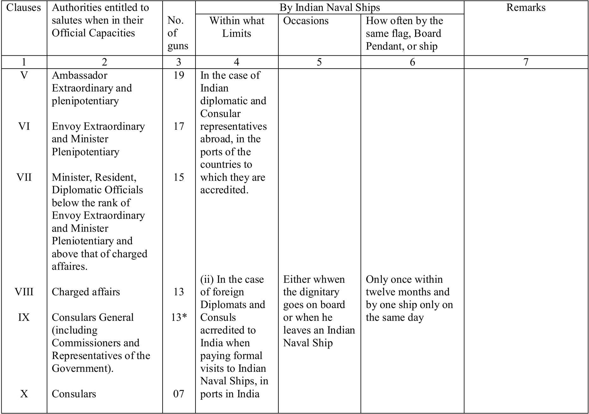

## PART III (STATUTORY)


## RECORD OF AMENDMENTS


---


## PART III (STATUTORY)


## RECORD OF AMENDMENTS


(ii)


---


## PART III (STATUTORY)


## RECORD OF AMENDMENTS


(iii)


---


## PART III (STATUTORY)


## RECORD OF AMENDMENTS


(iv)


---


## PART III


## (STATUTORY) CONTENTS


| Chapter No.   |    | Subject                                                              |
|---------------|----|----------------------------------------------------------------------|
| CHAPTER I .   | .  | PRELIMINARY . . .                                                    |
| CHAPTER II.   | .  | CEREMONIES ANDDISTINCTIONS                                           |
| Section I     | .  | Salutes to Heads of States and their Standards.                      |
| Section II    | .  | Salutes to Indian, Commonwealth, and Foreign Authorities.            |
| Section III   | .  | Salutes to National Flags and to Foreign Flag Officers.              |
| Section IV    | .  | Salutes in General . . .                                             |
| SectionV      | .  | Salutes which shall be Returned or Not eturned.                      |
| Section VI    | .  | Dressing Ship and Flags to be hoisted Saluting or Returning Salutes. |
| Section VII   | .  | Visits of Ceremony and Courtesy Calls                                |
| Section VIII  | .  | Distinguishing Flags and Pendants of Naval Authorities.              |
| Section IX    | .  | Distinguishing Flags of other Authorities                            |
| SectionX      | .  | President's Colour, Ensign, Jack and Pendant.                        |
| Section XI    | .  | Honours and Marks of Respect.                                        |
| Section XII   | .  | Naval Salutes and Marks of Respect.                                  |
| Section XIII  | .  | Funeral Honours.                                                     |
| Section XIV   | .  | Other of Precedence on Ceremonial Occassions.                        |


---


| Chapter No.   |    | Subject                                                                                                                                                                               |
|---------------|----|---------------------------------------------------------------------------------------------------------------------------------------------------------------------------------------|
| CHAPTER III   |    | RECRUITMENT OF CADETS                                                                                                                                                                 |
| Section I     | .  | Regular Entry Cadets                                                                                                                                                                  |
| Section II    | .  | Special Entry Cadets.                                                                                                                                                                 |
| Section III   | .  | Cadets from Training Ship 'DUFFERIN'                                                                                                                                                  |
| Section IV    | .  | Cadets from National Cadet Corps.                                                                                                                                                     |
| CHAPTER IV    | .  | --------------------------------------------------------------------------------------------------------------------------- TRAINING AND PROMOTION OF SUBORDINATE AND JUNIOR OFFICERS |
| Section I     | .  | Officers in the Executive Branch-Cadet Entry.                                                                                                                                         |
| Section II    | .  | Officers in the Executive Branch on Short Service Commisions.                                                                                                                         |
| Section III   | .  | Officers in the Engineering Branch-Cadet Entry                                                                                                                                        |
| Section IV    | .  | Officers in the Engineering Branch on Short Service Commissions.                                                                                                                      |
| SectionV      | .  | Officers in the Electrical Branch-Cadet Entry.                                                                                                                                        |
| Section VI    | .  | Officers in the Electrical Branch on Short Service Commissions.                                                                                                                       |
| Section VII   | .  | Officers in the Supply and Secretariat Branch- Cadet Entry.                                                                                                                           |
| Section VIII  | .  | Officers in the Supply and Secretariat Branch on Short Service Commission.                                                                                                            |
| CHAPTER V.    | .  | APPOINTMENT OF OFFICERS                                                                                                                                                               |
| CHAPTER VI    | .  | GENERAL SERVICE OFFICERS PROMOTION AND AGES OF COMPULSORY RETIREMENT                                                                                                                  |
| Section I     | .  | General.                                                                                                                                                                              |
| Section II    | .  | Executive Branch-Promotion.                                                                                                                                                           |
| Section III   | .  | Engineering Branch - Promotion                                                                                                                                                        |


---


| Chapter No.                                                                                                            |     | Subject                                                                                                                                                                     |
|------------------------------------------------------------------------------------------------------------------------|-----|-----------------------------------------------------------------------------------------------------------------------------------------------------------------------------|
| Section IV                                                                                                             | .   | Electrical Branch - Promotion                                                                                                                                               |
| SectionV                                                                                                               | .   | Supply and Secretariat Branch-Promotion.                                                                                                                                    |
| Section VI                                                                                                             | .   | Promotion in Instructor Branch.                                                                                                                                             |
| Section VII                                                                                                            | .   | Ages of Compulsory Retirement.                                                                                                                                              |
| CHAPTER VII                                                                                                            | .   | __________________________________________________________________________________ BRANCH OFFICERS (OTHERTHAN INSTRUCTOR BRANCH) PROMOTION AND AGES OFCOMPULSORY RETIREMENT |
| Section I                                                                                                              | .   | Promotion to Commissioned Officer (Branch (Branch List.)                                                                                                                    |
| Section II                                                                                                             | .   | Promotion Senior Commissioned Officer and above                                                                                                                             |
| Section III                                                                                                            | .   | Selective Promotion to Lieutenant.                                                                                                                                          |
| Section IV                                                                                                             | .   | Ages of Compulsory Retirement.                                                                                                                                              |
| CHAPTER VIII                                                                                                           | .   | __________________________________________________________________________________ GRANT OF ACTING RANKS TO COMMISSIONED OFFICERS                                           |
| CHAPTER IX                                                                                                             | .   | GRANT OF PERMANENT COMMISION TO TO SHORT SERVICE COMMISSIONED OFFICERS __________________________________________________________________________________                   |
| CHAPTER X.                                                                                                             | .   | OFFICERSONTHERETIREDANDEMERGENCY LISTS _________________________________________________________________________________                                                    |
| CHAPTER XI BANK ANDCOMMAND _________________________________________________________________________________ Section I | . . | Officers in General.                                                                                                                                                        |
| Section II                                                                                                             | .   | Flag Officers and Commodores.                                                                                                                                               |
| Section III                                                                                                            | .   | General Regulations.                                                                                                                                                        |
| Section IV                                                                                                             | .   | Acting Rank                                                                                                                                                                 |
| SectionV                                                                                                               | .   | Ship's Company                                                                                                                                                              |
| Section VI                                                                                                             | .   | Indian Navy, Army and Air Force.                                                                                                                                            |


---


| Chapter No.   |    | Subject                                                                                                                                                      |
|---------------|----|--------------------------------------------------------------------------------------------------------------------------------------------------------------|
| CHAPTER XII   | .  | SAILORS-CONDITIONS OF SERVICE                                                                                                                                |
| Section I     | .  | General.                                                                                                                                                     |
| Section II    | .  | Entry, Engagements and Re-Entry.                                                                                                                             |
| Section III   | .  | Transfer between Branches.                                                                                                                                   |
| Section IV    | .  | Discharges.                                                                                                                                                  |
| SectionV      | .  | Training - General.                                                                                                                                          |
| Section VI    | .  | Training of Sailors.                                                                                                                                         |
| Section VII   | .  | Ages of Compulsory Retirement                                                                                                                                |
| Section VIII  | .  | Promotion from the Lower Deck to Permanent Commissioned Rank in the Executive, Engineering, Electrical, Supply &Secretariat Branches.                        |
| Section IX    | .  | Good Conduct Badges.                                                                                                                                         |
| SectionX      | .  | Long Service and Good Conduct Medal with or Without Gratuity.                                                                                                |
| Section XI    | .  | Meritorious Service Medal.                                                                                                                                   |
| Section XII   | .  | Assessment of Character and 'Very Good' Conduct.                                                                                                             |
| CHAPTER XIII  | .  | REGULATION FORTHE INDIAN NAVAL RESERVE AND INDIAN NAVAL VOLUNTEER RESERVE __________________________________________________________________________________ |
| Section I     | .  | Preliminary.                                                                                                                                                 |
| Section II    | .  | Cadre of Officers and Types of Commission.                                                                                                                   |
| Section III   | .  | Entry, Confirmation, Promotion and Retirement.                                                                                                               |
| Section IV    | .  | Training and Service in Peace Time.                                                                                                                          |
| SectionV      | .  | Service during an Emergency.                                                                                                                                 |
| Section VI    | .  | Uniform.                                                                                                                                                     |
| Section VII   | .  | Retirement, Resignation, Discharge.                                                                                                                          |
| Section VIII  | .  | Leave, Pay and Allowances.                                                                                                                                   |
| Section IX    | .  | Reports and Correspondence.                                                                                                                                  |


*(viii)*


---


## APPENDICES


| Chapter No.   | Chapter No.   | Chapter No.   | Chapter No.   | Subject                                                                                                                                     |
|---------------|---------------|---------------|---------------|---------------------------------------------------------------------------------------------------------------------------------------------|
| I             | .             | .             | .             | List of Saluted Rulers in order of Seniority With Hereditary Tiles.                                                                         |
| II            | .             | .             | .             | State Funeral                                                                                                                               |
| III           | .             | .             | .             | Form I. N.708 - Report on a Candidate for Branch Rank.                                                                                      |
| IV            | .             | .             | .             | Classification and Relative Ranks of Officers.                                                                                              |
| V             | .             | .             | .             | Table of Precedence.                                                                                                                        |
| VI            | .             | .             | .             | Form I. N. 369-Selected Sailor's Confidential History Sheet.                                                                                |
| VII           | .             | .             | .             | Report on a Candidate for Commissioned Rank.                                                                                                |
| VIII          | .             | .             | .             | Form I. N. 285-Recommendations for Advancement and Conduct Record Sheet.                                                                    |
| IX            | .             | .             | . .           | Form I. N. 14-Monthly Return of G.C. Bs. Awarded, Resorted or Deprived. and Conditions of Service of Medical of the A.M.C. (Reserve) on     |
| X             | .             | .             |               | Terms Officers Secondment to the Indian Naval Volunteer Reserve.                                                                            |
| XI            | .             | .             | .             | Bond to be Signed by Parent/Guardian and the Candidate Selected for Initial Training with a view to being Commissioned in the Regular Navy. |
| Concordance . | Concordance . | Concordance . | .             | . . . . .                                                                                                                                   |


*(ix)*


---


## PART III


## (STATUTORY) CHAPTER I PRELIMINARY

- Short title- These Regulation may be called the Naval Ceremonial, Conditions of Service and Miscellaneous Regulations, 1963.
- Definitions:- In these Regulations unless the context otherwise requires:-
- (a)

'Act' means the Navy Act (62 of 1957);

- (b) 'active list' except in Chapter XII means the list of officers of the Indian Navy other than those who are placed on the 'retired list' or 'emergency list';
- (c)

'Appendix' means an Appendix to these regulations; 'Captain' means the officer appointed to command a ship;

- (d)
- (e) 'emergency list' means the list entitled as such on which officers are placed;

(i) in accordance with Chapter X of these Regulations ; and

- (ii) in accordance with any other regulations in force for the time being;

(f) 'general list' means the list of officers in the Indian Navy who are holding the rank of acting Sub-Lieutenant or above, excluding officers on the Special Duties List;


(g) 'general  service'  means  service  in  the  Indian  Navy  other  than  in  any  specialist capacity.


(h) 'Government' means the Central Government;


(i) 'Navy Order' means and order issued by the Chief of the Naval Staff;


(j) 'retired  list'  means  the  list  entitled  as  such  on  which  officers  holding  permanent commissions are placed when they retire from the Service with pension or gratuity;


(k) 'Service' means Indian Naval Services;


(l) All words and expressions used but not defined in these Regulations and defined in the Act shall have the meanings respectively assigned to them in the Act.

- Forms  in  appendices:-  The  forms  set  forth  in  the  appendices,  with  such  variations  as  the circumstances of each case may require, may be used for the respective purpose therein mentioned
- Exercise of power vested in holder of naval office. - Any power or jurisdiction given to, and any act or thing to be done by or before, any person holding any naval office for the purposes of these regulations may be exercised by, or done by or before, any other person for the time being authorized in that behalf according to the customs of the service.

---


## CHAPTER II


## CEREMONIES AND DISTINCTIONS


____________________________________________________________________


| Section   |                                                                                                                                  | Regulations   | Regulations   | Regulations   |
|-----------|----------------------------------------------------------------------------------------------------------------------------------|---------------|---------------|---------------|
| I         | Salutes to Heads of States and their Standards                                                                                   | 5-18          | 5-18          | 5-18          |
| II        | Salutes to Indian, Commonwealth, and foreign Authorities                                                                         | 19-26         | 19-26         | 19-26         |
| III       | Salutes to National Flags and to Foreign Authorities .                                                                           | . . 27-35     | . . 27-35     | . . 27-35     |
|           | . . . . .                                                                                                                        | . .           |               |               |
| IV        | Salutes in General                                                                                                               | 36-40         | 36-40         | 36-40         |
| V         | Salutes which shall be Returned or not Returned .                                                                                | . .           | 41-43         | 41-43         |
| VI        | Dressing Ship and Flags to be hoisted when Saluting or Returning                                                                 | Salutes       | 44-45         | 44-45         |
| VII       | Visits of Ceremony and Courtesy calls . .                                                                                        | . . .         | 46-51         | 46-51         |
|           |                                                                                                                                  |               | 52-59         | 52-59         |
| VIII      | Distinguishing Flags and Pendants of Naval Authorities                                                                           | . .           |               |               |
| IX X      | Distinguishing Flags of other Authorities . .                                                                                    | . .           | 60-63         | 60-63         |
|           | President's Colour, Ensign, Jack and Pendant .                                                                                   | . .           | .             | 64-77         |
| XII       | Naval Salutes and Marks of Respect . . .                                                                                         | . .           | . 102-107     | . 102-107     |
| XIV       | Order of Precedence on Ceremonial Occasions . __________________________________________________________________________________ | . .           | .             | 116           |


## SECTION I-SALUTES TO HEADS OF STATES AND THEIR STANDARDS

- Salutes to the President - In India all salutes to the President shall consist of 31 guns.
- The President.(1) A 21 gun salute shall be fired on the assumption and relinquishment of office by the President, by all Indian Naval Ships in ports in India.
- A 21 gun salute shall  be  given to  the  President on his arrival in  and departure  from India on occasions notified as 'Public', by all Indian Naval Ships present in the port of arrival or departure, and by any ship, on her arrival or departure, which may arrive at or leave that port during the stay of the President
- Whenever  the  President  shall  embark  in  any  ship  of  war,  the  National  flag  shall  be hoisted at the main, and the National Flag at the fore of such ship; or if on board a vessel with less  than  two  masts,  they  shall  be  hoisted  in  the  most  conspicuous  parts  of  her.    Should however, the President go on board for a short visit, the National flag at the main only shall be hoisted. A 21 gun salute shall also be fired from a ship or vessel on the President going on

---


board and again on leaving her; and every one of Indian Naval Ships present shall like wise fire a 31 gun salute on the hoisting of those flags, and such further 31 gun salutes shall be fired on the President quitting the ship or vessel or passing in a boat or on such other occasion as may be directed.

- Whenever the President shall be embarked in a ship or vessel at  sea and the beforementioned flags shall be hoisted in her, every one of Indian Naval Ships, meeting, passing or being passed by her, shall fire a 31 gun salute.
- The National Flag at  the  main  indicates  the presence  of  the  President on  board  and hence is to be hoisted at the main only on occasion when the President is actually present.
- National Flag at Jack staff(1)  On occasions when an Indian Naval ship or vessels ship or vessel is under way with the President's such ship or vessel and all escorting ships and vessels shall wear  the  National  Flag  at  the  Jack  staff  and  shall  wear  the  white  ensign  and  National  Flag continuously day and night.

(2)  The  provisions  of  sub-regulation  (1)  shall  apply  in  relation  to  Indian  Naval  ships  and vessels wearing on escorting flag of the President of a foreign republic or a Royal; standard as they apply in relation to Indian Naval ships or vessels with the President embarked or escorting a vessel in which the President is embarked.

- Death of President .-  On  the  death of  the  President,  Indian  Naval  Ships and establishments shall  half  mast  flags  from  the  day  on  which  intelligence of  the  death  is  received,  and  they  should remain at half mast until sunset on the day of the funeral.  The number of guns to be fired and the times of firing the salutes shall be as prescribed by the government from time to time.
- Sovereigns of Heads of States .-  (1)  Whenever any  Heads  of States, or  the consorts of any Sovereigns, or any eminent foreign dignitary arrive at or quit any place in India, they shall, subject to the concurrence of the Government, receive a 21 gun salute on their first arrival and again on their final  departure,  from  any  ships  present  or  from  any  battery  to  such  place,  from  which  salutes  are usually fired, and from any ship, on her arrival or departure, which may arrive at or leave that place during the stay of such personage. A similar salute shall also be fired upon by a going on board and again on leaving any of Indian Naval Ships, but concurrence of the government will not be required in these cases. On such occasions all ships shall be dressed, either overall or with masthead flags as may be ordered, in accordance with Regulation 44.
- Meet with at Sea.-  Whenever any of Indian Naval Ships meet, pass or are passed by any vessel wearing the flag or standard of the Head of a State, or the standard of the consort of any Sovereign, they shall salute that flag or standard.  All such ships shall be dressed as laid down in sub-regulation (1) in accordance with Regulation 44.
- A  salute  shall  not  be  fired  on  the  occasions of  a  vessel  wearing  a  Royal  Standard  or  of President's  flag,  passing  Indian  shore  saluting  batteries  and  not  intending  to  berth  in  the vicinity thereof.
- The  following  procedure  shall  be  observed  in  the  case  of  a  foreign  warship  which  is wearing a President's flag or Royal Standard visiting an Indian port:-
- (a) The visiting warship will salute the flag of the country.
- (b) Salute to the National Flag is returned by the shore battery or the Indian Naval Ships present.

---


(c) Indian warships present and shore battery salute the distinguished personage.


10. Royal Family.(1) Whenever any Prince or Princess, being a member of a Royal family shall arrive at, or quit any place in India they shall, on a requisition by the Government, receive a 21 gun salute on their first arrival and final departure, from all India Naval Ships present or from any battery at such place from which salutes are usually fired.  A 21 gun salute shall also be fired whenever any Prince or Princess, being a member of a Royal family, visits an Indian Naval Ship, both on arrival and departure.  The flag of the nation of such member will be displayed at the main mast.


(2) In  Foreign  Ports - Whenever such visits  to Indian Naval  Ships shall take  place in  a foreign port, corresponding salutes shall be fired, and the flag of the nation of the distinguished personage hoisted, as already explained.

- At sea.- Whenever any of Indian Naval Ships meet, pass or are passed by any vessel wearing the Standard of any member of a Royal family, they shall salute the Standard.

11. Order  of  Salutes  to  more  than  one  President's  Flag  or  Standard -  (1)  Whenever  any  of Indian Naval Ships meet, pass or are passed by any ship or ships which are wearing more than one President's flag or a Royal Standard, or arrive at, or quit any port or place where more than one is flying, or when two or more President's flags or Standards are broken simultaneously, they shall fire salutes in the following order, saluting the flags or standards of-

- (a) the  President of the Republic of India
- (b) The British Sovereign.
- (c) Presidents of Republics, Sovereigns, consorts, or heirs-apparent.
- (d) Members of the British Royal Family.
- (e) Members of foreign Royal Families.

(2) In  these  circumstances  only  one  salute  shall  be  fired  for  the  Standards  of  any  one nation, no matter how many may be hoisted.


12. Flags of  Presidents or  Standards of  Royal  Personages at Foreign Ports:(1)  Whenever any of Indian Naval Ships arrive at a foreign port in which salutes are returned, and where the flag of the President of a Republic or the standard of any Royal personage is hoisted, the customary salute to the flag of the nation to which the port belongs shall in all cases be fired first, the President's flag or the Standards present being subsequently saluted in the order directed in Regulation 11.


(2) In case the flag of the President of the Republic, the Standard of the Royal personage or the member of the Royal family of the nation to which the port belongs, is hoisted in the port, the  salute  to  the  national  flag  shall  be  considered  as  personal  to  that  flag  or  standard  as representing  the nation,  and in  this case the salute  will not be returned.  In the event of this salute being returned, a further salute of 21 guns shall be fired.


(3) In Commonwealth ports, Indian Naval Ships shall only salute the President's Flag or the Standard's present in the order directed in Regulation. These salutes will not be returned.


(4) Certain  countries  have  regulations  concerning  the  firing  of  salutes  to,  and  in  the presence  of  President's  Flag,  and  the  Royal  Standard,  which  differ  from  the  rules  in  this Regulation and Regulation 13.  When visiting foreign ports, therefore, Commanding Officers of Indian Naval Ships, shall when in doubt, ascertain the local practice in this respect and act in accordance with it, except that in no circumstances shall a Presidential or Royal salute or more than 21 guns be fired. Such foreign regulations as differ from those in this and the Regulation 13 and whose details are definitely known, are promulgated in Navy Orders.


---


(4) Certain  countries  have  regulations  concerning  the  firing  of  salutes  to,  and  in  the presence  of  President's  Flag,  and  the  Royal  Standard,  which  differ  from  the  rules  in  this Regulation and Regulation 13.  When visiting foreign ports, therefore, Commanding Officers of Indian Naval Ships, shall when in doubt, ascertain the local practice in this respect and act in accordance with it, except that in no circumstances shall a Presidential or Royal salute or more than 21 guns be fired. Such foreign regulations as differ from those in this and the Regulation 13 and whose details are definitely known, are promulgated in Navy Orders.


13. Another Authority in presence of Standard:In the presence ashore or afloat of ay flag of the President  of  a  Republic,  or  a  Royal  Standard  no  other  authority  of  that  nation  shall  be  saluted  by Indian Naval ships.


14. Dates for Salutes.The fixed dates for firing salutes in celebration of Indian anniversaries are as follows, namely:-

- (a) The anniversary of the formation of the Republic of India (26 th January), and
- (b) Independence Day (15 th August)

On these days a 31-gun salute shall be fired at noon from all Indian Naval Ships in port or from the shore battery when  no  Indian Naval saluting ship is present. Indian Naval Ships in Commonwealth and Foreign ports on Republic Day shall fire a 21-gun salute.  No gun salutes will be fired on Independence Day at ports outside India.


15. Commonwealth and Foreign Festivities.On the occasion of the celebration of such of the important anniversaries and festivals in other countries as may be specified in Navy Orders from time to time Indian Naval Ships, in company with ships of other Commonwealth countries or ships of a foreign nation, or in commonwealth or foreign ports, shall fire such salutes, not exceeding 21 guns as are fired by the ships or batteries of the country concerned.  The flag of the country shall be displayed at the main mast during the salute only, or ships dressed overall in accordance with Regulation 44, in conformity with the action taken by ships of the Commonwealth or foreign country.


16. Death of Sovereigns or Heads of States.(1) Orders concerning the ceremony to be observed shall be issued by the Chief of the Naval Staff on each occasion.  The usual procedure to be followed shall be for flags to be half masted on the day of the funeral only, with the ensign (if available) or the national flag of the bereaved nation at the dip on the main mast.  No gun salutes shall be fired unless specially ordered.


(2) In  the event of  Indian Naval  Ships being  in company  with a  ship or  in a port of  the bereaved  nation,  Indian  Naval  Ships  shall  act  in  unison  with  the  procedure  adopted  by  the Commanding Officer of the foreign ship or with the observances in the port.


(3) In the event of a ship of the bereaved nation being in an Indian port, Indian Naval Ships shall act in unison with the procedure adopted by that ship.


17.  National  Mourning.Orders  regarding  the  ceremony  to  be observed  as  may  be  issued  by  the Government shall be promulgated in the Navy by the Chief of the Naval Staff on each occasion of National Mourning.


18. Salutes not returnableNone of the foregoing salutes will be returned and they shall only be fired from ships authorized to salute under Regulation 38.


---


## SECTION II-SALUTES TO INDIAN, COMMONWEALTH, AND FOREIGN AUTHORITIES

- Indian and other important Commonwealth and Foreign authorities shall be saluted when in their official capacities as laid down in the following table:-

## TABLE OF SALUTES


|   Clauses | Authorities entitled to                   | No.     | By Indian Naval Ships                       | By Indian Naval Ships                                                  | By Indian Naval Ships                              | Remarks                                                                                                                                                                                                                         |
|-----------|-------------------------------------------|---------|---------------------------------------------|------------------------------------------------------------------------|----------------------------------------------------|---------------------------------------------------------------------------------------------------------------------------------------------------------------------------------------------------------------------------------|
|           | salutes when in their Official Capacities | of guns | Within what Limits                          | Occasions                                                              | How often by the same flag, Board Pendant, or ship |                                                                                                                                                                                                                                 |
|         1 | 2                                         | 3       | 4                                           | 5                                                                      | 6                                                  | 7                                                                                                                                                                                                                               |
|         1 | The Present                               | 31      | In Ports in India                           | On the assumption and relinquishment of office                         | As the occasion arises                             | Although according to international usage a gun salute comprises of 21 guns, a larger number of guns has been prescribed for the President of account of the existence in India of certain ex-Rules of former States carrying a |
|         1 | The Present                               | 31      | At all places                               | On visiting as Indian Naval Ship both on arrival and departure         | As the occasion arises                             | privilege of 21 guns.                                                                                                                                                                                                           |
|         1 | The Present                               | 31      | In the port of arrival in or departure From | On arrival and departure from India on occasions notified as 'public'. | As the occasion arises                             | For all international Purposes, however, a gun salute shall consist of 21 guns only No Gun salutes will ordinarily be fired on the President's visit                                                                            |


---


## TABLE OF SALUTES - (Continued)


| Clauses   | entitled to                                                                        | No.     | By Indian Naval Ships   | By Indian Naval Ships                                            | By Indian Naval Ships                              | Remarks                                                          |
|-----------|------------------------------------------------------------------------------------|---------|-------------------------|------------------------------------------------------------------|----------------------------------------------------|------------------------------------------------------------------|
|           | Authorities salutes when in their Official Capacities                              | of guns | Within what Limits      | Occasions                                                        | How often by the same flag, Board Pendant, or ship | Remarks                                                          |
| 1         | 2                                                                                  | 3       | 4                       | 5                                                                | 6                                                  | 7                                                                |
| II        | Heads of states and entitled Members of Royal Families                             | 21      | -                       | On occasion of visits to India                                   | As the occasion arises.                            | Subject to a specific requisition in each case by the Government |
|           |                                                                                    | 21      | Those of his Government | On visiting an Indian Naval Shi both on                          | As the occasion arises                             | -                                                                |
| III       | Governors General of Commonwealth                                                  | 21      | Those of his            | On occasion of visits to India                                   | As the occasion arises..                           | Subject to a specific requisition in each case by the Government |
|           | Countries                                                                          | 21      | Government              | On visiting an Indian Naval Ship                                 | As the occasion arises.                            | ----                                                             |
| IV        | His Ghitness Maharaja Sri Sri Sri Sri Sri Jigme Dorji Wangchuk, Maharaja of Bhutan | 19      |                         | On occasion of visits to India; or visit to an Indian Naval Ship | As the occasion arises.                            | -----                                                            |


---


## TABLE OF SALUTES - (Continued)




**Description:**
Chart type: Table
Title: (No visible title)
Axes: N/A
Trend: The table presents diplomatic and consular salutes by Indian Naval Ships across various clauses, detailing gun counts, conditions, occasions, and frequency for different official capacities.
Key data points:
| Clauses | Authorities entitied to salutes when in their Official Capacities | No. of guns | Within what Limits | Occasions | How often by the same flag, Board Pendant, or ship | Remarks |
|---------|---------------------------------------------------------------|-------------|--------------------|-----------|---------------------------------------------------|---------|
| V       | Ambassador Extraordinary and plenipotentiary                  | 19          | In the case of Indian diplomatic and Consular representatives abroad, in the ports of the countries to which they are accredited. |           |                                                   |         |
| VI      | Envoy Extraordinary and Minister Plenipotentiary              | 17          |                    |           |                                                   |         |
| VII     | Minister, Resident, Diplomatic Officials below the rank of Envoy Extraordinary and Minister Plenipotentiary and above that of charged affairs. | 15          |                    |           |                                                   |         |
| VIII    | Charged affairs                                               | 13          | (ii) In the case of foreign Diplomats and Consuls accredited to India when paying formal visits to Indian Naval Ships, in ports in India | Either whwen the dignitary goes on board or when he leaves an Indian Naval Ship | Only once within twelve months and by one ship only on the same day |         |
| IX      | Consulars General (including Commissioners and Representatives of the Government). | 13*         |                    |           |                                                   |         |
| X       | Consulars                                                     | 07          |                    |           |                                                   |         |


| Clauses   | Authorities entitled                                                                                                                 |             | By Indian Naval Ships                                                                                                             | By Indian Naval Ships                                                    | By Indian Naval Ships                                               |         |
|-----------|--------------------------------------------------------------------------------------------------------------------------------------|-------------|-----------------------------------------------------------------------------------------------------------------------------------|--------------------------------------------------------------------------|---------------------------------------------------------------------|---------|
|           | to salutes when in their Official Capacities                                                                                         | No. of guns | Within what Limits                                                                                                                | Occasions                                                                | How often by the same flag, Board Pendant, or ship                  | Remarks |
| 1         | 2                                                                                                                                    | 3           | 4                                                                                                                                 | 5                                                                        | 6                                                                   | 7       |
| V         | Ambassador Extraordinary and plenipotentiary                                                                                         | 19          | In the case of Indian diplomatic and Consular representatives abroad, in the ports of the countries to which they are accredited. |                                                                          |                                                                     |         |
| VI        | Envoy Extraordinary and Minister Plenipotentiary                                                                                     | 17          |                                                                                                                                   |                                                                          |                                                                     |         |
| VII       | Minister, Resident, Diplomatic Officials below the rank of Envoy Extraordinary and Minister Pleniotentiary and above that of charged | 15          |                                                                                                                                   |                                                                          |                                                                     |         |
| VIII      | Charged affairs                                                                                                                      | 13          | (ii) In the case of foreign Diplomats and Consuls acrredited to India when paying formal visits to Indian Naval Ships, in         | Either whwen the dignitary goes on board or when he leaves an Naval Ship | Only once within twelve months and by one ship only on the same day |         |
| IX        | Consulars General (including Commissioners and Representatives of the Government).                                                   | 13*         | ports in India                                                                                                                    | Indian                                                                   |                                                                     |         |
| X         | Consulars                                                                                                                            | 07          |                                                                                                                                   |                                                                          |                                                                     |         |


---


## TABLE OF SALUTES - (Continued)


| 1    | 2                                                             |   3 | 4                                                    | 5                               | 6                                                                                                                                                     | 7   |
|------|---------------------------------------------------------------|-----|------------------------------------------------------|---------------------------------|-------------------------------------------------------------------------------------------------------------------------------------------------------|-----|
| XI   | Admiral of the Fleet                                          |  19 | At all Places                                        | Only as or embarkation on going | Only by one ship at the prot on the same day. Only once in 12 months abroad and once in 3 years at home except in case the officer has been promoted. |     |
| XII  | Admiral                                                       |  17 |                                                      | authorized by Regulation 25     |                                                                                                                                                       |     |
| XII  | Vice-Admiral                                                  |  15 |                                                      | authorized by Regulation 25     |                                                                                                                                                       |     |
| XII  | Rear-Admiral                                                  |  13 |                                                      | authorized by Regulation 25     |                                                                                                                                                       |     |
| XII  | Commodore                                                     |  11 |                                                      | authorized by Regulation 25     |                                                                                                                                                       |     |
| XII  | Field Marshal                                                 |  19 |                                                      | authorized by Regulation 25     |                                                                                                                                                       |     |
| XII  | General                                                       |  17 |                                                      | authorized by Regulation 25     |                                                                                                                                                       |     |
| XII  | Lieutenant-General                                            |  15 |                                                      | Official visits                 |                                                                                                                                                       |     |
| XII  | Major-General                                                 |  13 | At all places                                        | in a ship,                      |                                                                                                                                                       |     |
| XII  | Brigadier                                                     |  11 |                                                      | onboard or                      |                                                                                                                                                       |     |
| XII  | Marshal of the Air Force                                      |  19 |                                                      | authorized by Regulation 25     |                                                                                                                                                       |     |
| XII  | Air Chief Marshal                                             |  17 |                                                      | authorized by Regulation 25     |                                                                                                                                                       |     |
| XII  | Air Marshal                                                   |  15 |                                                      | authorized by Regulation 25     |                                                                                                                                                       |     |
| XII  | Air Vice Marshal                                              |  11 |                                                      | authorized by Regulation 25     |                                                                                                                                                       |     |
| XIII | Air Commodore Captain of the Navy and officer below that rank |   7 | As a return salute only as directed by Regulation 24 | authorized by Regulation 25     |                                                                                                                                                       |     |
| XII  |                                                               |     |                                                      | authorized by Regulation 25     |                                                                                                                                                       |     |


---


## TABLE OF SALUTES TO GOVERNORS OF STATES (SRO 17 E/67)


| 1   | 2                                 |   3 | 4                       | 5                                           | 6    | 7    |
|-----|-----------------------------------|-----|-------------------------|---------------------------------------------|------|------|
| I   | Governors of States (SRO 17 E/67) |  17 | Those of his Government | On assumption and relinquishment of office. | ---- | ---- |

- Explaination 1 -  Gun salutes will be given on the assumption and relinquishment of office by the Governors where Artilery units are available locally or within a distance of 50 miles.  Indian Naval Ships will not fire these salutes (SRO 17 E/67). The table is for information only.
- 2 - Governors within their own jurisdiction, will be given appropriate gun salutes on the occasion of official visit to foreign warships visiting India.

---

- Rulers of former States .- Gun salutes shall be given as a personal privilege of rulers in the capital of their former states, on the occasion of their succession to the Gaddi, marriage, birth of the heir-apparent and demise, provided Artillery units are locally available.  The list of rulers entitled to gun salutes is set forth in Appendix I.
- Salutes on Embarking and Disembarking .-  When the ship, from which a diplomatic, or a Naval,  Army  or  Air  Force  officer  entitled  to  be  saluted  on  embarking  or  disembarking  under Regulation 19 shall be either a ship of war not authorized to salute under Regulation 38, or a merchant ship,  the  senior naval officer  may  direct the prescribed salute  to be fired from any of  Indian Naval Ships present.
- Acting in Higher Posts .-  (1)  Indian Naval, Army or Air Force officers temporarily acting in any higher command, shall be entitled during their temporary tenure, to all the honours and salutes that may appertain to such command.
- Officers, temporarily acting in any civil office, shall be entitled, during their temporary tenure, to all the honours or salutes that may appertain to such command.
- In  Presence  of  Senior  Authority .-    (1)  No  junior  Naval  authority  shall  be  saluted  in  the presence of a   senior naval authority.
- Similarly, no junior Army or Air Force authority shall be saluted in the presence of a senior Army or Air Force authority respectively.
- Personal salutes (namely those fired on being visited by officials), as well as salutes to Flag, are included in each case
- Salutes to Flag .-  (1)  The flag or broad pendant of the senior Naval authority present (afloat or ashore) shall be saluted as follows:-
- (a) By the next senior officer present:
- (i) on being first hoisted in the period of the former's new command.
- (ii) after the flag of the former's new rank has been hoisted on promotion.
- (b) by a single ship, or by senior officer only of two or more ships of the same fleet or squadron, on meeting or on arrival, subject to clause 3.

©  By a junior Flag Officer or Commodore:

- (i)  after  such  officer  has  hoisted  his  flag  or  broad  pendant  in  the  period  of  his  new command;
- (ii) after hoisting the flag of his new rank on promotion.
- These salutes shall be returned according to the scale; but if more than one salute has been fired, the return salute in answer to the whole shall consist of the same number of guns as that to which the officer receiving the salute is entitled.

---

- Limitation on Salutes to same authority .-  No  Flag  Officer,  Commodore, Captain or  other officer  in  command,  shall  salute  the  same  Flag Officer  or  Commodore  more  than  once  during  his command except in the case of promotion.
- Limitation as to Rank .- Officers below the rank of Commodore, Brigadier or Air Commodore shall  not  be saluted  in  any  part  of  the  world;  nor  shall salutes be exchanged between Indian Naval Ships, forts and batteries.

## SECTION III.- SALUTES TO NATIONAL FLAGS AND TO FOREIGN FLAG OFFICERS

- Salutes to National Flags .- (1) Salute to the national flag of a country consists of 21 guns.
- The Captain of a ship, or the senior officer of more than one ship, visiting a foreign port where there is a fort or saluting battery, or where a ship of the nation may be lying shall salute the national flag with 21 guns, on being satisfied that the salute will be returned.  A salute shall not be fired when the ship is passing through territorial waters with no intention of anchoring, or  making  fast  in  any  way,  in  them,  even  if  a  saluting  station  is  passed,  unless  unusual circumstances make it desirable.

The salute shall be fired on each occasion that a ship visits a foreign port, except that of a ship leaving port temporarily, when, by agreement with the local authorities, the salute on her return may be dispensed with.

- When a ship visits a foreign port where there is no saluting battery and no ship of the nation is lying on arrival, and a ship of the nation arrives during the visit, a salute to the national flag shall only be fired after mutual agreement between the Senior Officers of the ships concerned.
- If the ship of a senior Indian officer is already present in the port, the junior will not fire a salute.
- Salutes  to  a  national  flag  shall  not  be  fired  by  Indian  Naval  Ships  when  visiting Commonwealth countries.
- Recognised Governments .- Salutes to foreign Royal personages and other foreign authorities and flags are only authorized in the case of a Government formally recognized by the Government.
- Salutes  to  foreign  Functionaries .-  Salutes  in  conformity  with  the  table  of  salutes  given  in Regulation 19, shall be fired in compliment to foreign officials, from either ships or batteries, in the same manner and in circumstances similar to those in which salutes to an Indian Official would be fired.
- Foreign Flag Officers and Commodores :- (1) If one or more Indian ships of war should meet a foreign ship of war at sea ,wearing the flag of a  Flag Officer or the broad pendant of a Commodore of superior rank to the Senior Officer in command of an Indian Naval Ship or ships aforementioned, such Senior Officer shall salute, subject to Regulation 25, the foreign Flag Officer with the number of guns accorded to his rank in Regulation 31.  If the meeting takes place in port, the salute shall not be fired  until  the  proper  national  salutes  shall  have  been  interchanged,  and  then  only  if  the  local regulations admit thereof.

---


(2) If ships wearing the flags or broad pendants of officers of equal rank meet at sea and their relative seniority in rank is unknown or in doubt, they should mutually salute without delay.


(3) If ships wearing the flags or broad pendants of officers of equal rank meet in port, the ship arriving later, irrespective of seniority in rank, shall salute the flag(s) or broad pendant(s) first, subject to conditions stipulated in sub-regulation (1).


(4)  When  the  fleets  or  squadrons  of  several  nations  are  making  use  of  the  same  port,  the following modifications to sub-regulation (1) should  be  brought into force, with the concurrence of the senior naval authorities of each nation represented:-


(a) On the occasions stated in Regulation 24, sub-regulation (1) (a) (i) and (ii), the flag or  broad  pendant  of  the  senior  naval  authority  concerned  should  be  saluted  by  the senior  naval  Authorities  of  the  other  nations  present  who  may  be  junior  to  the  first mentioned Flag Officer.


(b) On the occasions stated in Regulation 24, sub-regulation (1) (b), the ship or Senior Officer  of  ships  arriving  or  meeting,  subject  to  sub-regulation  (3)  of  Regulation  24, shall only salute the flag or broad pendant of the senior naval authority of the whole of the nations represented if such Flag Officer be his senior in rank, and also provided that an officer senior to the officer arriving and of his own nation is not already in company with that foreign Flag Officer.  If on the other hand, an officer of his own nation, who is senior to him, is already there, the ship or Senior Officer of ships arriving shall fire only such salute as may be due to his own Senior Officer under Regulation 24, if any.  If the Senior  Officer  of  ships  arriving  is  himself  senior  to  all  the  senior  naval  authorities already in port, all the latter shall, subject to Regulation 24, sub-regulation (3) salute him after the prescribed national salutes, if any, have been interchanged.


© On the occasions stated in Regulation 24, sub-regulation (1) ©, a junior Flag Officer or Commodore shall, unless otherwise ordered, fire the prescribed salute to the senior Naval authority of his own nation only.  Should he himself already hold that position, he shall salute the flags or broad pendants of the senior Naval authorities present of the other Nation who may be senior to him [and will himself be saluted by those junior to him in accordance with clause (a)].  In the latter case he shall if possible, take step to inform the Flag Officers whom he proposes to salute of the time at which he indents to do so.


(d) As regards return salutes, ships will be guided by Regulation 24, sub-regulation (2) or Regulation 42, sub-regulation (2) (b), whichever is applicable, according to whether the salute has been fired by a ship of the same nation or by a foreign ship.


(e) If any doubt should arise in the application of Regulation 24, sub-regulation (3), to the orders contained herein, the salute should be fired.


31. Scale  of  Salutes .-  (1)  The  following  scale,  which  has  been  agreed  to  by  the  maritime  powers generally,  shall  be  observed  in  the  interchange  of  Salutes between  Indian  Naval  Ships  and  foreign ships of war which bear the flag of a Flag Officer, or the broad pendant of Commodore, or Captain commanding a squadron or division:-


---


|                                                                                    |   Guns |
|------------------------------------------------------------------------------------|--------|
| The flag of an Admiral of the Fleet or Flag Officer Who ranks with a Field Marshal |     19 |
| The flag of an Admiral                                                             |     17 |
| The flag of a Vice-Admiral                                                         |     15 |
| The Flag of a Rear-Admiral                                                         |     13 |
| The broad pendant of a Commodore, or a Captain in command ranking as a Commodore   |     11 |

- For  the purpose of this regulation, as a rank of  full Admiral does not exist in the French Navy, a Vice-Admiral of that nation, who is also Chief of Naval Staff or Inspector-General of the Navy (who will fly a square flag of the national colours with three blue stars in triangle on the white portion) shall be regarded as full Admiral, and shall be saluted with 17 guns.
- In presence of Senior Authority .-    The provisions of Regulation 23 shall apply to a junior authority in the presence of a senior authority of the same nation except in the case of a personal visit.
- Salutes to Foreigners visiting Indian Naval Ships .-  (1) If a foreigner of high distinction or a foreign general officer or air officer visits any one of Indian Naval Ships, he may be saluted on his going on  board,  or  on  leaving  the  ship,  with  the  number  of  guns  which  he,  from  his  rank,  would receive on visiting a ship of war of his own nation; or with such number of guns not exceeding 19 as may be deemed proper; should the number of guns to which he is entitled from ships of his own nation be less than is given to officers of his rank under Regulation 19, he shall be saluted with the greater number.
- On all occasions of an official visit of a foreign Flag Officer or Commodore to any one of Indian Naval Ships, he may be saluted on his going on board, or on leaving the ship, with the number of guns specified in Regulation 31.  This salute shall be personal salute and shall be distinct from the salute to flag provided for under Regulation 30.
- The personal salutes fired in accordance with the Regulation shall not be returnable and, with reference to Regulation 29, shall not be subject to the limitations laid down in column 6 of the Table of Salutes given in Regulation 19.
- Ships unable to Salute .-   If from any special cause one of  Indian Naval Ships from which a salute may reasonably be expected is unable to salute, the circumstances shall be explained  on  the spot.
- Lowering  flags .-  (1)  Indian  Naval  Ships  shall  not  on  any  account  lower  their  flags  to  any foreign ships whatsoever, unless the foreign ships shall first, or at the same time, lower their flags to them.
- Where by custom, and as an act of courtesy, merchant ships lower their colors to ships of war, Indian Naval Ships shall be punctilious in returning such salute, but shall be careful to avoid any suggestion of awaiting this mark of respect.
- Any flagrant or repeated cases of disregard of this practiee, particularly by Indian merchant ships shall be reported to the Chief of the Naval Staff.

---

- Indian Fleet Auxiliaries shall be punctilious in lowering their colours to foreign ships of war.  They are not required to lower their colours to Indian Naval Ships but shall hoist their distinguishing pendants when entering an Indian Naval port, joining the fleet, or passing Indian Naval Ships at sea.

## SECTION IV - SALUTES IN GENERAL

- Permission  of  Senior  Office r.-  No  salutes  shall  be  fired  from  Indian  Naval  Ships  without previous communication, by signal or otherwise, with the Senior Officer present.
- For one Office only .- Should any one of the officers fill more than one office entitling him to a salute, he shall be saluted in that which entitles him to the greatest number of guns.
- Ships Authorised to Salute .-   (1)  Unless otherwise directed by the Chief of the Naval Staff salutes  shall  be  fired  by  all  ships  except  destroyers,  commanded  by  a  Captain  or  Commander  and carrying  four  or  more  Q.  F.  guns  of  the  same  nature,  suitably  placed,  or  provided  with  a  saluting armament of light Q.F. guns.  Ships in the Reserve Fleet, however, that would otherwise be regarded as saluting ships shall, generally, be considered non-saluting ship while in Reserve.
- In  cases  where,  from  any  special  circumstances,  omission  to  fire  a  salute  to  a  foreign power or officer cannot be explained without causing offence the salute shall be fired by any ship which can possibly do so with safety, whether authorized to fire salutes by sub-regulation (1) or not.
- Time of Firing .-  As a general rule no salutes should be fired by Indian Naval Ships between sunset  and  0800.    A  salute  fired  by  a  foreign  man-of-war  within  this  period  should,  however,  be returned In foreign waters, the custom of the country shall be followed.
- Salutes not Authorised .-  No other salutes than those authorized shall be fired, except on the occasion of  a great victory to Indian Arms or other important National events, when the Chief of the Naval Staff may direct such salutes to be fired.  If out of India, the firing of such salutes may be directed by the Senior Indian Naval  Officer present  in consultation with the local representative of India, if any.

## SECTION V - SALUTES WHICH SHALL BE RETURNED OR NOT RETURNED

- To  Indian  Authorities .-  The  following  regulations  shall  be  observed  in  regard  to  return salutes:-
- (a) Salutes to the President shall not be returned
- (b) From  Foreign  ships-of-war  -  All  salutes  from  foreign  ships of  war,  either  to  Indian Naval Ships or forts, shall be returned gun for gun.  Should there be no fort or     battery from which such salutes can be returned, the Senior Naval Officer present will return them gun for gun.

---

- To Foreign Distinguished Personages and Authorities :-  In the case of salutes from Indian Naval  Ships,  forts  and  batteries  to  foreign  distinguished  personages  and  other  functionaries,  the following arrangement entered into with the maritime powers shall be observed namely:-
- Salutes not returned.-  Salutes from ships of war which will not be returned.-
- (a) To  Presidents  of  Republics,  Royal  personages,  Chiefs  of  States  or  members  of  Royal families, whether on arrival at, or departure from, a port, or upon visiting ships of war.
- (b) To diplomatic, Army, Air Force, or consular authorities, when visiting ships of war.
- (c) To foreigners on visiting ships of war.
- (d) Upon occasions of national festivals or anniversaries.
- (e) To naval officers on occasions of visits to ships of war as provided under Regulation 33.

Explanation .- By this sub-regulation Indian Naval Ships will not return a personal salute to an Indian officer fired by foreign vessels, nor will such return salute be expected by the officers of a power which adheres strictly to the international arrangement.  If, however, on any occasion where personal salutes are exchanged, a personal salute, fired by one of Indian Naval Ships or by the ships of some third nation to a foreign officer, is returned, it is an excess of courtesy which it would be impossible not to reciprocate by returning any personal salute to an Indian officer fired immediately afterwards under like conditions.  Indian Naval Ships may even take the  initiative  in  returning  personal  salutes,  if  such  is  known  to  be  the  custom  of  the  nation whose ship has saluted, and if it is expected that a personal salute to an officer of that nation will presently have to be fired and will be returned.


(2) Salutes returned .-  Salutes from ships of war which will be returned gun for gun-

- (a) To  the  national  flag  on  anchoring  at  a  foreign  port,  except  in  the  circumstances detailed in sub-regulation (2) of Regulation 12.
- (b) To  the  flags  or  broad  pendants  of  foreign  Flag  Officers  and  Commodores  or Captains in Command ranking as Commodores when met with at sea or in harbour.
- Reciprocity with Foreign Ships .-  When foreign ships of war salute the Indian National Flag or  other personages, or  any of  India's  functionaries in  similar circumstances,  the same rules  shall  be  reciprocally  observed  by  Indian  Naval  Ships  present  as  to  returning  or  not returning the salutes.
- From Merchant Ships .-    When Commonwealth, Foreign or  Indian  merchant ships,  or  any ships not in the Indian Navy, salute Indian Naval Ships, the return salutes shall be five guns to a single ship and seven to more than one sailing in company.

## SECTION VI - DRESING SHIP AND FLAGS TO BE HOISTED WHEN SALUTING OR RETURNING SALUTES

- Dressing Ship -  (1) On the occasions laid down in Regulation 14 all Indian Naval Ships and vessels in port, which are supplied with necessary material, shall be dressed overall from the time of hoisting colours until sun set.
- Indian Naval Ships under way  in the  vicinity of  an anchorage,  and those not  fitted with dressing lines, shall dress only with ensigns at their mast heads and national flag at the Jack staff.  This method shall also be adopted by other ships by order of the Senior Officer present, should conditions render dressing ship overall inexpedient.

---


(3) Indian Naval Ships shall also be dressed by order of the Senior Officer present when in the presence of a President's flag or Royal Standard on occasions of visits of a President or Royal personages,  and  on  certain  Commonwealth  or  Foreign  ceremonial  occasions  when  in  the presence of ships, or in the waters of the nations concerned. The manner of dressing and time during which ships shall be dressed  shall be stated on each of  these  occasions  according to circumstances.


(4)  On occasions when Indian Navy Ships are dressed in honour of an Indian ceremonial or personage ships wearing an Admiral's flag or Commodores broad pendant shall wear the white ensign  only  at  masts  not  occupied  by  either  of  the  above;  other  ships  shall  wear  the  white ensign at each mast.


(5) On occasions when Indian Naval ships are dressed in honour of Commonwealth or foreign ceremonial or personage, single-masted ships wearing the President's standard, flag or broad pendant shall wear the country's ensign alongside this standard, flag, or broad pendant; other single-masted ships shall wear the country's ensign alone.  In ships with more than one mast wearing the President's standard, the country's ensign shall be worn at the fore.  In ships with more than one mast wearing a flag or broad pendant, the country's ensign shall be worn at the main, and the flag or broad pendant at the fore; other ships shall wear the country's ensign at the main and the white ensign at the remaining masts.  Ships not supplied with the appropriate country's ensign shall wear the white ensign instead, and be subject to the provisions of subregulation (4).


45. Flags Hoisted during Salutes .-  (1) When salutes are interchanged with foreign ships of war or  forts  and  batteries,  or  when  salutes  to  Flag  Officers  and  personal  salutes  are  fired  in  honour  of foreigners, the following rules as to the flags that shall be displayed shall be observed by Indian Naval Ships:-


| (a) or in the of a and a                                                                                                                 | President of a Republic The ensign of the nation of such Chief of a State and the like President of Republic or Chief of case of a foreign President and the like, shall be hoisted at Republic or Chief of a state necessary alongside the President's Royal personage. Flag or broad pendant which may   |
|------------------------------------------------------------------------------------------------------------------------------------------|------------------------------------------------------------------------------------------------------------------------------------------------------------------------------------------------------------------------------------------------------------------------------------------------------------|
| (b) National Ensign-On arrival                                                                                                           | at a foreign port The ensign of the nation which is being saluted Shall be hoisted at the main during the salute, if necessary alongside President's standard, flag or broad pendant                                                                                                                       |
| (c) Foreign Flag Officer-When meeting a foreign Flag Officer or when returning if the salute of any foreign Flag Officer or ship of war. | The Ensign of the foreign nation which is being saluted shall be hoisted at the main during the salute or return salute, if necessary alongside any flag or broad pendant Which may already be hoisted in that position.                                                                                   |


---

- (d)       Visits of Foreign Authorities-On the occasion of visits from Governors General, Governors or Officers Administering a Government, Diplomatic Naval, Army, Air or Consular Authorites or of persons of High Distinction entitled to salutes.

Explanation :-  When there is no recognized ensign, the national flag shall be used.


(2) The distinguishing flags particularized in Regulation 60 shall be hoisted respectively at the fore whenever any of Indian Army, Air, Diplomatic or Consular Authorities are receiving salutes to which they may be entitled; should, however, the proper distinguishing flag not be on board the ship saluting, the blue ensign shall be hoisted.  Should the ship not have a blue ensign, a white ensign may be hoisted at the fore when saluting any of the Indian authorities referred to.


## SECTION VII-VISITS OF CEREMONY AND COURTESY CALLS


46. Courtesy Calls.(1) Courtesy Calls on the President shall be made by all officers of the rank of  Commander and  above, by  singing  in  the  Visitors  Book  kept  at the  Rashtrapati Bhavan,  on  the following occasions:-

- (a) on transfer of the officer to and from Delhi on permanent duty;
- (b) on assumption of office by the new President (by officer staying in Delhi only).

(2) On the occasion of their first visit to a state, the Chief of the Naval Staff and the Flag Officer  Commanding, Indian Fleet shall call on the Governor and the Chief Minister of  the State.   Such calls during subsequent visits shall not be obligatory unless, in the meantime, a new Governor  or  a  new  Chief  Minister  has  assumed  office.    Courtesy  calls  by  other  naval officers shall not be necessary.


Explanation.It  shall  not be necessary  for  the  Governor or the Chief Minister to return any calls by Service Officers.


(3)    Exchange  of  visits  between  naval  officers  on  the  one  hand  and  Army  and  Air  Force officers on the other shall be on the following basis:-

- (a) Calls shall be exchanged only between the senior most officers in the station.
- (b) The junior shall first visit the senior.
- (c) Where the officers are of equal seniority, the officer last arriving at the station shall pay the    first visit.

(d) Return visit shall be paid within 24 hours, either in person or by a representative, as the   circumstances may require.


The ensign of the foreign nation to which the person saluted belongs shall be hoisted at the fore during the personal salute, if necessary alongside any flag or broad pendant which may already be hoisted in that position


---


47. Visits of Ceremony and Courtesy Calls outside India - (1) The procedure governing the visits of Indian Naval Ships to Commonwealth ports which has been agreed to by the countries concerned is as follows:-


Visits of Indian Naval Ships are classified in three categories-

- (a) Formal:-  Formal  visits  are  made  as  a  matter  of  courtesy  and  involve  full ceremony including the exchange of official calls and the firing of gun salutes, except as provided in regulation 27(5)

(b) Informal.-  Informal  visits  are  also  courtesy  visits,  but  official  formalities  are restricted to the exchange of official calls and firing of salutes, except as provided in regulation 27(5).


(c) Routine and Operational:- Routine or operational visits are those  made in  the normal  course  of  duties  of  Indian  Naval  Ships  for  such  purposes  as  exercises  and practices, obtaining supplies, etc. No formal ceremonies or calls are required.


(2)  Formal and informal visits to Commonwealth ports shall be arranged by the Government by notifying the Government concerned that a visit is intended.  Indian Naval Ships need not ask  prior  concurrence  of  the  Government  or  administration  concerned,  before  visiting  a Commonwealth port.

- Routine and operational visits to Commonwealth ports shall be arranged by the Chief of the Naval Staff direct with the British or the Commonwealth Naval Authority except under circumstances  specified  in  sub-regulation  (6),  intimation being  sent  at  the  same  time  to  the Foreign Service Officer concerned for his information.
- All categories of visits to foreign ports shall be arranged by the Government and the prior  concurrence  of  the  Government  concerned  to  the proposed  visit,  shall  be  necessary  in each case except in the circumstances specified in sub-regulation (6)
- When the preliminary arrangements have been made, the Senior Officer of the visiting fleet or squadron, or the Commanding Officer of a single ship, shall notify the Indian Consular Authorities direct of the date and time of the intended arrival of the squadron or ship and the probable duration of the visit.  The requirements of the Fleet or Squadron or ship, such as fresh provisions, water and the like shall also be intimated.  Ceremonial visits shall be exchanged in accordance with Regulations 47 to 50.

The customary visit to the Governor or chief authority at a foreign port shall always be made unless there is some special reason for not doing so.  Communication shall always be established with the Consular Officer on arrival.


(6) In the event of a visit of Indian Naval Ship to a foreign port being in an emergency, like stress  of  weather,  landing sick personnel,  and the like, the Commanding Officer of the ship shall  inform  the  Consular  Officer  if  any  at  the  port  to  be  visited,  of  the  proposed  visit  and request  him  to  inform  the  local  authorities.    The  Indian  Representative  at  the  seat  of Government of the country visited shall be notified at the same time that the visit will be made, and requested to inform the Government of the informal character of the proposed visit.


---


Communication  shall  be  established  with  the  Consular  Officer  on  arrival,  and  the Commanding  Officer  should  consult  with  him  as  to  the  practicability  of  exchanging  any ceremonial visits.  When a call is made at a naval port, visits shall always be paid to the naval authority.


48. Foreign and Commonwealth Authorities (including Naval Authorities).(1) The Head of a State and the Governor of a Province,  Territory or Colonial possession, if residing in or near the port, shall receive the first visit from the Senior Officer in command of Indian Naval ship or squadron visiting a foreign or a commonwealth port.  This visit will be returned in  person to Flag Officers and Commodores, and by a Aide-de-Camp or other officer to officers of lower rank.


(2) The chief civilian authority of the port shall, as a general rule, receive the first visit from the  Senior  Officer  in  command  of  Indian  Naval  ship  or  squadron  visiting  a  foreign  or  a commonwealth port.


(3) The flag or other officer in chief command of the arriving ship or ships shall pay the first visit to the Senior Officers of the Army and Air Forces in the vicinity of the port if he be equal in  rank,  and  the  visit  shall  be  returned  within  twenty-four  hours  of  being  paid.    When  the officers are not of equivalent rank the inferior shall pay the first visit, the same limit of time being observed as to the visit and its return.  The procedure for returning visits between Naval, Army and Air Force officers will be similar to that laid down in clause (e) of sub-regulation (5) of Regulation 51.


(4) The following rules shall be observed by all naval officers in regard to the interchange of  visits  with  officers  of  commonwealth  and  friendly  foreign  warships  in  all  ports  whether Indian, Commonwealth or foreign:-

- (a) On the arrival of any warship of another country, the Flag or other officer in command of one or more warships, in port, whatever may be his rank, shall send an officer to such arriving ship, or in the case of a  fleet or squadron, to the ship of the officer in chief command of it, to offer the customary courtesies.  The Captain of the ship to which this visit is paid shall send an officer to return it.

(b) Within  twenty-four  hours of  his  arrival,  the  Flag  or  other  officer  in  the  chief command of the arriving ship or ships shall visit the officer in chief command of the fleet or squadron, or single warship of another country present at the port, if he be his equal in grade, and the visit will be returned within twenty-four hours of being paid.  In the case of officers of different grades, the officer of inferior grade shall pay the first visit, the same limits of time being observed as to the visit and its return.

- (b) Officers of superior grades are to return the visits as follows:-

Flag Officers and Commodores are to return the visits of Captains and those of grades superior to    Captain; they shall send their Flag Captains to return the visits of Commanders, Lieutenant Commanders and other officers in command. Captains  and officers  of  a lower  grade shall  return the visits  of Commanders and officers of inferior rank in command.


---

- (d) After the interchange of visits between the Senior Officers has taken place, the Captains or other officers in command of the several ships of war arriving shall visit the Captains or other officers in command of the warships in port, who shall return their visits.
- (e) Indian  Naval  officers  may  expect  that  strict  reciprocity  shall  be  observed  in similar circumstances by foreign and commonwealth naval officers in respect of these visits of ceremony.

Explanation  1 .  -  For  the  purpose  of  this  regulation,  the  professional  Head  of  an  Armed  Service including Navy shall be regarded as the Senior Officer regardless of his actual rank and seniority.  As regards calls between officers holding these appointments, the normal rules of rank and seniority shall apply.


Explanation 2 . - The grades referred to in sub-regulation (4) are-

- (a) Admiral.
- (b) Vice-Admiral.
- (c) Rear-Admiral.
- (d) Commodore.
- (e) Captain.
- (f) Commander.
- (g) Lieutenant-Commander or other officer in command.
- Indian Diplomatic Functionaries .- (1) every Flag or other officer in command shall, on arrival, pay the first visit to Indian diplomatic functionaries in charge of embassies or legations, or of above the rank of Charge d' Affairs, but they shall receive the first visit from diplomatic functionaries below that rank.
- In case of doubt as to the status of a diplomatic functionary in charge of an embassy or legation, an officer should be sent on shore to ascertain it previous to the interchange of visits.

Explanation. - For the purpose of this regulation, diplomatic functionaries include diplomatic functionaries of the Commonwealth.

- Consular Authorities including Commonwealth consular Officers. -  (1)  On  the  arrival  of  a fleet, flotilla, squadron, or ship at a foreign port, the first visit shall be made by the naval or consular officer who is subordinate in rank to the other, according to the following scale: -
- (a)
- Consuls General . . . To rank with but after Rear-Admirals.
- (b) Consuls . . . . To rank with, but after Captains.
- (c)       Vice-Consults . .
- (d)      Consular Agents . . . To rank with, but after Lieutenants.
- . To rank with, but after Lieutenant-Commanders.

---


(2) The Officer-in-Charge of a consular post during the absence of the titular incumbent shall take for the time being the rank of that incumbent.


51. Presidents or Governors-General of the Fully Self-Governing Countries of the Commonwealth - (1) The Presidents or Governors-General of the fully self-governing countries of the common wealth shall receive a visit from the senior officer in command of an Indian Naval ship or squadron visiting a port where the President or Governor-General is present. Return visits shall not be paid.


(2)  Governors,  Commissioners,  Administrators  and  Army  and  Air  Force  Officers.-  The following  procedure  in  regard  to  the  interchange  of  visits  between  Naval  officers  and Governors, Administrators, and the like, and officers in command of Army and Air Force shall be observed.


## (a) Official visits shall be exchanged-


(i) On the arrival of one or more of Indian Naval Ships at a port at which the Governor, administrator or Commissioner is present - between him and the Senior Officer in command of the squadron or ship.


(ii) On the first arrival at a port of a Flag Officer or Commodore flying his Broad  Pendant  since  taking  up  his  appointment  -  between  him  and  the Governor, Administrator or Commissioner.


(iii) On  a  Governor,  Administrator  or  Commissioner,  newly  appointed, assuming    office- between him and all Flag Officers and Commodores flying their Broad Pendants, present


## (b) Visits: How to be paid-


(i) A Governor shall always receive the first visit from the Senior Officer in command of the squadron or ship.


(ii) An Administrator or Commissioner shall pay the first visit to all Flag Officers  and  Commodores  flying  their  Broad  Pendants,  but  shall  receive  the visit in all other cases.


(iii) Naval, Army and Air Force Officers.- Exchange of visits shall be on      the basis that the junior officers will pay the first visit to the senior officer.  In the case of officers of equivalent ranks the same principles shall apply, but in the case of officers of the same seniority the officer  last arriving at the port shall pay the first visit.


(iv)  Priority  of  Visit.-  When  an  officer  has  to  pay  a  series  of  visits      to been laid down, and they shall be mutually Arranged to suit the convenience of the officials concerned.


## (c) Return Visits:  To be paid within twenty-four hours-


(i) A Governor shall return in person visits of all Flag Officers and Commodores flying their Broad Pendants.


(ii) An Administrator or Commissioner shall do so in person to all Captains.


---


(iii) A Flag Officer or Commodore flying his Broad Pendant shall do so in person to all Administrators or Commissioners.


(iv) In all other cases the return visit shall be paid by an Aide-de-Camp or other officer deputed.


(v)  All  Flag  Officers  and  Commodores  shall  return  in person  visits  of  Colonels  and Group Captains, and those of superior rank; they shall send a Captain or Commander to return  the  visits  of  Lieutenant  Colonels,  Wing  Commanders,  or  other  officers  in command.


(vi) Captains and officers of lower rank in command of Indian Naval Ships shall return in person the visits of Lieutenant -Colonels, Wing Commanders, Major and Squadron Leaders.


(d) Inability  to  Visit.Should  the  Governor,  or  any  other  officer  administering  the Government  find  that,  from  indisposition  or  pressure  of  important  business  he  is  unable  to return or pay a visit in person, he shall depute his Aide-de-Camp or some other officer to do so.


In like manner, should a Flag Officer or Commodore flying his Broad Pendant, from indisposition or pressing occupation, be precluded  from  paying or  returning  a visit, he  shall depute  his  Flag  Lieutenant or other  officer  not below  that rank to  do  so.    In  each case,  the officer failing to pay the required visit in person shall report the circumstances and assign the reasons, which led to the omission to the department under which he is acting.


(e) Acting Officers .- Officers acting temporarily in higher civil offices or commands shall, in respect of these visits, be upon the same footing as if they were confirmed in such offices or commands.


(f) Boats for Visits .-  The senior Officer present shall arrange, when necessary, to provide a suitable boat to enable the Diplomatic, or Consular Officer to pay any official visits afloat, and to take him ashore on the officer notifying his wishes to that effect.


Explanation .-  The term 'Governor' in this Regulation includes, 'Lieutenant Governor'.


## SECTION VIII.- DISTINGUISHING FLAGS AND PENDANTS OF NAVAL AUTHORITIES

- Admiral of the Fleet.The national flag shall be worn at the main by an Admiral of the Fleet as his proper flag.

The following flags shall be worn by Flag Officers, except Chiefs of the staff, as their proper flags:- Rear-Admiral. . .


| Admiral      | A white flag with red St. George's cross with blue Dharma Chakra superimposed at the center.                                                  |
|--------------|-----------------------------------------------------------------------------------------------------------------------------------------------|
| Vice-Admiral | A white flag with the red St. George's cross with blue                                                                                        |
|              | Dharma Chakra superimposed at the center, with one red roundel in the centre, with one red roundel in the upper canton of the next the staff. |


---


The following flags shall be worn by Flag Officers, except Chiefs of the staff, as their proper flags:- Rear-Admiral. . .


A white flag with the red St. George's cross with blue Dharma Chakra superimposed at the centre, with one Red roundel in the upper canton and one in the lower Canton next the staff.


The diameter of the red roundel shall be half the vertical depth of the white of the cantons next the staff, and the roundel shall be in the centre of the canton.

- Painted on Boats.When Vice-Admirals and Rear-Admirals have their flags painted on their boats, the same distinctive roundels at least 2 inches  in diameter shall be shown on the flag.
- 54 . Commodore.(1) A commodore, except a Chief of Staff or Cpatain of the Fleet, shall wear a white broad pendant with the red St. George's cross, with blue Dharma Chakra superimposed at the centre, with one red roundel in the upper canton next the staff.
- The  diameter  of  the  red  roundel  shall  be  half  the  vertical  depth  of  the  white  in  the cantons next the staff, and the roundel shall be in the centre of the canton.
- Chief of Staffs and Captain of the Fleet's Boat. -    A  Chief of Staff or Captain of the Fleet shall have painted on his boat the flag of the Flag Officer or Officer on whose staff he is serving.
- Convoy Commodore's Flag. - The Convoy Commodore's Flag shall be a white rectangular flag with a blue St. George's cross of the same dimensions as an Admiral's flag.
- Flags and Pendants Ashore . - An officer entitled to wear a flag, broad pendant, or pendant afloat, may fly the same flag, broad pendant, or pendant ashore, at any naval establishment or other place on shore where naval jurisdiction may, for the time being, prevail.
- Flags and Pendants Displaced . - (1) By President's Standard and the like. - The President's Standard  shall  always  be  worn  at  the  main,  the  flag  of  an  Admiral  or  the  broad  pendant  of  a Commodore, if necessary, being shifted to another mast or ship as the case may require.
- `The flags of other functionaries ordered to be hoisted in ships of war in accordance with Regulations 60 to  62  shall  not displace  at the masthead  the  flag of an  Admiral  of any grade nor the broad pendant of a Commodore.  When, therefore, a flag or broad pendant is hoisted,  the  distinguishing  flag  of  the  Civil,  Army  or  Air  Functionary  shall,  if  possible,  be hoisted  side  by  side  with  the  other,  subject  to  the  discretion  conferred  on  the  Senior  Naval Officer in Regulation 62.
- Senior Officers Present Afloat . - (a) When two or more of Indian Naval Ships are present in a  port  of  roadstead,  the  starboard  pendant  may  be  hoisted  at  the  starboard  yardarm  of  the  Senior Officer's ship as distinguishing flag in addition to the masthead pendant, provided that the ship is not already flying a flag or broad pendant.
- (b)        When  Indian  Naval  Ships  are  in  company  with  warships  of  other  nations  (including Commonwealth), the starboard pendant shall be flown by the Senior Indian Naval Officer present in the manner described above in addition to any flag or broad pendant.

## SECTION IX - DISTINGUISHING FLAGS OF OTHER AUTHORITIES

- Particulars of Flags . - (1) The flags authorized by the Government to displayed afloat are:-

---


(a) By Governors - The distinguishing flag  of the State.


(b) By Indian Diplomats - The provisions of sub-regulation (2) of Regulation 62 shall, as far as may be, apply to the flags to be displayed by Indian diplomats.


(c) By  the  Chief  of  the  Army  Staff,  General  Officers  Commanding-in-Chief and General Officers Commanding -  The  Army  Flag  (Rectangular  -  Scarlet  with cross swords and ASOKA LIONS in centre in yellow).


(d) By the Chief of the Air Staff, and the Air Officers Commanding - The Air Force Ensign.


(2) No other distinguishing flag or flags shall be worn afloat by any of these functionaries.


61. When to be Hoisted .  -  Whenever any  of the functionaries  mentioned in Regulation 60  are embarked-


(a) in  one  of  Indian  Naval  Ships  on  the  occasion  of  an  official  visit-  the  proper distinguishing flag shall be hoisted at the fore whenever the functionary is receiving a salute to which he is entitled;


(b) in one of Indian Naval Ships for passage- the proper distinguishing falg with the   approval of the Senior Naval Officer, may similarly be hoisted and be kept flying within  the  limit  of  the  respective  Governments,  Mission  or  Command,  provided  the functionary be proceeding on the  public service.  The distinguishing flag of Consular Authorities shall be hoisted in boats only and not in ships, except when they are being saluted.


(c)        in  a  boat  for  the  purpose  of  paying  visits  of  ceremony  or  on  other  official occasions-the  proper  distinguishing  flag  within  the  respective  limits  prescribed  in clause (b) may be hoisted at the bow, but when the boat belongs to one of Indian Naval Ships, she shall have her white ensign flying;


(d) in Indian  ships  and  boats,  other  than  those  of  Indian  Naval  ships,  such functionaries  are,  with  the  sanction of  the owners  or  masters,  authorized  to  fly  their proper distinguishing flags on the same occasions and within the same limits, and this regulation  shall  be  deemed  a  sufficient  warrant  to  the  master  under  the  Merchant Shipping  Act,  1958  for  so  doing,  but  the  permission  to  hoist  such  masthead  flags indicative of the presence on board of any of these functionaries in no way affects or alters  the character or status of the merchant ship in time of peace or in time of war, whether the Government of India is belligerent or neutral.

- Approval of Senior Officer. - (1) With regard to the previous approval of the Senior Officer, whenever  a  requisition  is  received  for  the  embarkation  or  conveyance  of  any  of  the  functionaries mentioned in Regulation 60, the Senior Officer present, in the absence of special orders from senior authority shall issue the necessary directions, provided that, after consultation with, and on requisition from, the official to be embarked, he considers it for the benefit of the service about to be performed that  such  he  flag  should  be  hoisted  within  the  authorized  limits.    Should  the  officer  who  has  to determine  the  question  consider  it,  in  the  circumstances,  undesirable  that  the  distinguishing  flags should be hoisted, he shall inform the functionary of his reasons, and at once report the same for the information of the Chief of the Naval Staff.

---

- In  the  event  of  an  Ambassador  or  High  Commissioner,  or  such  other  officer,  being detached on a foreign mission in his official capacity as Ambassador or High Commissioner, special instructions shall be issued in each case as to the flag which should be hoisted in a manof-war in which he may embarked; in the absence of instructions from the senior authority, the Senior Officer  present shall exercise his discretion  in consultation  with the  official  about to embark.
- General and /or Air Officers in Amphibious operations :-  In  amphibious operations with either or both of the other Services, should the General and/or Air Officers Commanding the Army and/or Air Forces be embarked in a ship of war or transport, the distinguishing flag or flags authorized by Regulation 60 may be hoisted at the fore of such ship or transport to denote the presence of the headquarters.

## SECTION X-PRESIDENT'S COLOUR, ENSIGN, JACK AND PENDANT

- The President's Colour .  -  (1) The President's Colour shall be paraded on shore in India on the following occasions, namely-
- (a) by a Guard of Honour mounted for the President;
- (b) by a Guard of Honour mounted for a foreign Sovereign, or the President of a Republic State;
- (c) on 26 th January, the Republic Day;
- (d) on such important ceremonial occasions as may be ordered by the Chief of the Naval Staff.
- The  President's  Colour  shall  only  be  lowered  to  the  President,  Foreign  Sovereigns, Presidents of Republican States, Governors-General of Commonwealth Countries, Governers within their jurisdictions.
- The President's  Colour  when carried uncased  shall  be  received  at  all  times  with  the highest  respect  with  arms  presented,  officers  saluting  and  the  band  playing  the  National Anthem.
- White Ensign Ashore .-  (1)  On  occasions  of  important ceremonial reviews or  international Naval displays on shore outside India, the White Ensign may be carried with naval landing parties at the discretion of the Senior Naval Officer present.

In countries the Government of which is recognized by the Government of India, the White Ensign may be carried by naval detachments on important ceremonial occasions-

- (a) when the head of the State or his representative is present; or
- (b) when the omission of the White Ensign might cause misunderstanding or offence.

(2) At the discretion of the Chief of the Naval Staff  or Senior Naval Officer present, the White Ensign may be hoisted at a flag staff ashore in India or in countries the Government of which  is  recognized  by  the  Government  of  India,  on  such  occasions  as  the  'Beating  the Retreat' or at the saluting base in a march past or review.

- Except for the occasions specified in sub-regulations (1) and (2), the parading of the White Ensign is unauthorized.

---


66. Ships  in  Commission .  -  All  Indian  Naval  Ships  of  war  in  commission  shall  wear  the following colours:-


(a) a  White Ensign, with the red St. George's cross and the national flag in the upper canton, in  the manner prescribed in Regulation 70;


(b) the National Flag, which should be of smaller dimensions than the ensign,  at the Jackstaff when in harbour, at anchor or moored to a buoy or alongside.  Ships in dock or ships in dockyard hands shall not wear the National Flag at the Jackstaff;

- (c) a  pendant under the terms of Regulation 67.

(2) Economy in Ensigns and Flags . - On all occasions and especially in bad weather, ensigns and flags of no greater breadth than is necessary shall be worn.


(3)  Ships not in commission shall not wear colours except on occasions of their launch.


67. Masthead Pendant .  -  (1)  All  Indian  Naval  Ships  in  commission  when commanded by  an executive officer, and when not wearing a flag or broad pendant, shall fly at the main masthead a pendant having a  St.  George's  cross  with  blue  Dharma  Chakra  superimposed  at  the  center,  on  a white field and in the part next to the mast with a white fly.


(2) If necessary, in order to avoid fouling radio aerials and other obstruction aloft, a shorter pendant may be flown, provided it can easily be seen at a short distance from the ship.


(3) At  a  shore  establishment  (commanded  by  an  officer  appointed  in  command  of  one  of Indian  Naval          Ships)  in  commission,  a  masthead  pendant  shall  be  flown  at  the  head  of  the Flagstaff, when a Flagstaff is fitted.


68.    Flags, etc, in Boats .  -  (1)  Flag Officers and Commodores entitled to fly their flag or broad pendant in a ship or shore establishment, and other officers holding an appointment in command of a ship in commission or shore establishment or sea-going tender to one of Indian Naval Ships, when proceeding on duty in a boat, may fly in  the bows, the  flag, broad pendant, or  masthead pendant applicable to their rank.


(2) The Officer of the Guard, proceeding on duty in a boat, shall fly masthead pendant both by day and by night.


( 3) `Members of a court-martial  on  their  way  to  or  from  the  court  shall  fly  a  masthead pendant in the bows of their boat.


(4) The National Flag shall never be displayed from any of the boats of Indian Naval Ships except to denote the presence of an Admiral of the Fleet.


(5) The following indicator plates shall be established for use in boats by the Senior Naval Officers when the full ceremonial prescribed in Regulations 82 to 84 is not required:-

- (a) A  Red Disc with a white St. George's Cross painted thereon;
- (b) A  Blue Disc with a white St. George's Cross painted thereon;
- (c) A  White Disc with five black crosses painted thereon.

All discs are to measure approximately 10 inches in diameter.


---


(6) The use of the above Flag Plates and Discs is as follows:-


(a) The Red Disc shall be displayed on formal occasions when the Flag Officers and Commodores who are entitled to wear a Broad Pendant, are proceeding on duty, and when the full ceremonial, laid down in Regulations 82 to 84, is not required.


(a) The Blue Disc shall be displayed on formal occasions when non-executive officers of  Rear-Admiral's  rank  and  above,  and  Commodores  not  entitled  to  wear  a  Broad Pendant, are proceeding on duty.


(c) The White Disc may be used on informal occasions by the Senior Officers in clauses (a) and (b).  When this disc is shown, only courtesy salutes shall be accorded.


69. Ensign, Hoisting and Hauling Down. - (1) Indian Naval ships, when lying in home ports and roads in India, shall hoist their ensigns at 0800 daily, but when abroad, at o800 or 0900 as the Senior Officer shall direct; and they shall be worn if the weather permit, or the Senior Officer present sees no objection thereto, throughout the day until sunset, when they shall be hauled down.


(2)  When bands are ordered to play at the hoisting of the Colours, they will play the Indian National  Anthem,  and  then  should  warships  of  other  countries  be  present,  the  National Anthems  of  those  countries,  playing  first  the  anthems  of  the  countries  represented  by  Flag Officers in  the order of  the seniority of  these officers, and the  remainder in an order varied from day to day.


(3)  When in foreign port, bands shall play the National Anthem of the country in which the port is situated immediately after the Indian National Anthem.


(4)  When bands are not paraded, the bugle shall sound the general salute.


(5) Whenever a ship shall take up her berth, or get under way, if there be sufficient light for the ensign to be seen, it shall be hoisted, though earlier or later than aforesaid; also on her passing, meeting,  joining,  or  parting  from,  any  other  of  Indian  Naval  Ships,  and  also,  unless  there should be sufficient reason to the contrary on her falling in with any other ship or ships at sea, or  when  in  sight  of,  and  near,  the  land,  and  especially  when  passing  or  approaching  forts, batteries, signal or coastguard stations, light houses, or towns.

- Wearing the White Ensign . - (1) The White Ensign shall be worn-

(a) In Harbour-At the ensign staff;


(b) At Sea-At the ensign staff whenever possible, but in bad weather or whenever the ensign staff is not available from any  cause,  such  as  the  ship  being  cleared  for action, and the like, it should be worn:-


(i)    In  ships  with  one  mast,  on  a  staff  in  a  suitable  position  on  the  after superstructure.


(ii)  In ships with two masts, either as in (i), or at a small gaff to be fitted as a ' peak' on the main  mast.


---

- The  senior  officer  present  shall  arrange  for  the  necessary  uniformity,  especially  as regards ships of the same class.
- The  Captain  shall  see  that  two  white  ensigns  are  always  displayed  in  a  conspicuous position, without interfering with signaling.
- Launchings of Indian Naval Ships . - Colours shall be worn at all launchings of Indian Naval Ships whether Dockyard or Contract built, at which there is a Naming Ceremony; the White Ensign shall be worn at the Ensign Staff and the National Flag at the Jackstaff.  It shall not be necessary to hoist any other flag.

The largest reasonable size flag should be worn, the following being taken as a guide:-

- (a) Light Fleet and Escort Carriers and Cruisers-

Ensign . .


.


National Flag .  .


.

- (b) Destroyers and Smaller Craft -

Ensign .


.


.


National Flag .  .


.

- Wearing the White Ensign in Boats . - (1) Boats belonging to Indian Naval Ships shall fly the ensign on the following occasions:-
- (a) In foreign waters;
- (b) In Indian waters-
- (i) when Indian Naval Ships are dressed;
- (ii) when going alongside a foreign warship on all occasions, day and  night;
- (c) When flying in the bows one of the special flags referred to in Regulations 51 and 60, whether in India, or in foreign waters.
- In  India,  boats  shall  only  fly  the  ensign  in  accordance  with  clauses  (b)  and  (c)  of  subregulation (1) between the time the colours are hoisted in the morning and sunset, except as provided for in sub-clause (ii) of the said clause (b).
- In  foreign  waters,  boats  shall  fly  their  ensigns  when  away  from  their  ships  at  any  time between dawn and dark, and on the occasion specified in sub-clause (ii) of clause (b) of subregulation (1).
- When  the  colours  are  half  masted  in  ships,  boat's  ensign  (if  flown)  shall  also  be  halfmasted.
- When a corpse is being conveyed in a boat, either in Indian, or foreign waters, that boat shall fly her ensign at half-mast.
- In boats under sail, ensigns shall be flown by launches and pinnaces only.

NOTE: -The same procedure as followed in Indian waters shall be followed in Commonwealth waters.


.


12 Breadths


.


8 Breadths


.

- 8 Breadths
- 6 Breadths

---

- Public Offices. - (1) Ships and vessels (including boats and launches using inland waterways) employed in the service of any public office in India wear a blue ensign, and a smaller blue ensign as a jack, but in the centre of the fly of such ensign and jack shall be inserted the badge of the office to which they belong. If a department or local Government has no distinctive badge, the Government of India crest, namely, 3 Asoka Lions, may be inserted in the flag.
- Ships and vessels employed in the service of the Indian Air Force shall wear the Indian Air Force ensign in place of the blue ensign described above.
- Merchant Ships to wear Red Ensign . - Except as provided in Regulations 75 to 77, all ships registered in India and all vessels which are not registered in any British possession but are owned exclusively by persons domiciled in India or by bodies corporate established in India, shall wear the Red Ensign consisting of a red flag with a width one-half of its length and the National Flag of India superimposed in the top quarter next to the staff, that being the proper National Colours.
- Merchant Ships allowed to wear the Indian Blue Ensign. - (1) Indian Merchant ships may wear the Indian Blue Ensign plain and un-defaced, consisting of a Royal Blue Flag, the width being one half of the length and the National Flag of India superimposed in the top quarter next to the Staff, provided the following conditions are fulfilled:-
- (a) The officer commanding the ship must be an officer on the retired or emergency list of the Indian Navy or an officer of the Indian Naval Reserve.
- (b) The crew must include (in addition to the Commanding Officer) officers of the Indian Naval to the number specified from time to time by the Chief of the Naval Staff, but officers on the retired or emergency list of the Indian Navy may be included in the number specified
- (d) Before  hoisting  the  Blue  Ensign,  the  officer  commanding  the  ship  must  be provided with a warrant issued by the Chief of the Naval Staff.
- (d) The fact that the Commanding Officer holds a warrant authorizing him to hoist the Blue ensign must be noted on the ship's articles of agreement.
- Commanding Officers failing to fulfil the conditions mentioned in sub-regulation (1) unless such failure is due to death or other circumstances over which they have no control, shall not be entitled to wear the Blue Ensign.
- Indian merchant ships in  receipt of Government subvention  may  be allowed to  wear  the Blue Ensign under a warrant issued by the Chief of the Naval Staff with any badge that may be prescribed in the Warrant.
- In order to ascertain that the conditions mentioned in sub-regulation (1) are strictly carried out, the Captain of one of Indian Naval Ships meeting a ship wearing the blue ensign may send on board  an  officer  not  below  the  rank  of  Lieutenant  at  any  convenient  opportunity.    This restriction as to the rank of the boarding  officer shall not limit or otherwise affect the authority or the duties of Naval officers under the Merchant Shipping Act 1958 or in time of war.
- Applications  for  permission  to  wear  the  blue  ensign on  board  Indian  merchant  ships  in receipt of Government subvention, should be made direct to the Chief of the Naval Staff by the owners  and  for  the  other  Indian  Merchant  ships,  applications  should  be  made  through  the Director General of Shipping, Bombay.

---


## 76. Indian Fleet Auxiliaries and Vessels other than ships of war, on naval service allowed to wear the Indian Blue Ensign (Defaced).

- Vessels  other  than  ships  of  War  employed  in  Naval  service  by  the  Government whether belonging to or under charter to Government shall wear the Blue Ensign defaced by an anchor in horizontal position.  The Anchor emblem shall be in yellow colour and be displayed in the centre of the fly.  The dimension of the emblem shall not exceed that of a circle whose diameter is 13/30 th of the width of the flag.
- The fly shall be half of the flag farthest away from the mast.
- Vessels  owned  by  Organisations under  the  Ministry  of  Transport  and  Communications, Government of India, allowed to wear the Indian Blue Ensign defaced by Badges of Office.
- Vessels  owned  by  organizations under  the  Ministry  of  Transport  and  Communications, except the Light House Department and Port Administration shall wear the Indian Blue Ensign defaced  by  an  Ashoka  Chakra  superimposed  over  the  shanks  of  the  anchor  in  a  vertical position.  The defacing shall be done in a light golden colour.
- Vessels  owned  by  the  Light  House  Department  of  the  Ministry  of  Transport  and Communications, shall wear the Indian Blue Ensign defaced by a Light House in a vertical position with two  white light beams emanating horizontally  from the beacon.  The defacing shall be done in a light golden colour.
- Badges of office referred to in sub-regulations (1) and (2) shall be displayed in the centre of Fly, the dimensions of the badge not exceeding that of a circle whose diameter is 13/30 th of the width of the flag.

Explanation . - The Fly shall be half of the flag farthest away from the mast.


## SECTION XI - HONOURS AND MARKS OF RESPECT


## 78. Guards of Honour.-

- The personages entitled to Guards of Honour are:-
- (a) The President, when his arrival and / or departure is public or official, and is notified as such  to the appropriate military authorities.
- (b) The Vice-President.
- (c) The Prime Minister

.

- (d) Governors within their Jurisdictions.
- (e) The Defence Minister (including the Minister of Defence, Production and Deputy Minister of Defence).

---


Provided that:

- (i) The Defence Minister (including the Minister of Defence Production and Deputy Minister of Defence) shall be presented a guard of honour only on ceremonial occasions directly connected with the Services or on such exceptional occasions as may in each case be held by the Central Government to require the presentation of a Guard of Honour;
- (ii) Governors  shall,  in  addition,  be  presented,  within  their  respective jurisdictions,  a  Guard  of  Honour on  arrival  to  take over  the  appointment  and departure on relinquishing such appointment.
- (f) Rulers of merged and integrated States:-
- (i) Within the limits of their former States: on the occasion of their succession to the Gaddi and marriage of rulers who maintained Indian State Forces before integration or merger, provided troops are available.

Explanation .  -  Guards  of  Honour  on  accession  to  the  Gaddi  shall  in  the  case  of  minor  Rulers  be presented on the attainment of majority.

- (ii) Outside the limits of their States:

When  attending  State  functions,  to  which  they  have  been  officially invited, as the Chief guest, provided troops are available.

- (g) Heads of Foreign and Commonwealth Missions of the rank of Ambassador or High Commissioner or Minister Plenipotentiary accredited to India, on the occasion of the presentation of their credentials to the President.
- (h) Heads  of  States,  Members  of  a  Royal  Family  and  Governors-General  of Commonwealth countries, on their arrival at,  and departure  from, the Capital, and at other places in India visited by them, where troops are available and on visiting Indian Naval Ships.  At Delhi, and where possible elsewhere, they be presented with an InterService Guard of Honour.
- (j) Prime Ministers and Foreign Ministers of Foreign and Commonwealth StatesAn  Inter-Service  Guard  of  Honour  shall  be  provided  for  them  on  arrival  at,  and departure from Delhi, on a requisition by the Government.
- Strength of the Guard of Honou r:

150 Rank and file for the President, visiting Heads of States and Governors-General of Commonwealth  Countries.  100  mark  anf  file  for  the  Vice-President  and  the  Prime Minister; visiting Prime Ministers of Foreign and commonwealth States; and Heads of Missions referred to in clause (iv) of sub-regulation (1)_.


50 rank and file for all others.

- Single-Service Guards of honour at Naval ports shall be provided by the Navy, at Indian Air Force Air Ports by the Air Force, and at other places by the Service, which is most conveniently situated to provide a Guard of Honour.

---


(4) A combined Inter-Service Guard of Honour will comprise of the Army, Navy and Air Force  personnel.  However,  for  the  ceremonial  functions  on  the  15th  August  and  the  26 th January, at Delhi, members of the Police may be included.


As a general principle and regardless of the station, an Inter-Service Guard of Honour shall be commanded in rotation by each of the three services.

- No Guard of Honour shall be provided between sunset and Colours.
- The President . - (1) The President shall be received on board any of Indian Naval Ships or on arrival at naval establishments by a Guard of Honour commanded by a Lieutenant Commander or a Lieutenant, the officers saluting, the bugles sounding the 'alert', with arms presented, and the band playing the National Anthem.  If the band is not available, the bugles shall sound the General Salute.

(2)  The  honours  and  marks  of  respect  laid  down  in  sub-regulation  (1)  shall  be  paid  as applicable  to  Heads  of  States  or  Members  of  Royal  Families,  except  that  the  whole  of  the appropriate National anthem  followed by the Indian National Anthem shall be played.  The first six bars only shall be played in the case of Members of the British Royal Families, except his Royal Highness the Prince Philip, Duke of Edinburgh in whose case the whole of the first verse of the National Anthem shall be played.


(3)  Governors-General  Commonwealth  countries  shall  be  received  on  board  Indian  Naval Ships with honours and marks of respect due to foreign Heads of State (except piping).


80. Foreigners  of  High  distinction .  -  Foreigners  of  high  distinction  who  are  received  with  a guard of honour when visiting Ships of their own nation shall be similarly received when visiting Indian Naval Ships.


Explanation . - National anthems of other countries shall always be played in full.


81. Toasts in Naval Messes and at Official Dinners. - (1) All toasts drunk in Naval Messes shall be in non-alcoholic drinks.


(2) The health of the President shall be honoured, seated, in all Naval messes, on board ship and on shore, on all occasions, except: -


(a) When the National Anthem is played; the toast shall then be drunk standing.


(b)  When  toasts  to  Heads  of  Foreign  States  are  being  drunk,  they  and  that  of  'The President  of  India'  shall  be  drunk  standing  whether  National  Anthems  are played or not.


(3) Whenever the health of the British Sovereign is ordered to be drunk it shall be honoured, seated,  in  all  Naval  messes,  on  board  or  on  shore,  except  under  the  conditions specified  in clauses (a) and (b)of sub-regulation (2).


(4)  The  toasts  to  the  President,  the  British  Sovereign  and  Heads of  Foreign  States  shall be drunk  on  the  occasions  shown  in  the  Table  appended  to  this  Regulation.    The  procedure outlined in this Regulation shall be arranged beforehand between the Indian Officer, who is the host and his guests.


(5)  When  a  foreign  national  anthem  is  played  in  accompaniment  to  a  toast,  an  abbreviated version shall not be used unless it has been ascertained that this shall be in accordance with the custom of the country concerned.


---

- If  two  or  more  national  anthems  are  played  they  shall  be  played  in  the  order  in  which countries are named in the collective toast.

---


## TABLE


| Sl No.                                                             | Nationality of Guests                      | First Toast                                  | First Toast   | Second Toast     | Second Toast      | Third Toast   | Third Toast   | Fourth Toast   | Fourth Toast   |
|--------------------------------------------------------------------|--------------------------------------------|----------------------------------------------|---------------|------------------|-------------------|---------------|---------------|----------------|----------------|
|                                                                    | Toast                                      |                                              | Proposed by   | Toast            | Proposed          | Toast         | Proposed by   | Toast          | Proposed by    |
| 1                                                                  | 2                                          | 3                                            | 4             | 5                | by 6              | 7             | 8             | 9              | 10             |
| 1 Indian (a)                                                       | Indian Officers                            | The                                          | Mess          | ..               | ..                | ..            | ..            | ..             | ..             |
| 2. (b) British the of India. Commonwealth Officers or Commonwelath | Indian and serving with Armed Forces other | Do. Head of State to which the guests belong | Do. Do.       | .. The President | .. Mess President | .. ..         | .. ..         | .. ..          | .. ..          |


Explanation I - In all Naval Messes, whether on board or onshore, the above toasts shall be honoured, seated, except on occasions detailed in clauses (a) and (b) of sub-regulation (2) when they shall be drunk standing.


## 3. Foreign


| (a) On nation only   | Head of   | Mess      | The       | Senior     |
|----------------------|-----------|-----------|-----------|------------|
| is represented.      | State     | President | President | Officer of |
|                      |           | to which  |           | Foreign    |
|                      |           | guests    |           | Guests     |


---

- (b) More than one Nation is represented:-
- (i) If Head of state visited is present in person.

Head of State visited


Mess President


Collective


Mess President


toast to


Heads


Remainin


g states


represente


d named


in order of


the rank


and


seniority


of their


respective


representa


tive


officers


present.


Explanation 2 - This procedure shall also be followed if a Head of State is present, otherwise than in a port of his own country.


Explanation 3 -  If  more  than  one  Head of  State  is present,  the  Mess  President  shall propose  a  joint  toast  to  the  Heads of  State present naming first the Head of State visited, or, in his absence, Head of state who is senior by date of accession.  The Head of State who is thus named first, shall propose the third toast to the President

- (ii) In a foreign port when Officer of the State visited are Present.

Collective toast to heads of several states represented naming the Mess President The President guests Senior Officer of foreign


Collective toast to heads of several states represented naming the Mess President The President guests Senior Officer of foreign


Collective toast to heads of several states represented naming the Mess President The President guests Senior Officer of foreign


Collective toast to heads of several states represented naming the Mess President The President guests Senior Officer of foreign


The


Head of state visited


President


..


..


..


..


---


head of state being visited first, and the remainder in the order of the rank and seniority of the respective representati ve officers Present.


(iii) Otherwise (i) and (ii)


Collective


Mess President The President guests Senior officer of foreign


Mess President The President guests Senior officer of foreign


Mess President The President guests Senior officer of foreign


toast to


heads of


several


states


represented


, named in


the order of


the rank


and


seniority of


the


respective


representati


ve officers


Present.


..


..


..


..


---


| Commonwealth and Foreign - (a) Commonwealth and one foreign nation.   | Head of state to which foreign guests belong   | Do.            | Head of state to which common- wealth guests belong.                                                       | Do.            | The President foreign guests. Senior of.           | officer        | ..        | ..             |
|-----------------------------------------------------------------------|------------------------------------------------|----------------|------------------------------------------------------------------------------------------------------------|----------------|----------------------------------------------------|----------------|-----------|----------------|
| (b) Commonwealth and more than foreign nation                         | Head of                                        |                |                                                                                                            |                |                                                    |                | The       | Head of        |
| (i) If Head of state visited is present in person.                    | State visited                                  | Mess President | Collective toast to Heads Remainin g states represente d named in order of the rank and seniority of their | Mess President | Head of state to which Common wealth guests belong | Head of state. | President | state visited. |


---


Explanation  5 -  Same  as  Explanation  3  with  the  exception  that  the  third  toast  shall  be  proposed  to  the  Head  of  State  to  which Commonwealth guests belong and a fourth toast to the President.


| (ii) In a foreign port when officers of state visited are present.   | Collective toast to Heads of several states to Heads of several states represented , guests naming belong the Head of   | Mess President   | Head of state which commonw ealth   | Senior officer of foreign guest   | The President   | Senior officer of foreign        | --   |
|----------------------------------------------------------------------|-------------------------------------------------------------------------------------------------------------------------|------------------|-------------------------------------|-----------------------------------|-----------------|----------------------------------|------|
| (iii) Otherwise than at (i) and (ii)                                 | Collective toast to Heads of                                                                                            | Mess President   | Head of state which                 | Senior officer of foreign         | The President   | Senior officer of foreign guests | ..   |


---


| several      | commonw   | guest   |
|--------------|-----------|---------|
| states       | ealth     |         |
| represented  | belong    |         |
| named, in    |           |         |
| the order of |           |         |
| the rank     |           |         |
| and          |           |         |
| seniority of |           |         |
| the          |           |         |
| respective   |           |         |
| representati |           |         |
| ve officers  |           |         |
| present.     |           |         |


Explanation 6 - Should the Head of Commonwealth be present in person the Mess President shall propose a separate toast to her before the first toast under 4(a), 4(b) (ii) and (iiii) and after the first toast at 4(b)(i); in each case the subsequent toast to the  Head of State to which Commonwealth guests belong, by Head of State or Senior officer of foreign guests shall then be omitted.


---

- Admiral  of  the  Fleet,  Admiral,  Vice-Admiral,  the  Chief  of  the  Naval  Staff  and  a Commander-in-Chief .-  An Admiral of the Fleet, an Admiral, Vice Admiral the chief of the Naval staff  or  a  commander-in-chief  being  a  Flag  Officer  or  Commodore,  when  flying  his  flag  or  broad pendant, shall be received on board any of Indian Naval Ships, or on arrival at naval establishments, by a guard commanded by a Lieutenant-Commander or a Lieutenant with arms presented, the officers saluting, the bugles sounding the 'alert' and the band playing a salute as laid down in Regulation 93. If  the band be not available, the bugles shall sound the general Salute.  These honour and marks of respect shall also be paid to Honorary Admirals of the Fleet and Honorary Admirals.
- Rear-Admiral .-  A Rear-Admiral, not being the Chief of the Naval Staff or a Commander-inChief, when flying his flag, shall be received on  board  any  of  Indian  Naval Ships, or  on arrival at naval  establishments,  by  a  guard  commanded  by  a  Lieutenant  or  a  Sub-Lieutenant,  with  arms presented, the officers saluting the bugles sounding the 'alert' and the band playing a salute as laid down in Regulation 93.  If the band be not available the bugles shall sound the General Salute.
- Commodore .  -  A  Commodore not being  the Chief  of the Naval Staff or  a  Commander-inChief, when flying his broad pendant, shall be  received on board any  of  Indian Naval  Ships, or on arrival at naval establishments by a guard commanded by a Lieutenant or a Sub-Lieutenant, with arms presented, the officers saluting the bugles sounding the 'alert' and the band playing a salute as laid down in Regulation 93.  If the band be not available, the bugles shall sound the Commodore's salute.
- Captains . - A captain, when flying his pendant shall be received on board any of Indian Naval Ships, or on arrival at naval establishments, by a guard under the orders of a Petty Officer, with arms presented.
- Captain  and Commander .  -  Captains  and  Commanders,  when  attending  as  members  of  a court-martial, shall be received by a Petty Officer's guard but such guard shall present arms only to the President of the Court.

Explanation : - When the officers referred to in Regulations 82 to 86 proceed on board any of Indian Naval Ships or arrive at naval establishments, otherwise than by boat, in circumstances under which they would be flying their flags or pendants if they had proceeded by boat, they shall receive the marks of respect laid down in those Regulations.

- Bugle .  -  (1) The 'alert' is a mark of respect due to rank and shall be sounded on the bugle, between the hours of colours and sunset, in addition to the occasions laid down in Regulations 82 to 84, for the Vice-President, the Prime Minister and the Defence Minister, and if in uniform for all Flag Officers,  Commodores  and  officers  of  equivalent  rank  when  coming  on  board  and  leaving  any  of Indian Naval Ships, or when visiting naval establishments.
- Between the hours of colours and sunset the side shall be piped to the following, coming on board or leaving one of Indian Naval Ships:-
- (a) The President.
- (b) All Flag Officers in uniform.
- (c) All Commodores in uniform, if authorized under Regulations 54 and 55 to wear a broad pendant.
- (d) All  executive  officers  in  uniform  holding  an  appointment  in  command  of  a  ship  in commission (including a shore establishment where the latter condition applies) or seagoing  tender,  and  all  non-executive  officers  in  uniform  holding  an  appointment  in command  of  a  shore  establishment  in  commission,  when  proceeding  on  board  or leaving one of Indian Naval Ships.  Officers coming on board by a brow should not be

---

- piped unless arriving at a pre-arranged time.  The side shall not be piped at any shore establishment.
- (e) Members of a court-martial attending or leaving the court.
- (f) Officer of the Guard when flying a pendant.
- (g) A corpse being brought on board or leaving a ship.
- All foreign naval officers in uniform should be piped at all hours.
- Officers on Half or Retired Pay .  -  The  marks of respect referred to in Regulation 87 shall equally be paid to officers on half or retired pay when they go on board any of Indian Naval Ships, or arrive at establishments, in their proper uniform.
- President of a Republic, Royal Personage, Flag Officer or Commodore, passing in Boat. -(1) When a President, or Royal personage is passing in a boat or tender, or when the Flag Officer, or Commodore as specified in Regulation 84, with his flag or broad pendant flying in a boat or tender, is passing a ship not under way, the guard and band shall be paraded, the bugles sounding, and the salute as laid down in Regulations 82 to 84 given, unless otherwise ordered.
- If a ship, not under way, is flying the flag or broad pendant of an officer senior to the Flag Officer or Commodore passing in a boat or tender, the 'alert' shall be sounded on the bugle but guard and band shall not be paraded.
- When a Flag Officer, Commodore, or officer of equivalent rank, in uniform, is passing a ship not under way in a boat showing a Red or Blue disc as appropriate, the 'alert' shall be sounded on the bugle.
- Officers of Army and Air Force . - Officers of the Army, the Military Nursing Service and the Air Force, being in their proper uniforms, shall be received on board any of Indian Naval Ships or on arrival at naval establishments, with the same honours and marks of respect as are directed to be paid in Regulations 82 to 84 to officers of a corresponding rank in the Navy, when the occasion of the visit is of a similar nature to those therein laid down, except as regards piping the side.
- Foreign  Officers .  -  Similar  honours  and  marks  of  respect  shall  be  paid,  under  the  same conditions, to foreign officers of equivalent rank as laid down in Regulations 82 to 84 and 87 to 92.
- The  Vice-President,  the  Prime  Minister,  Governors,  Officers  of  Diplomatic  and  other Non-Military Services, etc. - (1) The Vice-President and the Prime Minister of India, when visiting any of the Indian Naval Ships or establishments in their official capacity shall be received with the 'alert' by a guard commanded by a Lieutenant-Commander or a Lieutenant with arms at the present, the officers saluting, and the bugles sounding the General Salute.  On shore the strength of the guard shall be 100 rank and file.
- The governors within their jurisdiction shall also be received on board Indian Naval Ships or  establishments  with  the  same  honours  and  marks  of  respect  due  to  the  President  except piping and gun salute, with the following reservations:-
- (a) The abbreviated version of the National Anthem shall be played.
- (b) The strength of Guard on shore shall be 50 rank and file.
- The  Defence  Minister,  the  Minister  of  Defence  Production  and  the  Deputy  Minister  of Defence,  when  visiting  any  of  the  Indian  Naval  Ships  or  establishments  in  their  official capacity shall be received by a guard commanded by a Lieutenant or s Sub-Lieutenant with

---


arms  at  the  present,  the  officers  saluting  and  the  bugles  sounding  the  'alert'.  On  shore  the strength of the guard shall be 50 rank and file.


(4) Other distinguished persons who are entitled to fly a masthead flag while on board, when taking passage in one of the Indian Naval Ships, shall be received by a guard as laid down in Regulation 83 on their first arrival on board and final departure from the ship, and on other occasions when leaving and returning to the ship with their flag flying.


(5) Similarly, when such distinguished persons, with their flags flying in a boat or tender, pass one of  Indian Naval Ships,  which  is not under  way,  they  shall be  saluted by  such ship in  a manner similar to that laid down in sub-regulation (1) of Regulation 89, the appropriate salute being played by the band.


(6)  Subject  to  any  special  instructions  laid  down  in  Station  Orders,  Governors  in  foreign countries should normally receive the same marks of respect as are given to Indian Officials in similar positions.


(7) All officers of the Government Diplomatic and other services who are entitled to salute of 11 guns or more shall be received on board Indian Naval Ships with the 'alert'.  It is, however, quite  proper  for  ships'  companies  to  be  called  to  attention  by  pipe,  when  junior  Indian Representatives  pay  official  visits  and  this  should  be  done  when  the  Senior  Naval  Officer present considers that Indian prestige will be enhanced thereby.


(8) The Prime Minister of the Commonwealth and foreign countries, when visiting one of the Naval Ships in their official capacity, shall be received with the 'alert'.


(9) It is at the discretion of the Senior Officer present to order that other distinguished persons visiting Indian Naval Ships in their official capacity shall be received with the 'alert' when he considers that this action would be appropriate.


(10) When officers or personages who are about to be, or have been received with an 'alert' in accordance with sub-regulation (8) of this Regulation, pass one of Indian Naval Ship which is not under way, the 'alert' shall be sounded on the bugle.


(11)  Officers  of  Government  of  India's  Diplomatic  and  other  services  who  are  also  Flag, General or Air Officers, are entitled in every respect to the honours due to their Naval, Army or Air Force rank if these are higher than those due to their civil office, but on occasions of reception on  board Indian Naval  Ships the band shall  play  the salute applicable to  the civil appointment held.


(12) Except as directed in this Regulation, officers of the Government Diplomatic, and other non-military service are not entitled to the honours prescribed in this Regulation.


93. The National Anthem. - (1) There are two versions of the National Anthem, namely: (i) the full version comprising the first stanza of the song 'Jana Gana Mana' (playing time approximately 52 seconds) and (ii) a short version consisting of the first and the last line of the same stanza (playing time approximately 20 seconds).  The two versions are played on the following occasions when bands are available:-

- (a) Full version
- (i) On  all  ceremonial  occasions  when  the  President  is  present  (including broadcasts by the President on the National Days);

---

- (ii) On all ceremonial occasions for Governors when they attend ceremonial parades within their States.
- (iii) At Republic and Independence Day Parades when the National Flag is broken; and
- (iv) at 'Colours' when a guard and band are paraded.
- (b) Short version On all other ceremonial occasions.
- (a) ' Apne  Chief  Ko  Salami  Do' -  Salute  for  the  Chief  of  the  Naval  Staff  and visiting Chiefs of the other two services and Chief of the Foreign Armed Forces.
- 'The  Low  Land  Sea'  when  played.  -  'The  Low  Land  Sea'  shall  be  played  only  at  the reception of Admirals of the Fleet,  Admirals, the Chief of the Naval Staff and Commanders- in-Chief in Indian Naval Ships and establishments.
- Other Musical Salutes. - The following airs shall be played on the authorized occasions.-
- (a) General  Salute  for  Flag  Officers  not  entitled  to  'The  Low  Land  Sea'  and Commodores 'Jolanthe'.
- (b) General  Salute  for  Governors,  High  Commissioners,  etc.,  General  Officers, Brigadiers, Air Officers, Air Commodores, Foreign Officers and Officials…………………… 'Garb of Old Gaul'.
- © March Past for the Indian Navy…………….'Hearts of Oak'.
- (d) Advance in review Order………………………….. 'Nancy Lee'.
- Honours from Army and Air Force . - (1) Officers of the Indian Navy, being in their proper uniform, shall have the same honours and marks of respect from the Army and the Air Force units as the officers of corresponding rank in those Services.
- Officers other  than executive officers,  shall not be received by  garrison, regimental,  Air Force Station, or ship' guards.
- Times at which Military Honours, etc., shall be rendered . - The military honours and marks of respect authorized in the foregoing regulations shall, unless otherwise ordered, be rendered at the departure as well as at the reception of the personages and officials specified.
- Morning and Evening Guns . - Whenever the President is on board any of Indian Naval Ships with  his  standard  flying,  a  morning  and  evening  gun  shall  be  fired  from  the  ship  bearing  the President's  standard.    In  every  ship  present  carrying  a  band,  the  reveille  or  daylight  call  shall  be sounded immediately after firing of the morning gun, and the tattoo shall be sounded for a quarter of an hour previous to the firing of the evening gun.
- Ceremonial for two Ships passing between Sunrise and Sunset. (1)  When two ships pass one another, of which only one is under way-
- (a) If either is a ship wearing a President's flag or is a flagship or a foreign warship, the junior  ships  shall  sound  the  'alert'  on  the  bugle;  the  other  shall  immediately  do

---


likewise and after a short interval, also sound the 'carry on'.  The junior ship shall after a short interval, also sound the 'carry on'. If guards and bands are paraded, the junior ship shall give the salute applicable, as laid down in Regulations 82 to 84, the senior ship's guard receiving the salute at the 'slope' but if one of these ships is a foreign warship, a similar salute to those laid down in Regulations 82 to 84 shall be given by the junior and returned in full by the senior, the bands playing the national anthem of the foreign nation. In cases of doubt as to seniority, Indian Ships shall be prepared to give the salute first at the most opportune moment, provided they are satisfied that it is likely to be returned in a similar manner.

- (b) If neither ship be a flagship, nor a warship of a foreign nation, the bugle shall not be used, but similar marks of respect shall be paid and returned by pipe.  If guards and bands are paraded, the guards shall remain at the 'slope'.

(2)  In all cases when both ships are under way the above marks of respect shall be paid and returned by pipe only, guards if paraded, coming to the 'slope'.  If a foreign warship under this sub-regulation should act or appear likely to act as laid down in sub-regulation (1), reciprocal action shall be taken by Indian Naval Ships passing or being passed by such warship.

- Hours  for  Guards  and  Bands .  -  (1)  In  harbour,  the  following  shall  be  the  normal  times within which guards and bands are liable to be paraded.   At  other  times they shall not be required unless specially ordered before hand except as specified in sub-regulation (2).

Weekdays (except Saturdays and Sundays)


From 'Colours' to 1300


And from 1400 to sunset or 1800, whichever is the earlier;


Or


From 1430 to sunset or 1800, whichever is the earleir(when a longer dinner hour is in force.)


## Saturdays and Sundays


From 'Colours' to 1200


Guards and bands will not be required from 1 ½ hours before carrying out general drill until 1 hour after the general drill is completed.


(2) Guards and bands shall be required at any hour between 'Colours' and sunset (or 1800) on week days and 1200 on Sundays, unless otherwise ordered, when proceeding into or out of harbour, or when passing or being passed by a ship or boat flying a President's flag or Royal Standard or flag of a Distinguished personage, or by a foreign warship.


## 99. Reception of VIPs at Arrival and Departure . -

- (a) All VIPs like the Prime Minister, Governor, Chief Minister, Minister, Commissioner or Deputy  Commissioner as  the case  may  be  shall be  received by  the  seniormost  civil  official present in the station, regardless of his seniority vis-a.vis other officials in the station.  Where a

---


Guard of Honour is provided, the seniormost civil official present shall conduct the VIP to the Guard  of  Honour,  and  stand  back  until  the  inspection  of  the  Guard  of  Honour  is  over. Immediately after the inspection, the seniormost civil official shall escort the VIP and proceed to introduce to him the officials and non-officials present, in accordance with their seniority in the  Table  of  Precedence  issued  by,  the  Presidents  secretariate  in  Appendix  X.    The  same procedure shall be followed at departures.

- (b) When no Guard of Honour is provided, the seniormost civil official, receiving the VIP, shall  proceed  to  introduce  to  him  the  officials  and  non-officials  present,  according  to  their seniority in the Table of Precedence.
- © At Delhi, the seniormost civil official receiving the VIP shall first introduce to him the Military  Secretary  to  the  President,  when  the  latter  is  representing  the  President,  at  the reception/departure,  after  that  the  Guard  of  Honour  shall  be  inspected,  and  the  remaining officials  and  non-officials  presented  to  the  VIP,  according  to  their  seniority  in  the  Table  of Precedence.

Explanation 1. - The above procedure shall apply only when the arrival and/or departure of a VIP is 'public', and intimated as such, to the authorities concerned.


2. Members of Parliament shall ordinarily take their place, according to their position in the Table of Precedence, in the list of officials and non-officials to be presented to the VIP.

- (d) At he capital, foreign VIPs shall be received by the Chief of Protocol, on behalf of the Government, in the absence of any instructions to the contrary.
- (e) Approved photographers shall be allotted  a  specified place,  at  an  appropriate distance, by the seniormost receiving officer, if necessary, in consultation with the Guard Commander,From where they may take photographs of the reception, and the like.   They  shall not be  allowed to  approach any  nearer,  till  after  the reception  of  the  VIP,  the  inspection  of  the  Guard  of  Honour,  if  any,  and  the introduction  of  officials  and non-officials  present.    Even  then, photographers, and the like, shall not be permitted to go any nearer the VIP than prescribed by the seniormost receiving officer, Approved photographers, and the like, may be permitted to  take photographs of the reception, and  the  like,  from  a  distance. On no account should photographers, Pressmen, and the like, be permitted to crowd or cluster round the VIP or to embarrass him in any other manner.

## 100. Salutation by Civilian VIPs . -

- (a) form of Salutation. - Civilians - both ladies and gentlemen - required to take a military parade or receive a Guard of Honour shall return the compliments as follows:-
- (i) Gentlemen wearing Indian head-dress or none at all, by raising the  right hand to the forehead (as in civilian salutation) and touching the right of the forehead with the fingers slightly inclined, the obverse of the palm facing the right eye,   and the reverse outwards.  When wearing European head-dress, by raising the hat with the right hand.
- (ii) Ladies  shall  acknowledge  the  salute  in  the  same  manner  as  above  or  in  any other  suitable manner. The hand or hat  should be lowered only after  the troops have marched post or after each group has marched post, where are more than one.

---

- (b) Position of AsDC, the Parade Commander and the Seniormost Service(s) officer (s).

The VIP alone stands on the dias.  If he has AsDC attending on him, they may stand on the sides of the saluting dais, a little to the rear of the VIP.  The Parade Commander after he has saluted and passed in front of the VIP at the head of the Parade may leave the column and take up a position next to the VIP below the dais, on the flank  from which the Parade marches on.


Explanation 1. - At the ceremonial parades held on the Republic Day (26 th January) and the Independence  Day  (15 th August)the  salute  shall  ordinarily  be  taken  by  the  seniormost  civil representative  of  Government,  for  example  the Governor,  Chief  Minister,  Cabinet  Minister, Commissioner, Collector or Deputy Commissioner, as the case may be.


Expalantion 2.  -  At  the  Republic  Day  Parade  in  the Capital,  the seniormost officers of  the three services stand behind the President below the dais while the Services units are marching past.  The Parade Commander marches off with his coloumn.  In State Capitals where the local police also participate in the march past on the Republic Day, the seniormost Police official of the  State  may  also  stand  behind  the  VIP  along  with  the  seniormost  officers  of  the  three Services present at the Station.

- State Receptions. -

(a) State Reception shall be accorded to Heads  of States, Governors  General of Commonwealth Countries and other Foreign VIPs on a requisition by the Ministry of External Affairs.

- (b) The term 'State Reception' shall ordinarily comprise of the following. -
- (i) Gun Salute.

(ii)Playing of the full version of the National Anthem of the State    concerned followed by the full version of our own.

- (iii) Guard of Honour.
- (iv) Reception at the airport or seaport or railway station by the President or his representative and/or Cabinet Ministers.
- (v) Stay for the first night with the President at the Rashtrapati Bhawan.
- (vi) State Banquet by the President (optional).

## SECTION XII -  NAVAL SALUTES AND MARKS OF RESPECT


102. Naval Personal Salute. - (1) The Naval Salute shall be made by bringing up the right hand to the cap, hat or helmet naturally and smartly, but not hurriedly, with the thumb and fingers straight and close together, elbow in line with the shoulder, hand and forearm in line, the thumb being in line with the outer edge of the right eyebrow, with the palm of the hand turned to the left.


---


(2) When passing an officer, the salute shall be commenced just before meeting, and continued until well past the officer, the person saluting looking towards him at the same time.


(3) Every officer shall return a salute made to him, a salute made to two or more officers shall be returned by the senior officer only.

- A naval salute shall be made on all occasions with the right hand only.
- In plain clothes the salute shall be made by raising the hat or cap.

103. Salutes between Officers . - A junior officer, whether alone or in company with other officers, shall salute his senior officer when passing, addressing or being addressed by him, making the salute, which the senior  should  return.  A  junior  officer  when  in  company  with  a senior  officer  shall only salute officers senior to the latter.


104. Salutes on Board . - (1) When coming over the gangway, or on to the quarter deck, the salute shall be made by all officers and men.


(2)  Chief  Petty  Officers,  Petty  Officers  and  men  shall  salute  when  addressing,  or  being addressed by, an officer, and again on withdrawing.


(3) Chief Petty Officers, Petty Officers and men when being passed by an officer shall stand to attention.


(4) Officers, Chief Petty Officers, Petty Officers and men, if wearing head-dress, shall face in the required direction and salute:

- (a) Whenever the National Anthem or any foreign National Anthem is played.
- (b) When Colours are hoisted.
- © When Colours are lowered at sunset.

Explanation .  -  Parties  of  men  fallen  in  shall  be  called  to  attention,  the  officer  or  sailor  in charge saluting.


105. Salutes on Shore . - (1) The following shall be saluted: -

- (a) The President;
- (b) Naval officers, commissioned officers of the Army other than Junior Commissioned  Officers,  Nursing  Officers  of  MilitaryNursing  Service  and Commissioned Officers of Air Force, in uniform.
- © Naval  Officers  in  plain  clothes,  who,  either  by  reason  of  their  position  or because they belong to the the same ship, are known to be officers.

The  salute,  in  addition  to  being  a  mark  of  respect,  is  s  simple  act  of  courtesy  and  good manners. It behoves all officers and sailors to recognize a senior officer and accord him the prescribed salute.


(2) The rules for paying marks of respect in the following circumstances shall be as indicated against each:-


---

- (a) A Chief Petty Officer, Petty Officer, or man, who is standing about shall face and salute an officer who passes him; if sitting when an officer approaches, he shall rise, stand to attention and salute.
- (b) Organised  parties  of  men  in  charge  of  an  officer  or  sailor  shall  be  called  to attention, the officer or sailor in charge only saluting.
- © When other parties of Chief Petty Officers, Petty Officers, or men on shore are passing or being passed by an officer, all shall salute.
- (d) Officers and sailors riding two wheeled conveyance (pedal or motorised)  are not required to salute. When vehicle is in motion, but when vehicle is stationary the rider shall salute by turning his head smartty towards senior officer passing his without moving his hands from the handle bar.
- (e) The  senior  officer  or  sailor  in  a  vehicle,  whether  driver  or  passenger,  shall salute  when  passing  a  senior  officer,  the  remaining  passengers  in  the  vehicle meanwhile sitting to attention.

Explanation . - No officer shall except to be saluted if a rider or driver is in difficulty or danger.


(3) Officers and men shall also salute on the following occasions: -

- (a) On passing a funeral ;
- (b) On passing uncased colours carried by Naval, Army, or Air Force Units.
- (c) If  wearing  headdress,  when  the  National  Anthem  or  any  foreign  National Anthem is played;
- (d) When colours are hoisted;
- (e) When colours are lowered at sunset.

(4)    Individual officers  and sailors  shall  stand to attention, uncovered whenever the National Anthem or any foreign National Anthem is played.


(5) Salutes shall not be exchanged in such places as drillsheds, railway stations, stands at race meetings or football matches, except when an officer or sailor is being addressed personally by a superior or when making a report.


(6) Salutes shall be given to foreign Royalty and foreign officers in uniform in the same way as to Indian officers.


(7) Certain senior officers are entitled to fly official distinguishing flags on their cars. Such flags  shall not be displayed unless the entitled officer  is in  the car.   Officers  junior to those concerned and all sailors shall salute such flags.


(8)  Officers  of  the  rank  of  a  Commodore  and  equivalent  in  other  two  Services  and  above display  Star Plates to denote  their presence  in the car.   The Colour of  the plate denotes  the Service to which the officer belongs.


Blue for Navy, Red for Army and Light Blue for Air Force.


The following stars indicate the rank.


---


One Star


Two Stars


Three Stars


Four Stars


Five Stars (in a circle) ..


## (9 ) Painting of ship's boats . -

- (a) The barge and any other personal boats of the Chief of the Naval Staff shall be painted green.
- (b) The  barge  and  any  other  personal  boats  of  other  Flag  Officers  shall  be painted blue.
- (c) Except for restrictions in (a) and (b) above, boats may be painted any colour or  combination  of  colours  at  the  discretion  of  the  Captain,  subject  to  the approval of the Senior Officer.
- (d) Salute and marks of respect in boats shall be in accordance with Regulation 107.

106. Inspections, etc. without Arms . - (1) When inspected by a Flag Officer, or Captain, or by the officer  in  command  of  the  ship  of  whatever  rank,  ships  companies  are  inspected  covered,  and  the right-hand Chief Petty Officer or Petty Officer only shall salute on the arrival of the inspecting officer. This sailor should be the senior of those fallen in.


(2) If the inspecting officer wishes the sailors to uncover their heads, the drill 'Off Caps' shall be carried out.  Chief Petty Officers and Petty Officers will not uncover, but shall salute.


(3)  When being mustered by a Flag Officer, or Captain or by the officer in command of the ship, of whatever rank, all sailors below Petty Officer shall salute as they pass round.


(4) When inspected by an officer at Division, Quarters, Watch fall in and on all other occasions of falling in for inspections without arms, Chief Petty Officers, Petty Officers and men shall be called to attention.

- Salutes  and  Marks  of  Respect  in  Boats .  -  (1)  The  following  rules  for  the  paying  and returning of marks of respect in boats shall be observed: -
- (a) The officer in charge of the boat or the coxswain shall always salute, except where the design of the boat is  such  that the officer in  charge  or  the coxswain is  in an inconspicuous position, in which case one of the members of the boat's crew shall be detailed to salute.
- (b) The senior of the officers in the boat shall also salute whenever this is practicable.
- (c) The salute shall be acknowledged by the officer being saluted, unless he details an officer to do so.  If no officer is available, the coxswain of the boat may be detailed to answer the salute.
- (d) Where boats carrying officers of equal rank pass each other, no exchange of salutes shall take place.

(2)  In  addition  to  saluting,  special  marks  of  respect  shall  be  paid  to  Royal  and  important personages and senior officers, as given in the table in clause 6.


.. Commodore


.. Rear-Admiral


.. Vice-Admiral


.. Admiral


Admiral of the Fleet.


---

- All officers shall be saluted by the officer incharge of the boat or coxwain when getting into or leaving the boat.
- In private boats, officers and men should pay and return salutes as dictated by courtesy, but only the officer or the sailor in most convenient position should salute.
- The Officer of the Guard with his pendant flying shall be saluted by all officers of junior rank, as in the case of Captain with his pendant flying.  The Officer of the Guard will salute all officers senior to himself.

---


## (6) Table of special Marks of Respect in Boats:-


| Personage or Occasion   |                                                                                                                                                                                                                       | Boat when Passing Boat alongside Landing Place,      |                 |                 |                                                                                                                                                                                                                                                            |                                                                               |
|-------------------------|-----------------------------------------------------------------------------------------------------------------------------------------------------------------------------------------------------------------------|------------------------------------------------------|-----------------|-----------------|------------------------------------------------------------------------------------------------------------------------------------------------------------------------------------------------------------------------------------------------------------|-------------------------------------------------------------------------------|
|                         |                                                                                                                                                                                                                       | Power Boat                                           | Boat under Oars | Boat under Sail | Accommodation fast                                                                                                                                                                                                                                         | Leader or made                                                                |
| (1)                     |                                                                                                                                                                                                                       | (2)                                                  | (3)             | (4)             | (5)                                                                                                                                                                                                                                                        |                                                                               |
| (1)                     | The President, a President of a Republic, Royal Personages, Ambassadors, Governors - Generals and their equivalents in other countries.                                                                               |                                                      |                 |                 |                                                                                                                                                                                                                                                            |                                                                               |
| (2)                     | The chief of the Naval Staff, Commanding-in-Chief, Flag Officer and Commodores, and their equivalents in the other Services, and nations, when flying the appropriate flag of their command in their barges or boats. | Stop Engines and all and face personage (ii) In open | Toss Oars       | Let fly sheets  | (i) Crew called to attention Explanation :- (i) in decked-in-power boats, members of the crew who are not engaged in Keeping the boat alongside passengers stand to attention in the direction of the or officer being saluted. boats of all types members |                                                                               |
| (3)                     | A boat containing a Service Funeral Party with the body.                                                                                                                                                              | keeping passengers the thwarts                       |                 |                 | the sit or                                                                                                                                                                                                                                                 | boat alongside and all up-right and squarely on benches.                      |
| (4)                     | During the hoisting of colours, and the lowering of colourst at Sunset, and during the firing of gun salutes.                                                                                                         |                                                      |                 |                 |                                                                                                                                                                                                                                                            | (iii) Boatkeepers sit at attention and the senior sailor in the boat salutes. |


---


|     | Commanders-in-Chief and Flag Officers not flying a flag, Commodores not flying a Broad Pendent, officers of equivalent rank of other services and other nations, when not flying a flag, non-executive officers of Rear- Admirals rank and above. Note - In the Indian Navy, the Red and Blue Discs referred to in   | Reduce speed   | Lay Oars   | Let Fly sheets   | Crew called to attention.   |
|-----|----------------------------------------------------------------------------------------------------------------------------------------------------------------------------------------------------------------------------------------------------------------------------------------------------------------------|----------------|------------|------------------|-----------------------------|
| (6) | The Chief of the Naval Staff, Commanders-in-Chief, Flag Officers, Commodores and Officers of equivalent rank in Uniform or plain clothes when showing the white Disc described in sub regulation (5) for Regulation (68).                                                                                            |                |            |                  |                             |


---


## SECTION XIII - FUNERAL HONOURS


108. State Funerals . -

- (a) A  State Funeral  shall  be  accorded  to  any  dignitary,  when  ordered  by  the Government of India.
- (b) The detailed procedure for State Funerals shall be as given in Appendix II.
- (c) The following shall be observed when State mourning has been announced by the Government of India during a prescribed period: -
- (i) There shall be no official entertainment;
- (ii) All  flags  on  public  or  official  buildings  shall  be  flown  at  half-mast; colours in Indian Naval Ships and shore establishments shall remain at half-mast from the time of receipt of orders promulgating state mourning until sunset on the day of the funeral.

109. Flag  and  General  Officers,  Air  Marshals,  etc .  -  (1)  At  the  funerals  of  Flag  Officers, Commodores,  General  Officers,  Brigadiers,  Air  Officers  or  Air  Commodores,  who  have  died  on service,  minute  guns  shall  be  fired  whilst  the  body  is  proceeding  to  the  place  of  cremation  or interment, but these minute guns shall not exceed the number to which the officer's rank entitled him when  living.    They  shall  also  be  fired,  after  the  body  is  deposited  in  the  grave,  or  in  the  sea  or cremated,  a  salute  of  canon,  amounting  to  the  same  number  of  guns  as  the  deceased  officer  was entitled to when living; in the event of any such officer dying afloat and being buried at a place on shore where there is a fort, minute guns shall be fired from the ship whilst the body is being conveyed to  the  shore;  and  after  the  body  is  landed,  minute  guns  shall  be  fired  by  the  fort  while  the  funeral procession is moving from the landing-place to the place of cremation or interment; the minute guns, both from the ship and the fort, shall not exceed twice the number of the guns the officer was entitled to when living.


110. Captains and Commanders in Command of a Ship. -  (1)  At  the  funeral  of  a  Captain  or Commander in Command of a ship; seven  minute guns shall be  fired  by  the ship he commanded, whilst the body is proceeding to the place of cremation or interment.  After the body is deposited in the grave, or in the sea or cremated, a salute of seven guns shall also be fired by the same ship.  If the ship be alone, the officer succeeding to the Command shall order this to be done.


The minute guns and salute shall be fired only by the ship which the officer commanded, and this  shall  be  done  whether  the  ship  is  present  at  the  port  of  cremation  or  interment  or  not.    If circumstances do not permit of the minute guns being fired by the ship which the officer commanded, they shall not be fired by any other ship in lieu.


(2) If the funeral takes place ashore the procedure laid down in Regulation 111 shall be carried out in addition.


111. All Officers and Men . - (1) At the funeral of an officer, man or boy of any of Indian Naval Ships three volleys of musketry shall be fired over the grave or over the body when committed to the sea,  the  salute  of  guns  laid  down  in  Regulation  109  for  a  Flag  Officer  or  Commodore  and  in Regulation 110 for a Captain or Commander in command of a ship being fired in addition.


(2) On all occasions of naval funerals the Senior Officer present shall regulate the strength and composition  of  the  funeral  and  firing  parties,  the  number  of  officers  and  men  forming  the parties being, however, subject to the means at the disposal of the Senior Officer present.


---


112. A gun carriage may be used for carrying coffins of deceased personnel of the Indian Navy.


113. (1)  Honours shall be paid officially only at the funeral of officers or men who have died on active service and whose bodies are committed to the sea, cremated or buried within the precincts of a naval port or at the place where the ship is lying.  Notwithstanding this Regulation, however, the Chief of the Naval Staff may, at his discretion, authorize the rendering of honours at the funerals of officers who have held certain high appointments.


(2) Where the rendering of honours at the funerals of Naval personnel who have died on active  service  is  precluded  by  sub-regulation  (1),  application  may  be  made  (or  relatives applying  may  be  referred)  to  the  local  Army  or  Indian  Air  Force  authorities,  who  are authorized  by  the  Chief  of  the  Army  Staff  or  the  Chief  of  the  Air  Staff  to  render  honours whenever possible, provided that no public expense is incurred beyond the value of the blank ammunition fired and that the place of funeral is within a reasonable distance.


(3) At the funeral of officers on unemployed full pay or half pay or on the retired list, or of pensioners who possess war medals or good conduct medals, a gun-carriage and a bugler to sound the 'Last Post' may be lent, when desired together with bearer party and men to drag the gun-carriage.  This privilege shall, however, only be granted when the cremation or burial is within the precincts of a naval port and upon the conditions that there is no interference with Service duties, that no expense to the public is entailed, and that the services of the men on the bearer and gun-carriage parties are entirely voluntary.


(4) Expense for which it would be necessary to seek repayment from the representatives of the deceased shall not be incurred, whether they are willing to defray it or not.


114. Civil Officials . - Civil officials shall have at their funerals  the same number of guns fired as minute guns, while the procession is going to the cremation or burial ground, as they were entitled to as salutes when living.


Those who are not entitled to salutes when living shall not have guns fired at their funerals.


115. Half Masting Colours . - (1) Colours half-masted for a funeral on shore shall be lowered at the time the funeral procession is due to leave the place where the body has been lying, and re-hoisted when sufficient time has elapsed for the cremation or interment.


(2) When the body leaves a ship, the colours shall be lowered when the body is removed from where it has been lying on board the ship, and rehoisted when sufficient time has elapsed for the cremation or interment.


(3) For a funeral at sea, colours shall be lowered when the body is removed from where it has been lying and rehoisted when the funeral service is ended.


(4) When a body is being removed from a ship to await cremation or interment, colours shall not be half-masted, but the boat conveying it shall fly a boat's ensign at half-mast.


(5) When colours are ordered to be half-masted throughout the day, they shall be hoisted close up when colours are hoisted in the morning, and immediately lowered to half-mast.  At sunset they shall first be hoisted close up and then lowered in the usual manner.


(6) When in foreign ports, if warships of the countries concerned half-mast their colours on the death of one of their Nationals, Indian Naval Ships shall as a matter of courtesy conform by half-masting their own colours.  In the event of a foreign ship being in an Indian port on such an occasion,  Indian   Naval  Ships in company shall half-mast  their  colour  on  the day of  the funeral only unless special orders are issued by the Chief of the Naval Staff.


---


(6) When in foreign ports, if warships of the countries concerned half-mast their colours on the death of one of their Nationals, Indian Naval Ships shall as a matter of courtesy conform by half-masting their own colours.  In the event of a foreign ship being in an Indian port on such an occasion,  Indian   Naval  Ships in company shall half-mast  their  colour  on  the day of  the funeral only unless special orders are issued by the Chief of the Naval Staff.


(7) Indian Naval Ships approaching or leaving an anchorage where ships of any other country are wearing  a foreign  national flag at half-mast at the main, or have their colours at half-mast, shall , while within sight of the ships in port, hoist or keep the foreign national flag at half-mast or half-mast their own colours.


(8)  On  the  death (otherwise than in  battle)  of a  Flag Officer  whose  flag is  flying in  one of Indian Naval Ships or naval establishments, his flag shall be half-masted and kept at half-mast until sunset on the day of the funeral when it shall be hoisted close up and then finally struck.


(9) If, however, the funeral is to take place at a distance from the ship or port in which the flag is  flying,  the  flag  shall  be  kept  at  half-mast  until  sunset  on  the  day  on  which  the  body  is removed from the ship or port for the purpose of burial or cremation.


(10) Instructions regarding half-masting of colours on the death of the President as contained in Regulation 8 shall also be applicable in the event of death of the Vice-President and the Prime Minister.


## SECTION XIV - ORDER OF PRECEDENCE ON CEREMONIAL OCCASIONS

- Precedence on  Occassions of  Ceremony .  -  In  general,  officers  shall  be  introduced  in  the following order: -
- (a) The Second in Command of the Ship.
- (b) The Executive Officer where he is not also the Second in Command;
- (c) Commissioned Officers being Heads of Departments, in order of seniority.
- (d) The remaining officers, in order of seniority irrespective of Branch.

---


## CHAPTER III


## RECRUITMENT OF CADETS


| Section   |                                       |   Regulations |
|-----------|---------------------------------------|---------------|
| I         | Regular Entry Cadets . . ..           |           117 |
| II        | Special Entry Cadets . . .            |           118 |
| III       | Cadets from Training Ship 'Dufferin'. |           119 |
| IV        | Cadets from National Cadet Corps .    |           120 |


## SECTION I - REGULAR ENTRY CADETS

- Recruitment .  -  (1)  Recruitment  of  regular  entry  cadets  in  the  Executive,  Engineering, Electrical  and  Supply  and  Secretariat  Branches  of  the  Indian  Navy  shall  be  made  through  a competitive  examination.    This  examination  may  be  called  the  Army,  Navy  and  Air  Force Examination for admission to the National Defence Academy, and shall be held by the Union Public Service Commission twice a year in accordance with the Government of India, Ministry of Defence Notification published in the Gazette of India on each occasion.
- The following terms and conditions shall govern the selection and training of Regular Entry Cadets of the Indian Navy.
- Eligibility .  -  A  candidate  shall  be  an  unmarried  male  and  shall  fulfill  the  conditions regarding the nationality as laid down by the Government.

Explanation .  -  A  widower or a person who has divorced his wife shall not be treated as an unmarried male for the purpose of this regulation.

- Age limits .  -  The  age  limits  shall  be  15  to 17  ½  years  on  the  first  day  of  the  month  in which the course at  the  Academy  is due  to commence.   The  age  limits  shall  in no case be relaxed.
- Educational  Qualifications .  -  Candidates  must  have  passed  the  Matriculation  or  an equivalent examination or be in possession of the certificates mentioned in the Rules relating to the National Defence Academy Examination, published in the Gazette of India from time to time.
- Selection . -
- (a) U.P.S.C. Examination .  - The procedure for submission of application, palces of  examination,  syllabus and other details of  the examination shall be notified in  the Gazette of India from time to time.
- (b) Services Selection Board . - Candidates who qualify at the written examination shall appear before a Services Selection Board for interview and other tests.

Explanation .  -  Candidates  appearing before  the Services  Selection Board  shall undergo  the prescribed tests at their own risk and shall not be entitled to claim any compensation or other relief from Government in respect of any injury which they may sustain in the course of or as a result of these tests, whether due to the negligence of any person or otherwise.


---


Parent/Guardians the candidates shall be required to sign a certificate to this effect on the form appended to the application.


(c) Medical  Board .  -  Candidates  who  are  declared  qualified  by  the  Services Selection Board shall be required to appear for medical examination before a Board of Military  Medical  Officers.    Candidates  should  be  medically  fit  in  all  respects,  in accordance with the medical standards laid down by the Chief of the Naval Staff from time to time for selection as regular entry cadets in the Indian Navy.  Those candidates who are not found fit by the Medical Board shall not be admitted to the Academy.  The development of the candidate should be such that bu the time he attains the age of 17 ½ years,  he  will  reach  the  required  standard  of  medical  fitness.  Candidates  desiring  to appeal against the findings of the Medical Board may do so.  An appeal fee of Rs. 40 shall be charges which shall however, be refunded to: -

- (i) all  successful  candidates  except  those  who,  although  successful,  do  not  join  the Academy for personal reasons.
- (ii)  those  candidates  who withdraw their appeals before the Appeal Medical Board is convened:
- (iii)such  candidates  in  whose  case  the  Appeal  Medical  Board  is  not  convened  for administrative reasons.

The decision of the Appeal Medical Board shall be final.


(d) Final Selection . - Candidates to be finally selected should secure the minimum qualifying  marks  in  the  written  examination,  and  the  Services  Selection  Board interview.  Subject to this condition and to their being declared medically fit, successful candidates shall be placed in the order of merit on the basis  of total marks secured in the written examination and the Services Selection Board interview.  The final selection for admission to the Academy shall be made in this order up to the number of vacancies available for each course.


(7) Training .  -  Candidates  finally  selected  shall  undergo  a  three  years'  course  at  the National  Defence  Academy.  After  this  three  years'  training,  the  successful  candidates  shall undergo further specialized training in Indian Naval Ships and establishments.


(8) Discipline .  -  While  at the National Defence Academy, Cadets shall be subject to the discipline  of  the  Academy.    During  training  in  Indian  Naval  Ships  and  establishments  they shall be subject to the Navy Act, 1957.


## (9) Declaration . -

- (a) Candidates must undertake not to marry until they complete their full training at the  National  Defence  Academy,  and  later  on  at  Indian  Naval  Ships  and establishments.    A  candidate  who  marries  subsequent  to  the  date  of  his application, though successful at the written examination or Services Selection Board or medical examination, shall not be selected for training.  A candidate who  marries  while  under  training  shall  be  discharged  and  shall  be  liable  to refund all expenditure incurred on him by the Government.
- (b) Before a candidate joins the Academy, the parent or guardian shall be required to sign:-

---

- (i) A certificate to the effect that he fully understands that he or his son or ward shall not be entitled to claim any compensation or other relief from the  Government  in  respect  of  any  injury  which  his  son  or  ward  may sustain  in  the course of  or  as  a  result  of  the  training  for  where bodily infirmity  or  death  results    in  the  course  of  or  as  a  result  of  a  surgical operation  performed  upon  an  anesthesia  administered  to  him  for  the treatment f any injury received as aforesaid or otherwise.
- (ii) A bond to the effect that, if for any reason considered within the control of the cadet, he wishes to withdraw before the completion of the initial training,  or  he  marries  whilst  under  training  or  he  fails  to  accept  a commission, if offered,  he  shall be liable  to refund the  whole or  such portion  of  the  cost  of  tuition  and  training,  food,  clothing  and  pay  and allowances, received, as may be decided upon by the Government.
- Allowances : -

(a) The  cost  of  training  including  accommodation  and  allied  services,  books, uniform, messing and medical treatment shall be borne by the Government.  Parents or Guardians of cadets shall however, be required to meet their pocket and other private expenses.  Where a cadet's parent or guardians has an income less than Rs. 350 p.m. and  is  unable  to  meet  wholly  or  partly  the  pocket  expenses  of  the  cadet,  financial assistance up to Rs.40/- p.m. may be granted in the first two years and Rs. 45/- p.m. in the third year by the Government. A candidate desirous of securing financial assistance may, immediately after his  final  selection, submit an application  through the District magistrate of his District, who shall, with his recommendation, forward the application to the Director of Military Training.  Army Headquarters.


Provision :-  Provided  that in  a  case  where two or more  sons or wards of a parent or guardian  are  simultaneously  undergoing  training  at  the  National  Defence  Academy, financial  assistance  as  aforesaid  may  be  granted  to  all  of  them  for  the  period  they simultaneously undergo training if the income of the parent or guardian do not exceed Rs.400/- p.m.


(b) In addition to the uniform provided free by the Government, cadets should be in possession  of  some  other  items  of  clothing.  In  order  to  ensure  correct  pattern  and uniformity, these items shall be made at the Academy and the cost shall be met by the parents  or  guardians of  the cadets.    Cadets  applying  for  financial  assistance  may  be issued with some of these items of clothing free or on loan. They may only be required to purchase certain items.


(c) During the period of training, Service cadets shall receive pay and allowances of the substantive rate held by them as a sailor or as a boy or an apprentice at the time of selection as cadet.  They shall also be entitled to receive increments of pay, if any, admissible in that rate.  If the pay and allowances of their substantive rate be less than the financial assistance admissible to direct cadets, and provided they are eligible for such assistance, they shall also receive the difference between the two amounts.


(11) Registration and discharge .  -  No cadet shall normally be permitted to resign while under training.  A civilian cadet who is not considered suitable to complete the full course at the Academy and/or at the Indian Naval Ships and establishments may with the approval of the Government,  be  withdrawn  from  training  and  discharged.    A  service  cadet  under  these circumstances may be reverted to his original appointment.  A cadet thus discharged/reverted shall not be eligible for readmission to a subsequent course.  Cases of cadets who are allowed to resign on compassionate grounds, shall however, be considered on merits.


---


(11) Registration and discharge .  -  No cadet shall normally be permitted to resign while under training.  A civilian cadet who is not considered suitable to complete the full course at the Academy and/or at the Indian Naval Ships and establishments may with the approval of the Government,  be  withdrawn  from  training  and  discharged.    A  service  cadet  under  these circumstances may be reverted to his original appointment.  A cadet thus discharged/reverted shall not be eligible for readmission to a subsequent course.  Cases of cadets who are allowed to resign on compassionate grounds, shall however, be considered on merits.


## SECTION II - SPECIAL ENTRY CADETS


118. Recruitment  of  Special  Entry  Cadets.  -  (1)  Recruitment  of  special  entry  cadets  in  the Executive, Engineering, Electrical and Supply and Secretariat Branches of the Indian Navy shall be made  through  a  competitive  examination.    This  examination  may  be  called  the  Indian  Navy examination and shall be held by the Union Public Service Commission twice a year in accordance with the Government of India, Ministry of Defence, Notification published in the Gazette of India on each occasion.


(2) The following terms and conditions shall govern the selection and training of Special Entry Cadets of the Indian Navy:


(a) Eligibility .  -  A  candidate  must  be  an  unmarried  male  and  must  fulfil  the conditions regarding the nationality as laid down by the Government.


Explanation .  -  A  widower or  a person who has divorced his wife will not be treated as an unmarried male for the purpose of this regulation.

- (b) Age limits . - A candidate must be between 17 years and 20 years of age on the first day of the month in which the course at the National Defence Academy is due to commence.  The age limits shall in no case be relaxed.
- (c) Educational  Qualifications .-A  candidate  must  have  passed  the  Intermediate examination or an equivalent examination or be in possession of a certificate mentioned in the Rules relating to the Indian Navy Examination published in the Gazette of India from time to time.
- Selection. -
- (a) U.P.S.C. Examination . - The procedure for submission of applications, places of  examination,  syllabus and other details of  the examination shall be notified in  the Gazette of Indian from time to time.
- (b) Services Selection Board . - Candidates who qualify at the written examination shall be required to appear before a Services Selection Board for interview and other tests.

Explanation .  -  Candidates  appearing before  the Services  Selection Board  shall undergo  the prescribed tests at their own risk and shall not be entitled to claim any compensation or other relief from Government in respect of any injury which they may sustain in the course of or as a result  of  these  tests,  whether  due  to  the  negligence of  any  person or  otherwise.    Candidates shall be required to sign a certificate to this effect on the form appended to the application.  In the case of candidates who are minors, the required certificate shall be signed by their parents or guardians on the prescribed form.


(c) Candidates who are declared qualified by the Services Selection board shall be required  to  appear  for  medical  examination  before  a  board  of  Military  Medical Officers.  Candidates should conform to the medical standards laid down by the Chief of the Naval Staff from time to time for selection as special entry cadets in the Indian Navy.    Those  candidates  who  are  not  found  fit  by  the  Medical  Board  shall  not  be selected.  Candidates desiring to appeal against the findings of the Medical Board may do so.  An appeal fee of Rs. 40/- shall be charged which will, however, be refunded to:


---


(c) Candidates who are declared qualified by the Services Selection board shall be required  to  appear  for  medical  examination  before  a  board  of  Military  Medical Officers.  Candidates should conform to the medical standards laid down by the Chief of the Naval Staff from time to time for selection as special entry cadets in the Indian Navy.    Those  candidates  who  are  not  found  fit  by  the  Medical  Board  shall  not  be selected.  Candidates desiring to appeal against the findings of the Medical Board may do so.  An appeal fee of Rs. 40/- shall be charged which will, however, be refunded to:

- (i) all successful candidates except those who, although successful, do not join the Academy for personal reasons;
- (ii) those candidates who withdraw their appeals before the Appeal Medical Board is convened;
- (iii) such  candidates  in  whose  case  the  Appeal  Medical  Board  is  not convened for administrative reason;

The decision of the Appeal Medical Board shall be final.


(d) Candidates to be finally selected shall secure the minimum qualifying marks in the  written  examination  and  Services  Selection  Board  interview.    Subject  to  this condition  and  to  their  being  declared  medically  fit,  successful  candidates  shall  be placed in the order of merit based on the total marks secured in the written examination and the Services Selection Board interview.  The final selection shall be made in the order of merit up to number of vacancies available.


(4) Selected candidates may be appointed as Cadets and shall undergo one year's training at  the National Defence Academy.  On completion of this training, they shall be required to undergo further training in Indian Naval Ships and establishments.


(5) While at the National Defence Academy, cadets shall be subject to the discipline of the Academy,.  During training in Indian Naval Ships and establishments, they shall be subject to the Navy Act, 1957.


## (6) Declaration . -


(a) Candidates  shall  undertake  not  to  marry  until  they  complete  their  full training  at  the  National  Defence  Academy  and  later  on  at  the  Indian  Naval Ships and establishments. A candidate, who marries subsequent to the date of his  application,  though  successful  at  the  written  examination  or  Services Selection Board or medical examination, shall not be selected for training.  A candidate  who  marries  while  under  training  shall  be  discharged  and  shall  be liable to refund all expenditure incurred on him by the Government.


(b) Before a candidate joins the academy, the candidate and/or his parent/guardian shall be required to sign: -


(i) a certificate to the effect that he fully understands that he or his son or ward shall not be entitled to  claim any  compensation or other relief  from  the Government in respect of any injury which he or his son or ward may sustain in the course of or as a result of the training or where bodily infirmity or deaths results in the course of or as a result of a surgical operation performed upon or anesthesia  administerated  to  him  for  the  treatment  of  any  injury  received  as aforesaid or otherwise.


(ii) a bond to the effect that, if for any reason considered within control of the candidate, his son/ward wishes to withdraw before completion of the initial training, or he marries whilst under training or he fails to accept a commission,


---


if  offered, he shall be liable to refund the whole or such portion of the cost of tuition and training, food, clothing and pay and allowances received, as may be decided upon by the Government.


(7) (a) The  cost  of  training  including  accommodation  and  allied  services,  books, uniform,  messing  and  medical  treatment  shall  be  borne  by  the  Government.    Parents  or guardians of cadets shall however, be required to meet their pocket and other private expenses while  they  are  at  the  National  Defence  Academy.  When a cadets parent or  guardian has an income  less  than  Rs.350/-  per  mensem  and  is  unable  to  meet  wholly  or  partly  the  pocket expenses of  the  cadet,  financial  assistance upto Rs.45/-  per  mensem  may  be  granted  by  the Government.  A candidate desirous of securing financial assistance may, immediately, after his selection, submit an application through the District Magistrate of his District, who shall with his  recommendations  forward  the  application  to  the  Director  of  Military  Training,  Army Headquarters.


Provided that in a case where two or more sons or wards of a parent or guardian are simultaneously  undergoing  training  at  the  National  Defence  Acadamy,  financial assistance as aforesaid may be granted to all of them for the period they simultaneously undergo training, if the income of the parent or guardian do not exceed Rs.400/- P.M.


(b) In addition to the uniform provided free by the Government, cadets    should be in possession of some other items of clothing.  In order to ensure correct pattern and uniformity, these items will be made at the Academy and the cost shall be met by the parents  or  guardians of  the cadets.    Cadets  applying  for  financial  assistance  may  be issued with some of these items of clothing free or on loan.  They may only be required to purchase certain items.


(c) During the period of training, service cadets may receive pay and allowances of the substantive rate held by them as a sailor or as a boy or an apprentice at the time of selection  as cadet.    They  shall  also  be  entitled  to  receive  increments  of  pay,  if  any, admissible in that rate.  If the pay and allowances of their substantive rate be less than the financial assistance admissible to direct cadets, and provided they are eligible for such assistance, they shall also receive the difference between the two amounts.


(8) No cadet shall normally be permitted to resign while under training.  A civilian cadet who is not considered suitable to complete the full course at the Academy and/or at the Indian Naval Ships and establishments may, with the approval of the Government, be withdrawn from training and discharged.   A Service cadet under  these circumstances  may  be reverted to his original  appointment.    A  cadet  thus  discharged  or  reverted  shall  not  be  eligible  for  readmission to a subsequent course.  Cases of cadets who are allowed to resign on compassionate grounds, may, however, be considered on merits.


## SECTION III - CADETS FROM TRAINING SHIP  'DUFFERIN'


## 119. Deleted vide Amendment No. 77 (I)


---


## SECTION IV - CADETS FROM NATIONAL CADET CORPS


120. Selection  and  Training  of  Cadets  from  the  National  Cadet  Corps .  -  (1)  The  following terms  and conditions will govern the selection  and training of cadets of  the Senior  Division, Naval Wing of the National Cadets Corps as special entry cadets of the Indian Navy.

- (a) Eligibility .  -  A  candidate  must  be  an  unmarried  male  and  must  fulfill  the  conditions regarding the nationality as laid down by the Government

Explanation .  -  A  widower or  a person  who has  divorced his wife  will not be treated  as an unmarried male for the purpose of this regulation..


(b) Age limits . - A candidate must be between 19 and 22 years of age on the 1 st day of  the month in which the course at the National Academy Cochin is due to commence and the age limits shall in no case be relaxed.


© Educational  Qualifications .  -  A  candidate  must  be  science  graduate  in  physics  and ,mathematics or he must posses a degree in Engineering.


(d) Other Qualifications . - A candidate must: -

- (a) have  served  for  not  less  than  two  academic  years  in  the  Senior  Division,  Naval Wing of the National Cadet Corps;
- (b) be in possession of Certificate 'C' (Naval); those who have appeared or intend to appear  for  certificate  'C'  examination  are  also  eligible  to  apply  but  their  final selection  shall  depend on producing  the Certificate before  the  commencement of the course' and
- (c) be in possession of a certificate of good conduct and character from his University or Principal of his College.

(e) A candidate shall not be eligible to apply after twelve months of leaving the Senior Division, Naval Wing of the National Cadet Corps.


(2) (a) Applications shall be submitted by a cadet to his Officer Commanding, N.C.C. Unit, Naval  Wing,  who  shall  forward  it  through  the  Circle  Commander  concerned  to  the  N.C.C. Directorate,  Ministry  of  Defence,  New  Delhi.    The  N.C.C.  Directorate  will  forward  the applications  to  the  Chief  of  the  Naval  Staff.    The  applications  shall  be  submitted  on  the prescribed form.  These forms will be available at all N.C.C. Units.


(b)    Candidates  who  are  considered  prima  facie  suitable  shall  be  required  to  appear before  a  Services  Selection  Board  for  interview  and  other  tests.    The  Government reserve the right to make a preliminary selection on the basis of candidates' educational and other qualifications and any other relevant factors, and then call up only those who seem likely to be the best candidates.


Explanation .  -  Candidates  appearing before  the Services  Selection Board  shall undergo  the prescribed tests at their own risk and shall not be entitled to claim any compensation or other refer from Government in respect of any injury which they may sustain in the course of or as a result of these tests, whether due to negligence of any person or otherwise.  Candidates shall be required to sign a certificate to this effect on the form appended to the application.  In the case of  candidates  who  are  minors,  the  required  certificate  must  be  signed  by  their  parents  or guardians on the prescribed form.


---


Explanation .  -  Candidates  appearing before  the Services  Selection Board  shall undergo  the prescribed tests at their own risk and shall not be entitled to claim any compensation or other refer from Government in respect of any injury which they may sustain in the course of or as a result of these tests, whether due to negligence of any person or otherwise.  Candidates shall be required to sign a certificate to this effect on the form appended to the application.  In the case of  candidates  who  are  minors,  the  required  certificate  must  be  signed  by  their  parents  or guardians on the prescribed form.


© Candidates to be finally selected should at least secure the minimum qualifying marks at the Services Selection Board.  Subject to this condition and to their being declared medically fit, successful candidates shall be placed in the order of merit based on the total marks secured in the written examination and the Service Selection Board interview.  The final selection shall be made in the order of merit up to the number of vacancies available.


(d) Medical  Boards .  -  Candidates  who  are  declared  qualified  at  the  Services  Selection Board shall be required to appear for medical examination before a Board of Military Medical Officers.  Candidates should conform to the medical standards laid down by the Chief of the Naval Staff from time to time for selection as special entry cadets in the Indian Navy.  Those not passed, as  fit by the medical board  shall not  be selected.   Candidates desiring to  appeal against  the  findings  of  the  Medical  Board  may  do  so.    An  appeal  fee  of  Rs.40/-  shall  be charged which is, however, refunded to: -


(i) Candidates who, as a result of re-examination, are found fit except those who although successful, do not join the Indian Navy for personal reasons.


(ii) Candidates  who  withdraw  their  appeals  before  the  Appeal  Medical  Board  is convened; and


(iii) Candidates whose request for re-examination is not granted. The decision of the Appeal Medical Board shall be final.


(3) Selected candidates may be appointed as cadets and shall be required to undergo one year's training at the National Defence Academy.  On completion of this training, they shall also be required to undergo further training in Indian Naval Ships and establishments.


(4) While at the National defence academy, cadets shall be subject to the discipline of the Academy, During training in Indian Naval Ships and establishments, they shall be subject to the Navy Act, 1957.


(5) (a) Candidates must undertake not to marry until they complete their full training at the National Defence  Academy  and later on at the Indian Naval Ships and establishments.    A  candidate  who  marries  subsequent  to  the  date  of  his  application, though successful at the Services Selection Board or medial examination, shall not be selected for training.  A candidate who marries while under training shall be discharged and shall be liable to refund all expenditure incurred on him by the Government.


(b) Before  a  candidate  joins  the  Academy,  the  candidate  and/or  his  parent  or guardian shall be required to sign.: -


(i) a certificate to the effect that he fully understands that he or his son or ward shall not be entitled to  claim any  compensation or other relief  from  the Government in respect of any injury which he or his son or ward may sustain in the course of or  as a result of the training or where bodily infirmity or death results in the course of or as a result of a surgical operation performed upon or anesthesia  administered  to  him  for  the  treatment  of  any  injury  received  as aforesaid or otherwise.


---


(ii) a bond to the effect that, if for any reason considered within control of the  candidate,  his  son  or  ward  wishes  to  withdraw  before  completion  of  the initial  training  or  he  marries  whilst  under  training  or  he  fails  to  accept  a commission, if offered, he shall be liable to refund the whole or such portion of the cost of tuition and training, food, clothing and pay and allowances received, as may be decided upon by the Government.


(6) (a) The  cost  of  training  including  accommodation  and  allied  services,  books, uniform,  messing  and  medical  treatment  shall  be  borne  by  the  Government.    Parents  or guardians of cadets shall however, be required to meet their pocket and other private expenses, while they are at the National Defence Academy.  When a cadet's parent or guardian has an income  less  than  Rs.350/-  per  mensem  and  is  unable  to  meet  wholly  or  partly  the  pocket expenses  of  the  cadet,  financial  assistance  upto  Rs.45/-  per  desirous  of  securing  financial assistance  may  immediately  after  his  selection,  submit  an  application  through  the  District Magistrate of his District, who shall with his recommendations, forward the application to the Director of Military Training, Army Headquarters


Provided  that  in  a  case  where  two  or  more  sons  or  wards  of  a  parent  or  guardian  are simultaneously undergoing training at the National Defence Academy, financial assistance as aforesaid may be granted to all of them for the period they simultaneously undergo training, if the income of the parent or guardian do not exceed Rs.400/- P.M.


(b) In  addition    to  the  uniform  provided  free  by  the  Government,  cadets  should  be  in possession of some other items of clothing.  In order to ensure correct pattern and uniformity, these items shall be made at the Academy and the cost shall be met by the parents or guardians of the cadets.  Cadets applying for financial assistance may be issued with some of these items of clothing free on loan.  They may only be required to purchase certain items.


(7) Resignation and Discharges . - No cadet shall normally be permitted to resign while under  training.    A  cadet  who  is  not  considered  suitable  to  complete  the  full  course  at  the Academy  and  or  at  Indian  Naval  Ships  and  establishments  may,  with  the  approval  of  the Government, be withdrawn from training and discharged.  A cadet thus discharged shall not be eligible for re-admission to a subsequent course.  Cases of cadets who are allowed to resign on compassionate grounds may, however, be considered on merits.


---


## CHAPTER IV


## TRAINING AND PROMOTION OF SUBORDINATE AND JUNIOR OFFICERS


| Section   |                                                                             |   Regulations |
|-----------|-----------------------------------------------------------------------------|---------------|
| I         | Officers in the Executive Branch - Cadet Entry                              |           121 |
| II        | Officers in the Executive Branch on Short Service Com- Missions . . . . . . |           122 |
| III       | Officers in the Engineering Branch-Cadet Entry .                            |           123 |
| IV        | Officers in the Engineering Branch on Short Service Commissions             |           124 |
| V         | Officers in the Electrical Branch - Cadet Entry                             |           125 |
| VI        | Officers in the Electrical Branch on Short Service Commissions              |           126 |


## SECTION I - OFFICERS IN THE EXECUTIVE BRANCH - CADET ENTRY

- Cadet Entry . - (1) The following provisions shall govern the training and promotion of cadet entry subordinate and junior officers in the Executive Branch of the Indian Navy.
- Length of Training
- (a) Cadets
- (i)
- National Defence Academy Regular entry cadets . . . . 3 years Special entry cadets . . . . 1 year
- (ii) Afloat training  . . . . 6 months
- (b)
- Midshipmen Afloat training 1 year
- © Acting Sub-Lieutenants

Technical courses


.

- (d)
- Sub-Lieutenants A minimum period of 3 months

Sea service to obtain a Watch-keeping Certificate.

- Promotion
- (a) Midshipmen. -  On  completion  of  6  months  afloat  training  as  a  cadet  and subject to passing  the  Cadet's  Passing Out Examination  and being  recommended  for promotion, cadets shall be promoted to Midshipmen.
- (b) Acting sub-Lieutenants . -On completion of 5 months' service as Midshipmen, and subject to passing the Seamanship Examination and being recommended  for  promotion,  Midshipmen  shall  be  granted  the  rank  of  Acting  SubLieutenant with seniority of the date on which they are promoted.
- © Sub-Lieutenants .  -  Acting  Sub-Lieutenants  shall  be  confirmed  in  rank  with original  seniority  on  the  day  following  the  successful  completion  of  their  technical courses.

.


.


.


.


12 months


---


(d) Lieutenants .  - Confirmed Sub-Lieutenants shall be appointed to sea and shall be promoted to the rank of Lieutenant at the discretion of the Chief of the Naval Staff, provided they have obtained the following certificates from their Captains. -


(i) that the officer is competent to take charge of a Watch at sea as Lieutenant and to perform efficiently the duties of that rank;


(ii) that he is recommended and is fit in all respects for promotion to the rank of Lieutenant.


Explanation . - These certificates shall not be granted before the officer has served three months  at  sea  as  a  confirmed  Sub-Lieutenant.    No  officer  can,  however,  be  promoted before  the  date  of  his  seniority  as  a  Lieutenant  calculated  in  accordance  with  subregulation (6)


(4) If  a  Sub-Lieutenant, though no fault of his own, is unable to obtain a Watch keeping Certificate by the date on which he becomes due for promotion to Lieutenant, details of the case together with the Captain's recommendation shall be referred to the Chief of the Naval Staff in order that consideration be given to the grant of the acting rank of Lieutenant.  If the grant of acting rank is approved, the officer shall be given seniority as from the date on which he became due for promotion to Lieutenant, and pay of rank shall be effective from that date or from  six  months  after  date  of  first  effective  appointment  as  a  Sub-Lieutenant  (conformed) whichever  is  later.    On  obtaining  a  Watchkeeping  Certificate,  the  acting  rank  shall  be conformed as from the original date.

- Failure in Examination
- (a) Cadets and Midshipmen

(i) Cadets and Midshipmen who fail in the Cadet's Passing Out Examination or the Seamanship Examination as the case may be, shall be put back for a term of six months and then re-examined.


(ii) A second failure in either of these examinations shall entail liability to discharge from the Service.

- (b) Acting Sub-Lieutenants

(i) Officers  failing  in  not  more  than  two  subjects  in  any  one  course,  but obtaining pass marks for that course shall be given further instruction and reexamined in the subject(s) in which they have failed.


(ii) Officers  failing to obtain pass  marks for the  course  or failing in  more than two subjects shall be required to do the whole course again.


(iii) Officers failing in any of the following courses shall be penalized by the loss of seniority as a Lieutenant as follows: -


---


Navigation Direction  } Gunnery } T.A.S. } Signal Communication} War Course


Divisional } Electrical } Naval Aviation } Supply and Secretariat} Marine Engineering N.B.C.D }


}


NOTE. -Failure in a course does not invalidate the concurrent award of any time gained as a result of the number of points earned in other courses.

- (iv) Officers passing on re-examination shall be given a 'pass' class only and no marks shall be awarded.
- (v) Those who fail in the examination at their second attempt shall be liable to be discharged from the Service.
- Seniority . - The period of 'time to serve' as a Sub-Lieutenant (acting and confirmed) for the purpose of calculating seniority as a Lieutenant shall be 3 years subject to adjustment according to the time forfeited or time gained in respect of his promotion.
- Gain in time . - Officers shall be eligible for gain in time for the purpose of calculating seniority  as    a  Lieutenant  on  the  results  of  the  Passing  Out  Examination  in  Cadet  Training Ship,  the  Midshipmen's  Seamanship  examination  and  Technical  Courses  upto  a  maximum period of 12 months based on the total number of points earned.
- Cadets and Midshipmen whose period of training is lengthened on account of sickness may be eligible for an ante-date of seniority as a Lieutenant, subject to approval by the Chief of the Naval Staff in each case.

## SECTION II - OFFICERS IN THE EXECUTIVE BRANCH ON SHORT SERVICE COMMISSIONS

- Short Service Commissions .  -  (1)  The  following  Provision shall govern  the entry, training and promotion of officers granted Short Service Commissions in the Executive Branch of the Indian Navy.
- Nationality .  -  A candidate must be an unmarried male and must fulfil the conditions regarding the nationality as laid down by the Government.
- Educational  or  Technical  Qualifications .  -  A  candidate  shall  possess  any  of  the following qualifications: -
- (a) A  degree  of  a  recognized  University  and  have  passed  with  Mathematics  and Physics either as optional or as compulsory subjects in the Degree examination or in intermediate  or  higher    secondary  or  pre  university  or  Indian  school  certificate examination

One month


Half month.


---


(b) Government  of  India, Ministry  of  shipping and  Transport  Certificate of Competency (Foreign going) either as a Second Mate, Mate or Master or other similar certificate recognized by the Central Government, or any other qualification which may be recognized by the central Government as equivalent to the above.


Explanation :-  The  subjects  quoted  in  clause  (a)  above  termed  by  any  other  name  such  as general mathematics or physical science would be acceptable provided the chief of the Naval Staff is satisfied that the candidate have attained requisite standard in those subjects.


(4) Age limits. - Candidates shall conform to the following age limits on entry:-


|                                                                                             | Lower age Limit -----------   | Upper age limit -----------   |
|---------------------------------------------------------------------------------------------|-------------------------------|-------------------------------|
| (a) Graduates …..                                                                           | 19 ½ years                    | 25 years                      |
| (b) Those holding a Certificate of Competency mentioned in clause (b) of sub-regulation (3) | 20 years                      | 30 years                      |


Explanation . - Upper age limit in the case of clause (b) may be relaxed by the Government in exceptional circumstances.

- Medical Standards. - Candidates shall conform to the prescribed medical standards.

(6) Selection .  -  Candidates who are considered prima  facie suitable shall be interviewed by a Services Selection Board and the final selection shall be made by the Government taking consideration the Board's recommendations subject to medical fitness,.


6-A Declaration :- Before a Candidate reports for training he and his parent or guardian are required to sign a bond.


(7) Duration of Commission .  -  The period of Short Service Commission shall be seven years commencing from the date of reporting for, or commencement of, training whichever is later.  This may be extended  by a specified period at the discretion of the Chief of the Naval Staff  with  the  consent  of  the  officer  concerned,  provided  the  period  of  extension  does  not exceed two years at a time and the total service of the officer does not exceed ten years.  On expiry of their Short Service contract, including any period of extension thereof, officers shall be placed on the Emergency List for a period of 5 years.


## (8) Rank on Entry . -


(a) Those holding Certificate of Competency as a Master or a Mate shall be entered as  Acting  Lieutenant.    Suitably  qualified  candidates  who  are  in  possession  of  a Certificate of Competency as a master, may be granted upto a maximum of 2 years seniority in the rank of Lieutenant at the discretion of the Chief of the Naval Staff.


(b) Those holding Certificate of Competency as a Second Mate shall be entered as Acting  Sub-Lieutenant.    Suitably  qualified  candidates  may  be  granted  upto a maximum of 1 ½ years seniority in  that rank at  the discretion  of  the  Chief  of  the Naval Staff.

- (c) Others shall be entered as Acting Sub-Lieutenant.

---


(9) Period of probation . - An officer shall be on probation for a period of 1 year or until completion of initial training whichever is later.


(10) Initial  Training .  -  Candidates  shall  undergo  a  prescribed  course  of  training.    On completion of training they shall be required to pass an examination.


Cases of failure in the examination shall be referred to the Chief of the Naval Staff for consideration.  Those  who  fail  in the examination may,  at the discretion of  the Chief of  the naval  Staff,  be  given  further  training  in  the  subjects  in  which  they  had  failed  and  be  reexamined.  Such of these officers who, in the opinion of the Chief of the Naval Staff, will not benefit  by  further  training  shall  be discharged from  the  Service as being unsuitable.   Those who fail in the examination at the second attempt shall also be discharged from the Service as being unsuitable.


(11) Confirmation .  -  On completion of their probationary period, provided their progress and conduct have been satisfactory, officer entered as Lieutenant shall be confirmed as such with their original seniority. Acting sub lieutenants on completion of their probationary period, provided they have passed the examination referred to in sub-regulation (10) and their progress and conduct have been satisfactory,  shall  be  confirmed  in  the  rank  of  Sub-Lieutenant,  with their original seniority.


## (12) Promotion to Lieutenant . -


(a) Depending  on  the  marks  obtained  in  the  examination  referred  to  in  subregulation (10) officers entered as Acting Sub-Lieutenants will serve for a period of 2 ½ -3 ½ years in the rank of Sub-Lieutenant (acting and confirmed) before promotion to the rank of Lieutenant.


(b) No officer shall be promoted to the rank of Lieutenant unless he has obtained a full  Naval  Watchkeeping  Certificate  where  an  officer  fails  to  obtain  a  full  Naval Watchkeeping  Certificate  before  he  becomes  due  for  promotion  to  the  rank  of Lieutenant, his promotion shall be delayed correspondingly and the time thus lost shall not count as reckonable service for promotion:


Provided that where the Chief of the Naval Staff is satisfied that an officer has been unable to obtain the Naval Watchkeeping Certificate owing to the exigencies of service, such officer may be promoted to the rank of  Acting Lieutenant on the due date and confirmed in the rank of Lieutenant on obtaining the said certificate, with seniority of date of promotion to Acting Lieutenant.


Provided  further  that  where  the  Chief  of  the  Naval  Staff  is  satisfied  that  an  officer specializing as Pilot or Observer for employment in Naval Air Arm has been unable to obtain a Watchkeeping Certificate owing to the exigencies of service such officer may be promoted to the rank of confirmed Lieutenant, when he is due for such promotion.


© Where an officer has been promoted to the rank of confirmed Lieutenant under the second proviso to clause (b), such officer shall not be eligible for further promotion, whether acting or substantive, until he obtains the Naval Watch-keeping Certificate and he shall be required to obtain the same within one year of his becoming available for employment in the General Service.


(13) Refund of Cost of Training . - If an officer voluntarily withdraws from initial training, or resign during the probationary period, he shall be required to refund the cost of training in whole or in part, as may be determined by the Government, and all monies received by him as pay  and  allowances  from  the  Government  together  with  the  interest  on  the  said  money calculated at the rate in force for Government loans.


---


(13) Refund of Cost of Training . - If an officer voluntarily withdraws from initial training, or resign during the probationary period, he shall be required to refund the cost of training in whole or in part, as may be determined by the Government, and all monies received by him as pay  and  allowances  from  the  Government  together  with  the  interest  on  the  said  money calculated at the rate in force for Government loans.

- Permanent  Commissions .  -  Suitable  officers  may  be  considered  for  the  grant  of Permanent  Commission  in  the  Indian  Navy  at  any  time  after  successful  completion  of  the period of  probation,  subject  to  the existence  of  vacancies  and  the  regulations  current  at  the time.

## SECTION III - OFFICERS IN THE ENGINEERING BRANCH - CADET ENTRY

- (1) Training and Promotion in the Engineering Branch. - The following provisions shall govern the training and promotion of the sub-ordinate and junior officers in the Engieering Branch of the Indian Navy: -
- Length of Training. - The various phases of initial training shall be as under: -
- (a) National Defence Academy

Regular entry cadets


.


.


Special entry cadets . . . .

- (b) Afloat Training   .         .      .        6 months
- (c)
- Basic Engineering Course . .
- (d) Post-graduate afloat training

.

- (e) Specialisation Course

.


.


Explanation.  -  Officers  earmarked  for  Ordnance  Engineering  will  undergo  a  post-graduate  afloat training of 8 months and the Specialisation course for 16 months.

- Promotion. -
- (a) Midshipmen.  -  On  completion  of  6  months'  afloat  training  as  cadet  and  subject  to passing the Cadets' Passing Out Examination and being recommended for promotion, cadets shall be promoted to the rank of Midshipmen.
- (b) Acting  Sub-Lieutenants.  -  On  completion  of  6  months'  service  as  Midshipmen  and provided they are reported as 'Satisfactory' by the Commanding Officer, Indian Naval Ship SHIVAJI, officers shall be promoted to the rank of Acting Sub-Lieutenant with seniority of the date of promotion.
- (c) Sub-Lieutenants.  -  Acting  Sub-Lieutenants  shall  be  confirmed  in  rank  with  original seniority  on  the  day  following  the  successful  completion  of  the  Basic  Engineering Course.
- (d) Lieutenants.  -  Sub-Lieutenants  shall  be  appointed  to  sea  for  Watch-Keeping  duties. They dhall be promoted to the rank of Lieutenant at the discretion of the Chief of the Naval Staff provided.
- (i) they have obtained the Engine Room Watchkeeping Certificates;
- (ii) they are recommended by their Commanding Officers as fit in all respects for promotion to the rank of Lieutenant.
- (e) Officers  who  specialise  as  constructed  unable  to  obtain  thei4  Engine  Room  Watchkeeping  certificate  owing  to  the  exigenciesof  the  service,  may  be  promoted  to  the

.


.


3 years


1 year

- .

126 weeks


(2 years and 5 months approximately)


.


1 year


.


1 year


---


confiremed  rank  of  Lieutenant,  when  due  for  such  promotion.  They  shall  also  be eligible for further promotion (acting or confirmed) not withstanding their not being in profession  of  the  Engine  Room  Watch-keeping  Certificate.  They  shall,  however  be required  to  obtain  the  said  watch-keeping  certificate  within  one  year  of  beconming available for employment in the Generaql Service. (Vide Amend No.4-SRO 5-E dt 12 th May 1966)


## Note under clause (e):-


Officer  who  are  unable  to  obtain  the  Engine  Room  Watchkeeping  Certificate  owing  to  the exigencies of service,  may  be granted  the acting  rank  of Lieutenant  at the descretion of  the Chief of the Naval Staff from the date on which they otherwise become due for promotion to the  rankl  of  Lieutenant  in  relaxation  to  the  provisions  of  sub-regulation  (3)  (d)  (i).  In  such cases the officers will be confirmed in the rank of Lieutenant from the due darte on obtaining the requisite certificate.


(Vide Amend No. 11 SRO 76, 17-2-67)

- (f) Cases of officers who don not secure the Engine Room Watchkeeping Certificate within 8 months of sea service shall be referred to the Chief of the Naval Staff. No officer shall be promoted before the date of his seniority as a Lieutenant calculated in accordance with sub-regulation (6).

(4) Failure in Examinations. -

- (a) Cadets
- (i) Cadets who fail in the Cadet's Passing Out Examination shall normally be put back a term and then re-examined.  Relegation of a term as a cadet shall entail loss of six months seniority for promotion to Midshipman.
- (ii) A second failure in examination shall entail liability to discharge from the Service.
- (b) Basic Engineering Course
- (i)  An  officer  who  fails  to  reach  the  required  standard  at  any  of  the  term  progress examination during the Basic Engineering Course shall be put back one term.

(ii)  An  officer  who  fails  to  qualify  in  the  final  examination  of  the  Basic  Engineering Course shall be put back a term at the conclusion of which he shall be re-examined, and if then successful, confirmed in the rank of Sub-Lieutenant with original seniority.  Failure in  final  examination  shall  entail  loss  of  seniority  towards  promotion  to  the  rank  of Lieutenant up to a maximum of 6 months.


(iii)Second  failure  in  the  final  examination  of  the  Basic  Engineering Course  shall entail liability to discharge from the Service.

- © Specialisation Course
- (i) An  officer who  fails to qualify in the final examination  of the Specialisation Course  shall be  put back  a  term  at the conclusion of which he

---


shall be re-examined.  The officer shall also be penalized by the loss of up to a maximum of 3 months' time towards seniority as Lieutenant.

- (ii) An  officer  failing  twice  in  the  final  examination  of  the  Specialisation Course shall be liable to be discharged from the Service.

(d) Basic Engineering and Specialisation Courses. - Officers who pass in their second attempt  the  final  examination  of  the  Basic  Engineering  Course  or  the  Specialisation Course shall not be entitled to gain in time admissible under sub-regulation (5).

- Gain in time. - Officers shall be eligible for the following maximum gain in time for the purpose of calculating seniority as a Lieutenant on the results of Passing Out Examination in Cadet  training  Ship  and  the  final  examination  of  the  Basic  Engineering  Course  and  the Specialisation course: -

| (a)   | Passing Out Examination in Cadet Training Ship   | 1 month.   |
|-------|--------------------------------------------------|------------|
| (b)   | Basic Engineering Course ..                      | 7 months   |
| (c)   | Specialisation Course ..                         | 4 months.  |


The  gain  in  time  shall  not  be  admissible  to  officers  who  pass  these  examinations  in  their second attempt.

- Seniority. - The period of 'time to serve' as a Sub-Lieutenant (acting and confirmed) for the purpose of calculating seniority as a Lieutenant shall be 3 years subject to adjustment according to the time forfeited or time gained in respect of this promotion.
- (6-A)  Declaration.- Before  a  candidate reports  for  traiing,  he  and his parent or  guardian  are required tosign abond as given in Appendix XI.
- Cadets and midshipmen whose period of training is extended on account of sickness may be eligible for an antedate of seniority as a Lieutenant, subject to approval by the Chief of the Naval staff, in each case.

(Vide Amend No.12 SRO 76 dt 17-2-67)


## SECTION IV - OFFICERS IN THE ENGINEERING BRANCH ON SHORT SERVICE COMMISSIONS

- Training and Promotion of Short Service Commissioned Officers.- (1) The following provision shall govern the entry, training and promotion of officers granted Short Service Commissions in the Engineering Branch of the Indian Navy: -
- Nationality.  -  A  candidate  must  be  an  unmarried  male  and  must  fulfill  the  conditions regarding nationality as laid down by the Government.
- Technical Qualifications. -A  candidate must  possess any one of the following qualifications: -
- (a) Government of India, Ministry of Transport and Communications Certificate of Competency  as  1 st class  Engineer  of  a  steamship  or  other  similar  certificate recognized by the Government.

(At page 100)


(At page 101)


---

- (b) A degree in Marine or Mechanical Engineering from a recognized University, or  equivalent  qualification  in  Mechanical  Engineering  recognized  by  the Institute of Engineers (India) as exempting from Sections 'A' and 'B' of their Associate Membership Examination.
- (c) Deleted vide Amendment No.16 SRO 17-E dt 5-7-67
- Age limits. - Candidates must conform to the following age limits on entry: -
- (a) Those who fall under clause (a) Of sub-regulation (3)  . .
- (b) Others .

.


.


.


Explanation.  -  Upper  age  limit  may  be  relaxed  in  cases  falling  under  clause  (a)  by  the Government in exceptional circumstances.

- Medical Standards. - Candidates must conform to the prescribed medical standards.
- Selection. - Candidates who are considered prima facie suitable shall be interviewed by a Services Selection Board and the final selection shall be made by the Government taking into consideration the Board's

recommendations subject to medical fitness.

- Duration of Commission. - The period of Short Service Commission shall be seven years commencing from the date of reporting for, or commencement of, training whichever is later. This may be extended by a specified period at the discretion of the Chief of the Naval Staff, with the consent of  the officer concerned, provided the period of  extension does not exceed two years at a tim and the total service of the officer does not exceed ten years.  On expiry of their Short Service contract, including any period of extension thereof, officers shall be placed on the Emergency List for a period of 5 years.
- Rank on entry. - (a) Those possessing a Certificate of Competency referred to in clause (a) of sub-regulation (3) shall be entered as a Lieutenant.  Suitably qualified candidates may be granted up to a maximum of 2 years seniority in the rank at the discretion of the Chief of the Naval Staff.
- (b) Others shall be entered as an Acting Sub-Lieutenant.
- Period of probation. - All officers shall be on probation for a period of 11/2  years.  This may be extended upto 2 years at the discretion of the Chief of the Naval Staff, in the case of officers who fail to obtain their Engine Room Watchkeeping Certificates at the first attempt.

Lower


Upper


Age


AAe


Limit


Limit


-------


-------


.


19 ½ years


30 years


.


19 ½ years


25 years.


---


(10)  Initial  Training.  -  (a)  Candidates  possessing  Certificate  of  Competency  referred  to  in clause (a) of sub-regulation (3) shall undergo a Divisional Course and obtain an Engine Room Watchkeeping Certificate before  being drafted for  duties.  Others  shall be given professional prescribed training, and on its completion, they shall be required to pass an examination.  They shall then be sent to sea to obtain Engine Room Watchkeeping Certificate.


(b)  Cases of  failure  in  the  examination  shall  be  referred  to  the  Chief  of  the  Naval  Staff  for consideration.  Those  who  fail  in the examination may,  at the discretion of  the Chief of  the Naval  Staff,  be  given  further  training  in  the  subjects  in  which  they  had  failed  and  be  reexamined.  Such of these officers who, in the opinion of the Chief of the Naval Staff will not benefit by further training shall be discharged from the Services as being unsuitable.  Those who fail in the examination at the second attempt shall also be discharged from the Service as being unsuitable.


(11) Confirmation. - On Completion of their probationary period, provided they have obtained the  Engine  Room  Watchkeeping  Certificate  and  their  progress  and  conduct  have  been satisfactory, the officers in possession of Certificate of Competency referred to in clause (a) of sub-regulation (3) shall be confirmed in the rank of Lieutenant with their original seniority in that rank.  Other officers shall, on completion of their probationary period, be confirmed in the rank of Sub-Lieutenant with seniority of date as Acting Sub-Lieutenant provided:

- (a) their progress and conduct have been satisfactory
- (b) they have passed the examination referred to in sub-regulation (10); and
- © they have obtained the Engine Room Watchkeeping Certificate.

(12) Promotion. - Depending on the marks obtained in the examination.  Sub-Lieutenant shall serve  for  a  period  of  11/2  years  to  21/2  years  in  that  rank  (including  the  period  served  as Acting Sub-Lieutenant) before promotion to the rank of Lieutenant.  Should an officer fail to obtain an Engine Room Watchkeeping certificate before he is due for confirmation in the rank of  Lieutenant  or  Sub-Lieutenant,  his  promotion  to  the  rank  of  Lieutenant  shall  be  delayed correspondingly and the time thus lost shall not count as reckonable service for promotion:


P rovided that where the Chief of the Naval Staff is satisfied, that any officer has been unable to obtain a Watchkeeping Certificate owing to the exigencies of Service, such officer may be promoted to the rank of Acting Lieutenant on the due date and confirmed in the rank of Lieutenant on obtaining the requisite certificate. With seniority of date of promotion to Acting Lieutenant.


Explanation.- officers specialise as Constructors and are unable to obtain their Engine Room watch  keeping  certificate,  owing  to  the  exigencies  of  the  service,  may  be  promoted  to  the confirmed  rank  of  Lieutenant  when  due  for  such  promotion  (acting  or  confirmed)  not withstanding  their  not  being  in  possession  of  the  Engine  Room  Watch-keeping  certificate. They shall, however, be required to obtain the said Wartch-keeping Certificate within one year of becoming available for employment in General Service.


(Vide amendment No.5-SRO 5-E dt 12-5-66)


(13) Refund of cost of Training. - If an officer voluntarily withdraws from initial training, or resigns during  the probationary period, he shall be  required  to refund the  cost of  training in whole or in part, as may be determined by the Government, and all monies received by him as pay  and  allowances  from  the  Government  together  with  the  interest  on  the  said  money calculated at the rate in force for Government loans.


---

- Permanent  Commissions.  -  Suitable  officers  may  be  considered  for  the  grant  of Permanent  Commissions  in the  Indian  Navy  at  any  time  after  successful  completion  of  the period of probation subject to the existence of vacancies and the regulations current at the time.

## SECTION V - OFFICERS IN THE ELECTRICAL BRANCH - CADET ENTRY

- Training and promotion of subordinate and junior officers. - (1) The following provisions shall govern the training and promotion of subordinate and junior officers in the Electrical Branch of the Indian Navy.
- Length of Training. - The various phases of initial training shall be as follows:-
- (a) NationalDefence Academy

Regular entry cadets .


Special entry cadets .

- (b) Afloat training . .
- ©  Basic Engineering  course .
- (d) Post Graduate afloat training
- (e) Specialisation Course
- . .
- (f) Industrial training  . . .
- Promotion. -
- (a) Midshipmen. - On completion of 6 months afloat training as cadet and subject to  passing  the  Cadet's  Passing  Out Examination  and being  recommended  for promotion, Cadets shall be promoted to the rank of Midshipman.
- (b) Acting Sub-Lieutenants. - On completion of 6 months service as Midshipmen and provided they are reported as 'Satisfactory' by the Commanding Officer, I.N.S.  SHIVAJI,  officers  shall  be  promoted  to  the  rank  of  Acting  SubLieutenant with the seniority of the date of promotion.
- © Sub-Lieutenants.  -  Acting  Sub-Lieutenants  shall  be  confirmed  in  rank  with original seniority on the day following the successful completion of the Basic Engineering Course.
- (c) Lieutenant.  -  Sub-Lieutenants  shall  be  appointed  to  sea  for  sea  training  and award of  Certificate of  Competency.    They  shall  be  promoted  to  the  rank of Lieutenant at the discretion of the Chief of the Naval Staff, provided:
- (j) they have obtained the Certificate of Competency.
- (ii)  they are recommended by their Commanding Officers as fit in all respects for promotion                   to the rank of Lieutenant.

(e)Cases  of  officers  who  do  not  receive  the  Certificate  of  Competency  within  6 months of


sea service shall be referred to the Chief of the Naval Staff.  No officer shall be promoted  before  the  date  of  his  seniority  as  a  Lieutenant  calculated  in accordance with subregulation (6).


.


.


3 years.


.


.


1 year


.


.


6 months


.


.


126 weeks


(2 years and 5 months approximately)


.


.


6 months


.


1 year


.


6 months.


---

- Explanation. - Officers who are unable to obtain the certificate of competency, owing to the exigencies  of  Service  may  be  granted  the  acting  rank  of  Lieutenant  at  the discretion of the Chief of the Naval Staff from the date on which they otherwise become  due  for  promotion  to  the  rank  of  Lieutenant  to  relaxation  of  the provisions of Sub clause (i)of clause (d). In such cases, they shall be confirmed in  the  rank  of  Lieutenant  on  obtaining  the  certificate  of  competency,  with seniority of date of promotion to Acting Lieutenant. (sub.Vide Amend No.16, SRO17-E dt 5-7-67.
- Failure in Examinations- (a) Cadets-

(i)Cadets who fail in the Cadet's Passing Out Examination shall normally be put back a term  and  then  re-examined.    Relegation  by  a  term  as  a  cadet  shall  entail  loss  of  6 months seniority for promotion to the rank of Midshipman.

- (ii)  A  second  failure  in  this  examination  shall  entail  liability  to  discharge  from  the Service.
- (b) Basic Engineering Course. -
- (i)  An  officer  who  fails  to  reach  the  required  standard  at  any  of  the  term  progress examinations

during the Basic Engineering Course shall be put back one term.

- (iii) An officer who fails to qualify in the final examination of the Base Engineering Course  shall  be  put  back  a  term  at  the  conclusion  of  which  he  shall  be  reexamined, and if then successful, confirmed in the rank of Sub-Lieutenant with Original seniority.  Failure in the final examination shall entail loss of seniority towards promotion to the rank of Lieutenant up to a maximum of 6 months.
- (iii)  A Second failure in the final examination of the Basic Engineering Course shall entail liability to discharge from the Service.
- ©  Specialisation Course. -
- (i) An officer who fails to qualify in the Specialisation Course shall be put back a term at the conclusion of which he shall be re-examined.  The officer shall also be penalized by the loss of up to a maximum of 3 months time towards seniority as Lieutenant.
- (ii) An officer  failing  twice in  the  final  examination  of the  Specialisation Course shall be liable to be discharged from the Service.
- (d) Basic Engineering and Specialisation Courses. - Officers who pass in their second attempt the final examination of the Basic Engineering Course or the Specialisation Course shall not be entitled to gain in time admissible under sub-regulation(5).
- Gain in time. - Officers shall be eligible for the following maximum gain in time for the purpose  of  calculating  seniority  as  a  Lieutenant  based  on  the  results  of  the  Passing  Out Examination  in  Cadet  Training  Ship  and  the  final  examinations  of  the  Basic  Engineering Course and the Specialisation Course: -
- (a) Passing Out Examination in Cadet Training Ship  .
- (b) Basic Engineering Course .
- ©  Specialisation Course .

1 month


. 7 months.


. 4 months.


---


The  gain  in  time  shall  not  be  admissible  to  officers  who  pass  these  examinations  in  their second attempt.


(6) Seniority. - The period of 'time to serve' as a Sub-Lieutenant (acting and confirmed) for the purposes of calculating seniority as a Lieutenant shall be three years subject to adjustment according to the tine forfeited or time gained in respect of this promotion.


(7) Cadets and Midshipmen whose period of training is extended on account of sickness may be eligible for an antedate of seniority as a Lieutenant, subject to approval by the Chief of the Naval Staff, in each case.


(Vide Amend No. 13 SRO 76 dt 17-2-67)


## SECTION  VI  -  OFFICERS  IN  THE  ELECTRICAL  BRANCH  ON  SHORT  SERVICE COMMISSIONS .


126. Training and promotion of officers in the Electrical Branch. - (1) The following provisions shall govern  the  entry,  training  and  promotion  of  officers  granted  Short  Service  Commissions  in  the Electrical Branch of the Indian Navy:-


(2)  Nationality.  -  A  candidate  must  be  an  unmarried  male  and  must  fulfil  the  conditions regarding the nationality as laid down by the Government.


(3) Technical qualifications. - A candidate must possess a Degree in Electrical Engineering of a recognized University or equivalent qualification in Electrical Engineering recognized by the Institute  of  Engineers  (India)  as  exempting  from  Sections  'A'  and  'B'  of  their  Associate Membership Examination.


(4) Age Limits. - Candidates must not be below 191/2 years and over 25 years of age on entry. The upper age limit may, however, be relaxed in the case of specially suitable candidates at the discretion of the Government.


(5) Medical Standards. - Candidates must conform to the prescribed medical standards.


(6) Selection. - Candidates who are considered prima facie suitable shall be interviewed by a Services Selection Board and the final selection shall be made by the Government taking into consideration the Board's recommendations subject to medical fitness.


(7) Duration of Commission. - The period of Short Service Commission shall be seven years commencing from the date of reporting for, or commencement of, training whichever is later. This may be extended by a specified period at the discretion of the Chief of the Naval Staff, with the consent of  the officer concerned, provided the period of  extension does not exceed two years at a time and the total service of the officer does not exceed ten years. On expiry of their Short Service contract, including any period of extension thereof, officers shall be placed on the Emergency List for a period of 5 years.


(8)  Rank  on  Entry.  -  Selected  candidates  shall  be  entered  in  the  rank  of    Acting  SubLieutenant.


(9) Period of probation. - An officer shall be on probation for a period of 1 year or until such time  as completion of initial training whichever is later.


(10) Initial Training. -


---

- (a) Candidates  shall  be  given  an  initial  prescribed  training.    On  completion  of  this training   they shall be required to pass an examination.
- (b) Those who pass in this examination shall be sent to sea for further training, where they  will  have  to  obtain  a  certificate  of  competency  on  completion  of  the  sea training.  Cases of failure in the examination shall be referred to the Chief of the Naval  Staff,  for  consideration.    Those  who  fail  in  the  examination  may,  at  the discretion of the Chief of the Naval Staff, be given further training in the subjects in which  they  had  failed  and  be  re-examined.    Such  of  these  officers  who,  in  the opinion of the Chief of the Naval Staff, will not benefit by further training shall be discharged from the Service as being unsuitable.  Those who fail in the examination at the second attempt shall also be discharged from the Service as being unsuitable.

(11) Confirmation. - Acting Sub-Lieutenants on completion of their probationary period and provided they qualify in the examination referred to in sub-regulation (10), and their progress and  conduct  have  been  satisfactory,  shall  be  confirmed  in  the  rank  of  Sub-Lieutenant,with seniority of date of entry as Acting Sub-Lieutenant.


(12) Promotion to Lieutenant. -

- (a) Depending  on  the  marks  obtained  in  the  examination,  Sub-Lieutenants  shall serve a period of 1 ½ years to 2 ½ years in the rank of sub Lieutenant (including the  period  served  as  Acting  Sub-Lieutenant)  before  promotion  to  the  rank of Lieutenant.
- (b) No officer shall be promoted to the rank of Lieutenant unless he has obtained a certificate of competency on completion of sea training:

Provided that where the Chief of the Naval Staff is satisfied that any officer has been unable to obtain a certificate of competency owing to the exigencies of Service, such officer may be promoted to the rank of Acting Lieutenant on the due date, and may be confirmed in that rank of LT on obtaining the requisite certificate, with seniority of date of promotion to Acting Lieutenant Amendment No.16.


(13) Refund of Cost of Training. - If an officer voluntarily withdraws from initial training, or resigns during  the probationary period, he shall be  required  to refund the  cost of  training in whole or in part, as may be determined by the Government, and all monies received by him as pay  and  allowances  from  the  government  together  with  the  interest  on  the  said  money calculated at the rate in force for Government loans.


(14)  Permanent  Commissions.  -  Suitable  officers  may  be  considered  for  the  grant  of Permanent  Commission  in  the  Indian  Navy  at  any  time  after  successful  completion  of  the period of  probation,  subject  to  the existence  of  vacancies  and  the  regulations  current  at  the time.


## SECTION  VII-OFFICERS  IN  THE  SUPPLY  AND  SECRETARIAT  BRANCH-CADET ENTRY


127. Training and promotion of officers in the Supply and Secretariat Branch. - (1) The following provisions shall govern the training and promotion of cadet entry subordinate and junior officers in the Supply and Secretariat Branch of the Indian Navy: -

- Length of Training. Cadets

---

- (a) National Defence Academy

Regular entry cadets .


Special entry cadets .

- (b) Afloat training .

Midshipmen .


Afloat training .


Acting Sub-Lieutenants


Technical courses


.

- Promotion. -
- (a) Midshipmen. - On completion of 6 months' afloat service as cadets and subject to passing the Cadet's Passing Out Examination and being recommended for promotion, cadets shall be promoted to Midshipmen.
- (b) Acting Sub-Lieutenants. -On completion of 12 months' service as Midshipmen, and subject to passing the Midshipmen Examination and being recommended for promotion.  Midshipmen shall be granted the rank of  Acting SubLieutenant with seniority of the date on which they are promoted.

© Sub-Lieutenants. - Acting Sub-Lieutenants shall be confirmed in rank with original seniority on the day of following successful completion  of the technical and professional courses.


(d)  Lieutenants.  -  On  attaining  the  seniority  as  calculated  in  accordance  with  subregulation (5) and subject to recommendation by the Captain that the Officer is fit in all respects  for  the  higher  rank,  a  Sub-Lieutenant  shall  be  promoted  to  the  rank  of Lieutenant.

- Failure in Examination. -
- (a) Cadets and Midshipmen

(i) Cadets and Midshipmen who fail in the Cadet's Passing Out Examination or the Midshipmen Examination, as the case may be, shall be put back for a term and then re-examined.

- (ii) A second failure in either of these examinations shall entail liability to discharge from the

Service.

- (b) Acting Sub-Lieutenants
- (i) Officers failing in not more than two subjects in any one course, but obtaining pass marks in the aggregate for that course shall be given further instruction and reexamined in the subject in which they failed.
- (ii) Officers failing to obtain pass marks in the aggregate in a course or failing in more than two subjects thereof shall be required to do the whole course again.

Explanation. - For the purpose of sub-clauses (i) and (ii) all the Supply and Secretariat subjects shall constitute one course.

- (iii)  Officers  failing  to  obtain  pass  marks  in  any  of  the  following  courses  shall  be penalosed by loss of time for promotion to the rank of Lieutenant as follows:-

.


3 years.


.


. 1 year.


.


.


6 months.


.


.


.


.


.


.


1 year.


.


.


.


12 months.


---


```
Secretarial Duties and cash Duties Clothing , Victualling and Caqtering Durites) Pay Pension, passage and Cash duties        ) One month Naval and Air Stores Accounting Procedure   ) War Course                                  ) Divisional ) Electrical ) Marine Engineering ) Half month Naval Aviation A.B.C.D )
```


Explanation:- Failure in a course does not invalidate the concurrent award of any time gained as result of number of points earned in the examination.

- (v) Officers passing on re-examination shall be given a 'Pass' Class only and no marks shall be awarded .
- (vi)  Those  who  fail  in  examination  at  their  second  attempt  shall  be  liable  to  be discharged from the Service.
- Seniority. - The period of 'time to serve' as a Sub-Lieutenant (acting and confirmed) for the  purpose  of  calculating  seniority  as  a  Lieutenant  shall  be  3  years  subject  to  adjustment according to the time forfeited or time gained in respect of this promotion.
- Gain in time. -  Officers shall be eligible  for  gain  in time for the purpose of  calculating seniority as a Lieutenant on the results of the Passing Out Examination in Cadet Training Ship, the Midshipmen's Examination, and the Technical and Professional Courses up to a maximum period of 12 months based on the total number of points earned.
- Cadets and Midshipmen whose period of training is lengthened on account of sickness may be eligible for an ante-date of seniority as a Lieutenant, subject to approval by the Chief of the Naval Staff in each case.

## SECTION VIII-OFFICERS IN THE SUPPLY AND SECRETARIAT BRANCH ON SHORT SERVICE COMMISSION

- Training and promotion of Short Service Commissioned Officers in the Supply and Secretariat Branch.  -  (1)  The  following  provisions  shall  govern  the  entry,  training  and  promotion  of  officers granted Short Service Commissions in the Supply and Secretariat Branch of the Indian Navy: -
- Nationality.  -  A  candidate  must  be  an  unmarried  male  and  must  fulfil  the  conditions regarding the nationality as laid down by the Government.
- Educational Qualifications. -A candidate must possess a decree of recognized University in Arts,  Commerce or  Science.    A  law  degree  or  practical  experience  in  accountancy  or  on  a commercial form will be regarded as an added qualification.
- Age Limits:- Candidates shall not be below 19 ½ years and shall not be over 25 uears of age on entry.

---


(5) Medical Standards. - Candidates must conform to the prescribed medical standards.


(6)Selection:-  Candidates  who  are considered prima  facie  suitable shall be interviewed by  a Service Selection Board and the final selection shall be made by the Government taking into consideration the Board's recommendations subject to medical fitness.


(6A) Declaration:- Before a candidate  reports for training he  and his parent or  guardian  are required to sign a bond, as given in Appendix XI.


(7) Duration of Commission. - The period of short Service Commission shall be seven years commencing from the date of reporting for, or commencement, of training whichever is later. This may be extended by a specified period at the discretion of the Chief of the Naval Staff, with the consent of  the officer concerned, provided the period of  extension does not exceed two years at a time and the total service of the officer does not exceed ten years. On expiry of their Short Service contract, including any period of extension thereof, officers may be placed on the Emergency List for a period of 5 years.


(8) Rank on Entry. - Selected candidates shall be entered in the rank of Acting Sub-Lieutenant.


(9) Period of Probation. - Officers shall be on probation for a period of one year or until such time as successful completion of their professional training whichever is more.


(10) Initial Training: -


(a) Candidates shall undergo a course of initial prescribed trainings.  On completion of this training they shall be required to pass an examination.


(b) Cases of failure in the examination shall be referred to the Chief of the Naval Staff, for consideration.  Thos who fail in the examination may, at the discretion of the Chief  of  the  Naval Staff,  be  given further training  in the  subjects in  which  they had failed and be re-examined.  Such of these officers who, in the opinion of the Chief of the Naval Staff, will not benefit by further training shall be discharged from the Service as being unsuitable.  Thos who fail in the examination at the second attempt shall also be discharged from the Service as being unsuitable.


(11) Confirmation. - On completion of their probationary period, provided they qualify in the examination  referred  to  in  sub-regulation  (10)  and  their  progress  and  conduct  have  been satisfactory, Acting Sub-Lieutenant shall be confirmed in the rank of Sub-Lieutenant with the seniority of date of entry as Acting Sub-Lieutenant.


(12) Promotion to Lieutenant. - Depending on the marks obtained in the examination referred to in sub-regulation (10), officers shall serve for a period of 2 ½  - 3 ½ years in the rank of Sub-Lieutenant (acting and confirmed) before promotion to the rank of Lieutenant.


(13) Refund of Cost of Training. - If an officer voluntarily withdraws from initial training, or resigns during  the probationary period, he shall be  required  to refund the  cost of  training in whole or in part, as may be determined by the Government, and all the monies received by him as  pay  and  allowances  from  the  Government  together  with  the  interest  on  the  said  money calculated at the rate in force for Government loans.


(14)  Permanent  Commissions.  -  Suitable  officers  may  be  considered  for  the  grant  of Permanent  Commission  in  the  Indian  Navy  at  any  time  after  successful  completion  of  the period of  probation,  subject  to  the existence  of  vacancies  and  the  regulations  current  at  the time.


---


## CHAPTER V


## APPOINTMENT OF OFFICERS


129. Officers  generally.  -  The  appointment  of  officers  to  the  service  shall  be  made  by  the Government.


130. General Regulations. - (1) Officers shall not be permitted to select or decline appointments.


(2) Applications to have an appointment cancelled shall not be made except for urgent reasons, which  are  to  be  stated  fully  in  writing.    If  an  officer  makes  such  an  application,  his Commanding Officer or Superior Authority shall state whether or not he recommends that the application shall be granted.


(3) Applications for appointments to particular ships or establishments shall be considered as objectionable and shall not be forwarded to the Chief of the Naval Staff; but if two officers desire  to  exchange  their  appointments,  and  provided  that  adequate  reasons  are  given,  an application for exchange may be submitted, the Captains of the respective ships stating thereon that  they  have  no  objection to  the  request being complied with; but if  they have objections, these shall be specified.


(4) The Captain shall bear in mind that no application for the discharge or transfer of an officer from his ship, nor for such lengthened leave of absence as might render his return improbable, will be entertained unless he shall certify on the application that he is satisfied with the conduct of such officer; he shall also certify on every application for survey on an officer as well as for his discharge or transfer, that the request is not made for the purpose of removing the officer from the ship in consequence of any misconduct.


(5) Though the conduct of an officer may not be such as to warrant disciplinary action by court martial or disciplinary court he may be considered unsuitable for the appointment he holds, for example,  through  lack  of  professional  ability,  personal  qualities  or  conduct.    Where  his shortcomings compel his Commanding Officer to apply for his relief, the officer shall be fully informed before the application is forwarded to the Administrative Authority; the application must be accompanied by or comprised in a report upon the officer, and those adverse parts of the report of which the officer has been informed shall be underlined in red ink. (The adverse remarks shall be shown to the officer in accordance with instructions issued by the Chief of the Naval Staff from time to time.)


131. Officers  to  report  non-availability.  -  When  an  officer  is  not  immediately  available  for employment from any cause whatsoever, he shall report the fact, for the information of the Chief of the Naval Staff, through the usual channels.


132. Appointment to other navies. - (1) All officers are liable for service with any other navy as may be directed by the Government.  In selecting officers for such service, preference may be given to volunteers,  but  if  the  requisite  number  of  suitable  volunteers  is  not  forthcoming,  officers  may  be detailed as for any other appointment.


(2)  All  officers  are  liable  for  service  in  any  military,  civil  or  other  appointment  whether  in India  or  abroad  as  may  be directed by the Government, or  by chief  of the Naval Staff  who specifically so authorised by the Government.


133. The Chief of the Naval Staff. - The Chief of the Naval Staff shall be a Flag Officer appointed by the President as the Chief of the Naval Staff,  or in his absence on leave or otherwise, an officer appointed by the Government to officiate as such, or in the absence of such officiating appointment, the officer on whom the Command devolves in accordance with Regulation 221(4).


---


133. The Chief of the Naval Staff. - The Chief of the Naval Staff shall be a Flag Officer appointed by the President as the Chief of the Naval Staff,  or in his absence on leave or otherwise, an officer appointed by the Government to officiate as such, or in the absence of such officiating appointment, the officer on whom the Command devolves in accordance with Regulation 221(4).

- Captains and above. - The appointments of officers of all branches of the rank of Captain and above shall be made by the Government on the recommendation of the Chief of the Naval Staff.
- Other officers. - Other officers shall be appointed by the verbal or written order of the Chief of the Naval Staff, or the verbal or written order of any other of their superior officers duly authorized to appoint.  These orders shall be signified to officers in such manner as the Chief of the Naval Staff may at any time think proper.
- Flag Officer's  personal staff.  - A  Flag Officer  or Commodore may select his Secretary  and Flag Lieutenant where allowed from such officers as the Chief of the Naval Staff may make available for appointment.
- Chief  of  Staff  and  Chief  Staff  Officer.  -  When  the  Chief  of  the  Naval  Staff  shall  deem  it expedient to appoint a Chief of Staff or Chief Staff Officer, he shall be Flag Officer, Commodore or Captain, at the discretion of the Chief of the Naval Staff.  If a Commodore or Captain not in command of the ship in which he is borne, is appointed he shall be given an appointment as additional Captain of that ship.
- Captain of the Fleet. - When the Chief of the Naval Staff shall deem it expedient to appoint a Captain  of  the  Fleet,  he  shall  be  a  Captain  of  such  seniority  as  the  Chief  of  the  Naval  Staff  may consider desirable, save that in exceptional circumstances the Chief of the Naval Staff may appoint a Commodore, and if he is not also in command of the ship in which he is borne, he shall be given an appointment as additional Captain of that ship.
- Reserve Officers. - Officers of the Indian Naval Reserve and Indian Naval Volunteer Reserve shall be appointed by the Chief of the Naval staff to  Indian Naval Ships for training, in accordance with the Regulations for the Indian Naval Reserve and Indian Naval Volunteer Reserve.
- Officers of the Executive Branch below the rank of Commander, and officers of other branches of any rank, whose ships may be captured or lost, may, if dismissed their ships by a sentence of courtmartial,  or  if,  having  been  invalided,  they  have  sufficiently  recovered  before  an  opportunity  has offered of sending them home, be appointed or ordered to do duty by the Administrative Authority, or senior officer, or by any other officer, without the express authority from the Chief of the Naval Staff, should the exigencies of the service require it.  Every such case shall, however, be reported by separate letter to the Chief of the Chief of the Naval Staff.
- Removal of Captain. - (1) An officer in command of a ship to which he has been properly appointed shall not,  except  as hereinafter  provided be  removed  from  his command by  any superior officer without the prior approval of the Naval Staff.

(2) Where the flag or the Senior Officer considers it expedient in the interest of public service to change an officer from the command of one ship to the command of another, he may do so with the consent of the two officers concerned.


(3)  Where  the  circumstances  are  such  which  render  the  removal  of  an  officer  from  the command of  a ship  essentially  necessary  for  the  public  service  and  are  so  urgent  as not  to permit a prior reference to the Chief of the Naval Staff, the Flag or Senior Officer may direct the  removal  of  the  officer  from  command,  reporting  the  circumstances  immediately  to  the Chief of the Naval Staff.


---

- (f) Where a vacancy arises in command of a ship, the flag or Senior Officer may appoint a suitable officer  to the command of  such  ship,  reporting the circumstances to the Chief of the Naval Staff.
- (g) Any  appointments  made  under  sub-regulations  (2)  to  (4)  shall  be provisional until the final directions of the Chief of the Naval Staff are obtained.

142. Local    Appointments  and  Transfers:-  (1)  Administrative  Authorities  and  other  officers  in command of stations or squadrons shall transmit to the Chief of the Naval Staff by every available opportunity a return of all officers appointed by them or directed to act in vacancies.


(2) When a Medical Officer is transferred together with his stores from one ship of a squadron to  another  by  local  administrative  action,  as  may  occur,  for  instance,  with  the  Squadron Medical Officer  of a destroyer  or minesweeping squadron, the  Senior  Medical   Officer of  a destroyer or minesweeping squadron, the Senior Officer of the squadron shall report the date of transfer by letter through proper channel to Chief of the Naval Staff without delay.


(3)  On  all  occasions of  transfer of Flag, or  of  the  Senior  officer  of  a  squadron,  the  Flag  or senior  Officer  shall  report  to  the  Chief  of  the  Naval  staff  his  proposals  for  the  transfer  of officers.


143. Voluntary Retirements and Resignations:-(1) An application from an officer to retire voluntary or to resign his commission shall be made through, and with the approval of the Captain who shall be made through, and with the approval of the Captain who shall furnish the certificate prescribed by Regulation  130.  when  An  officer  is  liable  to  refund  outfit  allowance  or  a  portion  thereof,  an application to resign shall be accompanied by a statement that the officer is aware of such liability and is prepared  to refund the amount due in the event of his request being approved


(2) The Retired List is  restricted  to officers with permanent commissions  who withdraw from the Active List with retiring pension or service gratuity; officers placed on the Retired List are liable to be recalled for further service in way or emergency. Permanent Officers who withdraw  without  entitlement  to  retiring  pension  or  service  gratuity  are  not  eligible  for inclusion in the Retired List, but may voluntarily enroll their names on the emergency List, in which  case  they  accept  liability  to  recall  to  service  in  an  emergency.  Officers  who,  on withdrawal from the Active List, are not enrolled on the Retired List or on the Emergency List shall  resign their Commissions and sever their connection with the Navy.  They shall not be subsequently entitled to use their naval rank.  Short Service officers shall have an automatic liability for service on the Emergency List for a period specified in their original engagement.


(3) An application from an officer to be released abroad where he is serving, shall be referred to the Chief of the Naval Staff  for decision and shall be accompanied by all relevant details about the position of any dependants, so that it may be confirmed that the applicant is making reasonable provision for the maintenance of any dependants in India.


(4) The orders of the Government shall be obtained on all applications from officers to retire voluntarily or to resign their Commissions.


144. Seniority of Officer - (1) Sub-Lieutenant and below:- The relative position in the Navy List of officers of the same seniority in the rank shall be determined in alphabetical order.


(2) Lieutenants:- Seniority as Lieutenant shall be determined on the basis of time gained or lost during initial training, Officers of the same seniority as Lieutenants shall be placed in the Navy list in accordance with their date of commission. If they date of commission also happens to be


---


the same, then the age shall determine the reality position in the Navy List, that is to say, the older, the senior.


(3) Lieutenant commander:- if two officers in the rank of Lieutenant are promoted to the rank of Lieutenant Commander on the same date, they shall retain the same relative seniority as in the rank of Lieutenant.


(4) Commanders and above- The seniority of officers in the ranks of Commander and above shall be regulated in the order in which their substantive  promotion to that rank are made.

- Tenure of appointments. - The normal tenure of office of the chief of the naval Staff shall be three  years  or  up  to  the  prescribed  age  of  compulsory  retirement  whichever  is  earlier.  Tenure  of service in the substantive rank of Rear-Admiral shall be three years which may be extended to four years. There shall be no fixed tenure of service for officers of the rank of Captain and below.
- Rank of Officers holding naval appointments. - All appointments shall normally be filled by officers of the requisite rank who are best qualified to hold them, but the Chief of the Naval Staff is authorized to appoint, in any particular case, an officer of the rank next below or next above that by which the post is normally filled, should administrative convenience require such action, subject to the condition that in the former case acting higher rank is not granted and in the latter case no increase in the number of officers of the higher rank is involved.

146A.  Unpaid  acting  ranks  -  Unpaid  acting  ranks  appropriate  to  the  appointments  held  may  be granted to officers if considered necessary in the interest of service.

- Officers-how borne. - Officers serving afloat or ashore shall be borne on the books of the ship or establishment in which they are serving or to which they are attached.
- Honorary Naval Aides-de-camp. - Officers of the Navy may be selected for appointments as Honorary Aides-de-camp to the President of India and the Governors of the States of India.
- Joining Time. - (1) Officer transferred from one ship or establishment to another necessitating change of station, provided he is not required to arrive by a particular date, may be allowed joining time on the following scale subject to a maximum of 30 days:-
- (i)  Six days for preparation;
- (ii)    Actual  time  spent  in  the  journey  performed  by  air,  subject  to  the  provision  of  subregulation (5); and
- (iii) One day in respect of each of the following distances or fractions thereof:

| Journey by rail              |   500 Kilometers | 500 Kilometers   |
|------------------------------|------------------|------------------|
| Journey by sea               |              350 | '                |
| Journey by river             |              150 | '                |
| Journey by road by motor car |              250 | '                |
| Journey by other means       |               25 | '                |


Explanation. - For computing distances, only the actual mileage will be reckoned and not any assumed or weighted mileage for which fare may be charged by railways.


---


A road journey not exceeding five miles to or from an air port, railway station or steamer port at the beginning or end of a journey shall not count for joining time.  In calculating the amount of joining time admissible, Sundays shall be ignored, but shall be included in the thirty days maximum.


(2) Joining time counts as duty.


(3) Joining time may be allowed in conjunction with annual leave but not with any other kind of leave.  An officer holding acting rank shall retain his acting rank during the period of joining time, provided he does so during the annual leave preceding the joining time.


(4) Joining time shall count from the day following the date the officer is relieved of his duties


(5) For purposes of joining time by air under clause (ii) of sub-regulation (1)  a part of a day should be treated as a day.


(6)The  Chief  of  the  Naval  staff  may  sanction  an  extension  of  joining  time  beyond  what  is admissible under the scale authorised in sub-regulation (1) provided the maximum period of thirty days is not exceeded. This will be subject to the following  conditions:-

- (a) when  an  individual  has  been  unable  to  use  the  ordinary  mode  of  traveling  or, notwithstanding due diligence on his part, has spent more time on the journey than is allowed by the rules; or

(c) when such extension is considered necessary for public convenience or for the saving  of  or  such  public  expenditure  as  is  caused  by  unnecessary  or  purely  formal transfer; or


© when the rules have in any particular case operated harshly, as for example when an individual  has  through  no  fault  on  his  part  missed  a  steamer  or  fallen  sick  ion  the journey


(7) Joining time, as provided in sub-regulation (1) may be allowed to an individual at the time  of  proceeding  to  another  station  to  attend  a  course  of  instruction  of  more  than  three months if he does not retain service accommodation at the last duty station for the duration of the  course.  It  may  also  be  allowed  to  an  individual  who,  while on  temporary  duty  or  on  a course of instruction at another station irrespective of its duration, is posted on permanent duty to a new station and is required to proceed direct from the station of temporary duty or course of instruction. In such a case, the joining time will be reckonable from the station of temporary duty or course of instruction.


(8) (a) An individual who is transferred from an appointment in INDIA to an appointment exINDIA or from an appointmentex-INDIA to another appoinment ex-INDIA or who at the end of a course of instruction abroad is appointed to a station in India other than that from where he proceeded on the course, shall be entitled to joining time as follows: -


The  actual  period  spent  in  transit  from  the  old  duty  station  to  the  new  duly  station  by  the approved  route,  including  enforced  halts,  if  any,  as  certified  by  the  Heads  of  Missions concerned  in  countries  where  enforced  halts  occur  that  the  halt  was  necessary  to  catch  the connecting  transport,  plus  6  days  for  preparation  which  may  be  availed  of  at  any  station icluding the old duty station.


---


Explanation.  -  The  six  days  preparation  period  shall,  however,  run  concurrently  with  the period of enforced halt, if any at the starting station in the case of an individual appointed to or returning  from  ex-INDIA  on  permanent  transfer  or  returning  after  attending  a  course  of instruction abroad when informed of the station of posting before embarkation.


(b) An individual who is appointed ex-INDIA from his temporary duty station shall be struck off the strength of that appointment from the date of his leaving the temporary duty station and shall be  entitled to  joining time  as in clause  (a)  reckoning  from  the station of temporary duty.


(9) The joining time of an officer transferred from Naval to Civil or foreign employ or on re-transfer  to  Naval  Service  shall  be  governed  by  the  regulations  of  the  borrowing  Civil Department or Government and not by these Regulations.

- Officers  on  the  Retired  and  Emergency  Lists. -  Officers  on  the  retired  and  emergency  lists shall be liable for service under the Government, if required, in the event of war or emergency.

---


## CHAPTER VI


## GENERAL SERVICE OFFICERS PROMOTION AND AGES OF COMPULSORY RETIREMENT


| Section   |                                                                                       | Regulations         |
|-----------|---------------------------------------------------------------------------------------|---------------------|
| I         | General . . .. . . .                                                                  | 151 - 153           |
| II        | Executive Branch - Promotion . . .                                                    | 154 - 156           |
| III       | Engineering Branch - Promotion . . .                                                  | 157 - 159           |
| IV        | Electrical Branch - Promotion . . .                                                   | 160 - 162           |
| V         | Supply and Secretariat Branch - Promotion . .                                         | 163 - 165           |
| VI        | Promotion in Instructor Branch (officers entered after Ist January, 1955) . . . . . . | 166 - 174           |
| VII       | (Officers entered before Ist January, 1955). Ages of Compulsory Retirement . . .      | 175 - 178 179 - 180 |


## SECTION 1 - GENERAL

- Promotion in Gazetted Appointments. - (1) All promotions in the ordinary course up to the rank Lieutenant Commander and Acting Commander shall be made by the Chief of the Naval Staff, the usual draft notifications being forwarded to the Government for publication in the Gazette of India. Recommendations  for  promotions  to  substantive  Commander  and  above  shall  be  submitted  to  the Government for their approval.  Necessary orders for promotion shall be conveyed by the Chief of the Naval Staff.
- Substantive  promotions  upto  and  including  the  rank  of  Lieutenant  Commander  shall  be governed by time scale.  Promotion up to the rank of Lieutenant shall be subject to passing of professional examinations.  To be eligible for promotion, an officer must have a satisfactory record of service and be recommended.
- Substantive promotions to the rank of commander and above shall ordinarily be made by selection  from  amongst  the officers  who  are  placed  in  medical categories  S1A1,  S2A1  and S2A2 (permanent) and shall be limited to the number of vacancies in the authorised cadre. Provided  that  the  cases  of  officers  whose  medical  categories  have  made  them  unfit  for  sea service in S3A1, S3A2 may be considered for promotion for shore establishments only if the following conditions are fulfilled, namely:-
- (a)  that  the  medical  authorities  certif.  That  the  officer  is  capable  of  performing  the normal ashore duties is capable of performing the normal ashore duties of the rank in the branch in which he is being promoted in his medical category; and
- (b) that the medical authorities also certify that any disability,, disease or defect from which the officer is suffering is not likely to be aggregated by service conditions when he  is  employed  on  duties  compatible  with  his  medical  category  and  within  the restrictions placed by the medical board.

Provided further  that only such officers  who  fulfil  the conditions (a)  and (b) above shall be considered for promotion as are considered fit by the Chief of the Naval Staff on the basis of their past performance and confidential reports.


(Substitute vide Annexure No.84-SRO 2324 dt 11Jan77)


---


(4) All promotions other than those governed by time scale shall normally be made half-yearly on the 01 st October and April.


Explanation.  -  Substantive  promotion  by  time  scale  under  sub-regulation  (2)  shall  be admissible to officers during the period of leave pending retirement.


(5)  (a)  Substantive  promotions  to  the  rank  of  Commander  of  officers,  not  promoted  by selection against the authorized cadre of Commanders under sub-regulation (3) may be made, subject to their being considered fit in all respects, by time scale on completion of 21 years reckonable  commissioned  service  provided  they  have  not  attained  the  age  of  compulsory retirement.    Officers  so  promoted  shall  not  be  reckoned  against  the  authorized  cadre  of Commanders,  but  shall  be  held  in  a  separate  'non-selection'  list  except  that  an  officer promoted to  the  acting  rank  of  Commander  before  completing  24  years'  service  and  made substantive  under  this  sub-regulation  while  holding  the  rank  of  Acting  Commander  on completing 21 years service, shall be held against an authorized Commander's appointment


(b) The authorized cadre of Lieutenant Commanders or Lieutenants or Sub-Lieutenants shall be reduced to the extent of the number of officers borne on the 'non-selection' list of Commanders.


©  For  purposes  of  this  sub-regulation  reckonable  commissioned  service  means  the actual commissioned service rendered, except that an ex-Branch List Officer shall be permitted to  reckon, on  the date of substantive promotion to  the  rank  of LieutenantCommander,  11  years  commissioned  service  or  the  actual  commissioned  service, including service in the Branch List, whichever is less.


(d) Officers promoted by time scale to the rank of Commander shall retain on the 'nonselection' list their inter se seniority as before their promotion.


(6) Full pay commissioned service and periods of leave on furlough rates of pay, that is to  say  service  reckonable  for  increased  pay,  shall  reckon  as  qualifying  service  for substantive promotion by time scale up to and including the rank of Commander (nonselection) and by selection to Commander and higher ranks.


(7) The  following  periods  shall  also  reckon  as  qualifying  service  mentioned    in    Subregulation 6: -

- (a) Periods of captivity on Prisoner of War rates of pay;
- (b) Periods of leave without pay, subject to sub-regulation (8); and
- ©  Any ante-dated seniority granted under the rules from time to time.

Explanation:-Seniority forfeited by sentence of Court-Martial under the Navy Act, 1957 and the period of absence without leave shall not reckon as service for promotion.


(8) An officer who has lost service qualifying for substantive promotion in consequence of his having been granted leave without pay shall, if otherwise qualified, be promoted to the next higher rank,  but  without pay  and allowances  thereof, with effect  from  the date on which he would have qualified by seniority if he had not been granted leave without pay.  On completion of the prescribed period of qualifying service on full pay, the officer shall become entitled to the pay and allowances of his higher rank.


---


(9) Medical  Officers  shall  be  governed  by  the  Army  rules  applicable  to  officers  of  the Army Medical Corps and the Army Dental Corps as appropriate.


152. Special Promotion of Commissioned Officers (other than those of the Instructor Branch and of the Branch List) for Gallantry in Action or Specially Meritorious Service in War. - (1) An officer of the rank of Lieutenant. Lieutenant-Commander or Commander may be promoted with the approval of the Government to the next higher rank for gallantry in action or specially meritorious service in war, provided that:

- (a) in the case of an officer of the rank of Lieutenant or Lieutenant-Commander, he has completed 2 years' service in that rank, of which one year shall have been at sea; and
- (b) in the case of an officer of the rank of Commander, he has completed one year's service at sea in that rank.

An officer of the rank of Lieutenant on promotion to the next higher rank on the active list shall be entitled to the pay of such rank from the date of promotion.  Officers of the rank of Lieutenant-Commander  or  Commander  on  promotion  to  the  next  higher  rank  shall  not, however, be entitled to the full pay of the higher rank until they are re-appointed in such rank. If not re-appointed on promotion, they shall continue on the full pay of their former rank.


(2)  Recommendations  for  the  special  promotion  of  commissioned  officers  shall  be  made through  normal  channels,  to  the  Chief  of  the  Naval  Staff  for  obtaining  the  approval  of  the Government.


153. The Government may, for reasons to be recorded in writing, relax in any case the condition of sea service prescribed for promotion to the ranks of Commander and Captain in all Branches.


## SECTION II - EXECUTIVE BRANCH - PROMOTION


154.  (1)  promotions  of  Short  Service  Commission  Officers  Ex-Direct  Entry  Granted  Permanent Commission shall be made, in the case of : -


(a)  those  entered as  Acting Sub-Lieutenant. - Sub-Lieutenant  to  lieutenant-on attaining 3 ½ years' seniority in the rank of Sub-Lieutenant including period spent as Acting Sub-Lieutenant;


(b) those entered as Sub-Lieutenant. - Sub-Lieutenant to Lieutenant - on attaining 2 ½ years' seniority in the rank of Sub-Lieutenant.


(2) In cases falling under clause (a) or clause (b) of sub-regulation (1) the period to serve in the rank of Sub-Lieutenant may be reduced by a maximum of 12 months depending on the results of the examination held on completion of initial training.


Explanation 1. - No officer shall be promoted to the rank of lieutenant unless he has obtained a full  Naval Watchkeeping  Certificate. Should  an  officer fail to obtain a full  Naval Watchkeeping Certificate before he becomes due for promotion to the rank of Lieutenant, his promotion  shall  be  delayed  correspondingly  and  the  time  thus  lost  shall  not  count  as reckonable service for promotion.


---


Explanation 2.- In the case of officers employed permanently on provost duties, the condition of obtaiing full Naval watchkeeping certificate may be waived.


(Insert vide Annexure No.69 SRO 13E dated 23May 73.)


(3). - An exception to this Regulation may, however, be made in the case of an officer if the Chief of the Naval Staff is satisfied that the officer has been unable to obtain a Watchkeeping Certificate owing to the exigencies of the Service.  In such a case, the officer shall be promoted to the rank of Acting Lieutenant on the due date and confirmed in the rank of Lieutenant on obtaining  the  requisite  certificate,  with  the  seniority  of  the  date  of  promotion  to  Acting Lieutenant.  An officer, who has been given the opportunity to obtain a Naval Watchkeeping Certificate but fails to do so within one Year of being given the opportunity, shall be liable to be discharges from the Service at the discretion of the Government.


154A  Promotion  to  Lieutenent.  -  Officers  who  are  specializing  or  have  specialized  as  pilots  and observers for employment in Naval Aviation and who are unable to obtain their Naval Watchkeeping Certificate,  owing  to  the  exigencies  of  the  Service,  maybe  promoted  to  the  confirmed  rank  of Lieutenant, when due for such promotion.  They shall not, however, be eligible for further promotion (Acting or confirmed) until and unless they obtain the Naval Watchkeeping Certificate which must be obtained by them within one year of becoming available for employment in the General Service.


## 155. Promotion of Officers from the rank of Lieutenant and above. -

- (a) from Lieutenant to Lieutenant-Commander. - On attaining 8 years' seniority in the rank of Lieutenant.
- (b) from Lieutenant-Commander to Commander.
- (i) By Selection. - By selection from officers who have attained 2 years' seniority but not more than 8 years' seniority in the rank of Lieutenant-Commander. An officer should have served afloat for at least one year in the rank of Lieutenant Commander or Acting Lieutenant-Commander.

Explanation.  -  The  conditions  of  afloat  service  in  this  clause  shall  not  apply  to  officers permanently  employed  on  Naval  provost  and  armament  inspection  duties.(Substitute  vide Annexure No.2512)

- (ii) By time Scale. - In accordance with Regulation 151.
- (c) from Commander to Captain. - By selection from officers who have attained 4 years'  seniority  in  the  rank  of  Commander.    An  officer  should  have  served afloat for at least one year in the rank of Commander or Acting Commander.
- (d) from  Captain  to  Rear-Admiral.  -  By  selection  from  officers  of  the  rank    of Captain.

(e)  from Rear-Admiral to Vice Admiral- By selection from officers of the rank          of Rear-Admiral. (Added vide Annex No 39(3)

- Promotion of Officers Ex-Lower Deck.

(a)(i) confirmation  in  the  rank  of  Sub-Lieutenant.  -  Subject  to  satisfactory  completion  of professional  courses  and  recommendation,  officers  shall  be  confirmed  in  the  rank  of  Sub- Lieutenant on completion of one year's service in the rank of Acting Sub-Lieutenant with the seniority of date of promotion to that rank.


---


(a)(i) confirmation  in  the  rank  of  Sub-Lieutenant.  -  Subject  to  satisfactory  completion  of professional  courses  and  recommendation,  officers  shall  be  confirmed  in  the  rank  of  Sub- Lieutenant on completion of one year's service in the rank of Acting Sub-Lieutenant with the seniority of date of promotion to that rank.

- (ii)  An  acting  Sub  Lieutenant  who  on  completion  of  one  year's  service  as  such  is  not recommended for confirmations I his rank for reasons of nation or for misconduct, shall be given  the option of  discharge  from  the  service  under  the  provisions  of  the  existing  rules  in respect of subordinate officers of the Indian Navy withdrawn from training or of reversion to the  lower deck.  In the event  of reversion, he shall  revert  to the Chief  Petty  Officer's rating unless his reversion is due to misconduct not meriting discharge from service in which case he is to revert to his former rating.
- (i) The time served as Acting Sub-Lieutenant, shall, if the officer is not confirmed, count as Chief Petty officer's time unless failure to obtain confirmation is due to misconduct not meriting served in the acting capacity shall count as time in the rating held prior to appointment as Acting Sub-Lieutenant.
- (b) from  Sub-Lieutenant  to  Lieutenant.  -  On  attaining 3  years'  seniority  in  the  rank of Sub-Lieutenant (including period spent as Acting Sub-Lieutenant).

Explanations.  1.  -  The  period  mentioned  at  clause  (b)  above  may  be  reduced  or  increased depending upon the results achieved in the professional courses. The maximum 'gain in time' for the purpose of calculating seniority as a Lieutenant, shall be twelve months. (vide Annex No 16(32),(33)L(34) SRO17-E dt 5-7-67


2. - For purpose of obtaining Watchkeeping Certificate, officers shall be governed by Regulation 154.

- © from Lieutenant to Lieutenant-Commander and above. - Officers shall be governed by the  promotion  regulations  as  laid  down  for  Permanent  Commission  Officers  in Regulation 155.

## SECTION III - ENGINEERING BRANCH - PROMOTION

- Promotion from Sub-Lieutenant (E) to Lieutenant (E) of Short Service Commission Officers Ex-Direct Entry Granted Permanent Commission shall be made- On attaining 2 ½ years' seniority in the rank of Sub-Lieutenant.  This period may be reduced by a maximum of 12 months depending upon the results of the examination held on completion of initial training.

Explanation I. - No officer shall be promoted to the rank of Lieutenant unless he has obtained a  Naval  Watchkeeping  Certificate.    Should  an  officer  fail  to  obtain  a  Naval  Watchkeeping Certificate before  he is due for promotion to  the  rank  of Lieutenant, his promotion shall be delayed  correspondingly  and  the  time  thus  lost  shall  not  count  as  reckonable  service  for promotion.  An exception to this Regulation may, however, be made in the case of an officer if the  Chief  of  the  Naval  Staff  is  satisfied  that  the  officer  has  been  unable  to  obtain  a Watchkeeping Certificate owing to the exigencies of the Service.  In such a case the officer shall be promoted to the rank of Acting Lieutenant on the due date and confirmed in the rank of Lieutenant on obtaining the requisite certificate, with the seniority of date of promotion to Acting  Lieutenant.    An  officer  who  has  been  given  the  opportunity  to  obtain  a  Naval Watchkeeping Certificate but fails  to do so  within one year of  being given  the  opportunity, shall be liable to be discharged from the Service at the discretion of the Government.


Explanation II.- Officers who specialize as constructors and are unable to obtain their Engine Room Watch-keeping certificate, owing to the exigencies of the service, may be promoted to


---


the confirmed rank of Lieutenant when due for such promotion. They shall also be eligible for further promotion (acting or confirmed) notwithstanding their not being in possession of the Engine Room Watchkeeping certificate. They shall, however, be required to obtain the said Watchkeeping    Certificate  within  one  year  of  becoming  available  for  employment  in  the General service.


(Annexure No.7 SRO 5-E dt 12-5-66)

- Promotion of Officers from the Rank of Lieutenant and above shall be made: -

(a) from  Lieutenant  to  Lieutenant-Commander.  -  On  attaining  8  years'  seniority  in  the rank of Lieutenant.

- (b) from Lieutenant-Commander to Commander: -
- (i)  By Selection. - By selection from officers who have attained 2 years' seniority in  the rank of Lieutenant-Commander.  An officer should have served at least one  year  afloat  in  the  rank  of  Lieutenant  Commander  or  Acting  LieutenantCommander  as  Engineer  Officer  of  one  of  Indian  Naval  ships  or  as  Senior Engineer of a cruiser and above.
- (ii)  By time Scale. - In accordance with Regulation 151.

(c) from Commander to Captain. - By selection from officers who have attained 4 years' seniority in the rank of Commander.  An officer should have served at least one year afloat in an appointment tenable by an officer of the rank of Commander.

- (d) from Captain to Rear Admiral. - By selection from officers of the rank of Captain.
- Promotion of Officers Ex-Lower Deck.

(a)(i) confirmation in the rank of Sub-Lieutenant. - Subject to the satisfactory completion of professional  courses  and  recommendation,  officers  shall  be  confirmed  in  the  rank  of  SubLieutenant on completion of one year's service in the rank of Acting Sub-Lieutenant with the seniority of date of promotion to that rank.


(ii)  An  acting  Sub  Lieutenant  who  on  completion  of  one  year's  service  as  such  is  not recommendend for confirmations I his rank for reasons of nation or for misconduct, shall be given  the option of  discharge  from  the  service  under  the  provisions  of  the  existing  rules  in respect of subordinate officers of the Indian Navy withdrawn from training or of reversion to the  lower deck.  In the event  of reversion, he shall  revert  to the Chief  Petty  Officer's rating unless his reversion is due to misconduct not meriting discharge from service in which case he is to revert to his former rating.


(b) from Sub-Lieutenant. - On attaining 2 years and 8 months' seniority in the rank of SubLieutenant (including period spent as acting Sub-Lieutenant).


Explanations  -  1.  The  period  mentioned  at  clause  (b)  above  may  be  reduced  or  increased depending upon the results achieved in the professional courses. The maximum 'gain in time' for the purpose of calculating seniority as a Lieutenant, shall be twelve months. (vide Annex No 16(32),(33)L(34) SRO17-E dt 5-7-67


2. For the purpose of obtaining a Naval Watchkeeping Certificate, officers shall be governed by Regulation 157.


---


©  from  Lieutenant  to  Lieutenant-Commander  and  above.-  Officers  shall  be  governed  by Regulation 158.


## SECTION IV - ELECTRICAL BRANCH - PROMOTION


160. Promotion from Sub-Lieutenant (L) to Lieutenant (L) of Short Service Commission Officers Ex-Direct Entry Granted Permanent Commission shall be made - On attaining 2 ½ years' seniority in the rank of Sub-Lieutenant.  This period may be reduced by a maximum of 12 months depending upon the results of the examination held on completion of initial training.


Explanation - No officer shall be promoted to the rank of Lieutenant unless he has obtained a certificate  of  competency  on  completion of  sea  training.    Should  an  officer  fail  to  obtain  a certificate of competency before he becomes due for promotion to the rank of Lieutenant, his promotion  shall  be  delayed  correspondingly  and  the  time  thus  lost  shall  not  count  as reckonable service for promotion.  An exception to this Regulation may, however, be made in the case of an officer if the Chief of the Naval Staff is satisfied that the officer has been unable to  obtain  a  certificate  of  competency,  with  the  seniority  of  date  of  promotion  to  Acting Lieutenant on the due date and confirmed in the rank of lieutenant on obtaining a certificate of competency  owing  to  the  exigencies  of  the  Service.  In  such  a  case,  the  officer  shall  be promoted  to  the  rank  of  Acting  Lieutenant  on  the  due  date  and  confirmed  in  the  rank  of Lieutenant on obtaining a certificate of competency with the seniority of date of promotion to Acting Lieutenant.  An officer who has been given the opportunity to obtain a certificate of competency but fails to do so within one year of being given the opportunity, shall be liable to be discharged from the Service at the discretion of the Government.

- Promotion of Officers from the rank of Lieutenant and above shall be made -
- (a) from  Lieutenant  to  Lieutenant-Commander.  -  On  attaining  8  years'  seniority  in  the rank of Lieutenant.
- (b) from Lieutenant-Commander to Commander-
- (i) By  Selection. - By selection from officers who have attained 2 years' seniority in the  rank  of  Lieutenant-Commander.  An  officer  should  have  held  charge  of electrical  machinery  of  one of  Indian  Naval ships  for  at least one year in  the rank of Lieutenant-Commander or Acting Lieutenant-Commander.
- (ii) By  Time Scale. - In accordance with Regulation 151.

©     from  Commander to Captain.  -  By  selection  from  officers  who have  attained  4  years' seniority  in  the  rank  of  Commander.    An  officer  should  have  served  one  year  afloat  in  an tenable by an officer of the rank of Commander.

- (d) from Captain to Rear Admiral. - By selection from officers of the rank of Captain.
- Promotion of Officers Ex-Lower Deck-

(a)(i) Confirmation in the rank of Sub-Lieutenant. - Subject to the satisfactory completion of professional  courses  and  recommendation,  officers  shall  be  confirmed  in  the  rank  of  SubLieutenant on completion of one year's service in the rank of Acting Sub-Lieutement with the seniority of date to promotion to that rank.


---


(ii)  An  acting  Sub  Lieutenant  who  on  completion  of  one  year's  service  as  such  is  not recommendend for confirmations I his rank for reasons of nation or for misconduct, shall be given  the option of  discharge  from  the  service  under  the  provisions  of  the existing  rules  in respect of subordinate officers of the Indian Navy withdrawn from training or of reversion to the  lower deck.  In the event  of reversion, he shall  revert  to the Chief  Petty  Officer's rating unless his reversion is due to misconduct not meriting discharge from service in which case he is to revert to his former rating.


Explanation  1.  -  The  period  mentioned  at  clause  (b)  above  may  be  reduced  or  increased depending upon the results achieved in the professional courses. The maximum 'gain in time' for the purpose of calculating seniority as a Lieutenant, shall be twelve months. (vide Annex No 16(32),(33)L(34) SRO17-E dt 5-7-67)


2.  -  For  the  purpose of  obtaining a certificate of competency, officers shall be  governed by Regulation160.


©  from  Lieutenant  to  Lieutenant-Commander  and  above.  -  Officers  shall  be  governed  by Regulation 161.


## SECTION V - SUPPLY AND SECRETARIAT BRANCH - PROMOTION


163. Promotion from Sub-Lieutenant(s) to Lieutenant(s) of Short Service Commission Officers ExDirect Entry granted Permanent Commission shall be made-On attaining 3 ½ years' seniority in the rank of Sub-Lieutenant including time spent as Acting Sub-Lieutenant.  This period may be reduced by a maximum of 12 months depending upon the results of the examination of the initial training.

- Promotion of Officers from the rank of Lieutenant and above shall be made-

(a) from Lieutenant to Lieutenant-Commander. - On attaining 8 years' seniority in the rank of Lieutenant.


(b) from Lieutenant-Commander to Commander.


(i) Selection. - By selection from officers who have attained 4 years' seniority in the rank of Lieutenant-Commander.  An officer should have served at least one year afloat in the rank of Lieutenant-Commander or Acting Lieutenant-Commander as

- Supply Officer of an Indian Naval ship.
- Deputy Supply Officer of a cruiser and above.
- Secretary to a Flag Officer Afloat.
- (iii) By time scale. - In accordance with Regulation 151.

©    from  Commander  to  Captain.  -  By  selection  from  officers  who  have  attained  4  years' seniority in the rank of Commander.  An officer should have served at least one year afloat in the rank of Commander or Acting Commander.


(d) from captain to Rear-Admiral- By selection from officers of the rank of captain.


165. Promotion of Officers Ex-Lower Deck. -


(a)(i) Confirmation in the rank of sub-Lieutenant. - Subject to the satisfactory completion of the professional courses and recommendation, officers shall be confirmed in the rank of Sub- Lieutenant on completion of one year's service in the rank of Acting Sub-Lieutenant with the seniority of date of promotion to that rank.


---


(a)(i) Confirmation in the rank of sub-Lieutenant. - Subject to the satisfactory completion of the professional courses and recommendation, officers shall be confirmed in the rank of Sub- Lieutenant on completion of one year's service in the rank of Acting Sub-Lieutenant with the seniority of date of promotion to that rank.


(ii)  An  acting  Sub  Lieutenant  who  on  completion  of  one  year's  service  as  such  is  not recommended for confirmations I his rank for reasons of nation or for misconduct, shall be given  the option of  discharge  from  the  service  under  the  provisions  of  the  existing  rules  in respect of subordinate officers of the Indian Navy withdrawn from training or of reversion to the  lower deck.  In the event  of reversion, he shall  revert  to the Chief  Petty  Officer's rating unless his reversion is due to misconduct not meriting discharge from service in which case he is to revert to his former rating.


(b)  from Sub-Lieutenant. - On attaining 2 years and 8 months' seniority in the rank of SubLieutenant (including period spent as Acting Sub-Lieutenant).


Explanation.  -  The  period  mentioned  at  clause  (b)  above  may  be  reduced  or  increased depending upon the results achieved in the professional courses. The maximum 'gain in time' for the purpose of calculating seniority as a Lieutenant, shall be twelve months. (vide Annex No 16(32),(33)L(34) SRO17-E dt 5-7-67.)


©   from  Lieutenant  to  Lieutenant-Commander  and  above.  -  Officers  shall  be  governed  by Regulation 164.


## SECTION VI -  PROMOTION IN INSTRUCTOR BRANCH


## OFFICERS ENTERED AFTER 1 ST  JANUARY,  1955


166. Entry  and  Qualifications  for  entry.  -  (1)  All  entries  after  1 st Feb  1963  into  the  Instructor Branch shall be in the rank of Acting instructor Sub-Lieutenant


(2)  The  minimum  academic qualification  for  entry  is  a  first  class  Pass  Degree  or  a  first  or second class B.A. or B.Sc. Honours Degree of a recognized University with Mathematics or Physics  as  one  of  the  principal  subjects,  in  the  final  degree  examination.    Candidates  who possess a degree in Engineering will also be eligible for entry into the Branch.  Preference may be  given  to  those  who  possess,  in  addition,  teaching  qualifications  or  have  had  teaching experience.


(3) Candidates must be between the ages of 21 and 25 years on the date of entry.  In the case of candidates with teaching experience or other special qualifications, the upper age limit may be specially relax by the Government.


(4) Suitable candidates shall be required to appear before a Services Selection Board and their final selection shall be made on the recommendation of this Board.


(5)  Officers  entering  into  the  Instructor  Branch  shall  conform  to  the  medical  standards prescribed by the Chief of the Naval Staff from time to time.


166A  Declaration- Before a candidate reports for training he and his parent or guardian are required to sign a band as given in Appendix XI


167. Probation and refund of cost of training. - (1) Commissioned Instructor Sub-Lieutenant shall be on probation for a period of 1 years from the date of entry.  At the commencement of this probationary period, they shall undergo a Divisional Course and other prescribed courses of training pertaining to the duties of Instructor Officers.  Provided they qualify in their respective courses, and provided they are  suitable  in  all  other  respects,  they  shall  be  confirmed  in  the  permanent  cadre  of  the  Instructor Branch on completion of  their  period  of  probation,in  the  rank  of  S/LT  their  seniority  as  Instructor S/LT being reckoned from the date of entry.  Officers who fail to qualify in the examinations held on conclusion of initial training shall be penalized as follows:-


---


167. Probation and refund of cost of training. - (1) Commissioned Instructor Sub-Lieutenant shall be on probation for a period of 1 years from the date of entry.  At the commencement of this probationary period, they shall undergo a Divisional Course and other prescribed courses of training pertaining to the duties of Instructor Officers.  Provided they qualify in their respective courses, and provided they are  suitable  in  all  other  respects,  they  shall  be  confirmed  in  the  permanent  cadre  of  the  Instructor Branch on completion of  their  period  of  probation,in  the  rank  of  S/LT  their  seniority  as  Instructor S/LT being reckoned from the date of entry.  Officers who fail to qualify in the examinations held on conclusion of initial training shall be penalized as follows:-


(a) Officers failing in the Basic and Divisional Course in the first attempt may be allowed to do the course again in those subjects but they shall lose their seniority in the rank of Instructor S/LT by one month.


(b)  Officers failing in one or two principal subjects in General Education Course in the first attempt  may  be  allowed  to  do  the  course  again  in  those  subjects  but  they  shall  lose  their seniority  in  the  rank  of  Commissioned  Instructor  Officer  by  one  month  or  each  subject  in which they fail.


©     Officers  who  fail  in  more  than  two  subjects  of  the  General  Education  Course  shall be discharged.


(d)  Officers  whop  fail  to  qualify  in  the  second  attempt  either  in  the  Basic  and  Divisional Course or the General Education Course or who are otherwise considered unsuitable shall be discharged


(2) If an officer voluntarily withdraws from training, or resigns during the probationary period, he shall be liable to pay forthwith to the Government in cash such sums as the Government shall fix, but not exceeding such expenses as shall have been incurred by the government on account of officers training and all monies received by him as pay and allowances form the Government,  together  with  interest  on  the  said    money  calculated  at  the  rate  in  force  for Government loans.


168. Promotion  from  Instructor  S/LT  to  Instructor  Lieutenant:-  Subject  to  the  provisions  of  sub regulation 1 of regulation167, promotion shall be made by time scale on completion of 4 years service as Commissioned Instructor Officer to Instructor Officer.


## 169. Deleted vide Amendment No. 16(38)SRO 17E dt 5-7-67


170. Promotion from Instructor Lieutenant to Instructor Lieutenant-Commander. Promotion shall be made by time scale, on attaining 8 years' seniority as Instructor Lieutenant.


## 171. Promotion from Instruction from Instructor Lieutenant-Commander to Instructor Commander.


(a) By selection. Promotion shall be made by selection from officers who have attained 2 years' seniority in the rank of Instructor Lieutenant-Commander, subject to vacancies.


(b) By  time    scale.-Substantive  promotions  to  the  rank  of  Instructor  Commander  of officers, not promoted by selection against the authorised cadre of Instructor Commander, may be made, subject to their being considered fit in all respects, by time-scale on completion of 24 year's reckonable commissioned  service,  provided they have  not attained the age  of compulsory  retirement..    Officers  so  promoted  shall  not  be  reckoned  against  the  authorised cadre of Instructor Commanders, but shall be held in a separate 'non-selection' list except that an officer promoted to the Acting Rank of Instructor Cdr before completing 24 year's service and made  substantive under this clause while holding the rank  of Acting Instructor Commander  on  completing 24  year's  service  shall  be  held  against  an  authorized  Instructor Commander 's appointment, The authorised cadre of  Instructor  Lieutenant-Commanders or Lieutenants shall be  reduced to the extent of number of officers borne on the 'non-selection' list of Instructor Commanders.


---


(b) By  time    scale.-Substantive  promotions  to  the  rank  of  Instructor  Commander  of officers, not promoted by selection against the authorised cadre of Instructor Commander, may be made, subject to their being considered fit in all respects, by time-scale on completion of 24 year's reckonable commissioned  service,  provided they have  not attained the age  of compulsory  retirement..    Officers  so  promoted  shall  not  be  reckoned  against  the  authorised cadre of Instructor Commanders, but shall be held in a separate 'non-selection' list except that an officer promoted to the Acting Rank of Instructor Cdr before completing 24 year's service and made  substantive under this clause while holding the rank  of Acting Instructor Commander  on  completing 24  year's  service  shall  be  held  against  an  authorized  Instructor Commander 's appointment, The authorised cadre of  Instructor  Lieutenant-Commanders or Lieutenants shall be  reduced to the extent of number of officers borne on the 'non-selection' list of Instructor Commanders.


(b) By  time    scale.-Substantive  promotions  to  the  rank  of  Instructor  Commander  of officers, not promoted by selection against the authorised cadre of Instructor Commander, may be made, subject to their being considered fit in all respects, by time-scale on completion of 24 year's reckonable commissioned  service,  provided they have  not attained the age  of compulsory  retirement..    Officers  so  promoted  shall  not  be  reckoned  against  the  authorised cadre of Instructor Commanders, but shall be held in a separate 'non-selection' list except that an officer promoted to the Acting Rank of Instructor Cdr before completing 24 year's service and made  substantive under this clause while holding the rank  of Acting Instructor Commander  on  completing 24  year's  service  shall  be  held  against  an  authorized  Instructor Commander 's appointment, The authorised cadre of  Instructor  Lieutenant-Commanders or Lieutenants shall be  reduced to the extent of number of officers borne on the 'non-selection' list of Instructor Commanders.


Explanation:- For purposes of this clause, reckonable commissioned service means the actual commissioned  service  rendered,  except  that  an  ex-Branch  List  officer  may  be  permitted  to reckon on the date of  substantive  promotion  to  the  rank of  Lieutenant-commander,  11  year's commissioned service or the actual commissioned service, including service in the Branch List, whichever is less,


Officers promoted by time scale to the rank  of Commander will retain on the non-selection list their inter se seniority as before their promotion.

- Promotion from  Instructor Commander to Instructor Captain.- Promotion  shall be made by selection  from  officers  who  have  attained  4  year's  seniority  in  the  rank  of  Instructor  Commander, subject to vacancies.
- Acting  Promotions.-Promotion  to  the  acting  rank  of  Instructor  Lieutenant-Commander  and above shall be regulated under the regulations relating to acting promotions of officers provided for in Regulation 202.
- Eligibility for promotion.- To be eligible for promotion in accordance with Regulations 168 to 173, an officer must have a satisfactory record of service and be recommended.

OFFICERS ENTERED BEFORE 1 ST  JNUARY,1955


175-178 deleted vided Amendment No. 16(38) SRO 17E dt 5-7-1967


## SECTION VII - AGES OF COMPULSORY RETIREMENT

- (1)  Ages  of Compulsory Retirement of  Officers of  all  Branches (except  Branch List  Officers, Officers of he Instructor Branch and Medical Branch)

Admiral


Vice-Admiral


Rear-Admiral


Captain


Commander


Lieutenant-Commander and below Officers of the rank of commander And below Ex-Branch List


60 Years


…


58 years.


… 57 years


…  55 years


…  50 years


(See explanation below).


…


48 years.


50 years, Extendable at the discretion of the Ministry of Defence upto         55 years.


---

- officers of  all  branches  shall  normally be placed o  the retired list on  their earning the maximum pension of their rank, if this occurs earlier that their attaining the age limits mentioned in sub-regulation (I), but not before they attain the age of 48 years. They may, if required, be retained on the active list until they reach the age of compulsory retirement of the rank held.   Vide Amendment no.51(2)
- notwithstanding anything contained in sub-regulation (I) and (2), officers of all braches may be allowed to retire, at the discretion of the Government at any time before they reach the age of 48 years.

Vide Amendment No. 51(I) (SRO 93 dt 27 May 71


Explanation. - Officers promoted by time-scale, who have completed 26 years service before reaching this  age  limit,  shall  be  retired earlier on completion of 26 years service but not before  attaining 48 years of age. Similarly officers who have been able to complete the prescribed period of service as acting, or acting combined with substantive Commander counted for the retiring pension of that rank, either before 24 years or thereafter, shall be retired earlier than 50, but not before attaining 48 years of age.


180 (I) Age of compulsory  retirement for Instructor  officers. The ages of compulsory retirement or officers shall be as given below:-


Instrucrtor Captain


.


.


.


Instructor Commander


.


.


Instructor Lieutenant  .


.


.


Commander and below


.


.


Explanation-  the  ages  of  compulsory  retirement  or  officers  who  entered  service  prior  to February, 1963, including those promoted-BRANCH List, shall be as given below:-

- (i) Officers who possess the minimum academic qualification prescribed in sub-regulation (2) of regulation 166-

All ranks . . . . . . . . 55 years.


(ii)Officers other than those specified in item (i)


Instructor captain


.


Instructor commander


.


Instructor Lieutenant Commander and below


(iii)The ages of retirement of ex-Branch List officers of the rank of Instructor commander and below  shall  be  extendable  to  55  years  at  the  discretion  of  defence  Ministry.  (vide  Ammd No16(40) SRO 17-5-67)


(2) Officers shall normally be placed on the retired likes on their earning the maximum pension of their rank, if this occurs earlier than their attaining the age limit mentioned in sub-regulation (i)  but not  before  they  attain  the  age of  48  years.  They  may,  if  required, be  retained  on  the active list until they reach the4 age of compulsory retirement of the rank held.


.


.


.


55 years


.


.


.


.


50 years.


.


.


.


)


) 48 years


.


.


.


.


)


.


.


.


55 years


.


.


.


52 years


.


.


.


.


50 years


---

- Notwithstanding anything contained in sub-regulation (I) and (2), officers may be allowed to retire, at the discretion of the Government, at any time before they reach the age of 48 years. (Vide Ammend No. 5I (2) SRO 193 dt 27 May 1971

Note:-  Sub-  regulation  (3) of  Regulations 179  and  180  were  deleted  vide  Amendment  Nos. 16(39) (b) and 16 (40) (c) darted 1 Jan 68.


## CHAPTER VII


## BRANCH OFFICERS (OTHER THAN INSTRUCTOR BRANCH) PROMOTION AND AGES OF COMPULSORY RETIREMENT


| Section   |                                                    |     |    | Regulations   |
|-----------|----------------------------------------------------|-----|----|---------------|
| I         | Promotion to Commissioned Officer (Branch List) .  | . . | .  | 181 - 194     |
| II        | Promotion to Senior Commissioned Officer and above | . . | .  | 195 - 199     |
| III       | Selective Promotion to Lieutenant . . .            | . . | .  | 200           |
| IV        | Ages of Compulsory Retirement                      |     |    | 201           |


## SECTION I - PROMOTION TO COMMISSIONED OFFICER (BRANCH LIST)

- Promotion as  Commissioned Officers. -(1) Promotion of duly qualified sailors as Commissioned Officers of the Branch List shall be made by the Chief of the Naval Staff by selection from the roster of eligible sailors.
- All  candidates for Branch Rank must pass the prescribed examinations and must possess the other qualifications which are specified below.
- The character of all candidates must be such as would, if continued, qualify them for the Long  Service  and  Good  Conduct  Medal.    The  award  at  any  time  of  a  character  inferior  to 'Good' will disqualify a sailor.

The  particulars  of  candidates  who  are  considered  exceptionally  deserving  or  who  have distinguished  themselves  by  meritorious  or  special  services  but  who  have  not  attained  the requisite  standard  of  character,  may  be  submitted  to  the  Chief  of  the  Naval  Staff,  for consideration.

- A report on form I. N. 708, specified in Appendix III shall be rendered on 31 st May and 30 th November  to  the  Chief  of  the  Naval  Staff,  through  the  Captain,  Naval  Barracks  (Drafting Office), in respect of candidates for Branch Rank as indicated in sub-regulation (7).

If, however, the candidates become fully eligible as indicated in sub-regulation (7) prior to 31 st May or 30 th November, a report on form I. N. 708 is to be rendered on them without waiting for the half-yearly reports.

- Reports on form I. N. 708 shall also be rendered on the sailors when they leave ships or establishments, in addition to those rendered half-yearly.

Sections I to IV and Section VI form I. N. 708 are not to be completed unless the candidate has served for at least 3 months in a ship.  Where no recommendation is made, the words 'under 3


---


months'  are  to  be  inserted  on  the  form.    On  the  first  occasion  of  a  candidate  being recommended for Branch Rank, a notation of the fact shall be made on his Service Certificate and a copy of his Service Certificate and of the Trade History Sheet, where applicable, shall accompany the first return on the form.


If a candidate is not recommended, a report shall never the less be rendered, the reasons for his non-recommendation being briefly stated.

- A separate form shall be used for each candidate.
- The reports shall be rendered on form  I. N. 708 and shall commence, as indicated in the following table: -

| Branch Rank                                                       | When to commence                                                  |
|-------------------------------------------------------------------|-------------------------------------------------------------------|
| Commissioned Gunner                                               | After passing the educational                                     |
| Commissioned Gunner Torpedo and Anti-Submarine Seamanship         | test and the examination in                                       |
| Commissioned Boatswain                                            |                                                                   |
| Commissioned Boatswain (Diving)                                   | for Branch Rank.                                                  |
| Officer                                                           | And the preliminary professionally For Yeoman of Signals or Petty |
| Commissioned Master - Art -Arms and the                           | After Passing the educational test                                |
| Commissioned Airman examination.                                  | preliminary professional                                          |
| Commissioned Bandmaster Commissioned Shipwright Officer           | After passing the educational test                                |
| and the Commissioned Engineer Commissioned Ordnance Engineer      |                                                                   |
|                                                                   | professional examination.                                         |
| Commissioned Air Engineer Commissioned Electrical Officer (Power) | After passing the educational test                                |
| and (Radio) (Air Electrical) (Air Radio) examination.             |                                                                   |
| Commissioned Wardmaster Commissioned Writer Officer               | preliminary professional                                          |
|                                                                   | After passing the educational test                                |
| Commissioned Stores Officer                                       | and the professional examination.                                 |


---


(8)  If  a  candidate  for  Branch  Rank  should  misconduct  himself  in  a  manner  which  would disqualify  him  for  the  Long  Service  and  Good  Conduct  Medal,  his  misconduct  shall  be reported  individually  to  the  Chief  of  the  Naval  Staff  through  the  Captain,  Naval  Barracks (Drafting Office), to whom form I  N 708 'half-yearly report of candidates for Branch Rank' is forwarded and his name shall be removed from the roster for promotion.


If a candidate is found unsuitable for promotion, this fact shall also be reported to the Chief of the Naval Staff through the Captain, Naval Barracks (Drafting Office), whether or not he has previously been recommended.


(9)  Before  a  candidate  for  Branch  Rank  is  discharged  to  undergo  qualifying  courses  for promotion  to  Branch  Rank, he  shall be  medically  examined  in  the ship  or  establishment  in which he is serving, and a certificate that he is in all respects physically fit shall be forwarded to the Captain of the establishment in which the courses are to be held.  All candidates shall be medically examined before promotion to Branch Rank and such promotions will be dependant on medical fitness.


(10)  A  candidate  for  branch  Rank  may  be  given  the  acting  rank  on  promotion.    At  the expiration of  one year's service,  an  acting commissioned officer  of the Branch  List may be confirmed in his rank provided his conduct and qualifications have been satisfactory and he is recommended by his Commanding Officer.  This recommendation shall not be forwarded until the officer has completed one year in the acting rank.  His seniority shall reckon from the date of his acting appointment.  An acting commissioned officer of the Branch List who is invalided before completing one year's service as such, may, at the discretion of the Chief of the Naval Staff, be confirmed in his rank before retirement, provided his record is satisfactory.


An acting commissioned officer of the Branch List, who, on completion of one year's service as  such  is  not  recommended  for  confirmation  in  his  rank,  for  reasons  of  unsuitability, inefficiency or misconduct, may be  given the option of discharge from the service or reversion to the lower deck.  In the event of reversion, he shall revert to the Chief Petty Officer's rank unless  his  reversion  is  due  to  misconduct  or  inefficiency  in  which  case  the  time  served  as acting  capacity shall  count  as time in the rate  held prior  to  appointment  as  Acting Commissioned officer of the branch list.


(11)  To  be  eligible  for  confirmation  in  rank,  an  acting  Commissioned  Gunner,  an  acting Commissioned Gunner (Torpedo & Anti-Submarine), an acting Commissioned Boatswain, an acting  Commissioned  Boatswain  (Diving)  and  an  acting  Commissioned  Boatswain  (Plotter Radar) shall also be required to be in possession of a watch-keeping certificate certifying that he  has  kept  watch  at  sea  and  in  harbour  under  a  commissioned  officer  and  has  a  sound knowledge  of  the  duets  of  the  Officer  of  the  Watch,  including  measures  necessary  for  the safely of the ship.


(12) To eligible for confirmation in rank, an acting Branch Rank Officer shall also be required to pass a Divisional Course.


182. Promotion  as  Commissioned  Gunner,  etc.  -  Commissioned  Gunner,  Commissioned  Gunner (Torpedo  &  Anti-Submarine).    Commissioned  Boatswain,  Commissioned  Boatswain  (Diving), Commissioned Boatswain (Plotter Radar) and Commissioned Physical Training Officer. - (1) To be eligible for promotion, a candidate must:


---


182. Promotion  as  Commissioned  Gunner,  etc.  -  Commissioned  Gunner,  Commissioned  Gunner (Torpedo  &  Anti-Submarine).    Commissioned  Boatswain,  Commissioned  Boatswain  (Diving), Commissioned Boatswain (Plotter Radar) and Commissioned Physical Training Officer. - (1) To be eligible for promotion, a candidate must:

- (a) be  not  more  than  37  years  of  age  on  the  date  of  promotion;  this  age  limit  may  be relaxed by the Chief of the Naval Staff upto a maximum of one year in exceptional cases;
- (b) Be a Petty Officer or an acting Petty Officer with not less than one year's service in the actual performance of the duties of such sailors;
- © have qualified in the prescribed course of instruction.

(2) Before a candidate is selected to undergo the prescribed course referred to in clause © subRegulation (1)he must:

- (a) be qualified under Regulation 181.
- (b) Be qualified for advancement to acting Petty Officer;
- (c) have passed the educational test for Branch Rank;
- (d) have  passed  the  seamanship  examination  for  Branch  Rank.    Prior  to  taking  the seamanship examination a candidate will be required to produce a certificate to the effect that he is in all respects medically fit.  This examination is to be held by a Board to be constituted under the authority of the Chief of the Naval Staff;

(e)  have  qualified  in  the  Radar  Plotting  1 st class  specialist  qualification  course,  if  a candidate for     Commissioned Boatswain (Plotter Radar).


(f) be a Diver-I qualified in deep sea diving if a candidate for Commissioned Boatswain (Diving).


(3)  On  passing  the  seamanship  examination  for  Branch  Rank,  a  candidate's  name  shall  be placed on a roster for selection to undergo the course referred to in clause © sub-regulation (1). The date of passing of candidates examined during the six monthly periods ending 31 st May or 30 th November shall be regarded as 31 st May or 30 th November respectively.  The order on the roster  shall  be  determined  by  those  dates,  the  relative  order  in  each  half-yearly  batch determined by seniority as sailor on that date.


(4) The educational test may be taken either before or after the seamanship examination, but a candidate  who  has  not  passed  this  test  before  passing  is  seamanship  examination  shall  be required to do so within 3 years of the date of passing in seamanship examination.  If he does not do so, his name shall be removed from the roster.  A candidate whose name has been so removed, and who subsequently passes the educational test, may have his name replaced on the roster,  but  his  position  thereon  shall  be  determined  by  the  date  of  passing  the  latter examination.


(5) Before taking the seamanship examination, a candidate must:

- (a) be either  a  Petty  Officer  or  a  leading  rate passed  professionally  for  Petty  Officer who holds a certificate from his Captain that he has a reasonable chance of passing the examination.
- (b) Have  served  for  4  years  in  sea-going  ship,  the  actual  period  being  stated  on  his certificate of passing seamanship examination;
- (c) State  whether  he  elects  to  qualify  for  Commissioned  Gunner,  Commissioned Gunner  (Torpedo  &  Anti-Submarine),  Commissioned  Boatswain  commissioned Boadswain (Diving), Commissioned Boadswain  (Plotter Radar) or Commissioned

---


Physical  Training  Officer.    The  election  made  by  a  candidate  on  passing  the seamanship examination for Branch Rank as to the branch in which he desires to qualify for promotion shall, as a general rule, be regarded as final; but transfers to the other branches may be allowed at the discretion of the Chief of the Naval Staff according  to  the  requirements  of  the  Service.    The  position  on  the  roster  of  a candidate for under going the qualifying course who has been transferred from the roster of another rank, will be determined by the date of his transfer.


(6)  Candidates who satisfy all the requirements of Sub-regulation (1) may be considered for promotion to Branch Rank.


(7) A candidate for the Branch Rank who fails in the prescribed qualifying course may, on the expiry of 2 years from the date of failure, be allowed a further opportunity to qualify, if still otherwise eligible, and may be given his  original position on  the course roster,  provided he satisfies the following conditions: -

- (a) Recommended  for  a  further  trial  by  the  Captain  of  the  ship  or  establishment concerned, and
- (b) Continuously recommended for Branch Rank under Regulation 181.

If accepted for the course, he shall be required to take all the courses and examination and on qualifying he may be considered for promotion along with other eligible sailors.


(8) Candidates qualified for Commissioned Gunner, Commissioned Gunner (Torpedo & AntiSubmarine)  Commissioned  Boatswain,  Commissioned  Boatswain3  (Diving),  Commissioned Boatswain (Plotter Radar) and Commissioned Physical Training Officer shall be sent to sea as soon  as possible,  candidates  holding  the  rank of  Leading  Seaman  being  given  the  rating of acting Petty Officer immediately on completion of the qualifying courses.


(9) A leading Seaman given the rank of acting Petty Officer may be confirmed as Petty Officer at  the  expiration  of  12  months  if  recommended  in  all  respects  for  Branch  Rank.  If  not  so recommended, or if found unsuitable for Branch Rank at any time before the expiration of 12 months, he shall revert to his substantive rate, being eligible for subsequent advancement to Petty Officer rate in the ordinary course.


183. Promotion  as  commissioned  Communication  Officer. (1)  A  Candidate  to  be  eligible  for promotion, as a Commissioned Communication Officer must -


(a) be not more than 37 years of age on the date of promotion; provided that the Chief  of  the  Naval  Staff  may  relax  the  age  limit  up  to  a  maximum  of  one  year  in exceptional cases;

- (b) have qualified in the prescribed course of instruction.

(2)  Before  a  candidate  is  selected  to  undergo  the  course  referred  to  in  clause  (b)  of  subregulation (1), he must:


(a) be qualified under Regulation 181;


---

- (b) have not less than 2 years service as Leading Signalman or Leading Telegraphist or as Leading Signalman and Yeoman  of Signals combined, or as Leading Telegraphist and Petty Officer Telegrphist combined:
- (c) have passed professionally for Yeoman of Signals or Petty Officer Telegraphist.
- (d) Have passed the educational test for Branch.

(3)  In  forwarding  the  half-yearly  recommendations,  the  recommending  officer  shall  pay particular attention to a candidate's administrative ability, and power of exercising control over his department and the men under his orders.


(4)  Candidates shall be  selected  to undergo  the prescribed course  from  or  roster  of  eligible men, due regard being paid to recommendation, service qualification and seniority.


(5)  Candidates  who satisfy  all  the  requirements of  sub-regulation (1) may  be considered  for promotion to Branch Rank.


(6) Before promotion to Branch Rank, a candidate must have served one year at sea as Yeoman of Signals or Petty Officer Telegraphist. A Leading Signalman or Leading Telegraphist shall be granted, after the qualifying course, the rank of Acting Yeoman of Signals or Acting Petty Officer Telegraphist in sufficient time to ensure his having served in that capacity for a year before his turn of promotion is expected.


(7) A candidate for the Branch Rank who fails in the prescribed qualifying course may, on the expiry of 2 years from the date of  failure, be allowed a further opportunity to qualify if still otherwise  eligible  and  may  be  given his original  position  on  the  course  roster,  provided he satisfies the following conditions: -

- (a) Recommended  for  a  further  trial  by  the  Captain  of  the  ship  or  establishment concerned, and
- (b) continuously recommended for Branch Rank under Regulation 181.

If accepted for the course, he shall be required to take all the courses and examination and on qualifying he may be considered for promotion along with other eligible sailors.


184. Promotion  as  Commissioned  Airman .  -  (1)  A  candidate  to  be  eligible  for  promotion,  as  a Commissioned Airman must: -

- (a) be not more than 37 years of age on the date of promotion; provided that the Chief of  the  Naval  Staff  may  relax  the  age  limit  up  to  a  maximum  of  one  year  in exceptional cases;
- (b) be a Petty Officer Airman (Aircraft Handler), (Safety Equipment), (Meteorological Observer), or (Photographer) or an Acting Petty Officer Airman (Aircraft Handler, (Safety  Equipment),  (Meteorological  Observer),  or  (Photographer),  or  a  Petty Officer  Airman  Fitter  (Air  Frame),  (Engine)  or  Ordnance)  or  an  Acting  Petty Officer  Airman  Fitter  (Air  Frame),  (Engine)  or  (Ordnance)  or  petty  Officer Aircrewman with not less than one year service in the actual performance of  duties in such ranks:
- (c) have qualified in the prescribed course of instruction.

---


(2)  Before  a  candidate  is  selected  to  undergo  the  course  referred  to  in  clause  ©  of    subregulation (1), he must:

- (a) be qualified under Regulation 181;
- (b) be qualified for advancement to Acting Petty Officer;
- (c) Have passed the educational test for Branch Rank;
- (d) Have passed the preliminary professional examination. This examination is to be held by a Board to be constituted according to the instructions issued by the chief of the Naval Staff.

(3) Before taking the preliminary professional examination, a candidate must:

- (a) hold at least the Leading seamen and should have passed professionally  for Petty Officer;
- (b) have served for 4 years in a sea-going ship and/or a Naval Air Station.

Explanation. - In the case of existing Naval Air Arm sailors who have been transferred from the General Service and who are serving as such on 25 th August, 1956, any deficiency in the required 4 years service in a sea-going ship and /or a Naval Air Station shall be deemed to have been waived.


(4)  On  passing  the  preliminary  professional  examination,  a  candidate  shall  be  placed  on  a roster for selection to undergo the courses referred to in clause © of sub-regulation (1). The date of passing of candidates examined during the six monthly periods ending 31 st May or 30 th November shall be regarded as 31 st May or 30 th November respectively and the order on the roster  shall  be  determined by  these  dates,  the  relative  order  in  each  half-yearly  batch  being determined by the seniority in rank on that date.


(5)  The  educational  test  may  be  taken  either  before  or  after  the  preliminary  professional examination, but a candidate who has not passed the test before passing this examination shall be  required  to  do  so  within  3  years  of  the  date  of  passing  the  preliminary  professional examination.  If he does not do so, his name shall be removed from the roster.  A candidate whose name has been so removed, and who subsequently passes the educational test, may have his  name  replaced on  the  roster,  but his position  thereon shall be determined by the date of passing the latter examination.


(6)  Candidates who satisfy all the requirements of sub-regulation (1) shall be considered for promotion to Branch Rank.


(7) A candidate for the Branch Rank who fails in the prescribed qualifying course may, on the expiry of 2 years from the date of  failure, be allowed a further opportunity to qualify if still otherwise  eligible  and  may  be  given his original  position  on  the  course  roster,  provided he satisfies the following conditions.


---


(a)  Recommended  for  a  further  trial  by  the  Captain  of  the  ship  or  establishment concerned, and


(b) continuously recommended for Branch Rank under Regulation 181.


If accepted for the course, he shall be required to take all the courses and examination, and on qualifying, he may be considered for promotion along with other eligible sailors.


185. Promotion as Commissioned Master-At-Arms. - (1) A candidate to be eligible for promotion, as a Commissioned Master-At-Arms must:


(a) be not more than 37 years of age on the date of promotion; provided that the Chief  of  the  Naval  Staff  may  relax  the  age  limit  up  to  a  maximum  of  one  year  in exceptional cases;

- (b) be a Master-At-Arms with not less than one year's service in that rate.
- © have passed the prescribed course of instruction.

(2)  Before  a  candidate  is  selected  to  undergo  the  course  referred  to  in  clause  ©  of  subregulation (1), he must pass a preliminary professional examination.


(3) To be eligible to sit for the preliminary professional examination, a candidate must:


(a) be qualified under Regulation 181.


(b)  be  at  least  a  Regulating  Petty  Officer,  passed  professionally  for  Master-At-Arms; and


© have passed the educational test for Branch Rank.


(4) Candidates who pass the preliminary professional examination shall be placed on a roster or selection to undergo a further course and examination for Commissioned Master-At-Arms in accordance with the date of passing the preliminary professional examination.  In making the selection, due consideration shall be  given to seniority, percentage of marks obtained in  the preliminary professional examination and their reports on the form specified in Appendix III.


(5)  The  educational  test  may  be  taken  either  before  or  after  the  preliminary  professional examination but  a  candidate  who has  not  passed  the  test before passing  this  examination  is required  to  do  so  within  3  years  of  the  date  of  passing  the  preliminary  professional examination.  If he does not do so, his name be removed from the roster.  A candidate whose name has been and who subsequently passes the educational test may have his name replaced on  the  roster  but  his  position  thereon  shall  be  determined  by  the  date  of  passing  the  latter examination.


(6)  Candidates  who satisfy  all  the  requirements of  sub-regulation (1) may  be considered  for promotion to Branch Rank.


---


(7) A candidate for the Branch Rank who fails in the prescribed qualifying course may, on the expiry of 2 years from the date of failure, be allowed a further opportunity to qualify, if still otherwise eligible, and may be given his original position on  the course roster;  provided he satisfies the following conditions: -

- (a)  Recommended  for  a  further  trial  by  the  Captain  of  the  ship  or  establishment concerned, and
- (b) continuously recommended for Branch Rank under Regulation 181.

If  accepted  for  the  course,  he  will  be  required  to  take  all  the  courses  and examination, and on qualifying he will be considered for promotion along with other eligible sailors.


186. Promotion as Commissioned  Ship Wright Officer. - (1) A candidate to be eligible for promotion as a Commissioned Ship Wright Officer must:


(a) be not more than 37 years of age on the date of promotion; provided that the Chief  of  the  Naval  Staff  may  relax  the  age  limit  upto  a  maximum  of  one  year  in exceptional cases;

- (b) have passed the prescribed professional examination for promotion.
- Before a candidate is recommended to take the professional examination, he must:
- (a) be qualified under Regulation 181;

(b) have passed the educational test for Branch Rank;


© (i)have served for not less than six years since being rated Acting Artificer 4 th class, of which 3½  years must have been in a sea-going ship.

- Candidates who satisfy all the requirements of sub-regulation (1) may be considered for promotion to Branch Rank.

187. Promotion  as  Commissioned  Engineer.  -  (1)  A  candidate  to  be  eligible  for  promotion,  as Commissioned Engineer must:


(a) be not more than 37 years of age on the date of promotion; provided that the Chief of the Naval Staff may relax the age limit up to a maximum of one year in exceptional cases;

- (b) have passed the prescribed professional examination.
- Before a candidate is recommended to take the professional examination, he must:
- (a) be qualified under Regulation 181;
- (b) have passed the educational test for Branch Rank;

© (i) have served for not less than six years since being rated Acting Artificer 4 th class, of which 3 ½ years must have been in a sea-going ship.


---


(ii)Mechanician- have served for not less than two years in a sea-going ship as a mechanician after completion of the Mechanician course.


(d) (be capable of taking charge of machinery of small ship.


(3) Candidates who satisfy all the requirements of sub-regulation (1) may be considered for promotion to Branch Rank.


188. Promotion as Commissioned Air-Engineer.- (1) A candidate to be eligible for promotion, as a Commissioned Air Engineer must:

- (b) be not more than 37 years of age on the date of promotion; provided that the Chief of  the  Naval  Staff  may relax  the  age limit upto  a maximum of one year in exceptional cases;
- (c) have passed the prescribed professional examination for promotion.

(2) before a candidate is recommended to take the professional examination, he must:

- (a) be qualified under Regulation 181;
- (b) have passed the educational test for Branch Rank;
- (c) (i) have served for not less than six years since being rated Acting Artificer 4 th class, of which at least 31/2 years must have been in a sea-going ship and or/a Naval Air Station.

(ii)have served for not less than two years in a sea- going ship and or/ a Naval air Station after completing the Mechanician course.


(3)  Candidates  who satisfy  all  the  requirements of  sub-regulation (1) may  be considered  for promotion to Branch Rank.


189. Promotion as Commissioned Electrical Officer. - (1) Commissioned Electrical Officer (Power) (Radio) (Air / Electrical) (Air / Radio). - A candidate to be eligible for promotion as a Commissioned Electrical Officer (Power) (Radio) (Air / Electrical) (Air / Radio) must:


(a) be not more than 37 years of age on the date of promotion; provided that the Chief of the Naval Staff may relax the age limit upto a maximum of one year in exceptional cases;


(b) have qualified in the prescribed course of instruction.


(2)  Before  a  candidate  is  selected  to  undergo  the  course  referred  to  in  clause  (b)  of  subregulation (1) above, he must pass a preliminary professional examination.


(3)  Before a candidate is recommended to take the preliminary professional examination, he must:

- (a) be qualified under Regulation 181;

(b) have passed the educational test for Branch Rank;


(i)  in the case of Artificer - have served for not less than six years since being rated Acting Artificer 4 th class, of which 3 ½ years must have been in a sea-going ship for General Service sailors.  For Naval Aviation sailors, this 3 ½ years service must be in a sea-going ship and / or a Naval Air Station;


(ii) in the case of Mechanician - have served for not less than 2 years in a sea-going ship as Mechanician after completing the Mechanician course.


---


(iii)in  the  case  of  Chief  Electrician  (Power),  Petty  Officer  Electrician  (Power), Chief  Electrician  (Radio),  Petty  Officer  Electrician  (Radio),  (both  in  the  General Service and in the Naval Aviation Branch) - have served for not less than six years of which at least 3 ½ years must have been in a sea-going ship for General Service sailors.  For Naval Aviation sailors, this 3 ½ years service must be in a sea-going ship and or a Naval Air Station.  Six years service must include at least one year's service as Petty Officer or Acting Petty Officer.


(4) Candidates who pass the preliminary professional examination shall be placed on a roster for selection to undergo the final qualifying course.


The order on the roster shall be determined by the date of passing the preliminary professional examination, candidates who pass on the same date being arranged in order of seniority.


(5)  Candidates  who  satisfy  all  the  conditions  of  sub-regulation  (1)  may  be  considered  for promotion to Branch Rank.


(6) A candidate for Branch Rank who fails in the prescribed qualifying course may, on expiry of 2 years from the date of failure, be allowed a further opportunity to qualify if still otherwise eligible, and may be given his original position on the course roster, provided he satisfies the following conditions: -

- (a) recommended  for  a  further  trial  by  the  Captain  of  the  ship  or  establishment concerned; and
- (b) Continuously recommended for Branch Rank under Regulation 181;
- (c) have passed the preliminary professional examination again.

If  accepted, he shall  be  required  to  take  all  the  courses  and  examination  and on qualifying may be considered for promotion along with other eligible sailors.


190. Promotion as Commissioned Wardmaster - (1) A candidate to be eligible for promotion, as a Commissioned Wardmaster must:

- (a) be not more than 37 years of age on  the date of promotion; provided that the Chief of the Naval Staff may relax the age limit upto a maximum of one year in exceptional cases;
- (b) be a Sick Berth Chief Petty Officer of not less than 1 year's service in that rank and have obtained adequate experience in that rank;
- (c) have passed the prescribed course of instruction.

(2) Before a candidate is selected to undergo the prescribed course, he must;

- (a) be qualified under Regulation 181:
- (b) be a Sick Berth Chief  Petty Officer or a Sick Berth Petty Officer who has passed the examination for Sick Berth Chief Petty Officer;

---

- (c) have passed the educational test for Branch Rank.

(3)  Candidates  who  satisfy  all  the  conditions  of  sub-regulation  (1)  may  be  considered  for promotion to Branch Rank.


(4) A candidate for the Branch Rank who fails in the prescribed qualifying course may, on the expiry  of  2  years  from  the  date  of  failure  be  allowed  further  opportunity  to  qualify  if  still otherwise eligible, and may be given his original position on the on the course roster, provided he satisfies the following conditions:-

- (a) recommended  for  a  further  trial  by  the  Commanding  Officer  of  the  ship  or establishment concerned; and
- (b) continuously recommended for Branch Rank under Regulation 181;

If accepted, he shall be required to take the full course and the examination, and on qualifying, may be considered for promotion along with other eligible sailors.


191. Promotion as Commissioned Writer Officer - (1) A candidate to be eligible for promotion as a Commissioned Writer Officer must:

- (a) be not more than 37 years of age on the date of promotion; provided that the Chief of  the  Naval  Staff  may  relax  the  age  limit  upto  a  maximum  of  one  year  in exceptional cases;
- (b) have qualified in the prescribed professional course and examination.

(2) Before a candidate is selected to take the professional course and examination, he must:

- (a) be qualified under Regulation 181;
- (b) be a Leading Writer, qualified professionally for Petty Officer Writer;
- (c) have completed 7 years of service;
- (d) have passed the educational test for Branch Rank.

(3)  Candidates  who  satisfy  all  the  conditions  of  sub-regulation  (1)  may  be  considered  for promotion to Branch Rank.


(4) A candidate for the Branch Rank who fails in the prescribed qualifying course may, on the expiry  of  2  years  from  the  date  of  failure,  be  allowed  further  opportunity  to  qualify  if  still otherwise eligible, and may be given his  original position on  the course roster,  provided he satisfies the following conditions:-

- (a) Recommended  for  a  further  trial  by  the  Commanding  Officer  of  the  ship  or establishment concerned, and
- (b) Continuously recommended for Branch Rank under Regulation 181.

---


If  accepted, he shall be  required  to  take all the courses  and examination,  and on qualifying, may be considered for promotion along with other eligible sailors.


192. Promotion as Commissioned Stores Officer -(1) A candidate to be eligible for promotion, as a Commissioned Stores Officer must:

- (a) be not more than 37 years of age on the date of promotion, provided that the Chief of  the  Naval  Staff  may  relax  the  age  limit  upto  a  maximum  of  one  year  in exceptional cases;
- (b) have qualified in the prescribed professional course and examination.

(2) Before a candidate is selected to take the professional course and examination, he must;

- (a) be qualified under Regulation 181;
- (b) be a Leading Store Assistant, qualified professionally for Stores Petty Officer;
- (c) have completed 7 years of service;
- (d) have passed the educational test for Branch Rank.

(3)  Candidates  who  satisfy  all  the  conditions  of  sub-regulation  (1)  may  be  considered  for promotion to Branch Rank.


(4)  A  candidate  for  Branch Rank who  fails in  the  prescribed qualifying  course  may,  on  the expiry of  2  years  from  the  date  of  failure,  be  allowed  further  opportunity  to qualify,  if  still otherwise eligible, and may be given his  original position on  the course roster,  provided he satisfies the following conditions: -

- (a) Recommended for a further trial by the Commanding Officer of the ship/establishment concerned, and
- (b) Continuously recommencded for Branch Rank under Regulation 181.

If  accepted, he shall be  required  to  take all the courses  and examination,  and on qualifying may be considered for promotion along with other eligible sailors.


193. Promotion as Commissioned Stores Officer (Catering).  -  (1)  A  candidate  to  be eligible  for promotion, as a Commissioned Stores Officer (Catering) must:

- (a) be not more than 37 years of age on the date of prom otion: provided that the Chief of  the  Naval  Staff  may  relax  the  age  limit  upto  a  maximum  of  one  year  in exceptional cases;
- (b) have qualified in the prescribed professional course or examination.

(2) Before a candidate is selected to take the professional course and examination, he must :

- (a) be qualified under Regulation 181;

---

- (b) be a Leading Cook or Leading Steward, qualified professionally for Petty Officer Cook or Petty Officer Steward;
- (c) have completed 7 years of service:
- (d) have passed the modified educational test for Branch Rank.

(3)  Candidates  who  satisfy  all  the  conditions  of  sub-regulation  (1)  may  be  considered  for promotion to Branch Rank.


(4)  A  candidate  for  Branch Rank who  fails in  the  prescribed qualifying  course  may,  on  the expiry  2  years  from  the  date  of  failure,  be  allowed  further  opportunity  to  qualify,  if  still otherwise eligible, and may be given his  original position on  the course roster,  provided he satisfies the following conditions: -

- (a) Recommended  for  a  further  trial  by  the  Commanding  Officer  of  the  Ship  or establishment concerned, and
- (b) Continuously recommended for Branch Rank under Regulation 181.

If  accepted, he shall be required  to  take all the courses  and examination,  and on qualifying may be considered for promotion along with other eligible sailors.


194. Promotion as Commissioned Bandmaster must - (1) A candidate to be eligible for promotion as a Commissioned Bandmaster must:

- (a) be not more than 37 years of age on the date of promotion; provided that the Chief of  the  Naval  Staff  may  relax  the  age  limit  upto  a  maximum  of  one  year  in exceptional cases;
- (b) have qualified in the prescribed course of instruction.

(2)  Before  a  candidate  is  selected  to  undergo  the  course  referred  to  in  clause  (b)  of  subregulation (1), he must pass a preliminary professional examination.


(3) To be eligible to sit for the preliminary professional examination, a candidate must:

- (a) be qualified under Regulation 181;
- (b) be at least a Leading Bandsman, passed professionally for Petty Officer;
- (c) have passed the educational test for Branch Rank.

(4) Candidates who pass the preliminary professional examination shall be placed on a roster for selection to undergo a further course and examination for the Commissioned Bandmaster in accordance with the date of passing the preliminary professional examination. In making the selection, due consideration shall be  given to seniority, percentage of marks obtained in  the preliminary professional examination and their reports on the form specified in Appendix III.


(5)  The  educational  test  may  be  taken  either  before  or  after  the  preliminary  professional examination but a candidate, who has not passed the test before passing this examination, shall be  required  to  do  so  within  3  years  of  the  date  of  passing  the  preliminary  professional examination.  If  he does not do so, his name  shall  be  removed  from  the  roster.  A  candidate whose name has been so removed, and who subsequently passes the educational test, may have his name replaced on the roster, but his position thereon shall be determined with reference to the date of passing the latter examination.


---


(5)  The  educational  test  may  be  taken  either  before  or  after  the  preliminary  professional examination but a candidate, who has not passed the test before passing this examination, shall be  required  to  do  so  within  3  years  of  the  date  of  passing  the  preliminary  professional examination.  If  he does not do so, his name  shall  be  removed  from  the  roster.  A  candidate whose name has been so removed, and who subsequently passes the educational test, may have his name replaced on the roster, but his position thereon shall be determined with reference to the date of passing the latter examination.


(6)  Candidates  who satisfy  all  the  requirements of  sub-regulation (1) may  be considered  for promotion to Branch Rank.


(7) A candidate for the Branch Rank who fails in the prescribed qualifying course may, on the expiry of 2 years from the date of  failure, be allowed a further opportunity to qualify if still otherwise eligible, and may be given his  original position on  the course roster,  provided he satisfies the following condition: -

- (a) Recommended  for  a  further  trial  by  the  Captain  of  the  ship  or  establishment concerned, and
- (b) continuously recommended for Branch Rank under Regulation 181.

If  accepted  for  the  course,  he  shall  be  required  to  take  all  the  courses  and examination, and on qualifying, he may be considered for promotion along with other eligible sailors.


## Section II - Promotion to Senior Commissioned officer and above


195. General.  Selections  for  promotions  shall  normally  be  made  on  31 st March  and  30 th September.Promotions to the rank of Lieutenant shall be limited to the number of vacancies allotted for the purpose.


196. Commissioned  officer  (Branch  List)  to  Senior  Commissioned  Officer. -  Promotions  from Commissioned Officer (Branch List) to Senior Commissioned Officer shall be made by selection, at the discretion of the Chief of the Naval Staff, from officers who have attained 6 years seniority and not more than 12 years seniority as Commissioned Officer (Branch List).


197. Senior Commissioned Officer to Lieutenant. - Promotions from Senior Commissioned Officer to Lieutenant shall be made by selection from Senior Commissioned Officers who have completed 10 years Service in the Ranks of Senior Commissioned Officer and Commissioned Officer (Branch List) combined and who, on promotion, will be eligible to serve for at least 5 years before reaching the age limit for compulsory retirement. Special cases, where the limit of 5 years is likely to cause hardship, may be considered by the Government on their merits. Seniority in the rank of Lieutenant, shall be counted from the date of promotion.


198. (1) Gallantry in  action or Specially  Meritorious Service in  War.  A Senior Commissioned Officer  may  be  promoted  to  the  rank  of  Lieutenant  and  a  Commissioned  Officer  (Branch  List)  to Senior Commissioned Officer, for gallantry in action or specially meritorious service in war before he would have become eligible by the preceding Regulations. On promotion, they shall, for all purposes, be treated in the same way as other officers of corresponding rank promoted in peacetime.


(2)  Recommendations for special promotion of Senior Commissioned Officers may be made by  the  commanding officer  concerned,  through  normal  channels,  to  the  Chief  of  the  Naval Staff for consideration of the Government.


---


Recommendations for the special promotion of Commissioned Officers (Branch List) may be made by the commanding officer concerned through normal channels for approval of the Chief of the Naval Staff.

- Lieutenant - Commander and above. Officers shall be promoted to the rank of Lieutenant Commander and above under the regulations applicable to the General Service Officer.

## SECTION III - SELECTIVE PROMOTION TO LIEUTENANT

- Senior  Commissioned  Officer  and  Commissioned  Officer  (Branch  List)  to  Lieutenant  (Selective Promotion).(1) Promotions from Senior Commissioned Officer and commissioned Officer (Branch List) to Lieutenant shall be made by selection from Branch Officers who have been confirmed in the rank of Commissioned officer (Branch List) and who have attained the age of 25 years and are within the upper age limit of 35 years. The date of determining eligibility for promotion shall be 31 st January for the following March selections and 31 st July for the following September selections.
- The  following  categories  of  the  officers  shall  be  eligible  for  promotion  in  the  different Branches: -

## Executive Branch -


Senior Commissioned Gunner and Commissioned Gunner.

- Senior Commissioned Gunner (Torpedo & Anti-Submarine) and Commissioned Gunner (Torpedo & Anti-Submarine)
- Senior Commissioned Boatswain and Commissioned Boatswain
- Senior Commissioned Boatswain (Diving) and Commissioned Boatswain (Diving).
- Senior Commissioned Boatswain (Plotter Rader) and Commissioned Boatswain (Plotter Rader)
- Senior Commissioned Physical Training Officer and Commissioned Physical Training
- Senior Commissioned Communication officer and Commissioned Communication officer
- Senior Commissioned Master-at-Arms and Commission Master-at-Arms.
- Senior Commissioned Airman and Commissioned Airman Commissioned Bandmaster.

## Engineering Branch -


Senior Commissioned Engineer and Commissioned Engineer.


Senior Commissioned Shipwright Officer and Commissioned ShipWright Officer.


---


Senior Commissioned Air Engineer and Commissioned Air Engineer


Senior Commissioned Ordnance Engineer and Commissioned Ordnance Engineer.


## Electrical Branch -

- Senior Commissioned Electrical Officer (power) and Commissioned Electrical Officer (Power)
- Senior Commissioned Electrical Officer (Radio) and Commissioned Electrical Officer (Radio).
- Senior Commissioned Electrical Officer (Air Electrical) and Commissioned  Electrical Officer (Air Electrical).
- Senior Commissioned Electrical Officer (Air Radio) and Commissioned Electrical Officer (Air Radio).

## Supply and Secretariat Branch -

- Senior Commissioned Writer Officer and Commissioned Writer Officer.
- Senior Commissioned Stores Officer and Commissioned Stores Officer.
- Senior Commissioned Stores Officer (Catering) and Commissioned Stores Officer (Catering).

(3) Officers selected for promotion shall undergo special courses of instruction, and on completion of the respective courses, provided they are Recommended, they shall be promoted.  During the curse,  they  shall  retain their existing  rank  as Branch  Officers, and if not recommended for promotion on termination of the course, they shall revert to their former duties as Branch Officers.


Explanation. - Senior Commissioned / Commissioned Bandmaster selected for promotion to Lieutenant  shall  not  be  required  to  undergo  any  special  courses  of  instruction  before promotion.


(4) Unless they already have a watchkeeping certificate, officers of the Executive Branch shall, in the first instance, be promoted to Acting Lieutenant and sent to sea top obtain experience in watchkeeping.  On obtaining such a certificate, they shall be confirmed as Lieutenant. Officers who  already  have  a  watchkeeping  certificate  shall  be  promoted  to  the  rank  of  confirmed Lieutenant on satisfactory completion of the course.


Explanation.  -  Watchkeeping  Certificates  are  not  required  in  the  case  of  Senior Commissioned or Commissioned Master-atArms and Senior Commissioned or Commissioned Bandmaster  for  confirmation as Lieutenant.    On  confirmation,  these officers shall have no claim to revert to the General Service in the Executive Branch.

- Engineer,  Electrical  and  Supply  Officers  shall  be  promoted  to  the  rank  of  confirmed Lieutenant.

---


(6)  On  promotion  to  the  rank  of  Lieutenant,  officers  shall  be  permitted  to  count  half  their service  from  the date  of  promotion  to Branch  Officer  towards  their  seniority  as  Lieutenant. The ante-dated seniority as Lieutenant shall be calculated as from the date of selection that is to say 31 st March or 30 th September.


(7)  Officers  will  be  promoted  to  the  rank  of  Lieutenant  Commander  and  above  under  the regulations applicable to General Service Officers.


## SECTION IV - AGES OF COMPULSORY REGTIREMENT


201. Retirement Age. - Branch Officers of all categories shall be compulsorily retired on reaching the age of 50 years.


Commissioned  Officers  (Branch  List)  not  selected  for  promotion  to  Senior  commissioned Officers within 6months of attaining 12 years seniority shall be liable to be placed on the retired list on attaining 12 years seniority, even though they may not have reached the age of compulsory retirement.


## CHAPTER VIII


## GRANT OF ACTINNG RANKS TO COMMISSIONED OFFICERS


202. Scope,  application,  etc. -  (1)  This  regulation  shall  govern  the  grant  of  paid  acting  ranks  of Lieutenant  Commander  and  above  to  Commissioned  officers  of  the  Navy  and  for  retention  or relinquishment of such ranks by officers during periods of leave, on transit from one appointment to another, and during courses, etc.


(2)  (a)  This  regulation  shall  apply  to  Commissioned  Officers  both  Permanent  and  Short Service, in all Branches except officers of the Army Medical and Army Dental Corps seconded to the Navy.


(b) This regulation shall not affect the position of officers already holding acting ranks granted otherwise  than  for  the  duration  of  a  specific  appointment  under  any  orders  of  a  competent authority  made before the commencement of these regulations except that their  reversion to their confirmed rank shall be governed by the provisions of sub-regulation (9).


© Acting promotion of officers of the Army Medical and Army Dental Corps seconded to the Navy shall continue to be regulated under the rules applicable to their respective Corps.


## GRANT OF ACTING RANKS


(3) General. - (a) Acting ranks under the provisions of this Regulation shall initially be unpaid. Acting rank shall become paid after 21 consecutive days of duty in the appointment carrying the higher rank through the grant of pay shall be then become set respective at date at its grant Acting rank shall not be converted into paid acting rank unless it is held by an officer on the 22 nd day.


(b) If an officer proceeds on annual leave or combined leave (annual leave plus furlough) of on courses of instruction of less than 10 weeks duration while holding an unpaid acting rank, the period spend on leave other than furlough, or such courses shall be considered as on duty for the purpose of  conversion of  unpaid acting  rank into paid acting  rank, provided he is borne against the same appointment on the date he qualifies for such conversion.


---


(c) When an officer is appointed on return from combined leave (annual leave plus furlough ) to the same appointment or another appointment carrying equivalent rank, he shall, for purposes of the grant of paid acting rank, be governed by the provisions of clause (b).


(d) Acting promotion shall not be granted when the duties of an appointment are carried out as an interim arrangement.


(4) Lieutenant Commander. - (a) The grant of acting rank of Lieutenant Commander shall be in the nature of a quasi-permanent promotion to this rank. Promotion shall be by selection from among all eligible officers.


(b) Promotions shall normally be made half-yearly on the 01 July and 01 January and shall be effective from those dates.


(5)  The  number  of  promotions  shall  not  exceed  the  number  of  vacancies  in  the  sanctioned cadre  of  Lieutenant-Commanders;  the  sanctioned  cadre  of  Lieutenant-Commanders  for  this purpose  shall  be  reckoned  as  25  per  cent  of  the  total  sanctioned  cadre  of  LieutenantCommanders, Lieutenants and Sub Lieutenants in each Branch or such other percentages as may be fixed by the Government from time to time.


(6) To be eligible for promotion, an officer must satisfy the following conditions: -

- (a) Has attained 6 years' seniority as Lieutenant;
- (b) Is recommended by his Captain; and
- (c) Possesses  a  full  Naval  Watch-Keeping  Certificate  if  an  executive  Officer,  or  an Engine-Room Watch-Keeping Certificate if an Engineer Officer, or a Certificate of Competency if an Electrical Officer.

(7) Commander and above. (a) Acting ranks of Commander and above shall only be granted to officers who are selected to fill appointments carrying a rank higher than their confirmed rank, and will become effective from the date an officer actually assumes and performs duty in that  appointment. The grant of  acting  rank shall,  however, not be automatic upon an officer assuming the higher appointment.


(b) Selection of officers for the grant of acting rank shall be primarily based on merit, but other factors such as availability and/or suitability of an officer to fill a particular appointment shall also be taken into consideration.


(8) Promotion to acting ranks shall be restricted to one step above an officer's confirmed rank and also to the number of vacancies in the sanctioned cadre of each rank except as provided in Explanation (2) under sub-regulation (16)


## RETENTION AND RELINQUISHMENT OF ACTING RANKS


(9) General - An officer holding acting rank shall be liable to reversion to his confirmed rank under the following circumstances, or such other rules as may be prescribed from time to time:


-


---

- (b) If, in the opinion of the Chief of the Naval Staff, he is found to be unable to carry out  satisfactorily  the  duties  of  the  higher  rank,  or  he  is  otherwise  unsuitable  for holding the higher rank;
- (c) If  he  fails  in  course  or  examination  prescribed  by  the  Government  from  time  to time.

(10) Subject to the provisions of sub-regulation (9) : -

- (a) the  acting  rank  of  Lieutenant-Commander  shall  be  held  by  officers  at  all  times, whether on duty or on leave/furlough and
- (b) except as provided in sub regulations (12) to (16), acting ranks of Commander and above shall be held by officers only so long as they actually perform the duties of the appointment for which the higher rank was granted.

(11) Any acting rank held by Short Service Commission Officers at the time of transfer to a permanent commission may be retained subject to the provisions of sub-regulation (9).


(12) On transfer. (a) From one appointment in India to another appointment in India. - An officer holding acting rank in an appointment in India on transfer to another appointment in India shall retain his acting rank during the transit period, provided:

- (i) the  appointment  to  which  he  is  transferred  carries  an  equivalent  or  a  higher rank;
- (ii) he had held the acting rank for a minimum period of three months (or for a total period of 91 days when broken periods of paid acting rank are counted) prior to relinquishment of the appointment from which transferred; and
- (iii) the move is carried out direct by the first available opportunity.

Explanation 1. - Subject to the fulfillment of the conditions referred to in sub-clauses (i) and (ii) -

- (i) an officer under transfer from one appointment to another who is granted annual leave with the consent of or by the Captain of his new ship/establishment, may be taken against the new appointment from the date he is struck of strength of his  last  appointment  provided  the  new  appointment  is  vacant.  He  shall  be deemed to have proceeded on leave from the new appointment and shall retain his acting rank during the period of leave against that appointment,
- (ii) an officer who is transferred from one appointment to another whilst on annual leave and the relieving officer reports for duty before the expiry of leave of the outgoing officer, may be taken against the new appointment with the consent of the  Captain  of  his  new  ship/establishment  from  the  date  he  is  struck  off  the strength of  his  last  appointment  provided  the  new  appointment  is  vacant.  He shall  retain  his  acting  rank  during  the  balance  of  his  leave  against  the  new appointment.

---


Explanation 2.  -  Officers  who  are  transferred  from  one  appointment  to  another  carrying  a lower rank shall relinquish the higher acting rank during the transit period.


(b) From an appointment in India to an appointment ex-India and vice versa


(i)An  officer  transferred  from  an  appointment  in  India  to  an  appointment  ex-India  or vice versa, shall be granted the acting rank, if the new appointment carries a higher rank, from the date of embarkation.


(ii)An officer  holding acting rank  in an appointment  in  India  on  transfer to another appointment carrying an equivalent rank ex-India or vice versa shall continue to hold the acting rank until the date of assumption of the new appointment or until the new appointment falls vacant,  whichever  is  later,  but  the  retention  of  acting  rank  within  Indian  limits  prior  to embarkation shall be subject to the fulfillment of the conditions in clause (a).


Explanation 1. - Subject to the fulfillment of the conditions referred to in sub-clauses (i) and (ii) of clause (a), officers who are appointed ex-India as Naval Attaches or Advisers will retain their acting rank during the transit period from the date of their being struck off the strength to the date of assumption of appointment ex-India, provided that the total period from the date of their being struck off the strength in India to the date of embarkation does not exceed 7 days. Officers who proceed of the port of embarkation from the temporary duty station will be struck off the strength of their appointment from the date of leaving the temporary duty station and will  retain  their  acting  rank  as  above,  provided  the  period  from  that  date  to  the  date  of embarkation does not exceed seven days.


Explanation 2. - Acting rank will be retained subject to the above conditions by such officers during the return journey, that is to say from the date of vacating appointment ex-India to the date preceding that on which appointment is assumed in India.


© From an appointment ex-India to another appointment ex-India . - An officer holding acting rank in an appointment ex-India on transfer to another appointment carrying equivalent rank ex-India will retain his acting rank during the transit period under the conditions in clause (a).


(13) During periods of leave . - (a) Annual leave . - (i) An officer holding an acting rank who proceeds on  annual  leave  and  on  expiry  returns  to  them  same  appointment,  shall  retain  his acting rank for the entire period of annual leave. No acting promotion in replacement shall be made during this period.


(ii)  An officer holding acting rank who proceeds on annual leave and on expiry does not return to the same appointment shall retain his acting rank for the entire period of annual  leave, provided he  continues  to be borne  against his  last  appointment  for  the duration of the annual leave period. No acting promotion shall be made in his place for this period and he shall be struck off the strength of his ship or establishment from the date following that of expiry of annual leave:


Provided  that  an  officer  who  on  expiry  of  annual  leave  takes  up  an  appointment  in which he is granted the same acting rank may be struck off his last appointment and retain the acting rank during the period of annual leave in the following circumstances:


On transfer from a shore appointment provided it does not involve an acting promotion being made in replacement: and On transfer  from  an  afloat  appointment  even  though  it  may  entail  making  an  acting promotion in replacement.


---


On transfer from a shore appointment provided it does not involve an acting promotion being made in replacement: and On transfer  from  an  afloat  appointment  even  though  it  may  entail  making  an  acting promotion in replacement.


(b) Furlough. - An officer holding acting rank who proceeds on furlough shall retain his acting rank  if  under  these  regulations  he  is  entitled  to  retain  the  acting  rank  during  the  period  of annual leave;

- (i) When furlough is taken by itself;
- (ii) When furlough is combined with annual leave.

Officers proceeding on leave pending retirement or resignation shall not be entitled to retain the higher rank during the period of furlough.


The  retention  of  acting  rank  during  the  period  of  furlough  shall  not  be  taken  into account for purposes of any additional pension admissible on the basis of an acting rank nor will it have any other financial effect. Officers will receive their pay and allowances under the Pay and Allowances Regulations for the Indian Navy.


© Sick leave. - (i) An officer holding acting rank who is granted sick leave shall retain paid acting rank from the date of  first absence from duty  for a period of  six  months (which will include the period of annual leave of the year) or until he is taken on the strength of a ship or establishment  and  fills  a  specific  vacancy  in  the  authorised  complement  of  that  ship  or establishment carrying a lower rank, whichever is earlier.


Explanation. If the annual leave of the year or a part of that leave had been taken earlier, the period of six months referred to above will be reduced by a corresponding period.


(ii) He will remain on the strength of his ship or establishment during that portion of sick leave which  represents  annual  leave.  Acting  promotion  in  his  place  shall  be  admissible  after  the expiry of annual leave included in the period of sick leave:


Provided that an officer holding an acting rank in an afloat appointment who is granted sick leave, and in whose case a replacement is necessary, shall be struck off the strength of his ship and shall retain acting rank from the date of first absence from duty for a period of six months (which shall include the period of annual leave of the year) or until he is taken on the strength of a ship or establishment and fills a specific vacancy in the authorized complement of that ship or establishment carrying a lower rank whichever is earlier.


Explanation 1. - If the annual leave of the year or a part of that leave had been taken earlier, the period of six months referred to above will be reduced by a corresponding period.


Explanation 2.  -  Acting  promotion  in  his  place  shall  be  admissible  from  the  first  day  of absence on sick leave.


(d) Leave on termination of engagement of Short Service Commission Officers . - Promotion in replacement shall not be permissible during the period of leave on termination of engagement granted to Short Service Commission Officers.


(14) Courses of Instruction .  -  (a) Of less than  ten  weeks'  duration .  -  An  officer  detailed to attend a course or cour4ses totaling less than ten weeks' duration shall remain on the strength of his ship or establishment and shall retain acting rank. No acting promotion in his place will be admissible. If, however, it becomes definitely known during the course(s) that the officer will not  return  to  his  last  appointment  at  the  end  of  his  course(s),  he  will  be  struck  off  the strength of his ship or establishment from the date it becomes known that he will not return. In that event, he shall relinquish any acting rank held from the date on which he is struck off.


---


(14) Courses of Instruction .  -  (a) Of less than  ten  weeks'  duration .  -  An  officer  detailed to attend a course or cour4ses totaling less than ten weeks' duration shall remain on the strength of his ship or establishment and shall retain acting rank. No acting promotion in his place will be admissible. If, however, it becomes definitely known during the course(s) that the officer will not  return  to  his  last  appointment  at  the  end  of  his  course(s),  he  will  be  struck  off  the strength of his ship or establishment from the date it becomes known that he will not return. In that event, he shall relinquish any acting rank held from the date on which he is struck off.


Explanation 1.  -  An  officer  attending  a  course(s)  of  less  than  ten  weeks'  duration  may  be transferred  proforma  during  the  course  to  another  ship/establishment  in  a  vacant  equivalent appointment. When such a transfer is carried out, the officer shall continue to retain any acting rank  which,  from  the  date  of  transfer,  will  count  against  the  strength  of  his  new  ship  or establishment. Acting promotion in replacement in the original ship or establishment shall be permissible from the date the officer is taken on the strength of his new ship or establishment.


Explanation 2. - This clause shall apply in all cases of attendance of courses of less than ten weeks, irrespective of the actual duration of absence from ship or establishment.


(b) Of ten weeks' duration or more . - An officer detailed to attend a course or courses of ten weeks duration or more will be struck off the strength of his ship or establishment from which date  acting  promotion  in  replacement  will  be  admissible.  He  shall  retain  acting  rank  in accordance with the following provisions: -


An officer who has held acting rank for an unbroken period of not less than 3 months at the time of proceeding on a course in or ex-India shall retain such rank as under: -

- (i) during the journey period as well as any precourse attachment or training that is to say from the date of being struck off duty to the date of commencement of the course;
- (ii) for the duration of the course;
- (iii) from the date of the conclusion of the course to the date of the officer reports back for duty, or on completion of any leave (not exceeding 60 days) granted at the end of  the course, whichever is earlier. Thereafter, the retention of acting rank shall be governed by the normal regulations;
- (iv) an  officer  who  falls  sick  during  a  course  shall  relinquish  acting  rank  under clause © of sub-regulation (13); but it may be restored to him with effect from the date of relinquishment if he subsequently returns and completes the course.

(v)An officer who relinquishes acting rank under this clause, but recovers too late to finish the course may, if he rejoins the course next following without returning to duty in  ship  or  establishment,  shall  reassume  acting  rank  with  effect  from  the  date  of commencement of the next course, or the date of joining it, whichever is later an officer holding acting rank who, on completion of a course of then weeks' duration or more, proceeds to attend a course of less than ten weeks' duration without having joined his ship or establishment, shall continue to retain his acting rank, provided that the holder of  the  acting  rank  will  be  allowed  this  concession  only  if  he  is  reabsorbed  in  the establishment of his ship or establishment in the same rank on completion of the first course.


Explanation 1. - An officer holding acting rank who, on completion of a course falling under clause (a), proceeds to attend a course falling under clause (b) without having joined his ship or establishment shall continue to retain his acting rank.


---


Explanation 2. - An officer holding acting rank who, on completion of a course failing under clause (b), proceeds direct to attend another course falling under that clause, shall continue to retain his acting rank during the second course. On the completion of the second course, the relinquishment of acting rank will be governed by sub-clause (iii) of clause (b).


Explanation 3. - An officer granted acting higher rank for a specified period in an officiating capacity, or in an appointment sanctioned for a specified period, shall not be eligible to retain that  Rank  when  detailed  to  attend  a  course  of  instruction.  If  however,  such  an  officer  is promoted to that acting rank in the normal course before proceeding on a course and would have  continued  to  retain  that  rank  if  he  had  not  proceeded  on  the  course,  he  shall  not  be required to relinquish  that rank if  he fulfils  all  other conditions for holding  that acting rank during the course.


(15) Officers  under  arrest .  -  (a)  An  officer  who  ceases  to  carry  out  the  duties  of  his appointment  through being  placed  under  open  or  closed  arrest,  or  by  suspension  from  duty shall vacate his appointment and relinquish his acting rank after 21 days.


(b)  If  the  officer  is  subsequently  acquitted  or,  for  any  reason,  is  not  brought  to  trial,  or  his character  is  vindicated  to  the  satisfaction  of  the  Chief  of  the  Naval  Staff,  he  may  be reappointed to the appointment he has vacated with effect from the date of vacation, and his acting rank shall then be deemed to have been held by him continuously.


© If such an officer is convicted and receives a sentence of less than dismissal from the Naval Service, he may, at the discretion of the Chief of the Naval Staff be reappointed from the date he returns to duty provided he has not received the punishment of dismissal from the ship.


(d) If such an officer is convicted and receives a sentence of dismissal from the ship, he may, at the discretion of the Chief of the Naval Staff be transferred to another appointment carrying the same acting rank


(e) The officer temporarily filling the appointment in place of the officer under arrest may, in the case of the conviction of the latter, be granted acting rank for the period when such rank was not held by the accused  (that  is  to  say  from  the  22nd  day  after  the date on  which  the accused was placed under arrest or suspended from duty).


(f)  These provisions shall not  affect  the principle  that  two officers  cannot draw  pay  for  the same appointment at the same time, and as the officer under arrest may be reappointed under clause  (b),  and  may  hold  the  appointment  continuously,  the  promotion  of  the  officer temporarily performing the duties of the appointment will not be published until the result of the trial an d the like is known.


(16) Officers on temporary duty. -  (a)  An  officer proceeding on temporary duty shall not be required to  relinquish his  acting  rank,  if  during such duty  he  is not filling a vacancy  in  any other ship or establishment for which an authorisd establishment exists. No acting promotion in his place shall be made.


(b) If, however, the absence on temporary  duty exceeds or is expected to exceed three months and a replacement is considered necessary, steps may be taken to authorise an appointment for the duty, with a rank commensurate with its responsibilities.  Acting promotion shall then be admissible in place of the absence from the date the new appointment is created.


---


Explanation 1.  The  term  'period  of  transit',  wherever  it  occurs,  will  be  deemed  to  include joining  time  and  periods  of  handing  over  or  taking  over.    For  this  purpose,  the  maximum periods of handing over or taking over (including all holidays) shall be as follows:-

- (a) Where physical check of stores is involved . . 7 days.
- (b) In cases other than (a) above  . . . . 4 days.

Explanation 2. - The grant and retention of acting ranks under this Regulation will not involve any increase in the sanctioned cadre, either in the respective ranks or in the total cadre, of the particular Branch, except as indicated in Explanation 3.


Explanation  3.  -  Any  excess  in  the  number  of  officers  of  an  above  the  rank  of  Acting Commander who are permitted to retain acting ranks under the provisions of clauses (a), (b) and  (c)  of  sub-regulation  (12),  the  proviso  to  sub-clause  (ii)  of  clause  (a)  of  sub-regulation (13),  clause (c) of  sub-regulation (13), and clause  (b)  of sub-regulation  (14),  shall be borne against the sanctioned cadre in the lowest rank, that is, Lieutenant-Commander or Lieutenant or Sub-Lieutenant of the particular Branch.


(17) Officers who are prisoners of war or missing. - (a) Officers holding acting rank at the time they are captured by the enemy or become missing shall continue to hold that rank so long as they  are  prisoners  of  war  or  missing  but  no  part  of  the  period  during  which  the  officer  in prisoner of war or missing shall reckon towards any period of service necessary to qualify for pay of an acting rank.


(b)  Retention  of  acting  rank  by  officers  who  are  recovered  or  released  from  the  enemy's custody shall be governed as under: -

- (i) Officers who are sent on leave directly after a brief stay at a Reception Camp shall retain  their  acting  rank  from  the  date  of  their  recovery  or  release  from  the enemy's  custody  upto  the  date  of  proceeding  on  leave  and  thereafter  for  the period of  annual leave,  and for the period admissible for taking over the new appointment.
- (ii)In the case of sick officers who are admitted into the hospital directly on recovery or release  from  the  enemy's  custody,  retention of  acting  rank  shall  be  governed under clause © of sub-regulation (13).  For this purpose, the date of recovery or release shall be treated as the date of the first absence from duty.

(18) Acting promotions to the rank of Captain and above shall be notified in the Gazette of India.


---


## CHAPTER IX


## GRANT OF PERMANENT COMMISSION TO SHORT SERVICE COMMISSION OFFICERS


203. Grant of Permanent Commission. - (1) subject to the availability of vacancies in the stabilized cadre  of  the  Navy,  Permanent  Commission  may  be  granted  from  time  to  time  to  Short  Service Commission Officers of the rank of Sub-Lieutenant and above who are considered suitable and are recommended by the Chief of the Naval Staff.


(2)  Officers granted Permanent Commission may be transferred with their existing  rank  and seniority.  The  retention  of  any  acting  rank  held  by  an  officer  at  the  time  of  transfer  to  a Permanent Commission shall be governed by Regulation 202.


(3) Short Service Commission Officers selected for the grant of Permanent Commission in the Navy shall conform to the medical standard laid down by the Chief of the Naval Staff from time to time.

- Liability of officers on the retired and Emergency lists to serve when recalled :- (1) Officers on the  Retired  and  Emergency  Lists  of  the  Indian  Navy  shall  be  liable  to  recalled  by  the  Central Government for service up to the age of 55 years, in the event of war or any emergency or when grave emergency appears imminent.

(2) Officers recalled  for service shall be required to provide themselves with necessary articles of uniform comprising the following dresses:-


(Dress No. 2 (white Dress - Sword optional).


Dress No. 4 (white Undress).


Dress No. 6 (white Mess Dress).


Dress No. 6A (white Mess Undress).


Dress No. 6B (Tropical Mess Undress).


Dress No. 8 (Tropical Mess Dress).

- (b) And, if selected for service in cold climate: Dress No. 1 (Blue Dress - Sword optional).

Dress No. 3 (Blue Undress).

- © The provision of the following dresses is optional: -

Dress No. 5 (blue Mess Dress).


Dress No. 5A (Blue Mess Undress).


Dress No. 7 (Blue Working Dress).


Dress No. 10 (Blue Tropical Working Dress).


## 204A. Regulations regarding officers on the Emergency List:-


(1) A list of ex-naval officers eligible for re-employment in an emergency shall be maintained as  the  Emergency  List.    All  officers  who  are  permitted  to  resign  from  the  Active  List  for private  reasons  shall  be  eligible  for  enrolment  on  this  list.    Short  Service  Commissioned officers shall be placed on the Emergency List for a period of 5 years on expiry of their short service contract including any period of extension thereof.


---


(1) A list of ex-naval officers eligible for re-employment in an emergency shall be maintained as  the  Emergency  List.    All  officers  who  are  permitted  to  resign  from  the  Active  List  for private  reasons  shall  be  eligible  for  enrolment  on  this  list.    Short  Service  Commissioned officers shall be placed on the Emergency List for a period of 5 years on expiry of their short service contract including any period of extension thereof.


(2) Officers on the Emergency list whilst enrolled shall be allowed to retain their Commissions and to wear, on State and other occasions of ceremony, the uniform of their rank at the time of resignation or of any higher rank to which they may be subsequently promoted, but they shall not be entitled to receive pay or pension when not employed.


(3) When employed, officers on the Emergency List, if promoted subsequently to being placed on the List, shall receive the rate of full pay of higher rank, and those not so promoted shall receive the current full pay of higher rank they hold at the time of their resignation or release from  the  Service;  but  time  on  the  Emergency  List  when  the  officer  is not serving  does  not count  for  increases  of  full  pay  governed  by  seniority.    Such  officers  shall  be  entitled  to conveyance at public expense from and to the normal place of residence to and from the place where they are required to  report for duty.   Allowances  may be granted  towards  the cost of outfit, the amounts and conditions of payments being determined at the time.


(4)(i) Officers on the List actually selected to fill appointments to be taken up in time of war or emergency, shall undergo such instruction as may be considered necessary to fit them for the duties  they  are  called  upon  to  perform.    For  attendance  at  such  courses of  instruction  such officers shall be entitled to: -

- (a) pay in accordance with sub-regulation (3),
- (b) traveling expenses,
- (c) accommodation when available, if desired.

Plain clothes may be worn by such officers and no outfit allowance shall be given to them.


(5)The names of Emergency List Officers shall be shown in the Navy List.


(6)An officer who withdraws his name from the Emergency List shall be required to resign his commission.


(7) Engineer/Electrical Officers shall be placed on the List only if their profession continues to be connected with engineering.  The nature of their employment or intended employment shall be stated by candidates when volunteering, and also, if enrolled, once a year after their names are replaced on the Emergency List.


(8) Officers called from the Emergency List for service during war or emergency may be dealt with as regards promotion under regulations which are in force at the time for officers are same class on the  Active  List.  In special cases, officers  may be promoted  at the discretion of  the Government irrespective of the regulations governing the promotion of officers on the Active List, but such special promotion shall not extend to Flag or equivalent rank may, as a rule, only be granted on ceasing service.


(9) Officers on the Emergency List shall report in writing to the Chief of the Naval Staff on the 1 st January each year their address and, until they reach the age of 55, whether they are still fit to  serve;  otherwise  their  names  shall  be  removed  from  the  List,  with  the  approval  of  the Government.  They shall report at once any change in their address, and before proceeding out of India.  (otherwise than for purely temporary purposes), they shall obtain the approval of the Government through the Chief of the Naval Staff.


---


(10) Before officers on the Emergency List enter into any engagement under or on behalf of foreign  governments  or  accept  any  form  of  employment  which  may  take  them  away  from India, thus  rendering them not  available for service in  the Indian Navy at  short notice, they shall first obtain the approval of the Government through the Chief of the Naval Staff.


(11) Officers on the Emergency List shall not be eligible for promotion when not employed, except as stated below: -

- (a) Lieutenants shall be eligible for promotion to the rank of Lieutenant-Commander on attaining 8 years' seniority as Lieutenant.

(b) Sub-Lieutenants, who have passed for Lieutenant, shall be eligible for promotion to the latter rank on attaining 3 years' seniority as a Sub-Lieutenant.


## 204B. Regulations regarding Officers on the Retired Lists:-


(1) Notice of recall for service to officers on the Retired List may be given to such officers by signal, telegram or by letter. On receipt of such notice the officers shall forthwith report for duty at the place mentioned in the said notice.


(2)(a) Officers recalled for service receive pay and allowances as are applicable to commissioned officers of the Indian Navy. For the purpose of determining reckonable service for pay, the full pay commissioned service rendered shall be taken into account. Any ante-date allowed for purpose of pay during the previous spell of service shall be taken into account.


(b)Officers so recalled shall cease to draw their pension during service on such recall. If an officer has already commuted a pension of his pension, the commuted pension shall be deducted from the pay.


(c  )  In  the  case  of  officers  who  had  retired  with  a  gratuity  only  and  are  recalled  to service, a deduction on account of the except the pension equivalent of gratuity shall be made from their pay, except where the monthly equivalent of gratuity does not exceed Rs.120;in cases where the monthly pension equivalent of gratuity exceeds Rs.120, only the amount in excess of Rs.120 shall be recovered.


(3)  Officers on recall  to service  shall be entitled  to  an outfit  allowance proportionate to  the number of completed years previously spent on the active list plus the amount, if any, which they refunded on release and the balance shall be admissible to them on completing a further period of service on the active list to make up seven years from the date of the grant of the last initial or renewal outfit allowance.


Illustrations:-  An  officer  who has  completed  five  year's  active  before  release  subsequent  to drawing initial or  renewal  allowance  will  on  recall  to  service be  given 5/7 th of  the  renewal outfit grant and will be paid the balance of 2./7 th on completing two years on the Active List. For a further grant of renewal outfit allowance, the said period of seven years will reckon from the date of the second payment, that is to say, when the said balance becomes due.

- Refund of outfit allowance

(a) An officer who fails to serve i9n the Navy for the period of 2 years shall be required to refund 25 per cent of  the outfit  allowance  for  every  period of  six  months by  which  his service falls short of two years.


---


(b)Officers will not be required to refund the outfit allowance in its entirely if their call up service  is  for  a  duration  of  less  than  six  months  and  in  such  cases,  the  officers  will  be deemed to have put in more than six month's service but less than a year, and the refund will be calculated accordingly.


© The refund may, however, be waived in whole or in part, at the discretion of the Chief of the Naval Staff if the failure to complete the said period of service for two years in due to health, or other special circumstances.

- (a) An officer on recall to service shall take seniority in  his    rank from the date of such recall and shall be placed junior to all regular officers holding similar rank on that date.

(b) The seniority of officers on the Retired List on inter so    shall be decide on the basis of the date of promotion to the substantive ranks held by them.


(6) Officers on the Retired List on recall to service shall be eligible for acting promotions to higher ranks under the same rules as are applicable to regular officers of the Indian Navy.

- (a)  The  following  types  of  leave  shall  be  admissible  to  officers  on  the  Retired  List, namely:-

(1)On recall to active service(i)Casual leave)As admissible to the (ii)annual leave)regular serving officers (iii)furlough)of the Indian Navy under (iv)Sick leave)the rules in force from time to time.


(2)  On  termination  of  active  service-balance  of  any  annual  leave  under  subclause (1) admissible under the rules in force and applicable to them.


(b)Officers  on  the  Retired  List  who  at  the  time  of  recall  to  active  service  were employed in civil departments shall, during such service be granted leave in accordance with sub-clause (1) of clause (a). they shall, however, earn leave during naval service ion  accordance  with  the  leave  rules  applicable  to  them  while  serving  in  the  civil departments before transfer to naval service provided they retain a lien in the respective civil departments. The amount of leave actually taken by such personnel while in naval service  shall  be  deducted  from  their civil  leave accounts.  Any  case  of  excess consumption of leave during naval service shall  be condoned; and  if the leave  taken during such service is less than that earned during a comparable period of civil service, the difference shall be credited to their leave accounts in the civil departments.


(3) (a) An officer on the Retired List when called up for service and when discharged on termination thereof, shall be entitled to the same rate of traveling allowance  as  is  admissible  to  regular  officers  under  the  Travel  Regulations applicable to officers of the defence forces.


(b)  During  service  on  recall  and  also  on  being  compelled  to  resign  his commission on account of circumstances beyond his control, an officer shall be entitled to conveyance allowance as is admissible to regular officers.


© (i) On dismissal or removal from,© (i) On dismissal or removal from, vice or on being permitted to resign his commission to avoid dismissal from service, an officer may be allowed free conveyance on warrant for return to his permanent place  of  residence  or  to  the  place  where  he  last  held  the  civil  post,  at  the discretion of the Chief of the Naval staff provided the Chief of the Naval Staff is satisfied that the officer is unable to pay for his own conveyance or of that of his family or both. The class of accommodation to be provided shall be such as the Chief of the Naval Staff may order in each case. The scale of baggage shall be  restricted  to  that  permitted  as  free  allowance  on  railway  travel.  Free conveyance of servants shall not be admissible.


---


© (i) On dismissal or removal from,© (i) On dismissal or removal from, vice or on being permitted to resign his commission to avoid dismissal from service, an officer may be allowed free conveyance on warrant for return to his permanent place  of  residence  or  to  the  place  where  he  last  held  the  civil  post,  at  the discretion of the Chief of the Naval staff provided the Chief of the Naval Staff is satisfied that the officer is unable to pay for his own conveyance or of that of his family or both. The class of accommodation to be provided shall be such as the Chief of the Naval Staff may order in each case. The scale of baggage shall be  restricted  to  that  permitted  as  free  allowance  on  railway  travel.  Free conveyance of servants shall not be admissible.


(iii) Notwithstanding anything contained in the foregoing regulations, during the period of operation of any proclamation of Emergency issued under clause (1)  of  article  352  of  the  constitution,  traveling  allowance  on  permanent  duty scale shall be granted for the officers himself when posted to a peace station, provided that the anticipated period of stay at that station exceeds three months, and on temporary duty scale with baggage upto 750 Kilograms in other cased. Cash  advance  towards  traveling  allowance  may,  if  required  be  traveling allowance may, if required be drawn from the nearest naval establishment.


(cc)  When  an  officer,  who  is  recalled  for  service  from  a  civil  post  in  which  the possession of a private car was advantageous from the point of view of efficiency, and is appointed against a post in which the possession of a car is necessary from the point of view of efficiency, he may draw the cost of transportation of the car from the place of his civil appointment to the station to which he is posted on his recall:


provided that all other conditions laid down in rule 524 of the Travel Regulations are fulfilled.


1. If required to undergo medical examination before reporting for duty on recall to service traveling connection shall be admissible as indicated below:-


(i)On  first class single-fare  for  journey performed by rail and road mileage at the  rate  laid  down  in  rule  201  read  with  rule  202  of  the  travel  Regulations applicable to officers of the defence services  as is admissible for a first grade officer for journeys performed by road, from the ordinary place of residence to the place of medical examination and return.


Explanation:- if two station  are not connected by rail and the pouplar means of public  conveyance is an omnibus, mileage allowance admissible to an individual  shall  be  at  such  be  at  such  lower  rates  as  may  be  fixed  by  the competent authority. If the distance involved exceeds to kilometers one bus fare or two bus fares for a return journey will be paid.


(ii)One  first  class  single  fare  exclusive  of  the  cost  of  meals  for  journey performed by steamer.


(iii) If the journey is performed by rail or streamer by any class lower than first class, one fare of the class in which the journey is actually performed shall be admissible.


(iv) If the journey by rail or steamer begins or ends at a place which is nearer to the place which is nearer to the place of medical test than to the ordinary place of residence shall be admissible only to or from such nearer place.


---


(v)Traveling  allowance  for  any  journey  shall  be  admissible  as  for  a  journey performed by the cheapest practicable route irrespective of the particular mode in which the journey is performed.


(vi)If  any  part  of  the  journey  is  performed  on  a  warrant  no  further  traveling allowance shall be admissible for that journey.


(vii)Daily allowance shall be admissible for halts at the rate applicable to first grade officers,  for  every 24 hours. For fractions of 24 hours,  daily allowance shall be admissible as follows namely:-


| Upto 6 hours .            | Nil                  |
|---------------------------|----------------------|
| Exceeding 6 hours but not | Half daily           |
| Exceeding 12 hours        | allowance            |
| Exceeding 12 hours .      | Full daily Allowance |


The traveling concessions specified in item (i) to (vii) shall be admissible within Indian limits only.

- Officers recalled to service shall be required to subscribe compulsorily to  the  Defence  Services  Officers  Provident  Fund.  The  maximum  rate  of subscription shall be 6 per cent of the pay.
- Officers  on  the  retired  List,  on  recalls  to  service,  shall  be  entitled  to pension benefits in accordance with the orders issued in that behalf from time to time.
- Every officer on the Retired List shall report in writing to the Chief of the Naval Staff in January each year his present address and shall intimate any change of address whenever such change occurs. Before proceeding out of India (otherwise obtain the approval of the  central Government through the Chief of the Naval Staff.
- An officer who fails to report for duty or service when so required, for which he is liable by virus of being on the Retired List, is liable to be proceed against under the Act for such failure.
- All other terms and conditions of service of officers on recall to service, where such terms and conditions are not at variance with the provisions of these regulations shall be the same as are applicable to serving regular officers of the Indian Navy.

Vide Amend No.40 SRO L.E dt 20 Feb 70.


---


## CHAPTER XI


## RANK AND COMMAND


| Section   |                                 | Regulations   |
|-----------|---------------------------------|---------------|
| I         | Officers in General . .         | 205 - 212     |
| II        | Flag Officers and Commodores    | 213 - 224     |
| III       | General Regulations . .         | 225 - 244     |
| IV        | Acting Rank . . .               | 245 - 246     |
| V         | Ship's Company . .              | 247 - 249     |
| VI        | Indian Navy, Army and Air Force | 250 - 253     |


## SECTION  I - OFFICERS IN GENERAL


205. Classification  and  Relative  Rank  of  Officers  -  (1)  The  Officers  of  the  Indian  Navy  are classified and shall rank and command with each other, as indicated in the table at Appendix IV.


(2) The branches into which officers are classified shall be: -

- (a) Executive
- (b) Engineering
- (c) Electrical
- (d) Education
- (e) Medical
- (f) Shipwright.
- Parchment  Commission.  -  On  appointment  as  Sub-Lieutenant  or  in  a  higher  rank  or  on promotion to the rank of a Commissioned Officer (Branch List), the name of the person concerned shall be submitted to the Government with a request for the Parchment Commission to be issued in his favour.
- (1) Subject to the following provisions as to the right of Command, steps in rank given on or after retirement shall confer the right to the title, uniform and other advantages of the higher rank.
- Where a step or steps have been granted automatically by virtue of and in strict seniority, the officers shall take command according to their seniority on the retired list.
- Except as provided above, steps in rank given on or after retirement, shall not give the right of command amongst naval officers, which shall be governed by their seniority in the rank last held on the active list on the date of retirement .
- When,  however,  an  officer  on  the  retired  list  is  granted  higher  acting  rank,  he  shall command according to such acting rank in the same manner as though he were on the active list.
- When  a  retired  officer  holding  higher  rank  is  promoted  to  the  substantive  rank  on  the retired  list,  he  shall  continue  to  take  command  in  the  acting  granted  to  him  before  such substantive  promotion,  unless  directions  to  the  contrary  are  received  from  the  Chief  of  the Naval Staff.
- Order of  Command. - (1) All  executive officers  of  the  same  rank  shall  rank  and command according to their seniority in that rank and if they are of the same seniority according to the order in

---


which their names stand in the Navy List, or when not inserted in the list, according to the date of their first commissions, or orders, in their existing rank.


(2) Officers other than executive officers shall rank with each other and with executive officers according to rank and seniority.


(2A) For inter se seniority among officers holding the rank of commander, those promoted by selection against the authorized cadre of commanders shall rank higher than those promoted by time- scale and held in a separate 'non-selection' list. Officers promoted to the acting rank of commander before completing  24  years' service,  and  made  substantive  by  time-scale  while holding  the  rank  of  acting  commander  on  completing  24  years  service,  shall  rank  and command among officers promoted by selection according to the date of substantive promotion to the rank of commander.


(3)Unpaid  acting  rank  carries  with  it  the  same  advantages  of  precedence  and  command  as substantive  or  paid  acting  rank  and  shall  have  effect  so  long  as  the  officer  is  holding  the appointment for which it is given.


(4)Officers shall command as laid down in Regulation 225.


(5)Officers shall rank with officers of the Army and the Indian Air Force, in the order given in Regulation 250.


209. Commodore.  -  A  commodore  shall  rank  above  all  Captains  and  below  Rear  Admirals throughout his tenure of appointment as Commodore.  Among themselves, commodores shall rank and command according to their seniority as Captain.


210. Order  of  Command  -  Indian  Navy  and  Reserves.  -  (1)  Officers  of  the  Indian  Navy  and Officers of the Indian Naval Reserve and Indian Naval Volunteer Reserve who are given 'Qualified Officers' status, take rank and command in relation to each other according to their respective ranks and  substantive  seniorities.  Officers  of  the  same  rank  and  substantive  seniority  take  rank  and command in the order: Indian Navy, Indian Naval Reserve, Indian Naval Volunteer Reserve.


(2) 'Qualified Officers' of the reserves take rank and command before officers of the reserves of corresponding rank of any seniority who are not 'Qualified Officers'.


(3) Officers of the reserves who are not 'Qualified Officers' take rank and command after officers of the Indian Navy and 'Qualified Officers' of the Reserves of corresponding rank of any  seniority.    In  relation  to  each  other  they  take  rank  and  command  according  to  their respective  ranks  and  seniorities.    Officers  of  the  same  rank  and  seniority  take  rank  and command in the order (1) Indian Naval Reserve, (2) Indian Naval Volunteer Reserve.


211. Commonwealth and Foreign Naval Forces:- An officer of a Commonwealth Naval Force, or a foreign Naval Force, shall rank with an officer of the Indian Navy according to his rank and seniority in the force to which he belongs.


212. Use of Naval ranks. - (1) Apart from the Commissioned Officers of the Indian Navy and its Reserves on active service,  the following  categories of persons only  are  entitled to use naval  ranks with their names; the recognised method of doing so is indicated below in each case: -

- (a) Permanent Commissioned Officers of the Indian Navy who retire with pension or gratuity, for example, Captain…………….I. N. (Retd.)

---

- (b) Persons granted Honorary Commissions - (Hony.) Lieutenant Commander……………., I. N.

©Officers of the Emergency List of the I. N. - Lieutenant Commander…………. I. N..(Emergency List.)

- (d) Officers of the I. N. R. and I. N. V. R. on retirement - Commander ……..I. N. R. (Retd.),-Commander…..,I.N.V.R. (Retd.).

(2) Where the use of naval rank is permitted under sub-regulation (1), the rank used will be the substantive rank or the higher paid acting rank held for a minimum period of 2 years at the time of retirement.


## SECTION  II - FLAG OFFICERS AND COMMODORES

- Flag Officers. - Flag Officers are classed and shall rank and command in the following order: -

Admirals of the Fleet Admirals Vice-Admirals Rear-Admirals.

- Flag Officer Promoted. - Should an Admiral, a Vice-Admiral, or a Rear-Admiral, flying his flag as such by appointment, receive official notification of his promotion, he shall at once alter his flags to that of his new rank.
- Commodore.  -  (1)  A  Captain  may  be  constituted  a  Commodore  when  it  may  be  deemed expedient.  A Commodore shall, as a general rule, receive an appointment as a Captain of the ship in which his broad pendant is hoisted, and shall not have a Captain of the same ship under him unless specially authorised.
- If  transferred  to  another  ship  temporarily,  it  shall  not  be necessary  for  a  Commodore to have an appointment to such ship; but if it be found necessary for him to remain in such latter ship, an appointment shall then be made to the ship in which he is borne.
- Flying of Broad Pendant. - A Commodore shall fly his broad pendant, where authorized to do so, only in the ship to which he is appointed, or in her tenders and boats, except in the circumstances provided for in Regulations 223 and 224.
- Flag or other Officer in Command of a Fleet, of a Flotilla, of a Squadron or of an Area. - (1) A Flag or other officer who is appointed in command of a fleet, of a flotilla, of a squadron or of an area shall assume the title of the command when he has relieved his predecessor and taken over his duties.
- (a) In the event of the absence or sicknesss of the Flag or other Officer in command of a fleet, of a Flotilla or a squadron, command shall devolve upon the next senior executive officer of that fleet, flotilla or squadron, as the case may be (Short title SOPA).
- (b) In the event of the absence or sickness of the Flag or other Officer in command of an area, command shall devolve upon the next senior executive officer in the port where he is stationed (not the area).

---


218. Senior Officer disabled in action . - If  an officer  commanding a fleet, flotilla or squadron be from any cause rendered incapable of directing the operations of the fleet, flotilla or squadron in battle, or thence all operation; and such second in command if he be a Flag officer or a Commander, shall leave his flag or board pendant flying on board his on ship, notwithstanding his absence from her on such duty in the presence of an enemy, he may send for the officer next in command to come on board his (the senior Officer's) ship, and to direct from thence all operations; and such Second in Command, if he be a Flag Officer or a Commodore, shall leave his flag or broad pendant flying on board his own ship, notwithstanding his absence from her on such duty.


219. Senior Officer killed in action . - If a Flag Officer or a Commodore commanding a fleet, flotilla or squadron should be killed in battle, his flag or broad pendant shall continue to fly until the battle is ended  or  the  enemy  is  no  longer  in  sight;  but  the  officer  next  in  command  shall  immediately  be informed  of  the  event  by  signal  or  otherwise,  as  may  at  the  time  be  most  advisable;  and  he  shall forthwith assume the chief command, repairing to, and managing the fleet, flotilla or squadron from the  ship  of  the  former  Flag  Officer  or  Commodore  commanding,  should  he  judge  it  expedient  to remove to her in which case, if he be a Flag Officer or a Commodore, he shall leave his own flag or broad pendant flying on board the ship he quits until the battle is ended.


220. Junior  Flag  Officer  Killed  in  action. -  If  any  other  Flag  Officer  or  Commodore,  not commanding a fleet, flotilla or  squadron should  be  killed  in battle,  his  flag  or  broad pendant  shall continue to fly until the battle is ended; but the Flag Officer or Commodore commanding the fleet, flotilla or squadron shall immediately be informed of the event by signal or otherwise, as may be most advisable.


221. Deputy Chief of  the  Naval  Staff. -  (1)  The  Deputy  chief  of  the  Naval  Staff  shall  be  a  Flag Officer appointed as such by the Government


(2)  The Deputy Chief of the Naval Staff shall also be the Chief of Staff to the Chief of the Naval Staff.


(3) In the absence of the Chief of the Naval Staff from the Headquarters, the Deputy Chief of the Naval Staff may exercise such of the former's functions as may be authorized by him, save such powers as may, under law, be exercised only by the Chief of the Naval Staff.


(4) Death or serious illness of the Chief of the Naval Staff. -  If  the Chief of the Naval Staff should die, or if the state of his health should make it absolutely necessary for him to quit his command without waiting for the appointment of his successor, the Deputy Chief of the Naval Staff shall forthwith assume command of the Service until such time as the directions of the Government are received.

- Transfer of Command . - During the day on which a Flag Officer transfers the command to his successor, the flags of both officers shall remain flying.
- Shifting Flags or Broad Pendants. - Flag Officers and Commodores may shift their flags or broad pendants to, and may move on board, any other ship as the circumstances at the moment may induce them to deem proper for the good of the Service.
- Senior Officer proceeding to another Ship. - (1) When it shall be absolutely requisite for the Senior Officer of two or more ships, not being a  Flag Officer or Commodore, to be absent from his own ship and to go on board another ship under his orders, for the better conducting of any important service on which he may be engaged, he shall direct the officer commanding such ship, to bear him in his proper rank, as lent for particular service, and while so borne, the said Senior Officer shall have the same command and authority in every respect as he would have had if present in his own ship.

---


(2) In the event of the ship commanded by the Senior officer of two or more ships, who is not a Flag  Officer,  being  wrecked  or  lost,  such  Senior  Officer  may  direct  himself  to  be  borne  as additional in his proper rank, in one of the ships under his orders; and while so borne, or until an officer senior to him shall arrive on the spot and otherwise direct, he shall have the same command and authority as he had before his own ship was lost.


(3)  In  either  of  the  cases  covered  by  sub-regulations  (1)  and  (2),  The  senior  Officer  shall relinquish all command and authority on board the ship in which he is temporarily borne by his own order as soon as the exigencies of the Service will admit thereof, and he shall forthwith report  to  his  superior  authority,  for  the  information  of  the  Government,  the  circumstances which rendered it necessary for his to avail himself of the provisions of this Regulation.


## SECTION III - GENERAL REGULATIONS


225. Military Command. - (1) It is the authority vested in nofficers of the Executive Branch and in sailors mentioned in Regulation 249 to command one or more ships or boats or aircraft according to their  training  and  duties,  or  to  direct  any  work  or  undertaking  which  requires  the  cooperation  of different branches of the Service. It may be conferred on other officers and sailors by appointment or by direction of superior authority.


(2)  Officers and  men  entitled to  exercise  military command are not necessarily  qualified by training and duties to perform all the functions mentioned in sub-regulation (1), and this must be borne in mind when detailing officers and men for duties.


(3) All persons entitled by definition to military command are qualified to assume the direction of work or undertakings, which require the cooperation of different branches of the Service. Persons  not  entitled  to  military  command  may  be  entrusted  by  superior  authority  with  the direction of such work or undertakings when appropriate.


(4) Command of ships and boats shall be limited to qualified officers of the Executive Branch and seaman sailors, except when conferred by superior authority on other persons qualified by ability and experience.


(5) Command in the Air may be assumed only in accordance with the Regulations for Naval Air Arm.


(6) Officers and sailors qualified as aircrew and appopinted for flying duties but belonging to branches not entitled to military command may exercise it in the performance of their flying duties in the air, on board a ship and on the ground.


(7) Non-executive officers appointed in command of shore establishments may exercise such functions of military command as may be necessary for the proper performance of their duties.


(8)  No  officer  of  the  Indian  Navy  shall  be  entitled  to  any  military  command  unless  he  is serving on full pay, is borne on the books of one of  Indian Naval Ships, and is carrying out naval duties.


(9)  Officers  holding  appointments  under  Civil  Departments  of  the  Government  shall  not, without the express orders of the Chief of the Naval Staff, assume any command over or issue any orders to personnel of the Indian Navy other than those officers and men who are serving under their orders in their respective departments.


---


(10)  Officers employed on Naval Armament Inspection duties shall take precedence within the Naval Armament Inspection pool according to their seniority in the inspection grade.  Except when  appointed  temporarily  additional  to  a  seagoing  ship  and  given  appropriate  specialist duties in the ship in accordance with Regulations for Naval Armament Inspection, they shall be in the same position as officers outside the executive category, in that while they may be given such power of command as their duties require, they do not automatically assume command of officers and/or sailors other than those placed under their orders.


(11)  Except  as  provided  in  sub-regulations  (3),  (6),  (7)  and  (9)  and  in  Regulation  226,  no officer or sailor not entitled to military command shall assume command over officers and men of other branches unless those have been appointed or detailed for duty in his department or placed under his orders.


(12) Honorary Rank or an Honorary Commission shall not carry with it any military command.


226. Maintenance of Good Order. - It shall be the duty of every Officer, Chief Petty Officer, Petty Officer and Leading seaman (or equivalent rank) of all branches of the Service to ensure that order and regularity are preserved in his vicinity among those officers and men, of whatever branch and whether on duty or not, who hold a rank, junior to him, and the provisions of sub-regulation (11) of Regulation 225 shall not be taken as precluding him from giving any orders to such persons junior to him as are necessary to enable him to carry out this duty.

- Command of Ship, order of - A seagoing ship shall always be represented by an executive officer of the rank of Captain or below.

228. Command of Officers of  Non-Executive Branches. - (1) Notwith-standing the  relative rank and authority conferred by these Regulations on officers of branches other than the Executive Branch, they shall whatever their rank, be under the command of the Captain and the Executive Officer of the ship  in  which  they  may  be  and  of  the  Officer  of  the  Watch  for  the  time  being;  and  in  all  matters outside  their  own  departments  (except  as  provided  in  Regulations 225,  226  and 236)  they  shall be subject  to  the  authority  of  the  senior  officer  of  the  Executive  Branch  present  or  in  charge  of  the Service on which they are employed.


(2) In no case shall officers of the non-Executive Branches be deemed to be superior in rank to, or take precedence of, the officer appointed to command the ship or establishment in which they  are  employed  or  the  officer  or  other  person  on  whom  the  command  of  such  ship  or establishment may properly devolve in the absence of the officer appointed to the command thereof.

- Officer of Executive Branch Present. - If two or more officers not of the Executive Branch are in  the  presence  of  an  officer  of  the  Executive  Branch  under  whose  command  the  senior  of  these officers is serving, the others, whatever their rank and standing may be, shall not take precedence of the officer of the Executive Branch, within the sphere of his command.
- Officer in Command - Rank and Precedence. - Officers in command of Indian Naval Ships shall take rank and precedence over the officers placed under their command on all occasions, whether on shore or afloat.
- Command in Temporary Absence of Captain. - Except  in a shore establishment, the senior executive officer on board (other than an officer appointed additional for staff or special duties, or an officer not qualified to command ships or boats) shall, in the temporary  absence of the Captain, be responsible  for  everything  done  on  board.    As  Commanding  Officer  for  the  time  being,  he  shall

---


assume the powers and duties of the Captain. In a shore establishment, command shall descend in the branch of the Captain  provided that an officer of any branch other than the Executive Branch shall not assume command if there is an officer of the Executive Branch senior to him; but command shall not devolve on any officer appointed as Captain of staff or special duties or for courses.  If the officer appointed as Captain of a shore establishment is an officer of a branch other than that from which the Captain  would normally be appointed  in  accordance  with  the establishment  shall,  in  the  temporary absence of the Captain, descend as though the branch of the Captain were the branch specified in the sanctioned establishment:


Provided that in the case of Indian Naval Ship HOOGHLY and Indian Naval Ship ADYAR the command shall descend to the next senior officer (other than Medical Officer) irrespective of branch.

- Command  when  Captain  is  sick  or  Absent.  -  (1)  If  the  Captain  has  ceased  to  exercise command whether through sickness or for any other reason, or because of absence on duty, or leave during which he will be away from the ship, the officer next in command shall assume powers and duties  as  though  he  had  himself  been  appointed  in  command.    In  such  circumstances  he  has  full powers of punishment as Captain of the ship.

(2) When the Captain, without having ceased to exercise command, is absent from his ship, the officer next in command shall be responsible for every thing done on board.  He shall act as Commanding Officer for the time being and shall assume the powers necessary to carry out this duty other than the powers of punishment vested in the Captain.

- Command when Executive Officer does not succeed. -  When the officer  succeeding to  the command is other than the Executive Officer of the ship, he shall not take upon himself the routine duties of the Executive Officer, except by order of the Captain or in the case of necessity.
- Authority of Officer of the Watch. - Every officer or other person under the rank of Captain, not being either the Executive Officer or the Commanding Officer of the ship for the time being, shall be subordinate to the Officer of the Watch, whatever may be his rank, in regard to the performance of the duties with which he is charged.
- Officers  borne  additional.  -  When  it  is  desired  that  an  officer  borne  additional  for  staff  or special duties should practice or again experience in ship handling, and the like, authority for him to take charge of a watch at sea or in harbour may be given by the senior officer of the squadron or unit, provided that nothing in this regulation shall put him in the line of succession to command.
- Presiding Officer at Assemblages.  -  At  boards  of  inquiry,  survey,  and  other  similar assemblages of officers, the officer who, by virtue of his office, would under the foregoing regulations take  the  military  command,  shall  normally  preside  irrespective  of  the  relative  rank  of  the  other members,  whose  precedence  amongst  themselves  on  such  occasions  shall  be  determined  by Regulation 208.  The convening authority may, however, at his discretion appoint an officer not of the Executive Branch to preside.
- Officer Promoted. - An offier who is promoted shall take rank and command accordingly only if he is re-appointed to his ship in the higher rank. If not so re-appointed, he shall continue to perform the duties of, and  assume command in the rank from which he has been promoted, but he shall be senior to other officers to that rank, until relieved or until other instructions are issued by the Chief of the Naval Staff.
- In tenders or boats. - An officer absent on service in a tender or boat attached to the ship in which he is borne, shall have the same command as he would have, were he actually on board the ship in which he is borne.

---

- Authority when Wrecked or Lost. - When one of Indian Naval ships is wrecked, or otherwise lost or destroyed or taken by the enemy, the command, power, and authority given to the Captain, and to  the  other  officers  and  the  crew  with  respect  to  each  other,  shall  remain  and  be  in  full  force,  as effectually as if the ship were not lost.
- Officers  lent.  -  Officers  lent  by  competent  authority  to  do  duty  on  board  any  other  ship, although borne as supernumeraries, shall take the same rank and command, and be considered in every respect for the time they are so employed, as if they actually belonged to the complement.
- Officers  taking  Passage.-  Any  officer  taking  passage  in  one  of  Indian  Naval  Ships,  may, though borne as supernumerary, be ordered to do duty if of inferior rank or junior to the Executive Officer of the ship in which he is embarked; and while so employed he shall take the same rank and command, and shall be considered in every respect as if he actually belonged to the complement; but if the Captain of the ship shall die, the acting command thereof is vested in the officers mentioned in Regulation 231 and in no case shall it be assumed by a supernumerary officer, except when he shall have received the express authority mentioned in Regulation 242 or be in the position of the senior officer described in Regulation 224.
- Additional for Special Service. - Captains and other officers of the Executive Branch, borne on the books of any of Indian Naval Ships as 'Additional, for special or particular service', shall never assume  the  charge  and  command,  of  the  ships  in  which  they  are  so  borne,  or  any  other  charge or command,  except  that  which  may  appertain  to  the  special  or  particular  service  for  which  they  are borne, unless they receive from the Chief of the Naval Staff express authority to the contrary.
- 'Additional' not for Special Service. - Captains and other officers of the Executive Branch who are borne on the books of any of Indian Naval Ships as 'Additional', but not for any special or particular  service,  shall  take  rank  and  command  in  the  ships  in  which  they  are  so  borne,  and  be considered as if  they belonged to the complements of such ships.
- Other Officers 'Additional'. - Officers of branches other than the Executive Branch, and all persons not  included in  the  regulations  242  and  243  who  are borne  on  the  books of  any  of  Indian Naval  Ships  as  'Additional',  shall  perform  the  duties  for  which  they  are  appointed,  shall  be considered  as  belonging  to  the  ships  in  which  they  are  borne,  and  shall  take  rank  and  precedence according to their respective positions in the Indian Navy.

## SECTION  IV - ACTING RANK

- Acting promotion of officers of the  Army Medical and Army Dental Corps seconded to the Navy shall continue to be regulated under the rules applicable to their respective corps.

246. Confirmed officers take command over acting. - Officers of acting rank shall rank and command after  those  holding  the  corresponding  confirmed  rank,  and  in  relation  to  officers  of  the  same denomination shall rank and command according to the order in which their names stand in the Navy List, unless the Chief of the Naval Staff may otherwise direct.


## SECTION v. - SHIP'S COMPANY


247. (1) The crews of Indian Naval Ships shall rank and command after Naval Cadets according to this Regulation.


---


(2) Any sailor of any one of the following rates shall rank and command before any sailor of a rate below it in the following list, except that sailors exercising Military Command rank and command before all sailors placed under their command: -


Chief Petty Officer Petty Officer Leading Seaman Able Seaman Ordinary Seaman Boy Seaman .


Sailors  belonging  to  any  one  of  the  rates  mentioned  in  sub-regulation  (2)  shall  rank  and command among themselves according to their seniority in that rate, provided that: -


(a)  'Chief'  Engine-Room  Artificers,  Chief  Ordnance  Artificers,  Chief  Electrical  Artificers, Chief  Shipwright  Artificers,  Chief  Air  craft  Artificers,  Chief  Mechanicians,  Chief  Aircraft Mechanicians and Chief Electrical Mechanicians shall rank and command over all other ratings of these eight branches 'Chief' ratings within one of these branches shall rank and command between themselves according to the seniority in  Clarifiers or Mechanicians not holding  the rank  of  'Chief'  rating.    Chief  rating  two  or  more  these  branches  shall  rank  and  command between themselves by  seniority  as  Chief  Petty  Officer.  When  Chief  rating  of  any  of  these eight  branches  are  together  with  Chief  Petty  Officers  of  other  branches  they  will  rank  and command according to seniority as Chief Petty Officer.


(b)  Engine-Room  Artificers,  Ordnance  Artificers,  Electrical  Artificers,  Shipwright  Artificers and  Aircraft  Artificers  of  a  particular  class  shall  rank  and  command  over  all  Engine-Room Artificers, Ordnance  Artificers, Electrical Artificers, Shipwright Artificers and Aircraft Artificers of a lower class. Within one of these branches sailors of the same class shall rank at command according to the seniority in that class.


(c) Artificer or Mechanician sailors of particular class (for example ERA 2nd  Class, EAR 1 st Class, etc.) shall rank and command over all artificer or mechanician sailors of the same class shall rank and command among themselves according to their seniority in that class.


(d)  For  purpose  of  departmental  work  only,  in  the  absence  of  the  departmental  officer,  the senior most artificer or mechanician sailor of the department concerned may be directed to take charge of the department and deputise for the departmental officer.


(4) Acting sailor shall rank and command immediately after corresponding confirmed sailors, and among themselves according to the dates they attained their acting rating.


(5) Sailors of the same branch ranked on the same day shall rank and command according to the order in which they appear on the roster for advancement. Sailors of different branches, and sailors  whose  relatives  position  has  not  already  been  determined  by  roster,  shall  rank  and command according to the order in which they attained man's rank.  Sailors who have been reduced in rank and re-advanced will reckon their previous service in their present rating for purposes of rank and command.


(6)  Where  a  situation  arises  in  regard  to  the  exercise  of  rank  and  command  not  specially governed by the above provisions, Commanding Officers should deal with the case according to its merits with a view to the best interests of the Service.


---


(7) Relative rank of Chief Petty Officers, Petty Officers and men of the Indian Navy with NonCommissioned Officers and men of the Army and the Indian Air Force shall be as laid down in Regulation 250.

- Pensioners and Fleet Reservists. - The provisions of sub-regulations (3) and (5) of Regulation 247 shall not  apply  to pensioners  and  Fleet Re-servists  called up  for  further service  in emergency. They  shall  rank  and  command  according  to  seniority  based  on  the  time  served  in  active  service, including time served on mobilization.
- Military  Command by Sailors.  - The  following sailors  shall be  entitled  to exercise  military command: -

Seamen:


Chief Petty Officer


Petty Officer


Leading Seaman


Able Seaman


Ordinary Seaman


Signal:


Chief Yeoman of Signals


Yeoman of Signals


Leading Signalman


Signalman


Ordinary Signalman


Regulating:


Master-At arms


Regulating Petty Officer


Leading Patrolman


Naval Airman (All categories):


Chief Airman


Petty Officer Airman


Leading Airman


---


Naval Airman 2 nd Class


## SECTION VI - INDIAN NAVY, ARMY AND AIR FORCE

- Relative  Rank  -  Indian  Navy,  Army  and  Air  Force.  - The  relative  rank of  members of  the Indian Navy, the Army and the Air Force shall be as laid down in the following tables: -

| Indian Navy           | Army           | Indian Air Force          |
|-----------------------|----------------|---------------------------|
| Admiral of the Fleet* | Field Marshal* | Marshal of the Air Force* |
| Admiral*              | General        | Air Chief Marshal*        |
| Vice-Admiral          | Lieut-General  | Air Marshal               |
| Rear-Admiral          | Major-General  | Air Vice Marshal          |
| Commodore             | Brigadier      | Air Commodore             |
| Captain               | Colonel        | Group Captain             |
| Commander             | Lieut.Colonel  | Wing Commander            |
| Lieutenant Commander  | Major          | Squadron Leader           |
| Lieutenant            | Captain        | Flight Lieutenant         |
| Sub-Lieutenant        | Lieutenant     | Flying                    |
|                       |                | Officer                   |


*Note :- These ranks do not exist at present.


Acting Sub-Lieutenant Senior Commissioned Officer


Second Lieutenant;


Commissioned Officer (Branch List) Midshipman


No equivalent

- (a) Risaldar Major

Subedar Major

- (b) Risaldar

Risaldar CI.I., RVFC


Subedar


Subedar CI.I., AMC


No equivalent


(S.M.S.C.C.)


Subedar Clerk

- ©   Risaldar CI. II.,

RVFC


Subedar CI.II.,


AMC(S.M.S.C.C.)

- (d) Jemadar

Jemadar Clerk


Jemadar Bandmaster


Pilot Officer


No equivalent


Master Warrant Officer


---


Indian Navy No equivalent Chief Petty Officer Army No equivalent No equivalent Indian Air Force Warrant Officer Flight Sergeant


Indian Navy No equivalent Chief Petty Officer Army No equivalent No equivalent Indian Air Force Warrant Officer Flight Sergeant


## Dafadar of Havildar

- (a) Regimental Dafadar Major Regimental Havildar Major Havildar Major Armament Artificer

Regimental Q.M. Dafadar Regimental Q.M. Havildar Battalion Havildar Major Battalion Q.M. Havildar

- (b) Farrier Dafadar Major Squadron Dafadar Major Squadron Q.M. Dafadar Barrery havildar Major Barrery Q.M. Havildar Company Havildar Major Company Q.M. Havildar Q.M. Dafadar.
- © Dafadar Armourer Dafadar

| Petty Officer   | Havildar Artisans Gunner Havildar Driver Havildar Farrier Havildar Havildar Havildar Clerk   | Sergeant   |
|-----------------|----------------------------------------------------------------------------------------------|------------|
|                 | Armourer Band Havildar                                                                       |            |
|                 | Havildar                                                                                     |            |
|                 | Trumpet Major                                                                                |            |
|                 | Drum Major                                                                                   |            |
|                 | Bugle Major                                                                                  |            |
|                 | Pipe Major                                                                                   |            |
|                 | Dafadar Dresser                                                                              |            |
|                 | Dafadar                                                                                      |            |
|                 | Ride                                                                                         |            |


| Indian Navy   | Army Lance Dafadar                                            | Indian Air Force   |
|---------------|---------------------------------------------------------------|--------------------|
|               | L/Dafadar/Naik Havildar                                       | Corporal           |
|               | Lance Lance Dafadar Rider R.V.F.C. Lance Dafadar Dresser Naik |                    |
|               | R.V.F.C.                                                      |                    |
|               | Naik                                                          |                    |
|               | Artificer                                                     |                    |


Indian Navy No equivalent Chief Petty Officer Army No equivalent No equivalent Indian Air Force Warrant Officer Flight Sergeant


---


Leading Sailors (but junior to Army ranks)


Driver Naik Gunner Naik Naik Clerk Band Naik Farrier Lance Dafadar

- (a) Acting Lance Dafadar Lance Naik Sowar Gunner Driver Sapper Signalman

Seaman class I Or II or Equivalent

- (b) Sepoy Rifleman Assistant Armourer Trumpetor Bugler Piper Drummer Bandsman Signaller Sowar Rider R.V.F.C. Sowar Dresser R.V.F.C. Farrier Craftsman
- Relative Seniority. - (1) The relative seniority of officers of the Indian Navy, Army and Indian Air  Force,  holding  equivalent  ranks,  who  serve  together  in  an  Inter-Service  Organization  shall  be determined as follows: -
- (a) Officers  holding  equivalent  substantive  rank  (and  no  acting  rank)  shall  rank according to their seniority in the substantive rank and
- (b) Officers  holding  acting  rank  shall  rank  after  officers  holding  corresponding substantive  rank.  Officers of  equivalent  acting  ranks  in  relation  to  each  other shall rank according to their seniority in the substantive rank.

(2) Joint service with Land or Air Forces. - When officers of the navy are employed on shore, on  joint  service  with  the  land  or  air  forces,  their  relative  rank  shall  carry  with  it  all  the precedence and advantages, except command, attaching to the rank with which it corresponds, and shall regulate the choice of quarters.

- Power  to  exercise  Command over  Members  of  Naval  Forces. -  (1)  When  members  of  the regular Army and the Air Force or of either of these forces are serving with members of the Indian Navy or Indian Naval Reserve Forces under conditions specified in sub-regulation (2), the members of the regular Army and the Air Force may, under section 7 of the Navy Act, 1957 exercise all powers of command  other  than  powers  of  punishment,  as  if  they  were  members  of  the  Naval  Forces  of corresponding rank and seniority.
- For the purposes of clause (24 of section 3 and sub-section (1) of section 7 of the Navy Act, 1957, the following shall be the conditions in which members of the regular Army and the Air

Leading Aircraftsman Aircraftsman I Class Aircraftsman II Class


---


Force  or  either  of  these  forces  serving  with  members  of  the  Indian  Navy  or  Indian  Naval Reserve Forces may exercise the powers of command referred to in sub-regulation (1) or be superior officers in relation to members of the Indian Navy or Indian Naval Reserve Forces, namely: -

- (a) When a Member of the Naval Forces is acting with a body of the regular Army or the Air Force which is on active service;
- (b) When a Member of the Naval Forces is being conveyed on any convoy of the Army:
- (c) When a Member of the Naval Forces is on board an aircraft belonging to the Air Force;
- (d) When a Member of the Naval Forces is attached to or serving in any Army of Air Force Unit;
- (e) When a Member of the Naval Forces is serving in or is an patient in a hospital or medical unit, in which an officer of the regular Army or Air Force is on duty or is a patient;
- (f) Where a body of the Naval Forces is acting with a body of the regular Army or Air  Force  and  an  order  in  writing  applying Section  7  of  the  Navy  Act,  1957 while those bodies are so acting has been made by the officers in command of each such bod, provided that -

(i)any such order may be made jointly by the respective officers in command of Naval, Army and Air Force formations;


(ii)any such order may be limited to a specified period or to a particular situation;


(iii)in no case, shall any Naval officer appointed to the command of any ship or ships of the Indian Navy, be superseded when afloat by an officer of the regular Army or Air Force and that in no case shall any officer of the regular Army or Air Force appointed to the command of any body Army or Air Force appointed to the command of any body of the regular Army or Air Force, be superseded when on of the regular Army or Air appointed to the command of any body of the regular Army or Air Force, be superseded when on land or air as the case may be,, by any naval officer, and


(iv)any  such  order,  when  made,  shall  be  communicated  as  early  as  possible  for  the information  of  the  Government,  who  shall  have  the  power  to  revoke  or  vary  the provisions of any such order when deemed advisable.

- (g) Where a body of Naval Forces is acting with a body of the regular Army or Air Force and the Government by special order have declared that it is necessary for officers of  the  regular  Army  or  Air  Force to  exercise  command over persons subject to the Navy Act, 1957 in a particular place with that body of the Naval Forces:

Provided that in no case shall any Naval officer appointed to the command of any ship or ships of the Indian Navy be superseded when afloat by any officer of the regular Army or Air Force and that in no case, shall any officer of the regular Army or Air Force appointed to the command of any body of the regular Army or Air Force, be superseded when on land or air as the case may be, by any naval officer.


---


Provided that in no case shall any Naval officer appointed to the command of any ship or ships of the Indian Navy be superseded when afloat by any officer of the regular Army or Air Force and that in no case, shall any officer of the regular Army or Air Force appointed to the command of any body of the regular Army or Air Force, be superseded when on land or air as the case may be, by any naval officer.

- Precedence in India. - The table of precedence in India shall be the Table of precedence issued by the president's Secretariat.

---


## CHAPTER XII


## SAILORS - CONDITIONS OF SERVICE


| Section        |                                                                                                                                                             |             |    | Regulation      |
|----------------|-------------------------------------------------------------------------------------------------------------------------------------------------------------|-------------|----|-----------------|
| I              | General . . .                                                                                                                                               | . . .       | .  | 254-260         |
| II             | Entry, Engagements and Re-entry                                                                                                                             | . . .       |    | 261-272         |
| III            | Transfer between Branches .                                                                                                                                 | . . .       |    | 273             |
| IV V           | Discharges . . .                                                                                                                                            | . . .       | .  | 274-281 282-284 |
| VI             | Training - General . . Training of Sailors . .                                                                                                              | . . . . . . |    | 285-286         |
| VII            | Ages of Compulsory Retirement                                                                                                                               | . . .       |    |                 |
| VIII IX        | Promotion from the Lower Deck to Permanent -ssioned Rank in the Executive, Engineering, Electrical, Supply and Secretariat Branches Good Conduct Badges . . | Commi-      | .  | 289 290-301     |
| X              | . Long Service and Good Conduct Medal with or                                                                                                               | . without   |    | 287-288         |
| XI Meritorious | Gratuity . . . . . Service Medal .                                                                                                                          | . . . .     |    | 302-310 311-318 |


## SECTION I. - GENERAL

- Appointment to other Navies. - All sailors are liable for service with any other navy as may be directed by the Chief of the Naval Staff. In selecting sailors for such service preference shall be given to  volunteers, but  if  the  requisite  number  of  suitable  volunteers  is  not  forthcoming,  sailors  may be drafted as for any other appointment.
- Liability  of  Sailors.  -  (1)  All  sailors  are  liable  for  service  in  any  military,  civil  or  other appointment whether in India or abroad.
- Sailors are liable to be transferred from one branch to another branch at the discretion of the Chief of the Naval Staff.
- Drafting record. -(1) The Captain Naval Barracks shall be responsible for keeping a complete and up-to-date record of the whereabouts of all sailors.
- In overseas, when conditions render this desirable, the Senior Officer shall arrange for all temporary movements, or movements for which Genform will be some time in transit, to be recorded locally on the station, in such a way that he can inform the appropriate authority at home of any changes in personnel.
- Enquiries as to the whereabouts of sailors shall be addressed to the Captain Naval Barracks.
- Drafting. - No sailor shall be prejudiced in his substantive rank by being discharged to another ship;  should  there  be  no  equivalent  rank  open  to  him  in  the  ship  to  which  he  may  be  sent  as  part complement, he will be borne as supernumerary provided that nothing in this Regulation shall effect the power to reduce  in rank punishment, or to revert for proved unsuitability.

---


Joining  Time.  (1)  A  sailor  drafted  from  one ship  or  establishment  to  another  necessitating change of station, provided he is not required to arrive by a particular date, shall be governed for the purpose of grant of joining time by the provisions contained in regulation 149 except sub-regulation (6) thereof.


(2) An extension of joining time beyond what is admissible under the scale authorized in sub-regulation (1) of regulation 149, may be sanctioned by the commodore, Naval Barracks,  Bombay upto the maximum period of  thirty days subject to the following conditions, namely:-


(i) When an individual has been unable top use the ordinary mode of traveling or, notwithstanding due diligence on his part, spent more time on the journey than is allowed by the rules; or


(ii) When such extension is considered necessary for public convenience, or for the  saving  of  such  public  expenditure  as  is  caused  by  unnecessary  or  purely formal transfer; or


(iii)  When  the  rules  have  in  any  particular  case  operated  harshly,  as  for example, when an individual has through no fault on his part missed a steamer or fallen sick on the journey; or


(iv) When an individual is transferred from naval to civil or foreign employ, or is  retransferred  there  from  to  naval  employ,  he  may  be  granted  joining  time under  the  rules of  the  borrowing civil department  or  Government.  The  naval rules on joining time shall not apply.


(3) Cases involving an extension of joining time beyond thirty days shall be referred to the Central Government for orders.


258. Discharge  from  ship.  -  No  person  is  to  be  discharged  from  the  ship's  books  without  the authority  of  the  Chief  of  the  Naval  Staff  or  of  the  Administrative  Authority  except  for  one of  the following reasons: -


Death,  desertion,  transfer  to  some  other  ship,  training,  super  session,  sickness,  or dismissal by sentence of court-martial or, at home, discharge to shore on expiration of engagement.


259 Disposal  of  sailors  on  discharge  from  ship's  books.  -  Unless  orders  are  received  to  the contrary, all sailors on discharge from ship's books shall be drafted to Naval Barracks for disposal


260.  Inability  to  report  for  duty.-  When  a  sailor  is  unable  to  report  for  duty  due  to  any  cause whatsoever, he shall report the fact to his Commanding Officer at the earliest.


## SECTION II. - ENTRY, ENGAGEMENT AND RE-ENTRY


## Entry


261. Recruitment. -(1) The Chief of the Naval Staff may recruit sailors required for the Service.


(2)  Recruitment  of  sailors  shall  be  made  through  boy  entry,  artificer  apprentice  entry,  and direct entry as necessary. The recruitment shall be carried out by the


---


Recruitment Organisation established  for the purpose and  by  any other authority  as may be decided upon by the Chief of the Naval Staff from time to time. Persons authorised to enroll sailors, the manner, procedure and terms and conditions of enrolment shall be as laid down in the appropriate Regulations.


(3) Recruits shall conform to such physical and medical standards as may be prescribed by the Chief  of  the  Naval  Staff.    The  educational  Standards,  as  well  as  age  limits  and  any  other conditions of recruitment of sailors may be prescribed by the Government from time to time.


262. Fraudulent Entry. - (1) If a Man, Boy or Artificer Apprentice is found within the period of 3 months  from  the  date  of  enrolment,  to  be  in-eligible  by  age,  or  to  have  entered  the  service  by deception  of  any,  kind,  he  may  be  discharged  by  the  Captain.    Where,  however,  in  such  cases  an application for discharge is received from the sailor, or, in the case of one who is below 18 years, from his  parent  or  guardian,  within  the  said  period  of  3  months,  the  sailor  shall  be  discharged  by  the Captain.


After the lapse of the said period of 3 months, prior approval of the Chief of the Naval Staff shall be obtained for discharge of such persons.


(2) If a person is found to have entered the Naval Service while belonging to the Army, Army Reserve,  Indian  Air  Force of  Indian  Air Force Reserve,  reference shall first be  made to  the Officer Commanding the Unit to which the man belonged, to ascertain whether it is defined to claim him under his original engagement, if he is  not claimed, the question of his discharge shall then be decided as in sub-regulation (1).


(3) Until an enrolled person is finally discharged, no irregularity or illegality in his enrolment or  any  other  ground  shall  affect  his  position  as  an  enrolled  person  or  invalidate  any proceedings against him under the Act.


(4) The reasons for any discharge under the provisions of this Regulation will be 'Fraudulent Entry'.


263. Service Certificates. - All particulars required to be entered in the Service Certificate shall be so some, after tallying the same with the entries made in the Form of Enrolment, particular attention being paid to the verification from the person by personal interrogation, of his age and name, and the address of his next-of-kin, with correct spellings, etc.


264. Instructions to Recruiting Authorities. - Recruiting Officers shall be responsible for explaining clearly to the recruits the conditions of service in general, the duties of the Branch in which the person is  being  reenrolled,  the  various  items  comprising  'Clean  Ship'  duties  and  for  giving  any  further information they may require


They shall ensure that the recruits fully understand and accept the conditions of an their liabilities to the  Service,  before  they  (the  recruits)  affix  their  signatures  on  the  declarations  in  the  Form  of Enrolment contracting to serve the Navy for the period specified therein.  The declaration shall be duly witnessed by a responsible person, like, Justie of Peace, Gazetted Officer, Headmaster of a  school, Lambardar,  Tehsildar,  Naib  Tehsildar  or  a  Police  Officer  not  below  the  rank  of  Assistant  SubInspector.  The  witness  must  be  able  to  vouch  for  the  relationship  or  the  identity  (in  case  of  legal guardian) of the person who makes his signature or affixes his thumb impression on the declaration in the Form of Enrolment, in regard to his willingness to permit his son or ward to be enrolled in the Indian Navy.


265. Suspected Deserters. - Should there be grounds for suspecting that a person offering himself for enrolment as a Man or Boy or Artificer Apprentice is a deserter from


---


Government  Service,  the  Captain  shall  deal  with  him  in  accordance  with  Regulation  262(2)  if applicable.


266. Adverse Verification. - All enrolled persons who are found, on receipt of information in the post-enrolment verification rolls, to have unsatisfactory character or antecedents, shall be liable to be discharged as 'Service No Longer Required'. Each case shall be referred to the Chief of the Naval Staff for orders.


267. Enrolment  of  former  Government  employees.  -  Former  employees  of  the  Central  or  State Governments who have been dismissed or removed from service shall not be entered in the Navy.


268. Engagements. - (1) Boys, Artificer Apprentices and Direct Entry sailors shall be enrolled for Continuous Service as provided in sub-regulation (1) of Regulation 269.


(2)Re-enrolment of Continuous Service sailors shall be as provided in sub-reguation (3).


(3)(a)  Except as provided in Regulation 270, Continuous Service men who, after completing the  period  of  their  initial  Continuous  Service  enrolment,  volunteer  and  are  permitted  to continue to serve, shall, subject to the provisions of Regulation 269(2), be re-enrolled by the Captain  Naval  Barracks,  for  a  period  not  exceeding  that  required  to  complete  the  service necessary  to  qualify  for  the  minimum  pension.    In  exceptional  cases,  however,  where  the exigencies of the Service so warrant, the prior sanction of the Chief of the Naval Staff may be obtained instead for the re-enrolment of the sailor for a period not exceeding 8 years.


(aa)  Re-enrolment  of  sailors  who  have  been  advanced  to  the  rank  of  Master  Chief  Petty officers class I and II shall be permissible upto 30 years of service in spells not exceeding five years at a time with the pervious approval of the Chief of the Naval Staff. The total period of engagement  shall  not  normally  exceed  30  years.  The  chief  of  the  Naval  Staff  may  at  his discretion, grant extensions of engagement beyond 30 years upto a maximum of five years at a time until the prescribed age of compulsory retirement.


(b)Re-enrolment after completing the necessary qualifying service for minimum pension, shall normally be allowed for a period not exceeding 2 years at a time, subject to the provision in Explanation (ii). Such re enrollment for the first spell of 2 years shall be made by the captain Naval; Barracks, Bombay, but further re enrolment of two years at a time may be made by the Captain  Naval  Barracks  with  the  prior  approval  of  the  Chief  of  the  Naval  Staff.  In  cases, however,  where  the  exigencies  of  service  so  warrant,  re-enrolment  on  completion  of  the necessary qualifying service for minimum pension for a period not exceeding for a period not exceeding 5  years  at  time  may  be  made,  subject  to  the  provision    Explanation  (ii),  by  the Captain Naval Barracks, with the prior approval of the Chief of the Naval Staff.


© Captains or captains Naval Barracks are or is to forward their or his recommendations to the Captain Naval Barracks or the Chief of the Naval Staff, as the Case may be, for re-enrolment of a sailor or his discharge to shore, not later than six months before the expiry of a sailor's current  period  of  enrolment  or  re-enrolment.  The  exigencies  of  the  Service  permitting,  the annual leave or accumulated annual leave to which he may be entitled shall be granted to a sailor  in  all  cases  of  discharge,  as  distinct  from  dismissal  whatever  may  be  the  kind  of discharge,  subject  to  the  provision  that  his  period  of  service  shall  not  be  extended  for  that purpose without the previous sanction of the government except as provided in regulation 270


(d)  Even  after  orders  have  been  passed  for  the discharge  of  a  sailor,  he  may,  if  he  has  not previously volunteered, volunteer to re-enrol, In such cases, provided the re-enrolment can be effected before the expiry of his current period of enrolment or re-enrolment, and provided he satisfies  the  requirements  of  Regulation  269(2),  he  may  be  re-enrolled  in  accordance  with clause (a) or clause(b).


---


(d)  Even  after  orders  have  been  passed  for  the discharge  of  a  sailor,  he  may,  if  he  has  not previously volunteered, volunteer to re-enrol, In such cases, provided the re-enrolment can be effected before the expiry of his current period of enrolment or re-enrolment, and provided he satisfies  the  requirements  of  Regulation  269(2),  he  may  be  re-enrolled  in  accordance  with clause (a) or clause(b).


Explanation (i) Cases requiring approval of the Chief of the Naval Staff shall not be submitted unless further retention of then sailor  concerned is  specially desirable  in the interests of  the Service.


Explanation (ii):- No sailor  shall be  permitted to  serve for more  than the qualifying  service required  for  earning  the  maximum  pension  of  his  confirmed  rate  except  as  provided  in Regulation 270 and Explanation (iii).


Explanation (iii):- The chief of the Naval Staff may sanction further extension of service for a period not exceeding three years at a time to a restricted number of sailors who have put in service for the period entitling them for maximum pension, subject to the following conditions, namely;-

- (a) The  Individual  satisfied  the  requirements  of sub-regulation (2) of regulation 269;
- (b) The extension is certified to be in the interest of service; and
- (c) The extension is not beyond the age of compulsory retirement provided in regulation 287.

(4) Notwithstanding anything contained in these regulations, the Chief of the Naval Staff may, at any time, without assigning any reason, discharge a sailor from Service.


(5) In all cases where the prior approval of the Chief of the Naval Staff is to be obtained for reenrolment,  applications  for  the  requisite  permission  to  re-enrol  shall  be  made  sufficiently before the expiry of the period of existing engagement in order that the decision arrived at may be received before completion of time.


(6)  The  enrolment  and  re-enrolment  forms  of  sailors  must  never  be  so  worded  that  the enrolment or re-enrolment appears to commence a t a date later than the date of their being signed.


(7) Enrolment, Leave, and the like, of sailors. - The Chief of the Naval Staff may delegate to the Captain, Naval Barracks, Bombay, the power to engage and draft enrolled sailors and to grant them prize money and medals.


269. Continuous Service. - (1) Old Entrants Boys, Artificer Apprentices and Direct Entry sailors may be enrolled for a period calculated to permit a period of 10 years' service to be completed from the date of attaining 17 years of age or from the date of being ranked in the Man's rank on successful completion of initial training, whichever is later, provided their services are so long required.


Continuous Service sailors of all Branches shall be laible, if  required, for a further 10 years' service in the Indian Fleet Reserve, subject to the provisions of the Regulations for the Indian Fleet Reserve.


## (1-A) New Entrants :-


(a) Boys,  Artificer-  Apprentices  and  Direct  Entry  sailors  may  be  enrolled  for  a  period calculated to permit a period of 15 years service to be completed from the date of attaining the age of 17 years, whichever is latter, provided their services are so long required.


---


(b) All new entrants with 15 years' initial engagement are to sign a declaration that they shall be liable to recall to active service, after release upto two years in case of Non- Artificers and three years in case of Artificers;


Provided that during the said period they shall not be required to undergo refresher training or be entitled  to  any  retaining  fee,  but  when  recalled  they  shall  be  entitled  to  normal  pay  and allowances;


Provided further that if recalled they shall be liable to serve for so long as their services are required;


Provided also that sailors released prematurely from service at their own request shall also be liable to active service upto the period stated a above.


(1B)9(a) In case of the existing sailors, their period of engagement shall be governed by sub-regulation (1), except that they shall not be transferred to Fleet Reserve.


(b)The  Existing  Fleet  Reservists  shall  not  be  required  to  undergo  refresher training but shall be entitled to the retaining fee till they are wasted out.


(C)  Persons  joining service  on  or after  the  3 rd July,  1976  shall  be  deemed  to be New Entrants.


(2) No sailor shall be re-enrolled unless be fulfils the following conditions:-


(a) Out of the three annual assessments immediately preceding re-enrolment, he must have  had  at  least  two  assessments  of  character  and  efficiency  not  below  'V.G'  and 'Sat', respectively.


(b)Must  be  recommended  by  his  Captain  as  in  all  respects  suitable  to  continue  in Service.


©  Must  have  been  declared  medically  fit  for  satisfactorily  carrying  out  the  duties required of him.

- Period of Compulsory Service. - The period for which a sailor can be compelled to serve shall be reckoned from the date on which his enrolled period commenced without regard to any break in its continuity that may have been occasioned by desertion, invaliding, imprisonment or any other cause
- Probationary Period. - All service rendered as a Boy or Artificer Apprentice is on probation. Direct Entry sailors shall be on probation for the first two years of service [except in the case of SickBerth, Cooks (o) & (S) Steward and Topass Branches where the period is of one year only.
- Re-entry. - (1) no sailor shall be re-entered after a break in service without the prior approval of the Captain Naval Barracks, who may approve application for re-entry provided the individual is considered to be suitable in all respects for performing the duties of the rank in which he is being reentered.    Any  application  that  is  required  to  be  submitted  to  the  Chief  of  the  Naval  Staff  is  to  be accompanied by the recommendation of the Captain Naval Barracks.

(2)  Except with the prior approval of the Chief of the Naval Staff, no sailor with a break in service of more than 3 years (more than 5 years in the case of Fleet Reservists) shall be reentered.


---


(3) Except with the prior approval of the Chief of the Naval Staff, no man shall be permitted to re-enter unless he can complete time for pension (reckoning former service where permitted) before attaining  the  upper age  limit  prescribed  for  superannuation.   The  upper age  limit  for superannuation in each case shall be the age prescribed for the rank in which the man is reentered  or  to  which  he  may be advanced  by  day-by-day advancement  immediately  after  reentry.


(4)  Sailors  who  have  been  invalided  shall  not  be  re-entered  without  the  sanction  of  the Government.  A full medical report shall be forwarded for consideration.  All men invalided from  the  service  whose  re-entry  is  approved  shall  produce  their  invaliding  or  pension certificate at the time of re-entry in order that their cases may be fully known.


(5) Sailors  discharged  on  compassionate grounds may  be  permitted to re-enter only exceptionally and with the approval of the Chief of the Naval Staff.


(6)  (a) Ex-Servicemen re-entering after having been absent from the service for more than 3 years  (more  than  5  years  in  the  case  of  Reservists)  shall  not  be  permitted  to  count  their previous  service  and shall be  treated  as  new  entrants.    Sailors  re-entering  within  3  years  (5 years in the case of Reservists) will count their previous qualifying service for all purposes.


(b)  On re-entry Ex-Servicemen shall be required to sign a fresh engagement either to complete  time  for  pension  or  to  serve  for  a  period  of  10  Years  or  upto  the  age  of superannuation of the rate in which re-entered, whichever is least.


(7)(a) Sailors who are allowed to count their previous service shall be re-entered as follows: -


__________________________________________________________________________________


| Seaman Class II or equivalent Seaman Class II Rank and below   | or equivalent                          |
|----------------------------------------------------------------|----------------------------------------|
| Seaman Class I and above or all branches other than the        | Seaman Class I or equivalent of all    |
| Regulating Branch                                              | Branches other than Regulating Branch. |
| Leading Rank and above of the                                  | Leading Patrolman                      |
| Regulating Branch                                              |                                        |
| Mechanician 4 th Class and above                               | Mechanician 4 th Class                 |
| Artificer 4 th Class and above                                 | Artificer 4 th Class                   |
| Artifcer 5 th Class                                            | Artificer 5 th Class                   |
| Acting Artificer 4 th Class                                    | Acting Artificer 4 th Class.           |
| Vide Amend No 89(13)                                           | (At page 204)                          |


---


(b)  Sailors  re-entering  in  a  lower  rank  than  that  held  at  the  time  of  discharge  from service are to be advanced day-by-day in successive stages till they attain the rate held by them at the time of discharge.


© Sailors re-entering in a different branch from that in which they previously served shall  be  re-entered  in  the  lowest  grade  of  that  branch  in  which  sailors  are  normally entered.


(8) All Ex-Servicemen reporting for re-entry are to be victualled and accommodated in Naval Establishments  for  a  period  not  exceeding  two  weeks  while  awaiting  final  selection  or rejection.


(9) Railway warrants shall be issued to Ex-Servicemen called to an establishment for selection for  re-entry.    In  case of  those  who have to  travel  between places not connected by railway, traveling expenses by the shortest route in lieu of railway warrants will be given.  Sailors who may subsequently be rejected will similarly be granted railway warrants or traveling expenses in lieu, as the case may be, for their return journey.


(10) All sailors shall be medically examined before re-entry into the Navy, to ensure that they conform to the prescribed medical standards.


(11)  On  re-entry,  the  re-entrant  shall  be  required  to  refund  any  gratuity  other  than  War Gratuity, received in respect of his former service within a period of 3 years from the date of his re-entry in not more than 36 monthly installments from his pay. The first installment shall be payable within three months from the date of re-entry.


(12) The Controller of Defense Accounts (Navy) shall be informed after an Ex-Serviceman is re-entered and  an  audit  report shall be obtained on the previous service of the  sailor  before such service is accepted.


(13) (a) Sailors in receipt of ordinary pensions shall be liable for ser vice in the Indian Navy Fleet Reserve, if required to join that reserve. And they may not be re-entered for active service other than under the Regulations for the Indian Fleet Reserve. Sailors in receipt of disability pensions shall not be re-entered. Exceptional cases in which it is desired to re-enter pensioner shall be submitted to the Government for approval.


(b) The under mentioned categories of ex-sailors shall not be re-entered:

- (i) Those discharged unsuitable.

(ii)  Those discharged as 'Service no Longer Required' provided that those discharge 'Service  No  Longer  Required'  under  Regulation  268  consequent  on  reduction  of authorised establishment may be re-entered in accordance with the above provisions.


(iii) Those dismissed from the Naval Service.


## SECTION III. - TRANSFER BETWEEN BRANCHES


273. T ransfer of men from one Branch to another. - (1) Transfer from one Branch to another may be allowed only subject to the approval of the Chief of the Naval Staff, who will however, not consider such applications unless: -


---

- (a) there are vacancies in the branch to which transfer is desired, and the training of the applicant for the new branch can be arranged;
- (b) the  applicant  is  recommended  by  his  Captain  and  possess  the  prescribed educational qualifications and medical standard for the new rate; and
- (c) the transfer is otherwise in the interest of the Service.

(2) All candidates for entry in the Indian Navy shall be required to sign an acknowledgement that they have not been induced to enter by the prospect of being transferred to another rank at their  own request.  No application  for  transfer shall be entertained if  made on  the ground of such alleged inducement.


(3) All Applications submitted to the Chief of the Naval Staff under these regulations must be accompanied by the sailor's Service Documents.


(4) Applications from sailors for transfer from one rate to another shall be submitted through proper  channels  to  the Captain  Naval  Barracks  for  onward  transmission  to  the  Chief  of  the Naval Staff.  Applications  shall be  forwarded only when  the man  concerned  is considered to possess  particular  aptitude  for  the  new  rate  or  where  there  are  exceptional  circumstances known to his Captain, and in any case the transfer must be recommended as being clearly in the  interests  of  the  Service  and  of  the  man.  The  final  decision  shall  depend  upon  the requirements of the Service in the branches to which transfer is desired.


(5)  Where  necessary,  the  Chief  of  the  Naval  Staff  shall  issue  instructions  for  the  man  to undergo a course of trial in the proposed new branch, the nature and duration of which shall be as directed by the chief of the Naval Staff. Based on the results of the course and the other conditions in sub-regulation (4) being fulfilled, a final decision shall be conveyed by the Chief of the Naval Staff. Transfer shall generally be to the lowest rate in which men are normally entered in the new branch by this may be relaxed at the discretion of the Chief of the Naval Staff. If transferred in equivalent rate (but above O.D. rate) the effective date of transfer shall be the date of commencement of the Conversion Course. The effective date of transfer if in O.D. rate shall be the basic date of training of the batch with which a transferee is conjoined.


(6) The Captain Naval Barracks, on recommendation from the Captain, Training Establishment,  may  grant  reasonable  requests  from  sailors  to  transfer  from  one  branch  to another  while undergoing the New Entry Course. If  found unsuitable during the New Entry Course,  men  may  be  transferred  to  another  branch  at  the  discretion  of  the  Captain,  Naval Barracks.


(7) When transfer is necessary due to medical reasons (that is to say, a voluntary transfer as an alternative  to  invaliding,  or  where  there  is  clearly  a  prospect  of  invaliding)  sailors  may normally be transferred subject to  the  above provisions  in the equivalent rate  with  seniority counting from the date of transfer, except that ordinary seaman shall retain existing seniority.


## SECTION IV. - DISCHARGES


274. Discharges in India. (1) Except with the prior concurrence of the Captain Naval Barracks to the  contrary,  the  discharge  of  all  sailors  on  the  expiration  of  their  engagements  shall  be  affected through the Naval Barracks at Bombay.


---


(2)  Ships and establishments shall ensure that sailors sent for discharge are accompanied by their Service Documents.


275. Hospital patients due for discharge. - (1) Any sailor who is under treatment in a hospital, for any disease other than Tuberculosis on the day he is due for discharge or release from the Service on completion of his engagement, shall be brought before a medical board and released on the due date. This board shall record the clinical condition of the individual, assess the percentage of disablement and express an opinion regarding attributability or  aggravation of the disability. The  medical board shall, however, assess the percentage of disablement of the individual for a period of six months.


(2) The sailor concerned shall then continue to be given free medical treatment until medical or surgical finality is reached and he is fit for discharge from the hospital. Before final discharge from the hospital, he shall again be brought before a resurvey medical board which will record its findings on the clinical condition of the individual and assess the percentage of disablement at that time.


276. Discharge Overseas. - Where a sailor is serving overseas at the time he becomes entitled to be discharged  and he desires  to  be  discharged  overseas,  his case  shall be  referred  to  the  Chief  of  the Naval Staff for orders. The request to be discharged overseas shall be made at least six months before the due date.


277. When discharged under 18 years of age. - When sailor under 18 years of age is discharged from the Service, the Commanding Officer of the ship or establishment from which he is discharged shall inform his parent or guardian of the date of discharge and the cause of discharge.


278. Unsuitable, Incompetent or Undesirable Sailors. -  (1)  If  the Commanding Officer finds that any sailor of the ship's company is unable, either through mental or physical incapacity or through incompetence, to perform the duties of the lowest rate in his branch to which he can be reduce in rank or if the retention of any sailor is considered undesirable on grounds of conduct or character, he shall take the appropriate course among the following: -


(a) If the sailor volunteers for some other rank, the duties of which he is considered competent  to  perform,  application  for  transfer  is  to  be  made  in  accordance  with Regulation 273. When sailors, who are serving in a different branch from that in which they were entered, are found unsuitable for the duties of the lowest rate to which they can  be  reverted  in  their  present  branch,  application  may  be  made  for  compulsory reversion to their original branch.


(b) full particulars accompanied  by  the  sailor's service  documents  shall  be forwarded  to  the  Captain  Naval  Barracks  through  the  Administrative  Authority,  for transmission to the Chief of the Naval Staff, should be think fit, with a recommendation for discharge as 'Unsuitable.'


© Any sailor whose efficiency, physical condition or value to the Service becomes materially impaired may be recommended for discharge under this clause.


(2)  In  all  cases  of  recommendations  for  discharge  of  sailors  as  'Unsuitable'  on  grounds  of professional incompetence, Captains shall establish clearly the fact that the sailor recommended  for  discharge  has  been  given  suitable  warning  and  opportunity  to  improve. Evidence to this effect shall accompany the recommendation.


(3)  Discharge  'Unsuitable'  shall  not  be  looked  upon  as  a  punishment,  nor  shall  it  be recommended for men who can properly be dealt with by a medical survey.


---


(4)  Any Boy, Artificer Apprentice or Man, during probationary service, shall be liable to be discharged  as  'Unsuitable'  under  orders  of  the  authorities  herein  stated,  if  his  progress  or conduct is unsatisfactory.


(a)  Boys  at  the  Naval  Training  Establishments.  -  by  the  Captain  of  the  Training Establishment.    In  the  case  of  Boys  afloat,  by  the  Captain  Naval  Barracks  on  the recommendation of the Captain of the ship in which the boy is borne.


(b)  Artificer  Apprentices. - by  the Captain of the Training  Establishmnet concerned, unless he can be absorbed in any other branch.


©  Direct  Entry  Sailors.  -  by  the  Captain  of  the  Training  Establishment  concerned during the period of training and thereafter by the Captain Naval Barracks.


279. Discharge  'S.N.L.R.'  -  (1)  Discharge  S.N.L.R.  (service  no  longer  required)  shall  not  be considered as a punishment but only as the appropriate method of dispensing with the services of a man:

- (a) who is surplus to requirements,

(b) whose retention would be to the detriment of the Service but who has not recently committed a specific offence for which dismissal would be an appropriate punishment in addition to any other sentence awarded,


© on whom an adverse report has been forwarded in the post-enrolment verification report.


(2) Subject to the provisions of sub-regulation (1), if the retention of any sailor is considered undesirable  on  grounds  of  conduct  or  character,  a  report,  accompanied  by  his  Service Documents, shall be forwarded to the Administrative Authority, with a recommendation that the man be discharged Service No Longer Required'.


(3) In all cases of recommendations for discharge of sailors as 'Service No Longer Required' except  those  who  are  to  be  discharged  as  being  surplus  to  requirements,  Captains  shall establish  clearly  the  fact  that  the  sailor  recommended  for  discharge has  been  given  suitable warning and opportunity to improve. Evidence to this effect shall accompany  the recommendation.  In exceptional cases, when in the opinion of the Captain, the retention of a sailor  is  clearly  undesirable,  a  recommendation  may  be  forwarded  and  discharge  may  be approved although the sailor has not previously been warned.


(4) The Administrative Authority, if satisfied that discharge 'Service No Longer Required' is appropriate,  shall  forward  the  application  to  the  Chief  of  the  Naval  Staff  through  Captain Naval  Barracks  with  his  recommendation.  It  is  essential  The  man's  Service  Documents completed uptodate shall accompany the application for discharge.


(5) Abroad, sailors recommended for discharge 'Service No Longer Required' shall not be sent home until the approval of the Chief of the Naval Staff for discharge has been received.  If in the interim, the man is transferred to another ship, the Service Document sent with the man shall be annotated to the effect that an application for his discharge has been made and a copy of the application shall accompany his papers.


---


280. Discharge  on  compassionate  grounds.  -  (1)  Sailors  may,  in  exceptional  cases,  obtain  their discharges in India on extreme compassionate grounds, that is today, in cases in which it is clear that undoubted material hardship to the sailor or dependents is involved by his retention in the Service.


(2) Discharge shall not be claimed as a right, however, and nothing in these regulations shall interfere with the power of the Government to suspend discharge on compassionate grounds or to refuse discharge in particular case.


(3) Applications submitted other than by the serving individual shall not be considered, and the applicant  informed  accordingly.    Serving  sailors  in              respect  of  whom  an  application  is approved,  washing  not  to be  discharged  subsequently,  shall  be  required  to  furnish  a  signed statement to this effect.


(4) Applications for discharge  on  compassionate grounds shall be forwarded  by the Commanding Officer through the Administrative Authority to the Captain Naval Barracks for transmission  to  the  Chief  of  the  Naval  Staff.    They  shall  be  scrutinised  and  if  the  grounds appear to be reasonable, reference shall be made by the Chief of the Naval Staff to the Deputy Commissioner or Collector of the district concerned for verification of the circumstances stated therein and for an opinion as to whether or not the application for discharge is justifiable.


(5) Applications that have been subjected to investigation, and have received the recommendations of the civil authorities, shall be submitted to the Chief of the Naval Staff, who shall be the competent authority to determine  whether or not the application for discharge on compassionate grounds is to be granted.  Personnel whose request for premature discharge from  service  under  such  circumstances  is  granted  by  the  Chief  of  the  Naval  Staff,  shall  if required, be liable to serve for the unexpired portion of their original service engagement Fleet Reserve in  addition  to the period for which they  are normally required to serve in  the Fleet Reserve under  the  terms of  their  original  engagement.    If  the sailor  is  required  for  Reserve Service, the order granting the discharge shall clearly specify in each case:-


(a) that the discharge is restricted to his obligation to render service for the unexpired portion of such engagement, and

- (b) that he will be required to serve in the Fleet Reserve for-
- (i) the unexpired portion of the service engagement:
- (ii) and  for  the  full  period  of  his  original  Reserve  Service  engagement thereafter.

If  he  is  not  required  for  Reserve  Service,  the  order  granting  the  discharge  shall  so specify.  A declaration in writing according to the above conditions shall be obtained from him prior to his actual discharge from service.


281. Authorities empowered to authorise discharge. - The authority mentioned in column 2 of the table  appended  below  shall  be  the  competent  authority  to  authorize  discharge  from  the  service  of sailors on the grounds stated in the corresponding entry in column 1 thereof.


Any  power  conferred  by  this  regulation  on  any  of  the  aforesaid  authorities  shall  also  be exercised by any other authority superior to it.


---


| Grounds of Discharge   | Grounds of Discharge                                                                                                                                                                                                                                       | Competent Authority to Authorise Discharge                | Manner of Discharge                                                  |
|------------------------|------------------------------------------------------------------------------------------------------------------------------------------------------------------------------------------------------------------------------------------------------------|-----------------------------------------------------------|----------------------------------------------------------------------|
| I.                     | On fulfillment of the Conditions of his enrol- ment or having reached the Stage at which discharge May be enforced.                                                                                                                                        | Captain Naval Barracks.                                   |                                                                      |
| II.                    | On completion of the period of active service engagement or re-engagement, when the sailor is not eligible under the Fleet Reserve Regulations or is not required under the order of the Chief of the Naval staff, to be transferred to the Fleet Reserve. | Captain Naval Barracks.                                   |                                                                      |
| III.                   | Having been found medically Unfit for further service.                                                                                                                                                                                                     | Captain Naval Barracks                                    | To be carried out only On the recommendation Of an Invaliding Board. |
| IV.                    | Discharge at his own request Before fulfilling the conditions Of his enrolment.                                                                                                                                                                            | Captain Naval Barracks.                                   | With the prior approval the Chief of the Naval. Staff.               |
| V.                     | Discharge as unsuitable or Service No Longer Required.                                                                                                                                                                                                     | Captain Naval Barracks.                                   | With the prior approval Of the Chief of the Naval Staff.             |
| VI.                    | Discharge 'Dead'                                                                                                                                                                                                                                           | Captain naval Barracks                                    |                                                                      |
| VII. Discharge         |                                                                                                                                                                                                                                                            | Establishment concerned.                                  | training                                                             |
|                        |                                                                                                                                                                                                                                                            | Barracks on the Of the Captain of the ship                | Naval recommendation                                                 |
|                        | ©                                                                                                                                                                                                                                                          | Direct entry sailors-By the of the training establishment | Captain of                                                           |


---


| VIII. 'Fraudulent Entry'   | By the Captain of the ship or the                | prior                                       |
|----------------------------|--------------------------------------------------|---------------------------------------------|
|                            | With Establishment in which the sailor Is borne. | approval of the Chief of the Naval Staff if |
|                            |                                                  | the Discharge of                            |
| such                       |                                                  |                                             |
|                            |                                                  | Sailors is to be                            |


## SECTION V. - TRAINING - GENERAL

- New  entries.  -  The  usages  of  the  lower  deck,  the  customs  and  routine  of  the  Service, discipline, and the pay, pensions and badges to which sailors are entitled, shall be explained to all  new  entries.    They  shall  be  instructed  to  apply  to  the  officer  of  their  division  should  they require advice or information, and that they are responsible to him for the condition of their kits.
- Physical  training.  -  (1)  Physical  training  shall  be  carried  out  by  all  except  those  who  are exempted by the competent authority on grounds of age or physical unfitness.  It shall be conducted in accordance  with  the  instructions  set  forth  in  the  Handbooks  of  Physical  Training  in  force,  by  a Physical Training Instructor under the supervision of an officer, who shall be selected by the Captain.
- Captains  shall  hold  Divisional  Officers  and  Petty  Officers  responsible  for  the  physical efficiency  and  smartness  of  the  men of  their  divisions.    All  officers  shall  make  themselves familiar with the system of physical training laid down in the Hankbooks.
- Swimming. - (1) Regular swimming classes shall be held in the training establishments.  All boys and newly entered men shall be encouraged to learn swimming and to pass the Standard Test (which is a compulsory qualification for advancement to Leading seaman, Acting Artificer 4 th class in the case of Artificers) before leaving the training establishments.
- In  all  ships,  instruction  in  swimming  shall  be  given  under  proper  supervision  whenever suitable opportunity arises.
- There are two tests of ability to swim, namely,

'Provisional Test' - To be carried out in a swimming bath shallow water or suitable swimming pool.


'Standard Test' - To be carried out in the open sea.


Passing of any of these tests will be accepted as a 'Pass' for advancement purposes.  In each c ase,  the  test  consists  of  swimming  50  yards  in  a  duck  suit  and  remaining  affoat thereafter for three minutes.

- Qualifications in both tests shall be awarded as follows:-

---


'Fair'  -  Meaning  the  man  only  just  managed  to  pass  and  should  be  given  more practice.


'Good' - Meaning an average swimmer


'Very Good' - Meaning a strong swimmer.


'Cannot Swim' - and the date.


(5)  Notations  in  respect  of  sailors  who  have  passed  either  the  Standard  or  Provisional Swimming Test shall be made on page (1) of their service certificates as follows:-


'P.P.T' -(Passed Provisional Test) followed by qualification.


'P.S.T' -(Passed Standard Test) followed by qualification.

- Sailors who have passed the Provisional Test shall be put through the Standard Test in the sea, when opportunity occurs.  Failure shall not entail any penalty as regards advancement, but the sailor concerned shall be given further instruction and opportunity to pass the test in sea.
- The tests shall be supervised by an officer, who shall furnish to the Captain of the ship or establishment  concerned  a  list  showing  the  results  and  qualifications  obtained  by  each candidate.
- Life saving should be taught to the more proficient, advanced classes being held for this purpose as opportunity occurs.
- A  record  of  swimming  instruction  showing  the  number  of  sailors  who  have  passed  the swimming test since the last inspection and the number of non-swimmers remaining in the ship shall  be  produced  at  all  inspections,  and  shall  be  examined  and  signed  by  the  Inspecting Officer who shall satisfy himself that junior sailors who have not passed the test are receiving all possible instruction.

## SECTION VI. - TRAINING OF SAILORS

- Training ashore .  -  All  training  and  courses of  instruction  whether  professional,  technical or educational held in shore establishments for boys and men of all branches, and all examinations, shall be  organized  and  carried  out  under  the  direct  supervision  of  the  Captain  of  the  establishment concerned. The training shall be carried out in accordance with prescribed orders.
- Training afloat . - So far as possible, every sailor is to receive such continuous and systematic instruction as will prepare him for higher rate.

## SECTION VII. - AGES OF COMPULSORY RETIREMENT


287. Ages of Compulsory retirement of sailors . - The ages of compulsory retirement of sailors are as follows: -


Ordinary Seaman, Able Seaman and Equivalent Rates


Leading Seaman and Equivalent Rank


41 years.


---


## Petty Officer, Chief Petty Officer and Equivalent Rates 50 years


## MCPOS Class I&II


288. No sailor shall be  retained  in the service beyond  the age limit prescribed  in Regulation 287 except  with  the  prior  sanction  of  the  Government.  Service  rendered  after  completing  the  time  for maximum pension of his substantive rate shall not entitle a sailor to any further increase in the rank of pension already earned.


## SECTION VIII - GRANT OF PERMANENT COMMISSION IN THE GENERAL LIST TO SAILORS OF ALL BRANCHES


289.      (1)  Aim:-  The  aim  of  this  scheme  shall  be  to  select  deserving  sailors  from  amongst  all  the branches of the Navy and to give them appropriate in-service training fully as to make them general list officers fully at par with entrants through other schemes.


(2) Eligibility:- Sailors of all branches shall be eligible under this scheme, provided they fulfil the following conditions, namely:-


(a) Age  Limits:-  Non-Artificers  sailors  shall  be  under  221/2  years  of  age  ,  and Artificer sailors under 24 years of age on 1 st January of the year in which the course commences. Age limit can be relaxed upto one year at the discretion of the Chief of the Naval  Staff.  To  protect  the  inter4est  of  sailors  who  may  be  affected  during  the transitional period  from the old to  this revised  scheme,  the  age limits  can be  further relaxed as follows, upto the 1981 course:-

- (i) Mechanicians of all branches - 29 years
- (ii) Others -25 years

(b) Educational  Qualification:-  The  minimum  educational  qualification  shall  be Matriculation or equivalent.


(c) Service:-  Before  appearing  for  the  written examination  a  Non-Artificer  sailor should have completed his induction training, including Class III specialist Qualification where applicable. An artificer sailor, should hold the rank of Artificer V Class or higher.


(d)  Marital  status  and  Accommodation:-  Sailors  who  are  married        shall  not  be provided  married  accommodation  nor  allowed  to  live  with  their  families  while undergoing training. Those who are not married shall not be permitted to marry till they become confirmed sub-Lieutenants.


(e)Medical  Standards:-  A  sailor  should  be  in  S1A1  medical  category.  Those  in temporary lower medical category shall also be eligible to apply but their cases shall be decided on merits by Naval Headquarters.

- Selection
- (a) Application-  Candidates  wishing  to  apply  for  commission  under  this scheme shall apply, on the Form prescribed by the Chief of the Naval Staff, through their Commanding Officers.
- (b) Preliminary ScreeningBoards  of officers shall be constituted in Commands  to  screen  the  applicants  and  ensure  that  they  have  a reasonable chance of qualifying in the written examination and pass the

55 years


---


Services  Selection  Board. A  sailor shall be permitted to  appear before the  screening  Board  only  three  times  during  his  entire  service.  The number of times a sailors has appeared before the Preliminary Selection Board under the earlier scheme shall also be counted against this total.

- (c) Written examination- Sailors who pass the 'Preliminary Screening' shall be  permitted  to  appear  in  a  written  examination.  There  shall  be  two separate  written  examinations,  one  fore  Artificers  after  the  other  for Non-artificers. The standard of examination for Artificers shall be such as enable them, after six months of training to conjoin with NDA cadets of  technical branches  at  INS  Shivaji. The standard of  examination  for Non-Artificers shall be equivalent to that of Higher Secondary.
- (d) Services  selection  Board-Candidates  declared  successful  at  the  written examination  shall  be  required  to  appear  before  the  Services  Selection Board.
- (e) Medical Board- candidates who qualify in the services Selection Board shall be required to appear before a Medical Board.
- (f) Final Selection- final selection shall be made on the basis of a merit list in  case  there  are  more  successful  candidates  than  there  are  vacancies. Those who fail to make the merit list shall have to undergo the selection process again starting with the written examination.

(4) Branch Allocation-Because of the substantial technical training undergone by them as apprentices, Artificers, excepting shipwright Artificers, who are selected under this scheme shall be allotted to the Engineering or Electrical Branch. Non-Artificer Sailors and  shipwright  Artificers  selected  under  this  scheme  shall  be  allotted  Branches depending  upon  the  needs  of  the  service  from  time  to  time,  and  the  aptitude  of  the individual.


## (5)Training and Promotion

- (a) Artificers-After  final  selection,  artificers  shall  be  designated  as  cadets and sent  to  the  Naval  Academy  for  undergoing six  months  of  general academic  training.  Thereafter  they  shall  conjoin  with  ex-NDA  cadets and undergo the Basic Engineering Course at INS Shivaji. They shall be promoted  to  Midshipmen  after  six  months  service  at  INS  Shivaji  as cadets  and  to  Acting Sub-Lieutenant  after six  months  service  as Midshipmen.
- (b) Non-artificers-  After  final  selection,  Non  Artificers  and  Shipwright Artificers shall be designated as cadets and sent to the Naval Academy for  two  years  academic  training.  Thereafter,  they  shall  undergo  six months afloat training as cadets on board a Cadets' Training Ship and be promoted Midshipmen at the end of this period.

Thereafter:-


(i)Those  allotted Executive  Branch shall undergo a  further six months training afloat, as Midshipmen. After this they shall be promoted as Acting SubLieutenant  and  undergo  further  training  courses  along  with  their  ex-NDA counterparts.


---


(ii)Those allotted Engineering or electrical Branch shall conjoin with ex-NDA Midshipmen at INS Shivaji and undergo the Basic Engineering Course. They shall  be  promoted  to  Acting  Sub-Lieutenant  after  serving  for  six  months  as Midshipmen.


© Relegation-those failing in the prescribed examination hold during taiing as cadets  and  Midshipmen  shall  be  relegated  by  six  months  at  a  time  and  their promotion  delayed  accordingly.  Penality  for  failure  after  being  promoted  as Acting Sub-Lieutenant shall be as applicable to ex-NDA Cadets.


(d)  Withdrawal-  A  trainee  who  fails  to  make  adequate  progress  may  be withdrawn from training with the approval of Naval Headquarters. If a trainee is withdrawn while under training as a Cadet, he shall be reverted to his original rank


## SECTION IX - 'GOOD CONDUCT BADGES'


290. Award of Good Conduct Badge. - Good Conduct Badge shall not be awarded or restored as a matter of course merely because a man has avoided serious punishments.  If the Captain is satisfied that  a  man  is  fully  qualified  in  accordance  with  regulations  291  to  293  and  sub-regulation  (1)  of regulation 294 and is deserving of the award, a badge shall be conferred, when due, under provisions of this Section.  The maximum number of badges that a sailor may earn during his service shall be three.


291. Service qualification. - (1) Before a sailor can be considered for the award of a Good Conduct Badge, he must have completed the following periods of qualifying service: -


For 1 st


Good Conduct Badge  .. .. 4 years


For 2 nd Good Conduct Badge ..


For 3 rd Good Conduct Badge ..


## Sailors - Conditions of Service


(2) The whole service in the Indian Navy y, including mobilized service of a reservist, shall be reckoned as qualifying service, with the following exceptions: -

- (a) Time served before attaining the age of 17 years;
- (b) Time for which pay is not allowed, for example, time lost through imprisonment,  detention, cells, custody of civil power, waiting trial for desertion or time during which a man has been out of the Service for any cause;
- (c) Time prior to desertion unless the notation 'R' (Run) or 'R. Q.' (Run Query) is removed;
- (d) Fleet reserve service including time under training as a Reservist;
- (e) Time before absence from the Service for the period referred to in Regulation 298 (1) and 300 (1) (a).

..


8 years


..


12 years.


[CHAP.XII


---


Explanation. - In reckoning service towards badges, care shall be taken that the same period of time forfeited is not deducted more than once; for example, under 'cells' and second class for conduct


292. Conduct  qualification. -  In  addition  to  fulfilling  the  condition  regarding  the  period  of qualifying  service  laid  down  in  sub-regulation  (1)  of  Regulation  291  a  man  must  also  qualify  by conduct before being considered for the award of a badge. The minimum requirement for the award of each  badge  is  continuous  'Very  Good'  conduct  during  the  two  years  of  reckonable  service immediately preceding the award of the badge.


293. Additional  qualification  for  the  award  of  the  2 nd and  the  3 rd Good  Conduct  Badges. -  In addition to  satisfying  the conditions  laid down in sub-regulation (1) of Regulation 291  a man  must have been properly in continuous possession of the preceding badge (or badges) for the 12 months of actual service immediately  prior  to the award of  the second or  the  third badge,  as the case may be except when badges are awarded consequent on removal of notation 'R', by the Captain or when, after removal of 'R', by the captain the sailor becomes eligible by service and conduct for the award of the second or the third badge within 12 months of the date of removal of 'R'.


294. Captain  's  decision  regarding  award  or  deferment. -  (1)  when  the  man  has  qualified  for consideration in accordance with Regulations 291 to 293 the Captain shall, consider the award of a badge  whether  the  sailor  applies  for  the  same  or  not.  If  the  Captain  decides  that  the  sailor  has maintained the requisite standard of conduct and is in all respects deserving of a badge he shall award the  badge  with  effect  from  the  due  date  and  -'Re-commendation  for  Advancement  and  Conduct Record  his  decision  in  pencil  on  the  man's  service  certificate,  form  I.N.  285Sheet'  shown  ion Appendix VIII and form I.N. 14 (Good Conduct Badge Return) shown in Appendix IX. On receipt of Form I.N. 14, duly verified by the Captain Naval Barracks, the date of award as confirmed on Form I.N. 14 shall be recorded on the man's Service certificate in ink.


(2)  If  after  considering  the  award of  a  badge,  the Captain decides that  the sailor has clearly failed to reach the necessary standard (his decision shall operate as a break in the continuity of 'Very Good' conduct) the Captain's decision not towards the badge shall be recorded on the man's Form I.N. 285 in the appropriate column, together with a new date of recommencement of 'Very Good' conduct, that is to say, the day after the man qualified for consideration. This shall be entered in red ink and signed by the Captain.


(3) In appropriate cases, however, instead of deciding not to award the badge the Captain may direct the sailor to appear before him again after a period of not less than three or more than six months. This decision should be noted on the form I.N. 285, and during this period the sailor shall not be promoted in ranks.


(4) Should the Captain decide at the end of the period of deferment that the sailor's conduct during the two years preceding that date may now be considered to have reached the qualifying standard, the badge shall be awarded from the date of such final decision and the entry on the man's service certificate as well as on Form I.N. 14 underlined to indicate that the deferment was intentional.


(5)  If,  however,  at  the  end  of  the  period  of  deferment,  the  Captain  decides  that  the  sailor's conduct is still below the requisite standard the continuity of his 'Very Good' conduct shall be regarded as broken on the day he qualified for consideration of the award in the first instance. The fresh date of recommencement of 'Very Good' conduct, that is to say, the day after the man  qualified  for  consideration  in  the  first  instance,  shall  be  entered  in  red  ink  in  the


---


appropriate  column  of  the  man's  Recommendation  for  Advancement  and  Conduct  Record Sheet and signed by the Captain.


(6)  A  sailor  who has  received one or  more  minor  punishments not involving  a  break in  the continuity of his 'Very Good' Conduct during the two years immediately preceding the award may nevertheless be deemed worthy of a badge, if his general conduct and bearing are of the requisite  standard.  Conversely,  although  a  sailor  may  not  have  been  punished,  the  Captain might, in certain circumstances, consider him below the requisite standard.


(7) Before a sailor is deprived of a Good Conduct Badge, the Captain must invariably ascertain whether  he  is  due  for  the  award  of  any  badges,  and  if  he  is  due,  then  the  Captain  should consider the award of the badges with reference to the sailor's conduct prior to the commission of  the  offence  with  which  he  has  been  charged.  If  the  conduct  of  the  sailor  so  merits,  the Captain should award the Good Conduct Badge due. The question of deprivation of a Badge or badges shall then be considered on the merits of the case.


295. Finality of  awards by  the  Captain. -  An  award or  restoration of  a  badge  authorized  by  the Captain  in  accordance  with  this  section  (duly  verified  by  commodore,  Bureau of  sailors  )  shall be regarded as final and shall not be altered without the prior approval of the Chief of the Naval Staff.


296. Good  Conduct  Pay. -  The  possession  of  Good  Conduct  Badge  in  accordance  with  the provisions of this section shall entitle a sailor to the Good Conduct Pay attached to the award(s).


297. Errors in Award of Badges. If  a  badge has been awarded or restored from an incorrect date, the  qualifying  period  during  which  that badge  must  have  been  held  before  a  further  badge  can be awarded or restored shall commence from the correct date from which the said preceding badge ought to have been awarded or restored. Over payments if any, made consequent on erroneous award shall not be recovered.


298. Former Service. -  (1)  Ex-servicemen  other  than  pensioners  who  are  re-entered  in  the  Navy within three years (five years in the case of Reservists) of their discharge, shall be permitted by the Commodore, Bureau of sailors if the Audit Report of the Controller of Defense Accounts (Navy), so justifies,

- (a) to resume any Good Conduct Badges they held on discharge; and

(b) to  reckon towards the acquisition of Good Conduct Badges under Regulations 290 to 291(1) to their former qualifying service, including mobilised service in the case of Reservists, with the exceptions detailed in Regulations 291 (2) to 293


Provided that Ex-Army and Ex-Indian Air Force men refund any bonus or gratuity which they may have received on, or since, their discharge from the Army, Army Reserve, Indian Air Force or Indian Air Force Reserve in not more than 36 monthly installments from their pay commencing from the date of their enrollment in the Indian Navy.


## Regulation 298


In sub-Regulation (I), after the first provision, insert the following further proviso:-


Provided further that in the case of an ex-servicemen other than a pensioner, who is an ex-sailor, on audit report as aforesaid shall be necessary.


---


(2) In the case of Ex-Army and Ex-Indian Air Force men any service in the Army or Indian Air Force below the age of 17 years shall not count.


299. Pensions  and Reservists.  -  (1)  Pensioners  and  Reservists  when  called  up  shall  resume  their position as regards badges, and receive pay for the latter without reference to the time which may have elapsed since they last served.


(2)  Should  any  Pensioner  or  Reservist  not  have  been  in possession  of  three  Good  Conduct Badges when pensioned or discharged to the Reserve, his previous service, as well as Active Service  as  a  pensioner  or  reservist  after  recall  shall  be  allowed  to  reckon  towards  further badges.


300. Sailors to be treated as new entries. - (1) Sailors in the following categories shall be considered in respect of the award of badges as fresh entries from the date of their return to the Service: -

- (a) Sailors  who  rejoin  after  an  absence  of  three  years  (5  years  in  the  case  of Reservists), except as provided in sub-regulation (1) of regulation 299.
- (b) Recovered deserters, unless the 'R' or 'R.Q.' is removed.

(2)  On  the  notation  'R'  or  'R.O.'  being  removed from the record of  a  recovered deserter or when service which has been forfeited for any cause is restored any badge or badges forfeited in consequence of desertion or forfeiture of service, and any further badges for which the sailor may be eligible under ordinary rules, may be granted from the date of the order for removal or for restoration of forfeited service.


301. Restoration  of  Good  Conduct  Badges.-  (1)  Restoration  of  good  conduct  badges  may  be considered  when  it becomes  due  whether  the sailor  prefers  his  claim or  not,  the  procedure  in  subregulation (1) of regulation 294 for the award of a badge being observed.


(2) One badge may be regained by six months 'Very Good' conduct, and additional badges by further period of six months, reckoned in each case, from the date of the preceding restoration. If  however,  a  sailor  has  been  sentenced  to  deprivation  a  second  time  within  three  years  of service after the first deprivation, the qualification shall be 12 months for the first restoration and six months for each subsequent restoration.


Time, which does not count, for purposes of award shall not be reckoned towards restoration of badges.


(3) It shall be within the discretion of the Captain to delay the restoration of a badge if, at the time restoration would normally be due, a sailor has failed to reach the requisite standard of conduct.  When restoration of a badge is delayed under this sub-regulation, the continuity of 'Very Good' conduct shall be regarded as broken on the date on which the sailor completed six  months  or  twelve  months  'Very  Good'  conduct  and  a  fresh  period  of  qualification commences the following day.  This procedure may be repeated until the required standard of conduct is attained.  The fact that the restoration of a badge has been delayed shall be noted on the sailor's Recommendations for Advancement and Conduct Record Sheet.


(4) When a badge is restored after the normal date, the notation of restoration on the Service Certificate shall be underlined to indicate that the restoration has been advisedly delayed.


---


## SECTION X - LONG SERVICE AND GOOD CONDUCT MEDAL WITH OR WITHOUT GRATUITY

- Scale of awards per annum. - The Chief of the Naval Staff may sanction the grant of Long Service and Good Conduct Medal with or without gratuity to sailors of the Indian Navy.  The number of medals to be awarded annually shall not exceed the maximum determined at the scale given below calculated to the nearest whole number: -
- (a) Long Service and Good Conduct Medal with Gratuity. - 2 for every 800 men of the sanctioned strength as on 31 st December of the year  for which the medals are to be awarded.
- (b) Long Service and Good Conduct Medal without Gratuity. - One for every 800 men of the sanctioned strength as on 31 st December of the year for which the medals are to be awarded.
- Gratuity. - The award of the medal with gratuity will carry with it a gratuity of Rs.100.  If an awardee dies before he could receive the gratuity, it shall be paid to his estate.
- Conditions for Award of the Medal with Gratuity. - (1) For a sailor to be eligible for the award he must:
- (a) be a continuous service sailor of the rank of Petty Officer or below, excluding ordinary seamen and their equivalents in other branches,
- (b) have completed 15 years' pensionable service reckoned upto  and for the 14 th August of the year in which recommendations are submitted, the last 12 years of which  carried  a  continuous  'Very  Good'  character  and  with  the  previous character  not  inferior  to  'Good'.  Where  character  has  been  assessed  on  the sailor's  Service  certificates  'Good'  on  31 st December  in  any  year,  time reckoning for the Medal shall commence on the 1 st January following.
- © be in possession of 3 Good Conduct Badges.
- (d) have been recommended for the award by the Captain on the sailor's Service Certificate for the 3 consecutive years immediately preceding his application,
- (e) be  recommended by  the  Captain  of  the  ship  or  establishment  in  which  he  is serving at the time of the application as in every respect deserving of the award.

(2)  Individuals who distinguish themselves  in action after  committing  an offence  which has rendered them ineligible for the award of the Medal, may be recommended for the award if otherwise qualified, at the discretion of the Captain.

- Conviction for desertion, or reduction to second class for conduct, shall disqualify a sailor from being eligible for the award throughout his service, except under sub-regulation (2)

---


305. Conditions  for  Award of  the  Medal  without Gratuity.  - The Medal without  gratuity may be awarded to those who are eligible for but have not received the Medal with gratuity.


306. Break  in  Service.  -  (1)  A  break  is  service  not  exceeding  3  years  (5  years  in  the  case  of reservists) if due to any cause other than desertion imprisonment, or misconduct, shall not break the continuity of 'V.G'. Character or of recommendations for the Medal.


(2) Ex-servicemen who re-enter shall be permitted to reckon their former service which counts for pension towards the award of the Medal.


307. Annual Recommendations. - (1) After a sailor has been awarded a 'Very Good' character for the 9 th year in succession in service counting towards the medal, the Captain shall consider whether the sailor is also deserving of the recommendation for the Medal.


(2) If the sailor is considered deserving of the medal, the Captain when recording the award of the  10 th successive  'Very  Good'  character  on  the  Service  Certificate  shall  also  record  the recommendation in the appropriate column by the notation 'R.M.G.'(Recommended for Long Service and Good Conduct Medal with gratuity).


(3) If the sailor is not considered deserving of the medal, the fact shall be recorded by drawing a line across the recommendation column of the Service Certificate.  The reason for so doing shall also be fully recorded by the Captain on the sailor's Recommendation for Advancement and Conduct Record Sheet.


(4) Where a sailor's character remains 'Very Good' and he is still recommended, a record as provided  for  in  sub-regulation (2)  shall  similarly  be  made  at  each  subsequent  annual assessment until the medal is awarded.


(5) The recommendation, or otherwise, of a sailor shall also be noted on his Recommendation for  advancement  and  Conduct  Record  Sheet  whenever  he  is  transferred  to  another  ship  or establishment after he has become eligible for recommendation.


308. Notation  of  the  Award  in  Service  Certificate.  -  The  award  of  the  Medal  with  or  without gratuity shall be noted on the Service Certificate.  In order that the possession of the Medal may not be overlooked when consideration is being given to deprivation of a good conduct badge, the award of the  medal  shall  be  noted  at  the  foot  of  the  badge  column  in  addition  to  the  Medal  Section  of  the Service Certificate.

- Presentation of Medal and Gratuity. - When the Chief of the Naval Staff has sanctioned the award and the medal has been received in the ship or establishment, the medal should if possible, be presented by the Captain, before the ship's company.
- Misconduct pending presentation. - (1)If a sailor's conduct should not have been satisfactory after  his  name  has  been  forwarded  to  the  Captain,  Naval  Barracks  (Drafting  Office)  with  the recommendation for the award of the medal, the Captain Naval Barracks (Drafting Office) and Naval Headquarters shall be informed by signal.

(2) In cases where the Chief of the Naval Staff has already awarded the Medal.


(a) if the report indicators that misconduct, or punishment awarded for it, would have involved  a  loss of  the  medal  or  that  deprivation  would  have  been  proposed had  the medal been in the sailor's possession at the time of the punishment, the medal should be regarded as awarded and shall be deprived in accordance with prescribed orders.


---


(b) in other cases the medal shall be presented and retained by the awardee, despite the intervening misconduct.


(3) A sailor who has been deprived of a 'Good Conduct Badge' shall not be entitled to have the medal presented to him until the badge is restored.


(4)  in  all  cases  mentioned  in  sub-regulation  (2)  the  awardee  will  be  paid  the  gratuity,  if attached to the award.


## Section XI-Mention Service Medal


311. Scale of  Awards per annum. - (1) The Chief of  the  Naval  Staff  may sanction the  award of Meritorious  Service  Medal,  with  annuity  to  men  of  the  Indian  Navy.    The  number  of  awards authorized in the service shall be determined at the scale of one for every 800 men of the sanctioned strength as 31 December of the year for which the Meritorious Service Medals are to be awarded.


(2)  A  vacancy  shall  be  considered  to  have  occurred  on  the  death,  dismissal,  discharge  or disrating of the awardee or his transfer to pension establishment or promotion to commissioned rank  or  on  forfeiture  of  the  medal  involving  immediate  stoppage  of  the  annuity  to  the individual, and awards may be made against the vacancies thus caused in the permanent quota.


312. Pecuniary  Benefits.  -  The  award  of  the  medal  shall  carry  with  it  an  annuity  of  Rs.100 admissible with effect from the 15 th August of the year for which the award is made.  On the death of the awardee, the amount due to date shall be paid to his estate, otherwise the annual grant shall be paid in  arrears  on  the  1 st of  April.    On  his  transfer  to  the  pension  establishment  or  promotion  to commissioned rank the medal may be retained by the awardee but the annual grant of Rs.25 attached thereto,  shall  be  stopped,  and  shall  not  be  resumed  by  the  pensioner  in  the  event  of  his  re-entry Service.


313. Conditions for the Award. - (1) For a sailor to be eligible for the award of the Medal he must: -

- (a)  hold  the  rate  of  Chief  Petty  Officer  or  Petty  Officer  and  their  equivalent  in  any branch of the Indian Navy:
- (b) have  completed  18  years  pensionable  service  reckoned  upto  and  for  the  14 th August  of  the  year  in  which  the  recommendations  are  submitted,  with  a continuous record of 'Very Good' character:
- © be in possession of 3 Good Conduct Badges;
- (d) have been recommended for the award by the Captain on the sailor's Service Certificate for the 3 consecutive years immediately preceding his application;
- (e) be  recommended by  the  Captain  of  the  ship  or  establishment  in  which  he  is serving at the time of the application as in every respect deserving of the award.

(2)  Individuals who distinguish themselves in action after committing an offence, which has rendered them ineligible for the award of the Medal, may be recommended for the award if otherwise qualified, at the discretion of the Captain.


(3) Conviction for desertion, or reduction to second class for conduct shall disqualify a sailor from  being  eligible  for  the  award  of  the  Medal  throughout  his  service,  except  under  subregulation (2),


314. Break  in  Service.  -  (1)  A  break  in  service  not  exceeding  3  years  (5  years  in  the  case  of reservists) if due to any cause other than desertion, imprisonment or misconduct, shall not break the continuity of 'V.G.' character or of recommendation for the Medal.


---


(2) Ex-Servicemen who re-enter may be permitted to reckon their former service which counts for pension towards the award of the Medal.


315. Annual Recommendations. - (1) After a sailor has been awarded a 'Very Good' character for the  15 th year  in  succession  in  the  service  counting  towards  the  medal,  the  Captain  shall  consider whether the sailor is also deserving of their recommendation for the award.


(2) If a sailor is considered to be deserving of the Medal, the Captain when recording the award of the 16 th successive 'Very Good' character on the Service Certificate shall also record the recommendation on the sailor's Service Certificate in the appropriate column by the notation 'R.M.M.' (Recommended for Meritorious Service Medal).


(3)If a sailor is not considered deserving of the Medal, the fact shall be recorded by drawing a line  across  the  recommendation column on the Service Certificate.  The reason for so doing shall  also be  fully  recorded by the Captain on the man's Recommendation for Advancement and Conduct Record Sheet.


(4)  Where a sailor's character remains 'Very God' and he is still recommended, a record as provided  for  in  sub-regulation (2)  shall  similarly  be  made  at  each  subsequent  annual assessment of character until the medal is awarded.


(5) The recommendation or otherwise, of a sailor shall also be noted on his Recommendation for Advancement and Good Conduct Record Sheet whenever he is transferred to another ship or establishment after he has become eligible for recommendation.

- Notation of the Award in Service Certificate. - The award of the Medal shall be noted in the Service  Certificate.  In  order  that  the  possession  of  the  medal  may  not  be  overlooked  when consideration is being given to deprivation of Good Conduct Badge, the award of the medal shall be noted at the foot of the badge column in addition to Medal Section of the Service certificate.
- Presentation of the Medal. - When the Chief of the Naval Staff has sanctioned the award and the medal has been received in the ship or establishment, the Medal the Medal should, if possible, be presented by the Captain before the ship's company.
- Misconduct pending presentation. - (1) The provisions of regulation 310 shall apply to award of Meritorious Service Medal as they apply in relation to Long Service and Good Conduct Medal with or without gratuity.

(2) The annuity attached to the award shall in any case be paid to the awardee for the year to which the award relates, but shall not be admissible again until the medal is restored.


## SECTION XII. - ASSESSMENT OF CHARACTER AND 'VERY GOOD' CONDUCT

- Assessment of  Character.  -  (1)  Sailors  shall  be  assessed  for  character  by  the  Commanding Officer under one of the following terms on the occasions prescribed in Regulation 326: -

| Very Good, to be written      | ...   | V.G.      |
|-------------------------------|-------|-----------|
| Very Good(Star) to be written | ...   | V.G.Star) |
| Good, to be written           | ...   | Good      |
| Fair, to be written           | ...   | Fair      |


---


| Indifferent, to be written   | ...   | Indifferent   |
|------------------------------|-------|---------------|
| Bad, to be written           | ...   | Bad.          |


(2) In assessing the character of a sailor, the Commanding Officer shall consult the Executive Officer  and  the  officer  of  the  sailor's  division  as  well  as  any  other  officer  who  may  have special knowledge of the sailor.  He shall fully consider all the entries against the sailor on his Record  of  Offences  Sheet  since  the  date  of  the  last  character  assessment  on  his  service certificate and his general character and efficiency, so that this duty, so important both to the sailor and to the Service, may be performed justly and with proper deliberation.


(3)  Where  a  sailor  has  been  transferred  from  another ship,  or has been embarked,  since  the immediately preceding 31 st December, the Commanding Officer shall take into consideration the assessment made on the sailor's Recommendation for Advancement and Conduct Record Sheet since that date.


(4) Where a sailor has been temporarily transferred for any course and is to return to the parent ship, the assessment shall be made by the parent ship.


(5) The actual character assessment to be given to any sailor shall be at the discretion of the Commanding Officer subject to the maximum assessments prescribed in Regulation 320 to 325 and to any inferior assessment already approved following conviction by the civil power.  Any assessment which is below the maximum allowable for example.  'Good' when 'V. G.' or 'V. G.*'  is  permissible  of  'Fair'  when  'Good'  is  permissible,  shall  be  underlined  by  the Commanding Officer in order that there may be no question that the assessment has been made advisedly.  When  considering  such  discretionary  assessments  the  Commanding  Officer  shall bear in mind that-

- (a) any discretionary assessment involves a break in the continuity of the sailor's 'Very  Good'  conduct  and  therefore  has  an  adverse  effect  on  the  award  or restoration of badges, and on advancement;
- (b) a 'Good' assessment unless awarded within the first three years of pensionable service shall render the sailor ineligible to be considered, on completion of time for  minimum pension, for  the  award of  the  Long  Service  and  Good  Conduct Medal with or without gratuity.
- © a 'fair' or lower assessment shall render a sailor ineligible to be considered, for all time, for the award of the Long Service and Good Conduct Medal with or without gratuity.

(6)  When  assessing  the  character  of  a  sailor  who  is  in  the  second  class  for  conduct  on  the immediately preceding 31 st December and may be restored to the first class at the end of the first or second months, the Commanding Officer may award the highest character permissible, for example, 'V.G.*' if appropriate or 'Good', but if restoration is deferred beyond the first or second months, the assessment must be altered to 'Good' or 'Fair' as the case may be. Such alterations shall be reported to the Captain, Naval Barracks.


(7)  If  a  sentence  be  quashed,  the sentence originally  awarded shall not affect  the  maximum character assessment for which the sailor is otherwise eligible.


(8) If a sentence be reduced, the sailor shall be eligible for the maximum character assessment applicable to the reduced sentence.


---


(9)  If  a  sentence be  suspended before  a committal  order is  issued,  the effect upon character entailed by the inflection of the suspended sentence shall also be regarded as suspended.


(10) With this exceptions in sub-regulations (7) to (9) the maximum character assessment shall be  governed  by  the  sentence  as  awarded  shall  not  be  affected  by  remission  earned  by  the offender  or  granted  by  the  Government,  or  by  discharge  of  the  offender  from  prison  or detention under section 154.


(11) A conviction by the civil power shall not be taken into consideration in the assessment of character,  unless  an  inferior  character  was either  specially  approved  or  was  entailed  by  any other consequential naval penalty following conviction by the civil power.


320. 'V.  G.'.  -  'V.G.'  is  the  highest  character  assessment  attainable  even  by  the  sailor  whose behavior has been exemplary throughout the year. It shall not, therefore, be awarded automatically to a sailor  whose  general  behavior  has  not  been  satisfactory,  merely  because  he  has  avoided  major punishments.


321. 'V.G.*'. - (1) The privilege of a 'V.G.*' character is granted in order that a sailor may not, by one slip, forfeit the rewards due to an otherwise unblemished record. The Commanding Officer may assess  a  sailor's  character  as  'V.G.*'  once  during  the  sailor's  career,  notwithstanding  that  an assessment of 'V.G.' has been precluded by one of the following punishments: -

- (a) in the first four years of sailor's time -

(i) Cells for a period not exceeding five days:


(ii)  Reduction  to  the  second  class  for  conduct  if  restored  at  the  end  of  one month:


or,

- (b) by the following punishment at any time: -

Deprivation of one Good Conduct Badge.


(2) This privilege shall not be allowed unless the Commanding Officer is entirely satisfied with the  behavior,  conduct  and  work  of  the  sailors  for  the  year,  apart  from  the  offence  which resulted in one of the punishments mentioned in sub-regulation (1).


(3) when  an  offender's  sentence  is  suspended  before  committal,  he  has,  having  been convicted,  made  the  one  slip  which  the  privilege  of  'V.G.*'  is  intended  to  cover,  and consequently the character assessment of such a sailor for the year in which he has received a suspended sentence shall not be 'V.G'. The assessment may be 'V.G.*' subject to:


(a)  the  provisions  of  the  relevant  Regulations  regarding  effect            of  suspension  of sentences upon consequential penalties;


(b) the provisions of sub-regulation (2) and sub-regulation (4);

- (c) the effect of any other punishment awarded during the year.
- (d) the award of 'V.G.*' not being precluded by a previous award of 'V.G.*'.

---


A  sailor  with  a  previous  assessment  of  'V.G.*'  or  below,  whose  character  is  being assessed for a year in which he had received a suspended sentence, shall not receive a character higher then 'Good'.


(4)  Sailors  who  have  previously  received  a  character  below  'V.G.'  in  man's  time  are  not eligible  for  the  concession,  nor  are  sailors  who  have  had  an  inferior  assessment  specially altered with the prior approval of the Chief of the Naval Staff to 'V.G.' unless the alteration followed  automatically  upon  the  cancellation  of  a  punishment,  and  then  only  with  the  prior approval of the Chief of the Naval Staff.


(5) 'V.G.' shall be regarded as equivalent to 'V.G.' for all purpose which entail consideration of character the asterisk being placed against the award to ensure that no sailor receives such special consideration more than once during his service.


(6)  'V.G.*'  cannot  be  awarded  as  a  discretionary  assessment  to  a  sailor  whose  general behavior  during  the  year  is  considered  by  the  Commanding  Officer  not  to  warrant  as assessment of 'V.G.'.


322. 'Good' - (11) Subject to the provisions of Regulation 321 for the award of 'V.G.' a higher character than 'Good' shall not be given to any sailor if during the period for which his character is being assessed he has been awarded any of the following punishments, namely: -

- (a) Reduction in rank
- (b) Deprived  of  one  or  more  Good  Conduct  Badges  or  of  the  Long  Service  and Good Conduct Medal.
- (c) Sentenced  to  cells,  detention  or  imprisonment  or  any  two  or  more  of  these punishments for less than 22 days in the aggregate.
- (d) Reduced  to  2 nd class  for  conduct,  provided  he  is  restored  within  the  first  or second months from the date of reduction [Sec. Regulation 319(5)].

(2) If a sailor has been awarded two or more of the above punishments during the year, it shall be open to the Commanding Officer to award an assessment lower than 'Good' if he thinks fit. Such a lower assessment shall be underlined.


(3)  A  higher  character  than  'Good'  shall  not  ordinarily  be  awarded  to  any  sailor  who  is discharged from the service 'Services no longer required'.

- 'Fair'. - A higher character than 'Fair' shall not be given to any sailor if during the period for which his character is being assessed he has been sentenced to be punished in any of the following ways, namely:-
- (a) Reduced to the second class for conduct on one or more occasions for a period exceeding two months in the aggregate but not exceeding six months.
- (b) Sentenced  to  cells,  detention  or  imprisonment,  or  any  two  or  more  of  these punishments, for 22 days or more in the aggregate but less than 61 days.

---

- (c) Dismissed  without  disgrace  or  without  any  additional  punishment  that  could affect his character.

324. ' Indifferent' . - A higher character than 'Indifferent' shall not be given to any sailor if during the period for which his character is being assessed he has been sentenced to be punished in any of the following ways, namely: -

- (a) Reduced to the second class for conduct on two or more occasions for a period exceeding six months in the aggregate.
- (b) Sentenced  to  cells,  detention  or  imprisonment,  or  any  two  or  more  of  these punishments, for 61 days or more in the aggregate.

325. 'Bad' . - 'Bad' character may be given only on discharge from the service to sailors who have been -

- (a) dismissed with disgrace.
- (b) dismissed or discharged after conviction for particularly vicious offences.
- (c) Dismissed or discharged for misconduct after long records of previous misconduct with several earlier assessments of 'Fair' or 'Indifferent'.

326. Record of Character Assessment' (1) The character of every sailor borne on the books of a ship shall be recorded on his service certificate by the Commanding Officer, who shall insert the entry in his own handwriting and write his signature on the same line as the character awarded, as follows: -

- (a) On  31 st December  in  each  year,  except  where  sailors  are  waiting  trial  for desertion.
- (b) On  being  marked  'RUN',  but  not  to  be  recorded,  until  final  discharge  from ship's books unless  the  sailor is in desertion on 31 st December of the  year in which he is marked 'RUN'.
- (c) On discharge from the Service, except where a sailor sentenced to imprisonment is to be discharged direct from the prison to civil life.  In such circumstances, his character shall be assessed on the date he is discharged from ship's books.

(2) If a sailor dealt with under clause (b) or clause (c) of sub-regulation (1)rejoins the Service within the year, the assessed character awarded on 31 st December shall cover the whole year, the intermediate character awarded on desertion or discharge being ruled through.  This does not apply to recovered deserters awaiting trial at the end of the year; their characters shall not be assessed on 31 st December.


(3)  A  sailor's  character  since  the  previous  31 st December  shall  also  be  recorded  on  his Recommendation for Advancement and Conduct Record Sheet on discharge or on transfer to another ship, or on being marked 'RUN'.


(4)  Any person who may be on passage, in prison, under detention, imprisoned by the civil authority, or  in hospital, on 31 st December in any  year,  shall  have his character to  that date assessed from his Recommendation for Advancement and Conduct Record Sheet on his arrival on board the ship to which he is sent or to which he may return, the assessment being made by the Commanding Officer of such ship.


---


(5)  A  sailor  invalided  out  of  the  Service  shall  have  his  character  assessed  to  date  from  the entries on his conduct sheet by the Commanding Officer of the ship upon whose books the sailor is borne.


327. Character Assessment of Artificer Apprentices and Boys. (1)  The character of all Artificer Apprentices shall be assessed on the day they attain the age of 17 years and thereafter annually on 31 st December.


(2) The character of Boys shall be assessed upon their final discharge from the Boy's Training Establishment or on the day they attain the age of 17 years whichever is earlier, and thereafter annually on 31 st December.


328. Re-assessment of Character. -  (1)  Assessments higher  than  those permitted by  Regulations 320 to 325 shall be corrected, with approval of the Chief of the Naval Staff but those properly made by the Commanding Officer in accordance with sub-regulation (5) of Regulation 319 are final and shall not be subject to review unless one of the following conditions is fulfilled, when application may be made to the chief of the Naval Staff for re-assessment: -


(a) The assessment has come to have an effect which could not have been foreseen at  the  time  it  was  awarded  and  which,  taking  into consideration  also  the  length  and quality of subsequent service, is now unduly severe. An application for review on these grounds  may  be  forwarded  only  within  the  last  year  before  completion  of  time  for pension  or  on  discharge  if  earlier.  No  application  shall  be  entertained  when  the character record during pensionable service includes an assessment below 'Good' or more  than  one  assessment  other  than  'V.G.'  (for  example  one  'V.G.*'  and  one 'Good')except in very exceptional circumstances (for example because of recognition given for an act of personal gallantry).


(b) There is good reason to believe that a character assessment which is lower than the highest assessment which could have been given, under Regulations 320 to 325 was not given advisedly. An application for review on these grounds may be made as soon as possible after the assessment has been communicated. If the application is n ot made within a reasonable period, it shall include the reasons for the delay.


(c) The  assessment  was  unfair  or  the  punishment  which  affected  the  assessment was  unjust  or  unduly  severe  in  itself  or  in  its  immediate  effects  an  application  for review on these grounds shall follow the procedure prescribed for making complaints. Any  such  complaints  shall  be  made  as  soon  as  possible,  while  the  facts  are  still ascertainable.


(2)  The only  applications  for the review of  character assessments which may  be  considered after a sailor has been released are those relating to the final assessment on discharge and such applications shall be considered only if  appeal  is made on discharge or within three  months after the date of discharge. Any sailor who expresses dissatisfaction with the assessment given on his discharge shall be warn ed that any appeal to the Chief of the Naval Staff must be made within three months.


(3) Application under clauses (b) and (c) of sub-regulation (1) from pensioners, reservists, or sailors re-entered for review of character assessment during previous period of service shall not be entertained.


---


## 329. 'Very Good Conduct' . - (1) -

- (a) The standard required for the maintenance of  'Very  Good Conduct is not  the same as that for an award of 'V.G.' character, but is a higher and more exacting one.  To  maintain  the  standard  a  sailor  must  have  conducted  himself  with sobriety, diligence and attention.
- (b) 'Very Good' conduct is not governed by a sailor's character as assessed on his service certificate, except as in clause (c) of sub-regulation 2) and, subject to the provisions of the following rules, the latter part of a year for which a character lower  than  'V.G.'  has  been  awarded  may  be  regarded  by  the  Commanding Officer as a period of 'Very Good' conduct.

(2) A break in continuity of 'Very Good' conduct is obligatory under the circumstances stated below:


(a) When a sailor is punished by warrant or receives a sentence by court-martial, which is at least the equivalent of a warrant punishment. The mere fact of conviction shall constitute a break in the continuity of 'Very Good' conduct, regardless of the fact that  a  sentence  is  suspended before  committal  and  subsequently remitted partially or wholly. If however a sentence is proved to be wholly unjustified and is quashed, break in the continuity of 'Very Good' conduct shall not be obligatory.


(b) When a discretionary  character  lower  than  'V.G.'  is  awarded  advisedly  as  a consequence  of  a  number  of  minor  offences,  none  of  which  of  itself  necessitated  a break in continuity of 'Very Good' conduct.


(c) When  a  badge  is  intentionally  not  awarded  when  due  or  after  the  period  of deferment.

- (d) When restoration of a badge has been intentionally delayed.
- (e) When on conviction by the civil authority any of the naval penalties, other than forfeiture of pay and time and stoppage of leave, are awarded.

(3) In addition, a break in 'Very Good' conduct may be imposed as a separate naval penalty. Further, it is within the discretion of the Commanding Officer to regard any reprehensible act, for example a repeated contraction of venereal disease, any particular naval offence or a series of minor offences as breaking the continuity of 'Very Good' conduct, even though a character assessment below 'V.G' is not involved. A break shall not be awarded as a punishment or as a substitute, but it may accompany any punishment if the commanding Officer considers that the circumstances justify such a course.


(4) When a break in continuity of 'Very Good' conduct is obligatory under sub-regulation (2) the break need not be specially recorded on the sailor's Record of Offences Sheet because it will  be  obvious  why  it  has  been  incurred  but  in  all  other  circumstances  the  break  shall  be recorded  in the 'Remarks'  column of  the  Sailor's  Record of Offences  Sheet,  and not in  the 'Punishment Awarded' column.


(5)  The  date  on  which  'Very  Good'  conduct  is  broken  and  the  reasons  thereof  shall  be intimated to the Captain, Naval Barracks (Drafting Office) by issue of a Genform immediately on occurrence.


---

- (a) The date of recommencement of 'Very Good' conduct after a break in its continuity shall  be  recorded  in  the  appropriate  column  of  the  sailor's  Recommendation  for Advancement  and  Conduct  Record  Sheet.  The  date  of  recommencement  of  'Very Good' conduct shall in all cases be inserted in red Ink.

(b) If a sailor is transferred to another ship while in prison or detention or in the second class  for  conduct,  the  date  of  recommencement of  'Very  Good'  conduct will not be known  and  the  word  'not  V.G.'  shall  be  inserted  in  the  appropriate  column  of  his Recommendation for Advancement and Conduct Record Sheet.


©  When  a  sailor  joins  from  another  ship,  'V.G.'  time  for  badge  purposes  shall  be reckoned from the date entered on the Recommendation foe advancement and Conduct Record Sheet.

- When a break has been incurred: -

| (a)                                                     | under clause (2) (a) disrating, deprivation of Good Conduct Badges and of good conduct Medal, and the like.)   | 'Very Good' conduct shall recommence on the day after the date of sentence or warrant subject to the following exceptions.                                      |
|---------------------------------------------------------|----------------------------------------------------------------------------------------------------------------|-----------------------------------------------------------------------------------------------------------------------------------------------------------------|
| (ii) In                                                 | the case of sailors committed to cells, prison,                                                                | 'Very Good' conduct shall recommence on the day after release from such cells, detention or detention or prison, but see sub-clause(iv).                        |
| (iii) detention                                         | When a sentence of or imprisonment is under secti- -on 151(2), Navy Act,                                       | The date of recommencement of cells, 'Very Good' conduct shall be antedated by the Postponed number of days of postponement.                                    |
| (iv) cells,                                             | When a sentence of detention or imprisonment is sus- pended.                                                   | 'Very Good' conduct shall recommence on the following day, but would again be broken if sentences were subsequently enforced on account of further misconduct.  |
| (b)                                                     | Under clause (2) (b)                                                                                           | The date of recommencement of 'Very Good' conduct shall be the day following the date of the discretionary character assessment (usually 1 st January)          |
| © Under clause(2) ©: (i) Good Conduct Badge not awarded | when due.                                                                                                      | The date of recommencement of 'Very Good' Conduct is the day after the sailor completed the necessary period of service with 'Very Good' conduct to qualify for |


(i) Good Conduct Badge not awarded when due.


---


| (ii) Good Conduct Badge is not awarded even after the period of deferment.   | The date of recommencement of 'Very Good' conduct is the day after the sailor completed the necessary period of service With 'Very Good' conduct to qualify for consideration for award of the badge in the first place.                                                                                                                                                                                                                                                                            |
|------------------------------------------------------------------------------|-----------------------------------------------------------------------------------------------------------------------------------------------------------------------------------------------------------------------------------------------------------------------------------------------------------------------------------------------------------------------------------------------------------------------------------------------------------------------------------------------------|
| (d) Under clause (2)(d)                                                      | The date of recommencement of 'Very Good' conduct is the after the sailor Completed the necessary period of service With 'Very Good' conduct to qualify for The restoration of the badge in the first Place.                                                                                                                                                                                                                                                                                        |
| (e) Under clause (2) otherwise as a Naval Penalty.                           | 'Very Good' conduct shall recommence on the (e), day after the date on which the offence was Found proved against the sailor, unless a sentence of imprisonment (or detention in a Reformatory Jail) is awarded, in which case The date of recommencement of 'Very Good' Conduct shall be the day after release. When A sailor forfeits time and pay for the continuity of 'Very Good' conduct is not Involved as a naval penalty, his existing Date of recommencement of 'Very Good' conduct shall |
| (f) Under clause (3)                                                         | 'Very Good' conduct shall recommence the following day.                                                                                                                                                                                                                                                                                                                                                                                                                                             |


---


## CHAPTER 13


## REGULATIONS FOR THE INDIAN NAVAL RESERVE AND INDIAN NAVAL VOLUNTEER RESERVE


| Section   | Section                                       | Regulations   |
|-----------|-----------------------------------------------|---------------|
| I         | Preliminary . . . . .                         | 330-333       |
| II        | Cadre of Officers and Types of Commission.    | 334-338       |
| III       | Entry, Confirmation, Promotion and Retirement | 339-349       |
| IV        | Training and Service in Peace time . .        | 350-366       |
| V         | Service during an Emergency. . .              | 367-371       |
| VI        | Uniform . . . . .                             | 372-375       |
| VII       | Retirement, Resignation, Discharge . .        | 376-380       |
| VIII      | Leave, Pay and Allowances . . .               | 381-401       |
| IX        | Reports and Correspondence . . .              | 402-412       |


## SECTION I - PRELIMINARY

- Composition of Indian Naval Reserve . - The Indian Naval Reserve shall comprise officers who have taken to the sea as a profession.
- Composition of  Indian Naval Volunteer Reserve .  -  The  Indian  Naval  Volunteer  Reserve shall comprise officers who, although they may not have taken to the sea as a profession are keenly interested in yachting or similar pursuits connected with the sea and in the Navy.
- Definition . - In this chapter, unless the context otherwise requires,
- (a) 'Active List' means the list of Reserve Officers other than those who are placed on the Special List and Retired List.
- (b) 'Emergency'  means  any  period  during  which  a  proclamation  of  Emergency  issued under clause (1)of Article 352 of the Constitution is in operation.
- © 'Qualified Officer' means an officer who acquires or possesses such qualifications as may be laid down by the Chief of the Naval Staff and which, in his opinion, qualify the officer to  perform  the  ordinary  duties  of  an  officer  of  the  Indian  Navy  of  corresponding  rank  and seniority in the class of vessel in which he is serving;
- (d) 'Register of Reserves' means an officer appointed as such by the Chief of the Naval Staff and includes an officer performing the duties of the Registrar of Reserves in his absence due to sickness or otherwise;
- (e) 'Retired List' means the list of officers  who  have  retired  from  the  Reserves,  but  are liable to be called up for actual service in the Indian Navy, if under 50 years of age, when an Emergency is declared;
- (f) 'Special List' means the list of Reserve Officers transferred from the Active List before being due for  retirement and  liable to  be called up for actual service in  the  Indian  Navy,  if under 50 years of age, when an Emergency is declared.

---

- Correspondence to be addressed to Registrar of Reserves . - All correspondence regarding the Indian Naval Reserve and the Indian Naval Volunteer Reserve shall be addressed to the Registrar of Reserves.

## SECTION II - CADRE OF OFFICERS AND TYPES OF COMMISSION

- Cadre. - The cadre of officers in the Indian Naval Reserve and the Indian Naval Volunteer Reserve shall be as authorized by the Government.
- Branches . - The Indian Naval Reserve shall comprise Executive, Engineering, Electrical and Supply and Secretariat Branches.  The Indian Naval Volunteer Reserve shall, in addition, have the Instructor Branch, and Medical Branch.  For terms and conditions of Medical Officers of the Naval Reserve, see Appendix X.
- Ranks. - (1) The following ranks are authorized to be held by officers in the Indian Naval Reserve and the Indian Naval Volunteer Reserve, namely: -
- (a) General List-
- (i)   Executive Branch:

Captain, Commander,  Lieutenant-Commander, Lieutenant, Sub-Lieutenant, Acting Sub-Lieutenant, Midshipman.

- (ii)  Engineering Branch:

Captain, Commander, Lieutenant-Commander, Lieutenant, Sub-Lieutenant.

- (iii) Electrical Branch:

Captain, Commander, Lieutenant-Commander, Lieutenant, Sub-Lieutenant.

- (iv) Supply and Secretariat Branch:

Captain, Commander, Lieutenant-Commander, Lieutenant, Sub-Lieutenant.

- The following additional ranks are authorized to be held by officers in the Indian Naval Volunteer Reserve, namely: -
- (a) Instructor Branch:

Instructor  Captain,  Instructor  Commander,  Instructor  Lieutenant-Commander, Instructor Lieutenant, Instructor Sub-Lieutenant.

- Rank and Precedence .  -  (1)  The  order  of  precedence  in  the  Indian  Naval  Forces  shall  be, Indian  Navy,  Indian  Naval  Reserve  and  Indian  Naval  Volunteer  Reserve.    Except  as  provided hereinafter  as  regards  'Qualified  Officer'  of  the  rank  of  Lieutenant  or  Lieutenant-Commander,  all officers shall take precedence in the order given above, rank for rank, irrespective of seniority.
- Qualified  officers  of  the  Indian  Naval  Reserve  and  Indian  Naval  Volunteer  Reserve shall take precedence with but after officers of the Indian Navy of the same rank and seniority and before officers (other than qualified officers) of the Reserves of the same rank, irrespective of  seniority.    Among  themselves, qualified  officers shall  take precedence  according  to  their respective seniority.

---

- Officers holding equivalent acting higher rank shall among themselves according to the date of their substantive seniority.
- Types  of  Commission .  -  There  shall  be  three  types  of  commissions  in  the  Indian  Naval Reserve and Indian Naval Volunteer Reserve:
- (a) Permanent Reserve Commissions. - Officers granted permanent Reserve Commissions shall  undergo  specified  training  in  the  Indian  Naval  Reserve  or  Indian  Naval  Volunteer Reserve, as the case may be, in peace time and be liable to be called up into actual service in the Indian Navy in case of an Emergency.
- (b) Temporary Reserve Commissions. - Officers granted temporary Reserve Commissions shall  serve  only  for  the  duration  of  an  Emergency  or  for  the  period  specified  in  their appointment  letter  and shall be entitled  to  all  the  rights  and privileges of  permanent  Indian Naval Reserve and Indian Naval Volunteer Reserve officers of equivalent ranks whilst holding such commissions.
- © Honorary Commissions. - Honorary Commissions may be granted to those gentlemen who in the opinion of the Government, are rendering or have rendered such exceptional service in promoting the interest of the Reserve as to merit such recognition. Honorary officers shall receive no remuneration whatsoever.

## SECTION III - ENTRY, CONFIRMATION, PROMOTION AND RETIREMENT

- Applications.  (1)  All  applications  for  commissions  or  appointments  in  the  Indian  Naval Reserve and Indian Naval Volunteer Reserve shall be made to the Registrar of Reserves together with a letter from the employer of the applicant, if any, permitting him to join the Reserve and fulfil all his obligations as a member thereof.
- Eligible  candidates  shall  be  required  to  appear  before  a  Board  of  Selection  and  to undergo a medical examination; proved that Cadets about To pass out from the Training Ship 'Dufferin' or any other recognized Merchant Navy Training Centre may be accepted without being required to appear before a Board of Selection.
- Change of Nationality .  -  In  the  event  of  an  officer  becoming  a  naturalised  foreign  subject (other than a subject of Nepal) after appointment, he shall inform the Registrar of Reserves for with of the fact and resign his commission.
- Liability  for actual service in the Indian  Navy .  -  All  officers  holding  permanent Reserve Commission or temporary Reserve Commission shall be liable to be called up for actual service in the Indian Navy in Emergency and shall undergo such training as may be prescribed.  When so called up, they shall be liable to serve in any part of the world.
- Qualifications for entry into the Indian Naval Reserve . - Candidates for commissions and appointments  other  than  in  the  Engineering  Branch  must  have  served  at  sea,  produce  satisfactory record of service at sea, and certify that they intend following the sea as their profession.  In addition, candidates for commissions and appointments in the Reserves must have the following qualifications.
- (A) Executive Branch. -
- (a) Midshipman. - in order to qualify for appointment as Midshipman, a candidate must:-

---

- (i) have attained the age of   17 ½ and be less than 19 ½ years of age; and
- (ii) must have passed a Deck Officers' Course of instruction for two years on board one of the approved Mercantile Marine Training Ships or Establishments  or  have  served  for  one  year  at  sea  on  board  a  ship  in  the Merchant Navy as a Cadet or apprentice.
- (b) Acting Sub-Lieutenant. - A direct entrant in this rank must:-
- (i) have attained the age of 21 and be less than 24 years of age: and
- (ii) hold  a  First  or  Second  Mate's  Certificate  of  Competency  (Foreign Going).
- © Sub-Lieutenant. - A direct entrant in this rank must: -
- (i) have attained the age of 22 and be less than 25 years of age; and
- (ii) hold a First Mate's Certificate of competency (Foreign Going)
- (d) Lieutenant. - A direct entrant in this rank must: -
- (i) have attained the age of 24 and be less than 30 years of age; and
- (ii) (a) under the heading (A) Executive Branch-
- (i) for item © (ii), the following item shall be substituted, namely-

(ii) Hold a First Mate's Certificate for Competency (Foreign Going) or be a Mate Pilot in the Highly Pilot Service or be an assistant River Surveyor with at least three year's service under Calcutta Port Commissioners.

- (ii) for item (d) (ii) the following item shall be substituted namely:-

(ii) Hold  a  Master's  certificate  of  Competency  (Foreign  Going)  or  be  a Master Pilot in the Highly Pilot Service or be an Assistant River Surveyor with at  least  six  years  of  service  in  the  River  Survey  service  under  Calcutta  port Commissioners.

- (iii) for  item (e) Lieutenant Commander, and the entry  relating thereto, the following item and entry shall be substituted, namely:-
- (e) Lieutenant commander- In special cases, a candidate who holds a Ministry of Transport and communication Master's Certificate (foreign Going), has been Master of a ship of not less than 2,000 tons for one year and is less than 35 years of age,

A  candidate  who  is  a  Branch  Pilot  in  the  Hooghly  Pilot  Service  and  is  less  than  35 years of age, A candidate who has held command of a River survey Vessel in the River service under the Calcutta port commissioners for at least one year and is less than 35 years of age, may be appointed Lieutenant Commander.


---


A  candidate  who  is  a  Branch  Pilot  in  the  Hooghly  Pilot  Service  and  is  less  than  35 years of age, A candidate who has held command of a River survey Vessel in the River service under the Calcutta port commissioners for at least one year and is less than 35 years of age, may be appointed Lieutenant Commander.


Note:Officers  of  the  Hooghly  pilot  Service  and  River  Service  will  River  Survey Service will not be eligible for Regular Commission (Permanent or S.S.C)

- (iV) item (f) and the entry relating thereto shall be deleted.

## (B) Engineering Branch -

- (a) Sub-Lieutenant. - In order to qualify for appointment as Sub-Lieutenant, a candidate must: -
- (i) have attained the age of 22 and be less than 25 years of age;
- (ii) hold  a  2 nd Class  Ministry  of  Transport  and  Communications  Certificate  of Competency as a Second Class Engineer; and
- (iii) certify  that  it  is  his  intention  to  follow  the  sea  as  a  profession  until  he  has attained  his  Ministry  of  Transport  and  Communications  1 st Class  Certificate  of competency.
- (b) Lieutenant. - A direct entrant in this rank must: -
- (i) have attained the age of 24 and be less than 30 years of age; and
- (ii) hold a Ministry of Transport and communications Certificate of Competency as a  1 st Class  Engineer of  a  steamship or of  a  motorship bearing an endorsement to  the effect  that  the  holder  has  passed  for  a  certificate  as  a  First  Class  Engineer  of  a steamship;

Provided that an engineer employed in a factory or workshop may be accepted in the Indian Naval  Reserve  as  Lieutenant  if  being  qualified  as  above,  he  is  employed  on  practical engineering work of use in the Indian Navy.

- (c) Lieutenant-Commander.  -  In special cases a candidate who  has some  special qualifications in addition to those required of a Lieutenant and is less than 35 years of age may be appointed Lieutenant-Commander.

## (c) Electrical Branch -

- (a) Sub-Lieutenant. - In order to qualify for appointment as Sub-Lieutenant, a candidate must: -
- (i) have attained the age of 22 and be less than 25 years of age: and
- (ii) hold qualifications recognized by the Ministry of Transport and Communications  for  executing  duties  of  an  Electrical  and/or  a  Radio  Officer  of  a merchant ship fitted with wireless and radar equipment.

---

- (b) Lieutenant. - A direct entrant in this rank must: -

(i) have attained the age of 24 and be less than 30 years of age;


(ii) be  a  gradate  of  a  recognized  University  in  Electrical  Engineering  or  of  the Institute  of  Electrical  Engineers,  London,  or  of  the  Institute  of  Engineers  (India)  in Electrical Engineering subjects; and


(iii)     hold qualifications recognised by the Ministry of Transport and communications for  executing duties of an Electrical and/or a Radio Officer of a merchant ship fitted with radio equipment.


## 343. Qualifications for confirmation in the Indian Naval Reserve. -


(1) No officer shall be confirmed in the Indian Naval Reserve unless he has successfully completed his initial training of 2  months and is  recommended by  the Commanding  Officer under whom such training is completed.


(2) Confirmation  shall  be  with  retrospective  effect  from  the  date  of  entry  in  the  Indian Naval Reserve.


(3) On  confirmation,  Direct  Entry  Sub-Lieutenants  shall  be  given  one  year's  additional ante-dated seniority for holding a First Mate's Certificate.

- Promotion in the Indian Naval Reserve . - Officers on the Active List of the Indian Reserve who have a satisfactory record of service in the Indian Naval Reserve and Merchant Navy, possess the qualifications mentioned below and are recommended by the Commanding Officer will be eligible for promotion to higher ranks.
- (A) Executive Branch -

(a) Midshipman to Acting Sub-Lieutenant. - An officer must: -


(i) have attained the age of 21; and


(ii) hold a Ministry of Transport and Communications 2 nd Mate's Certificate of Competency (Foreign Going).


(b) Acting Sub-Lieutenant to Sub-Lieutenant. - An officer must: -


(i) have one year's seniority as an Acting Sub-Lieutenant, promotion being ante-dated to cover the period spent as an Acting Sub-Lieutenant;


(ii) hold a Ministry of Transport and Communications first Mate's Certificate  of  Competency  (Foreign  Going)  in  which case he  will  be  given  a year's additional seniority.


(c) Sub-Lieutenant to Lieutenant. - An officer must have attained the age of 24 and have three years' seniority as Sub-Lieutenant which may include seniority gained for obtaining first Mate's Certificate.


---


(d) Lieutenant to Lieutenant-Commander. - An officer must: -


(i) have 8 years' seniority as Lieutenant;


(ii) hold a Master's Certificate of Competency (Foreign Going);


(iii) hold a Naval Watch keeping Certificate in the Indian Naval Reserve.


(e) Lieutenant-Commander to Commander. - Promotion shall be by selection from officers of outstanding merit of at least three years' seniority as Lieutenant-Commander who have held command of a large foreign-going merchant vessel for not less than one year.


(f) Commander  to  Captain.  -  Promotion  shall  be  by  selection  from  officers  of outstanding  merit  of  at  least  four  years'  seniority  as  commander  who  have  held command of a large foreign going merchant vessel for not less than three years.


(g) Deleted Vide Amend.No.33(3)


## (B) Engineering Branch-


(a) Sub-Lieutenant  to  Lieutenant  .  -  An  officer  must  have  either  three  year's seniority  as  Sub-Lieutenant;  or  attained  the  minimum  age  of  24,  hold  a  Ministry  of Transport and Communications Certificate of Competency as first class Engineer of a steamship and have two years' seniority as Sub-Lieutenant.


(b) Lieutenant to Lieutenant-Commander. - An officer must: -


(i) have 8 years' seniority as Lieutenant; and


(ii) hold  a  Naval  Engine-Room  Watchkeeping  Certificate  in  the  Indian Naval Reserve.


(c) Lieutenant-Commander to Commander. - Promotion shall be by selection from officers of outstanding merit, of at least three years' seniority as LieutenantCommander.


(d) Commander  to  Captain.  -  Promotion  shall  be  by  selection  from  officers  of outstanding merit; of at least four years' seniority as Commander.


(e) Deleted Vide Amend No.33 (3)


(C) Electrical Branch-


(a) Sub-Lieutenant to Lieutenant. - An officer must have three years' seniority as Sub-Lieutenant.


(b) Lieutenant to Lieutenant-Commander. - An officer must have 8 years' seniority as Lieutenant.


(c) Lieutenant-Commander to Commander. - Promotion shall be by selection from officers of outstanding merit and qualifications, of at least 3 years' seniority as Lieutenant Commander.


---


(d) Commander  to  Captain.  -  Promotion  shall  be  by  selection  from  officers  of outstanding merit and qualifications, of a least 4 years' seniority as Commander.


345. Qualifications for entry into the Indian Naval Volunteer Reserve . - Candidates must be persons  who  are  interested  in  yachting or  similar  pursuits  connected  with  sea  and  in  the  Indian Navy.  In addition, they must have the following qualifications: -

- (A) Executive Branch-

(a)

- Midshipman. - In order to qualify for appointment, a candidate must: -
- (i) have attained the age of 17 ½ and be less than 19 ½ years of age; and

(ii)    hold a 'B' Certificate in the Naval Wing of the National Cadet Corps or having passed a Deck Officer's course of not less than 2 years' duration in one of the recognized training ships not have followed the sea for a career.

- (B) Acting Sub-Lieutenant . - A direct entrant in this rank must: -
- (i) have attained the age of 21 and be less than 23 years of age; and
- (ii) possess qualifications required by a Midshipman, or
- (iii)      be a graduate of recognized university having taken Mathematics   and Physics as two of his subjects in the Intermediate Class; or have associations with the sea.

(C) Sub-Lieutenant . - A direct entrant in this rank must have attained the age of 24 years and  be  less  than  26  years  of  age  and  hold  the  qualifications  required  of  an  Acting  SubLieutenant.

- (B) Engineering Branch-
- (a) Sub-Lieutenant.  -  In  order  to  qualify  for  appointment  as  Sub-Lieutenant,  a candidate must: -
- (i) have attained the age of 22 and be less than 26 years of age; and

(ii) hold  a  2 nd Class  Ministry  of  Transport  and  Communications  Certificate  of Competency  or  the  'DUFFERIN'  Final  Passing  Out  Certificate  in  Engineering followed by two years' practical experience at sea or in a Marine Engineering concern; or hold a degree in marine or Mechanical Engineering of a recognized University, or equivalent qualifications recognized by the Institute of Engineers (India)as exempting from Sections 'A' and 'B' of their Associate Membership Examination in Mechanical Engineering; or hold a certificate awarded after completion of five years' apprenticeship (which should have included both theoretical and practical training) as an Engineer in some Marine Engineering concern of standing.

- (C) Electrical Branch-
- (a) Sub-Lieutenant.  -  In  order  to  qualify  for  appointment  as  Sub-Lieutenant,  a candidate must: -

---

- (i) have attained the age of 22 and be less than 26 years of age; and

(ii) hold  a  degree  in  Electrical  Engineering  of  a  recognised  University  or equivalent qualifications in Electrical Engineering recognized by the Institute of Engineers (India)  as  exempting  from  Sections  'A'  and  'B'  of  their  Associate Membership Examination; or hold a certificate awarded after completion of 5 years  apprenticeship  (which  should  include  both  theoretical  and  practical training)  as  an  Electrical  Engineer  in  an  Electrical  Engineering  concern  of standing.


## (E) Instructor Branch-


Commissioned Instructor Sub-Lieutenant. - In order to qualify  for appointment as Instructor Sub-Lieutenant a candidate must: -

- (i) have attained the age of 21 and be less than 25 years of age; and

(ii) be  a  1 st Class  pass  or  1 st Class  or  2 nd Class  Honours  Graduate  of  a  recognized University with Mathematics or Physics as principal subject in the Degree examination; or

- (iii) be a graduate in Engineering from a recognized University:

Provided that the Chief of the Naval Staff may relax the upper age limit up to five years in the case  of  candidates  who  are  otherwise  considered  suitable  for  entry  in  the  Indian  Naval  Volunteer Reserve.


346. Confirmation in the Indian Naval Volunteer Reserve . - (1) No officer shall be confirmed in the Indian Naval Volunteer Reserve unless he has successfully completed his initial training of two months and is recommended by the Commanding Officer under whom such training is completed.


(2) Confirmation shall be with retrospective effect from the date of joining the service.


347. Promotion  in  the  Indian  Naval  Volunteer  Reserve .  -  Officers  on  the  Active  List  of  the Indian  Naval  Volunteer  Reserve  who  have  a  satisfactory  record  of  service  in  the  Indian  Naval Volunteer  Reserve,  possess  the  qualifications  mentioned  below  and  are  recommended  by  the Commanding Officer will be eligible for promotion to higher rank:


Provided that promotion from Lieutenant-Commander to Commander and from Commander to Captain in all Branches shall be by selection from officers of outstanding merit who have at least 3 years' seniority as Lieutenant-Commander and 4 years' seniority as Commander respectively.

- (A) Executive Branch -

(i) Midshipman to Acting Sub-Lieutenant. - An officer must have attained the minimum age of 21 and have a seniority of 2 1 /2 years as Midshipman.


(ii) Acting Sub-Lieutenant to sub-Lieutenant.- An officer must have one year's seniority as Acting Sub-Lieutenant. Promotion shall be ante-dated to cover the period spent as an Acting Sub-Lieutenant.


(iii)      Sub-Lieutenant to Lieutenant. - An officer must have 3 years seniority as SubLieutenant.


---

- (iv) Lieutenant to Lieutenant-Commander. - An officer must have 8 years seniority as Lieutenant in the Indian Naval Volunteer Reserve and hold a Naval Watch keeping Certificate.
- (B) Engineering Branch -
- (i) Sub-Lieutenant to Lieutenant. - An officer must have 3 years seniority as SubLieutenant.
- (ii) Lieutenant to Lieutenant-Commander. - An officer must have 8 years seniority as Lieutenant and hold a Naval Engine-Room Watch keeping Certificate.
- (C) Supply and secretariat Branch -
- (i) Sub-Lieutenant to Lieutenant. - An officer must have 3 years seniority as SubLieutenant.
- (ii) Lieutenant to Lieutenant-Commander. An officer must have 8 years seniority as Lieutenant.
- (D )      Electrical Branch -
- (i) Sub-Lieutenant to lieutenant. - An officer must have 3 years seniority as Sublieutenant.
- (ii) Lieutenant to Lieutenant-Commander. - An officer must have 8 years seniority as Lieutenant.
- (E) Instructor Branch :-
- (i)  Instructor  sub-Lieutenant  to  Instructor  Lieutenant-  An      officer  must  have  three years' seniority as Sub-Lieutenant.
- (ii) Instructor Lieutenant to Instructor Lieutenant Commander- An officer must  have 8 years' seniority as Instructor Lieutenant.
- Previous  Naval  Service .  -  Subject  to  satisfactory  record  of  service  Ex-Royal  Indian  Naval Reserve and Ex-Indian Naval Reserve Officer is may be accepted in the Indian Naval Reserve and ExRoyal Indian Naval Volunteer Reserve and Ex-Indian Naval Volunteer Reserve officers in the Indian Naval Volunteer Reserve up to the age of 40, with the seniority held at the time of their release:

Provided that the Chief of the Naval Staff may relax the upper age limit up to five years in the case of candidates who are otherwise considered suitable for entry in the Indian Naval Reserve or the Indian Naval Volunteer Reserve.

- Retirement. - The ages retirement in all Branches of the Indian Naval Volunteer Reserve shall be as follows: -

Lieutenants and Lieutenant-Commanders


Commanders


Captains


Branch List Officers


On attaining the above age limits, officers will ordinarily be placed on the Retired List.


48 years.


50 years.


55 years.


50 years.


---


## SECTION IV - TRAINING AND SERVICE IN PEACE-TIME.


## A - OBLIGATORY TRAINING

- Obligatory Training . - Officers on the Active List holding Permanent Reserve Commissions shall be required to undergo the following obligatory training in the Indian Navy, exclusive of the time spent in travel: -
- (a) two months initial training on joining the Reserve or soon there after as ordered by the Registrar of Reserves;
- (b) (i) biennial training of one month; or
- (ii) Where Naval ships are able to provide training on Sundays, holidays or part of a day for the benefit of those residing in the vicinity, biennial training of 30 days may be given in broken periods provided at least 2 weeks training is given in a continuous spell. When a full day's training is not undergone, every six hours of training shall for all purposes be counted as one day.

Explanation. - This facility will normally be restricted to officers residing within a distance of 15 miles from their training centers; and

- © an aggregate period of three months sea training for Indian Naval Reserve Officers and of  six  months  sea  training  for  Indian  Naval  Volunteer  Reserve  Officers  who are required to obtain  a  Naval  Watch  keeping  Certificate  before  promotion  to  the  rank  of  LieutenantCommander, and an aggregate period of six months training to obtain an Engine-Room Watch keeping Certificate before promotion to the rank of Lieutenant-Commander in the Engineering Branch.
- (a) Initial Obligatory Training will, as far as possible, comprise a 2 weeks Divisional Course which is to include Seamanship; in addition to the periods of are allocated for other subjects:-
- (i) Executive Branch

Navigation


Gunnery


TAS


Communications


Attached to ships


(To include practical seamanship, Navigation, NBC and ship administration).

- (ii) Engineering Branch

A.B.C.D. and Acquaintance Course Attachment in ships


.


.


.


1 week


.


.


.


1 week


.


.


.


1 week


.


.


.


1 week


.


.


.


2 weeks


2 weeks


4 weeks


---

- (iii) Electrical Branch

|      | Acquaintance Course in Electrical Equipment Attachment in Ships   | 2 weeks 4 weeks   |
|------|-------------------------------------------------------------------|-------------------|
| (iv) | Supply and Secretariat Branch                                     |                   |
|      | Pay and Allowances                                                | 2 weeks           |
|      | Stores                                                            | 2 weeks           |
|      | Secretariat and Discipline                                        | 1 week            |
|      | Victualling                                                       | 1 week            |
| (v)  | Instructor Branch Theory Course                                   | 6 weeks           |

- (b) Syllabus for the obligatory biennial training will be as specified from time to time.
- Messing and Accommodation while undergoing training .  -  Arrangements for the messing and accommodation of officers undergoing Training shall be by the Commanding Officer of the ship to which they are attached.  The expenses shall be defrayed by the officers themselves.
- Exemption  from  Obligatory  Training .  -  (1)  officers  who  undergo  voluntary  specialist training or  temporary  service specified in  Part B  of this  Section shall be exempted  from  obligatory biennial training for the period specified in that Section.

(2) Officers  who  are  permitted  to  undergo  a  further  voluntary  specialist  training  or temporary service as specified in Part B of this Section before the expiry of their exemption from biennial obligatory training, shall be allowed on completion of such voluntary training or service, either the balance of the period of exemption to their credit or the exemption they will gain as a result of the further voluntary training or service, according to the officers' choice.


(3) In exceptional circumstances, the Chief of the Naval Staff may relax the rules in respect of biennial obligatory training if he considers that such concession is merited.  Applications for such  relaxation shall be  made  through  the Registrar  of  Reserves  stating  full  reasons  for  the concession.


(4) Officers  who  do  not  wish  to  avail  themselves  of  exemptions  may  be  permitted  to resume their biennial training.

- Failure to  undergo Obligatory Training .  -  Officers  who  fail  to  report  for  their  obligatory initial training or for their obligatory biennial training without obtaining the necessary exemption will render  themselves  liable  to  punishment  under  section  73  of  the  Act.    Without  prejudice  to  such disciplinary action, they may be : -
- (a) transferred to the Special List; or
- (b) discharged from the Reserves.
- Medical Examination .  -  Before  commencing  their obligatory training, all Reserve Officers shall undergo a medical examination which shall be in accordance with the rules governing the annual medical examination of Regular Officers of the Indian Navy.

---

- Orders for Joining . - As far as possible, orders for joining service or training will be issued by the Registrar of Reserves two months before the due date.
- Requests for training during  particular periods .  -  Officers  may  request  the  Registrar  of Reserve  by  the  1 st of  January  each  year  for  a  particular  period  during  which  it  would  be  most convenient for them to present themselves for training.  As far as possible, endeavor will be made to comply with these requests.
- Discharge on completion of training. - During the period of training, officers shall be borne on the books of the ship or establishment concerned. On completion of the period of training officers shall  be  discharged  from  the  ships'  books  unless  suffering  from  a  disability  attributable  to  naval service, in which case the rules for Regular Officers of the Indian Navy shall apply.
- Reckoning of period of training. - Periods of training shall be reckoned as follows: -

| I month   | .   | .   | .   | .   | .   | .   | .   | .   | 30 days   |
|-----------|-----|-----|-----|-----|-----|-----|-----|-----|-----------|
| 2 month   | .   | . . | .   | .   | .   | .   | .   | .   | 61 days   |
| 3 months  | .   |     | .   | .   | .   | .   | .   | .   | 91 days   |


## B - VOLUNTARY SPECIALIST TRAINING AND TEMPORARY SERVICE IN THE INDIAN NAVY

- Specialist  Courses .  -  Whenever  it  is  possible  to  conduct  Specialist  Courses  for  confirmed Reserve Officer, volunteers may, if selected, undergo such courses in addition to obligatory training.
- Types  of  Specialist  Courses .  -  The  following  specialist  courses  shall  be  conducted  when convenient: -

Executive Branch - Gunnery, Torpedo and Anti-Submarine, Communication, Navigation


Engineering Branch - Naval Engineering.


Electrical Branch - High and low power Electrical Course, Radio    Course including W/T and Radar.


Supply and Secretariat Branch - Supply and Secretariat Course.


Instructor Branch - A course in subjects taught in the Navy.

- Exemption for undergoing Voluntary Training . - On successful completion of a voluntary specialist course, officers shall be exempted from any obligatory biennial training they have been due to undergo during that year and the next two financial years.
- Applications for Voluntary Training . - Any Officer desiring to undergo voluntary specialist training shall apply to the Registrar of Reserves within a week after the course is notified, mentioning his address and the nearest railway station from which he is commence his journey.
- Temporary Service in the Indian Navy . - (1) Officers who have passed a voluntary specialist course or are otherwise considered suitable may volunteer for temporary service in the Indian Navy, should their services be required in lieu of Regular Officers of the Indian Navy.

---

- No temporary appointment shall, however, be made without the prior approval of the Government of India and the number of such appointments and the periods for which they are made shall depend on vacancies available in the authorized cadre of the Indian Navy.
- Appointments during Fleet Exercises , Cruises and the like .  -  Any officer of the reserves any volunteer for service in the Indian Navy during Fleet Exercises, Firing Exercises, Cruisers, and the like, if his services are required.
- Exemption for temporary Service with the Indian Navy. - (1) Officers who complete six months  continuous  temporary  service  with  the  Indian  Navy  shall  be  exempted  from  undergoing obligatory biennial training for three years thereafter, and those who complete continuous 9 months or more of such service, shall be so exempted for 4 years.
- Officers who have served at Fleet Exercises, Firing Exercises, Cruises, and the like, for a period of les than 6 months shall be exempted from any obligatory biennial training they may have  been  due  to  undergo  during  that  year  and  may  also  be  so  exempted  for  the  next  two financial years.

## SECTION V - SERVICE DURING AN EMERGENCY

- Mobilisation  Warning .  -  Officers  shall  be  given  warning  or  impending  mobilization  by telegram  or  public  notification.    Officers  shall  then  immediately  communicate  to  the  Registrar  of Reserves their addresses and probable movements for the next three months. Every change of address shall be immediately intimated.
- Mobilisation. - When mobilization is ordered, officers shall proceed immediately to the ship as instructed by the Registrar of Reserves.
- Action to be taken by Officers who are abroad on date of call-up.- When the Reserves are called up ,- officers if abroad, shall receive notice thereof from the Registrar of Reserves or the nearest Indian representative. They shall then present themselves abroad the first Indian Naval Ship they  meet and also report by letter to the Registrar of Reserves in India and to the nearest Indian representative. No further action is required until receipt of summons calling them up for actual service in the Indian Navy.
- Transfer from Indian Naval Volunteer Reserve to Indian Naval Reserve . - Officers who after  joining  the  Indian  Naval  Volunteer  Reserve  obtain  qualifications  required  for  entry  into  the corresponding rank of the Indian Naval Reserve may, if they desire, be transferred to the Indian Naval Reserve.
- Honours and Awards . - Officers while in actual service in the Indian Navy are eligible for the same Honours and Awards as for Regular Officers.

## SECTION VI -UNIFORM

- Uniform. - The uniform to be worn by officers shall be of the same pattern as for officers of the Indian Navy but with the following differences: -
- (I) Indian Naval Reserve and Indian Naval Volunteer Reserve Officers Holding Permanent Reserve Commissions other than those employed On aviation duties.

As for Indian Navy Officers, but with the letter 'R' in the curl.  During mobilized service, Qualified Officers shall omit the 'R' from the curl.


---

- (ii) Indian Naval Volunteer Reserve Officer holding Permanent ReServe Commissions employed on Aviation duties.
- (iii) Officers holding temporary commissions in the Indian Naval Reserve.
- (iv) Officers holding temporary commissions in the Indian Indian Naval Volunteer Reserve.
- (v) Honorary Officers

.


.


As for Indian Naval Officers but with the letter 'A' in the curl. During mobilized service, Qualified Officers shall omit 'A' from The curl. Midshipmen of the Indian Naval Volunteer Reserve employed On aviation duties shall wear the Letter 'A' on the twist instead of On the cuff of the sleeve.  During mobilized service, Qualified Officers shall omit the letter'A' on the twist


(a) The distinctive stripe of gold lace round the selves of the coat And on epaulettes is substituted By two waved lines of gold lace Each of one-half the width prescribed for officers of the Indian Navy one line superimposed Upon the other so that I/8 inch of Blue cloth shows between the curves.  The half stripe, however, Is a single straight line of I/8 Inch gold place.  In war time, on becoming Qualified Officers the navy curl will be replaced by a plain curl as for Indian Navy officers.


(b) The white patches and notched holes of twist in the case of Mid-shipmen will be as for Midshipmen in the Indian Navy except that for officers holding temporary appointment, the notched holes of twist are to be waved instead of straight.


(a) The distinctive stripe of gold lace round the sleeves of the coat And on epaulettes is substituted by a stripe of waved line of gold 3/8 inch in width.  The half stripe, however, is a single straight line of gold lace I/8 inch in width. In war time on becoming Qualified Officers the Navy curl shall be replaced by a plain curl as for Indian Navy Officers.


(b)The white patches and notched holes of twist for Midshipmen shall be as in the Indian Naval Reserve.


As for Indian Navy Officer, but with the letter 'H' in curl.


---

- Occasions on which uniform is worn . - (1) Officers on the Active List shall wear naval uniform when borne on the books of one of Indian Navy Ships
- Officers on the Active or Retired List may wear the prescribed naval uniform on occasions of State or Ceremony within India.  Such occasions may be deemed to include Reviews, official functions or entertainments given by Army.  Naval or Air Force authorities or by civil functionaries.
- Officers shall not wear naval uniform at other times.
- Wearing of Medals and Decorations . - (1) Only medals and decorations authorized to be worn in the naval service or the appropriate ribbons thereof shall be worn by officers when in uniform.
- The regulations regarding the acceptance and wearing of foreign Orders, medals and decoration are as for Regular Officers of the Indian Navy.
- Scale of Uniform . - All Reserve Officers shall provide themselves with their badges of rank and the following uniform: -

## Blue Uniform


| Trousers, Blue (Plain).                             | .                                                   | .                                                   | .                                                   | .                                                   | .                                                   | .                                                   | I pair                                              |
|-----------------------------------------------------|-----------------------------------------------------|-----------------------------------------------------|-----------------------------------------------------|-----------------------------------------------------|-----------------------------------------------------|-----------------------------------------------------|-----------------------------------------------------|
| Shoes, Black (leather).                             | .                                                   | .                                                   | .                                                   | .                                                   | .                                                   |                                                     | . I pair                                            |
| Socks, Black . .                                    | .                                                   | .                                                   | .                                                   | .                                                   | .                                                   |                                                     | . I pair                                            |
| Cap, Blue, Uniform .                                | .                                                   | .                                                   | .                                                   | .                                                   | .                                                   | .                                                   | I                                                   |
| Badges, Uniform for Cap                             | .                                                   | .                                                   | .                                                   | .                                                   | .                                                   | .                                                   | I                                                   |
| White Uniform                                       |                                                     |                                                     |                                                     |                                                     |                                                     |                                                     |                                                     |
| Tunics, white . .                                   | .                                                   | .                                                   | .                                                   | .                                                   | .                                                   | .                                                   | 3                                                   |
| Trousers, white .                                   | .                                                   | .                                                   | .                                                   | .                                                   | .                                                   |                                                     | 3                                                   |
| Shirts, white uniform (half                         | sleeves)                                            | .                                                   | .                                                   | .                                                   | .                                                   |                                                     | 6                                                   |
| Shirts, white uniform .                             | .                                                   | .                                                   | .                                                   | .                                                   | .                                                   | .                                                   | 6                                                   |
| Socks, white . .                                    | .                                                   | .                                                   | .                                                   | .                                                   | ..                                                  | .                                                   | 2 pairs                                             |
| Stockings, white .                                  | .                                                   | .                                                   | .                                                   | .                                                   | .                                                   | .                                                   | 2 pairs                                             |
| Stockings, Blue .                                   | .                                                   | .                                                   | .                                                   | .                                                   | .                                                   | .                                                   | 2 pairs                                             |
| Shoes, white canvas (Leather soles). . . . . I pair | Shoes, white canvas (Leather soles). . . . . I pair | Shoes, white canvas (Leather soles). . . . . I pair | Shoes, white canvas (Leather soles). . . . . I pair | Shoes, white canvas (Leather soles). . . . . I pair | Shoes, white canvas (Leather soles). . . . . I pair | Shoes, white canvas (Leather soles). . . . . I pair | Shoes, white canvas (Leather soles). . . . . I pair |
| Cap covers, white .                                 | .                                                   | .                                                   | .                                                   | .                                                   | .                                                   | .                                                   | 3                                                   |
| Mess jackets (white) .                              | .                                                   | .                                                   | .                                                   | .                                                   | .                                                   | .                                                   | I                                                   |
| Evening Waist Coat (white)                          | .                                                   | .                                                   | .                                                   | .                                                   | .                                                   | .                                                   | I                                                   |
| Kamarbund . .                                       | .                                                   | .                                                   | .                                                   | .                                                   | .                                                   | .                                                   | I                                                   |
| Butttons, gilt for white tunic                      | .                                                   | .                                                   | .                                                   | .                                                   | .                                                   |                                                     | I set                                               |
| Buttons, gilt for Mess jacket                       | . .                                                 | .                                                   | .                                                   | .                                                   | .                                                   |                                                     | I set                                               |
| Shirts white, long sleeves                          | .                                                   | .                                                   | .                                                   | .                                                   | .                                                   | .                                                   | 2                                                   |
| Collars, white stiff, turned down                   |                                                     | .                                                   | .                                                   | .                                                   | .                                                   | .                                                   | 2                                                   |
| Necktie, Black .                                    | .                                                   | .                                                   | .                                                   | .                                                   | .                                                   | .                                                   | I                                                   |
| Bow Tie, Black .                                    | .                                                   | .                                                   | .                                                   | .                                                   | .                                                   | .                                                   | I                                                   |


---


## SECTION VII - RETIREMENT, RESIGNATION, DISCHARGE

- Retirement, Resignation and Discharge Liability of Retired Officers . - (1) Officers placed on the Special List or Retired List and under 50 years of age may be called up for actual service in the Indian Navy in the event of an Emergency provided they are medically fit.
- Officers  so  called  up  cannot  claim  to  be  discharged  during  an  Emergency  merely  on account of attaining the age of 50 years.
- Resignation . - Officers of the Naval Reserve Forces may, at the discretion of the Government, be permitted to resign or retire.
- Medical Fitness. - (1) Officers who become medically unfit due to reasons not attributable to service in the Reserves will be brought before a Medical Board in order to ascertain whether or not the disability is of permanent or temporary nature.
- In the case of permanent disability, an officer will be placed on the Retired List if he has  been  confirmed  in  his  rank.    If  he  has  not  been  confirmed  in  his  rank,  he  shall  be discharged from the Reserve.
- In the case of temporary disability, an officer shall be temporarily placed on the Retired List upto a maximum period of two years. During such period, he may be required to appear before a Medical Board from time to time as may be directed.  On expiry of two years from the date of being temporarily placed on the Retired List or on the recommendation of the medical board an officer,  fit  for  service,  shall  be  taken  back  on  the  Active,  List,  or  if  still  unfit  for service, be dealt with as in sub-regulation (2).
- Discharge from the Reserves .  - (1) An officer will at the discretion of the Government, be liable  to  be  discharged  upon  his  certificate  of  competency  under  the Merchant  Shipping  Act,  1958 being suspended or cancelled.
- An officer who takes up an appointment either afloat or ashore which, in the opinion of the  Government,  is  not  consistent  with  his  status  as  an  officer  in  the  Reserves  will  be  so notified,  and  if  he  fails  to  relinquish  such  appointment  thereafter,  he  will  be  liable  to  be discharged from the Reserves.
- Transfer to Special List and Discharge . - (1) An officer who fails to undergo the requisite obligatory training may, without prejudice to any action which may be taken under Section 73 of the Act, be transferred to the Special List at the discretion of the Chief of the Naval Staff or be discharged from the Reserves at the discretion of the Government.
- An officer who fails to qualify for promotion within a reasonable length of time may either be transferred to the Special List at the discretion of the Chief of the Naval Staff or be discharged from the Reserves at the discretion of the Government.
- An officer who may be found unsuitable for retention in the reserves on account of any of the under mentioned causes shall be liable to immediate discharge or transfer to the Special List, as the case may be, after having been given a reasonable opportunity of showing cause against the action proposed to be taken in regard to him: -
- (a) unsatisfactory conduct whilst serving in any of Indian Navy  Ships or Establishments;

---

- (b) unsatisfactory conduct as naval officer while on the active list;

© unsatisfactory conduct whilst serving the Merchant Service or elsewhere in civil life;


Provided  that  it  shall  not  be  obligatory  to  give  an  opportunity  of  showing cause  where  the Government or the Chief of the Naval Staff, as the case may be, is satisfied that in the interests of the security of India or for some reason to be recorded in writing, it is not expedient to do so.


## SECTION VIII - LEAVE, PAY AND ALLOWANCES


381. Traveling Allowance and Daily Allowance for candidates called up before the Board of Selection. - Candidates called up before the Board of selection for admission into the Reserves will be granted traveling allowance and daily allowance as follows:-


(a) (i)  By  rail,  or  sea.  -  Travelling  allowance  as  for  candidates  for  commission  in  the Indian Navy, between the place of permanent residence in India and the place of interview and back.


(ii)  By  road.  - Travelling allowance for the journey or portion of the between points where there is no rail, river or sea connection, at the rates admissible for third grade individuals in the Indian Navy.


(b) If  the candidate is away from his permanent place of residence when called up before the  Board  of  Selection,  traveling  allowance  will  be  admissible  for  the  journey  actually performed limited to traveling allowance from the permanent place of residence in India to the place of selection.


© If accommodation and board are not provided at Government expense, daily allowance for each day of detention at the place of selection will be admissible as for civilian candidates for admission to the National Defense Academy, Khadakvasla.


(d)   Civilian Gazette Officers class I and Civilians in Central Government Services or these employed  in  local  bodies  or  reputed  firms  and  in  receipt  of  basic  pay  exceeding  Rs.800/peronth,  will  be  entitled  to  the  grant  of  first  class  fire  by  railway  or  highest  class  fire  by steamer, as the case may be, when called up before the Board of  Reserve or the Indian Naval Volunteer  Reserve.  They  will  also  be  entitled  to  read  mileage  and  daily  allowance  as admissible of officers of Grade I if in receipt of basic pay of Rs,800 per month or above. These drawing pay upto Rs.799 per month will be entitled to such allowances as are admissible to officers of Grade I


382. Pay and Allowances for Reserve Officers who are not employees of Central Government or  State  Government. -  (1)  When  called  up  for  training  or  service,  offices  shall  receive  pay  and allowances at the rates admissible at the time to regular officers of the Indian Navy of equivalent rank and seniority:


Provided  that  no  Kit  Maintenance  Allowance  or  Special  Disturbance  Allowance  will  be admissible in peacetime.


(1-A) An  Officer  who  is  required  to  report  to  the  training  establishment  for  Medical examination  before  the  commencement  of  training  shall  be  entitled  to  the  rates  of  pay  and allowances admissible to regular officers of the Indian Navy of Equivalent rank for a period not exceeding to two days.


---


(2) Officers undergoing training as provided for in Regulation 350(b) (ii) and residing at a distance between 5 and 15 miles from their training center shall be paid the actual cost of travel by rail or road, the upper limit for road fare being fixed by Government from time to time for such journeys.  Officers residing beyond a distance of 15 miles from the training center may only claim their fare for a maximum distance of 15 miles.


## 382(A) PAY AND ALLOWANCES OF RESERVE OFFICERS WHO ARE EMPLOYEES OF CENTRAL GOVERNMENT/STATE


## (1) During Training


(a) Civil or Naval Pay and allowances, whichever is more favorable shall be paid to an  officer  if  he  does  not  avail  of  any  leave  due  in  respect  of  his  civil  appointment during  the  period  of  training.  Where  the  civil  pay  and  allowances  are  higher,  the difference between   the civil  pay  and  allowances  and  the  Naval  pay  and  allowances shall be a charge against the civil department of the Central or the State Government concerned.


(b) Where,  however,  an  officer  chooses  to  avail of  leave  at  his  credit  in  order  to undergo  training,  the  civil  leave  salary  and  allowances  may  be  given  in  addition  to Naval pay and allowances.


(c) An officer  who is  required  to report to  the training establishment for medical examination before date of commencement of training shall be entitled to naval rates of pay and allowances for the Period not exceeding two days .


(2) On service in the Indian Navy Civil or Naval Pay and allowances, which ever is more favorable shall be paid  to an officer  and where the civil pay  and allowances are higher,  the difference shall be a charge against the civil department of the Central or the State Government concerned.


## (3) Pay and allowances


(a) the period of training and service in the Indian Navy (including the period of transit)  shall  count  as  'duty'  in  the  civil  post  for  purposes  of  leave,  increments  and pensions.  The  periods  of  training  and  transit  shall  not  be  treated  as  duty,  if  the government servant avails himself of leave during training or transit period. In such a case, the government servant shall be allowed to draw, during training, leave salary, in addition to Naval pay, and during the transit period, only the civil leave salary.


(b) During the transit period, the government servant shall be entitled to his civil rates of pay and allowances to be met from the budget head to which such expenditure is normally debitable.


(c) No  traveling  allowance  shall  be  payable  by  the  civil  department  concerned. Traveling allowance shall be admissible as under from the Defence Services Estimates:


(i) When an officer is called up for training he will be entitled to the same traveling  allowance  by  rail,  road,  river  or  sea  on  temporary  duty  scale  as  is admissible  under  regulations  to  regular  officers  traveling  on  duty.  These allowances are payable only for actual journeys performed and shall be limited to  the  maximum admissible,  from  the place at  which the civil post is held or permanent place of residence in India, to the place of training and return to any other station not involving extra expenditure to the state.


---


(i) When an officer is called up for training he will be entitled to the same traveling  allowance  by  rail,  road,  river  or  sea  on  temporary  duty  scale  as  is admissible  under  regulations  to  regular  officers  traveling  on  duty.  These allowances are payable only for actual journeys performed and shall be limited to  the  maximum admissible,  from  the place at  which the civil post is held or permanent place of residence in India, to the place of training and return to any other station not involving extra expenditure to the state.


(ii) When an officer is called up for service In the Indian Navy and also on termination thereof,  he shall be entitled  to the same  traveling  allowance  as in sub-clause (i) above.


(iii) (A) During service and also on being completed to resign his commission  through  circumstances  beyond  his  control,  an  officer  shall  be entitled to conveyance as is admissible to regular officers.


(B) On dismissal from service or an being permitted to resign his commission, an officer may be authorised free conveyance on warrant to his permanent place of residence or the place where the civil post is held, at the discretion of the Chief of the Naval staff provided the latter is satisfied that the officer is unable of his family. The class of accommodation to be provided shall be such as the Chief of the Naval Staff may order in each case. The scale of baggage shall be  restricted  to  the  railway  free  allowance.  Free  conveyance  of  servants  shall  not  be admissible.


## (4) Periods of absence from duty


The period of absence from duty of civilian Government servants occasioned by their interview, medical examination etc., in connection with their joining the Indian Naval Reserve or  Indian  Naval  volunteer  Reserve  shall be  treated  as  special  casual  leave.  This  concession shall,  however,  be  admissible  only  in  those  cases  where  it  may  not  be  possible  for  the Government servant withdraws his candidature at the interview, he shall not be entitled to any special casual leave.


## Regulation 382-B


The following instructions are issued in order to facilitate the implementation of the provision of the above regulation in so far as persons called up for active service are concerned :-


(a) The Naval authorities shall inform the civil Department concerned of the name and address of the Naval establishment to which the civil Government Servant called up for service has been asked to report for duty.


(b) As soon as the civil government servant is struck off the civil post, his Head of officer (in the case of non-gazetted personnel) or the Accounts officer (in the case of gazetted  personnel)  shall  forwards  his  last  pay  certificate  and  gazette  notification  or officer order or Part II Order to the Naval Establishment to which the individual has been asked to report for duty. Character Rolls or service Books of the Individuals are not to be forwarded to the Naval authorities.


© The officer shall draw Naval Pay and allowances, or civil pay and allowances, which ever are higher. The Controller of Defense Accounts (Navy), Bombay will raise debits against the Civil Accountant General for the excess of civil pay and allowances over  Naval  pay  and  allowances  and  afford  credits  to  him  for  recoveries  made  on account of Provident Fund, advances, etc., as noted on the Last Pay Certificate.


(d) For purposes of determining whether civil pay and allowances are higher than Naval pay and allowances, the following elements shall, be taken into account from the civil and Naval Pay Codes:-


---


____________________________________________________________________________


## Civil Pay Code


Pay other than special Pay, As defined in F.R.9(2)(a) and Dearness allowance. This includes Officiating pay (Other than Short-term officiating appointment So held was not in a tenure post And it is certified by the appointing authority that but for the Naval duty, the government servant concerned would have continued to hold the officiating appointment.


Special pay granted in lieu of a Separate higher scale of pay and special Pays drawn in non-tenure appointments for specific conditions to duty of arduousness of work, subject to the conditions mentioned below, will also be taken into account:-

- (I)It must be certified that, but for his Naval service, the government servant would have continued to draw the special pay.
- (2)Such special pay shall be reckoned so long as the government servant would have drawn the special pay.
- (3)Such special pay shall be computed in the nature of personal pay to be absorbed in future increments in pay on the civil side.

____________________________________________________________________________


(e) All  local  and  compensatory allowances  shall be  regulated in  accordance with the  naval  Pay  Code  and the  place  of  posting.  High  Altitude  Allowances,  Field  Area Concessions and other benefits peculiar to Naval service shall be payable separately in accordance with Naval rules.


(f) The Head of Office in the case of non-gazetted personnel and civil Accounts Officer in the case of gazetted personnel shall communicate to the Supply Officer-inCharge, Naval Pay Office, all office orders and administrative decisions including those relating to proforma promotion under the 'next below' rule which might have a bearing on  the  pay  and  allowances  of  individuals.  All  increments  including  crossing  of efficiency bar in the civil scales for these personnel shall continued to be granted as a matter of course, unless a report from the Naval authorities is received indicating any punishments having the effect of stoppage of increments of pay and allowances.


## Naval Pay Code


Pay including acting rank pay, Kit Maintenance Allowance, Special Disturbance Allowance and Dearness Allowance.


---


(g) Civil Government servants who are reservists shall continue their membership of the Provident Funds to which they were subscribing before being called up for service. Contribution to the Fund shall be deducted by the Naval authorities and credits for recoveries made shall be afforded to the civil authorities concerned for adjustment in their books. In the case of Class IV government servants, an intimation in respect of credits shall also have to be sent to the parent office. In case any government servants was not subscriber of  any  Provident  Fund before  transfer  to  Naval duty,  he shall be called upon to become a member of the DSOP Fund and after completion of one year's continuous service from the date of his appointment the civil side.  In that case, the accounts of the civil servant will be maintained directly by the Naval authorities. Any advance to be drawn  from  the  Provident  Fund  shall  be  sanctioned  by  the  competent Naval authorities controlling the Provident Fund concerned and necessary debits shall be  raised  or  credit    given  to  the  civil  accounts  authorities  for  the  payments  and recoveries  made,  intimation  being  sent  to  the  parent  office  in  the  case  of  Class  IV government servants.


383. Commencement and cessation of full pay . - When called up for training or service, pay shall commence from the date officer actually starts his journey to report for duty and shall cease from the date the return journey ends and they will be entitled to the same travelling allowances in joining first appointment  and  terminating  of  their  active  service  as  admissible  to  regular  officers  of  the  Indian Navy off equivalent rank.


Provided that pay and allowances for traveling time for each journey from or to the place of residence shall be restricted to 10 days in cases where the period of such journey exceeds that limit.

- Interrupted Training . - An officer who is permitted to interrupt his period of training at his own request, before completion of the time for which he was called up, shall not be eligible for any traveling allowance for the return journey and, if subsequently permitted to rejoin in order to complete his training, shall do so at his own expense. Traveling allowance shall, however, be admissible for the final return journey on completion of the full training period for which the officer was called up.
- Traveling  Allowance  Claims . -  (1)  Commanding  Officer  of  the  ship  on  whose  books  the officer  is  borne,  shall  be  the  competent  authority  to  countersign  traveling  allowance  claims  before forwarding them to the Controller of Defense Accounts (Navy) for payment.
- Officers  undergoing  obligatory  training  as  provided  for  in  regulation  350(b)  (ii)  shall submit their traveling allowance claims at the end of the calendar month.
- 386 Allowances in aid of purchase of uniform . - A uniform allowance of Rs.400 shall be payable on entry to assist officers in the purchase of uniform.
- Uniform allowance payable to officers with previous naval service . - Officers with previous service  in  the  Indian  Navy,  Indian  Naval  Reserve  or  Indian  Naval  Volunteer  Reserve  shall  receive uniform allowance as follows: -
- (a) Those who enter or re-enter the reserve after a break of at least seven years from the time they left the Indian Navy or its Reserves shall receive uniform allowance in full.

(b) Those who enter or re-enter the Reserve before the expiry of seven years from the time they lefty the Indian Navy or its Reserves shall receive a uniform allowance as follows: -


---


| In case of break not exceeding three years                          | Nil    |
|---------------------------------------------------------------------|--------|
| Incase of break exceeding three years but not exceeding five years  | Rs.125 |
| In case of break exceeding five years but not exceeding seven years | Rs.250 |

- (c) Officers appointed for temporary service of 12 months or more shall be required to provided themselves with the complete uniform required of an Indian Navy Officer, and  shall  be  given  for  this  purpose  the  difference  between  the  uniform  allowance payable at the time for regular officers of the Indian Navy entering service and Rs.400.
- (d) Officers  will  be  entitled  with  effect  from  01  Jan  1920,  for  renewal  of  out  fit allowance under the same conditions as are applicable to regular officers at the Indian Navy on the basis of call up service

Explanation. -  Uniform allowance is granted for the sole purpose assisting officers in providing themselves with the necessary articles of uniform. An account of expenditure may be asked for by Naval Headquarters and the payment of uniform allowance restricted to the amount for which proof of expenditure is produced but not exceeding that admissible as above.

- Payment of Uniform Allowance . - (1) Applications for uniform allowance shall be made by officers on contingent bills to the Registrar of Reserves together with an undertaking, in writing, that they will spend the entire amount in providing themselves with uniform.
- Payment  of  uniform  allowance  shall  be  made  by  the  Controller  of  Defence  Accounts (Navy) on the authority of Registrar of Reserves.
- Refund of Uniform Allowance . - An officer who fails to serve for a period of two years shall be required to refund 25 per cent of the uniform allowance received for each period of six months (or part of such period) by which his service falls short of 2 years:

Provided that the refund may be waived in whole or part at the discretion of the chief of the Naval Staff if the failure to complete the prescribed period of service is due to death, ill health due to causes beyond the officer's own control or other special circumstances.


Explanation: -This regulation will be applicable separately to the uniform allowance received under regulation 386 and clauses (a), (b) and (c) of Regulation 387.

- Accounts of  Reserve  Officers  shown  separately .  -  Accounts  of  Reserve  Officers  borne  on ships' books shall be shown separately from those of Indian Navy Officers.
- Payment  of  Mess  Bills,  Rent,  etc .  -During  the  period  of  training  or  service,  payment  for messing,  accommodation  and  allied  charges  shall  be  governed  by  the  same  rules  as  applicable  to regular officers of the Indian Navy.
- Leave and  Sick  List  Concessions  for  officers  in  continuous  service .  -Officers  who  have completed  one  year's  con  tenuous  actual  service  in  the  Indian  Navy  shall  be  entitled  to  60  days' annual  leave  on  full  pay  and  allowances,  If,  on  expiry  of  leave,  the  officers  are  to  return  to appointments,  leave  travel concession  shall  be  permissible  while  proceeding  to  and  returning  from leave as for regular officers of the Indian Navy.

---

- Explanation I. Casual leave may be granted on compassionate grounds but such leave shall not exceed twenty days in a calendar year.
- Explanation II. -For  the  purpose  of  sick  list  concessions,  sick  leave  and  allowances during this period, officers shall be governed by the rules applicable to regular officers of the Indian Navy.

Explanation III. Added Vide Amend No.33(7).


393. Leave and Sick List Concessions for Officers undergoing training . -(1) Officers who are called up for obligatory training shall not be entitled to any leave.


(2) During period of sickness or injury attributable to naval service they shall be governed by the same rules as applicable to regular officers.


(3)  In  case  of  sickness  or  injury  not  attributable  to  naval  service,  no  leave  or  pay  and allowances shall be admissible.


394. Medical Attendance . -  (1)  When called up for service, including temporary service, officers will be entitled to medical (indoor and out-door) attendance for themselves and their families to the extent admissible to regular officers of the Indian Navy.


(2) When called up for training, medical attendance will be restricted to officers alone.


395. Death . -  If  death  occurs  while  serving  in  the  Indian  Nay  ships  or  establishments  or  when seconded  to  the  Army  or  Air  Force,  the  deceased  officers  will  be  given  a  State  funeral/funeral allowance in the same manner and to the same extent as admissible to regular officers of the Indian Navy.


396. Retaining Fee. - A midshipman shall draw a retaining fee of Rs.300 per annum and officer holding a commission Rs.200 per annum, subject to the conditions prescribed in Regulation 397.


397. Retaining fee may be paid to officers at the scale mentioned in Regulation 396, provided the following conditions are fulfilled: -

- (a) the officer has completed the prescribed obligatory training;
- (b) he  has  maintained  a  satisfactory  standard  of  efficiency  whilst  borne  in  the Indian Naval Ships; and

(c) his  conduct  during  the  actual  service  in  the  Indian  Navy  and  in  civil  life  is satisfactory.

- Payment of Retaining Fee . - (1) The retaining fee shall be payable in arrears.

(2) The first payment  shall be  made on 1 st April  of  the  year  following  that  in  which  the officer  satisfactorily  completes  his  initial  obligatory  training.  It  shall  be  calculated  as  a proportion of the full annual retaining fee, that is to say, the proportion which the number of days subsequent to the date of entry bears to the number of days in the financial year.


(3) Subsequent retaining fee shall be paid on the 1 st of  April each year provided that the conditions specified in Regulation 397 are satisfied,


---

- Cessation of Payment of Retaining Fee. -(1) In the event of mobilization or an Emergency when  the  Reserves  are  called  up,  payment  of  retaining  fee  shall  ceases  as  from  that  date,  and  no subsequent  payment  shall  be  made  in  respect  of  such  officers  as  are  called  up.    Payment  may  be resumed, however, on the authority of the Chief of the Naval Staff, when the state of Emergency is declared to have ceased and officers are released from actual service and retransferred to the Reserves.
- Officers on temporary service with the Indian Navy in accordance with the conditions set  forth  in  Section  IV  of  this  chapter  shall  not  draw  retaining  fee  during  such  periods  of service.
- Retaining fee when payable though obligatory training not carried out . - Where the Chief of the Naval Staff is satisfied that owing to active employment in his profession in the Merchant Navy, an officer, who has undergone his initial training, has been unable to carry out his other obligatory training as laid down in these Regulations, he may be allowed to draw his retaining fee.
- Applications for Payment .  -  (1)  Applications  for  payment of retaining fee accompanied by training certificates shall be made to the Registrar of Reserves on whose authority the Controller of Defence Accounts (Navy) shall make the necessary payments.
- No application shall be made prior to the date on which the retaining fee falls due.
- Retaining fee may be paid, of due, to the legal heir of an officer who may die whilst a member of the Reserves.

## SECTION IX - REPORTS AND CORRESPONDENCE

- Six monthly Reports to be made to the Registrar of Reserves. - Every officer on the active list shall report himself by letter once every six months (during March and September of each year) to the Registrar of Reserves.

Such reports shall contain the following information: -

- (a) his present employment in detail;
- (i) if employed afloat, particulars of the vessels and rank in which serving;
- (ii) if not employed afloat, date of last sea service and particulars of any subsequent appointments held on shore; and
- (b) the address to which any communications for him may be sent.
- Change  of  names .  -  Officers  wishing  to  amend  or  change  their  names  shall  follow  the procedure laid down for regular officers of the Indian Navy.
- Change of Address .  -  Officers  shall  keep  the  Registrar  of  Reserves  fully  informed  of  any changes of address subsequent to the last six monthly report rendered.
- Retired  Officers .  -  Retired  Officers  shall  communicate  their  address  to  the  Registrar  of Reserves  annually  between  1 st January  and  31 st March,  Changes,  if  any,  shall  also  be  immediately communicated to him.

---

- Applications  for  civil  jobs .  -  An  Officer,  before  signing  a  ship's  article  of  agreement  or accepting  any  employment  shall  inform  his employer  in  writing  that he  is  a  member  of  the  Indian Naval Reserve or Indian Naval Volunteer Reserve, as the case may be.
- Nest of Kin. - The name and address of the next of kin shall be communicated to the Registrar of Reserves on the 1st April each year.  Changes, if any, shall be immediately communicated to him.
- Official  correspondence,  etc.  addressed  to  Registrar  of  reserves  through  Commanding Officers of Ships where serving . - An Officer serving in one of the Indian Naval Ships shall address all correspondence of an official nature to the Registrar of Reserves through the Commanding Officer of the Ship in which he is serving at the time.
- Certificate  Books .  -  (1)  Each  officer  shall  be  provided  with  a  Certificate  Book  on  first appointment .

(2) This book shall accompany all applications for training courses or service, which are addressed to the Registrar of Reserves.


(3) The  Certificate Book  shall  be  forwarded  by  the  Registrar  of Reserves  to  the Commanding Officer of the ship in which the officer is appointed for duty.  On completion of such  duty,  the  Commanding  Officer  of  the  ship  shall  return  the  Certificate  Book  duly completed  to  the  Registrar  of  Reserves  who,  on  verification  shall  return  it  to  the  officer concerned.

- On discharge from the Reserves, the Certificate Book shall be returned to the officer concerned.
- Reports  on officers .  -  A  report  will  be  rendered  by  the  Commanding  Officer  of  a  ship  in which an officer has carried out training or service.
- Publications and Lectures .  -  (1)  An  officer  belonging  to  the Reserves  shall  not  publish or cause  to  be  published  either  directly  or  indirectly  any  matter  or  information  relating  to  the  naval service without the permission of the Government or any officer specified by them in this behalf.
- An officer belonging to the Reserves shall not deliver any lecture or read in public any paper on any subject connected with the naval service without having previously submitted a copy of such lecture or paper to the Government or any other officer specified by them in this behalf and obtain necessary permission.
- An officer belonging to the Reserves who may wish to publish an article or deliver a lecture on naval matters shall apply  for permission in accordance with this regulation to the Registrar of Reserves who will inform him in due course whether or not such permission has been granted by the Government or the officer specified by them in this behalf.
- Repeal. -  The  Regulations  for  the  Indian  Naval  Reserve  and  the  Indian  Naval  Volunteer Reserve published with the notification of the Government of India in the Ministry of Defence No. S.R.O. 53 dated the 23 rd January 1960 are hereby repealed.

---


## List of Saluted Rulers in Order of Seniority         [APPENDIX I With Hereditory Titles


*APPENDIX I (Regulation 20)*


## List of Stated Rulers in Order of Seniority with Hereditary Titles


| Sl. No.                                                                                                     | Gun Salutes                                                                                                 | Name of State                                                                                               | Name of State                                                                                               | Hereditory the Ruler __________________________________________________________________________________     | title of                                | Date of succession   |
|-------------------------------------------------------------------------------------------------------------|-------------------------------------------------------------------------------------------------------------|-------------------------------------------------------------------------------------------------------------|-------------------------------------------------------------------------------------------------------------|-------------------------------------------------------------------------------------------------------------|-----------------------------------------|----------------------|
| (Unless other Wise stated _________________________________________________________________________________ | (Unless other Wise stated _________________________________________________________________________________ | (Unless other Wise stated _________________________________________________________________________________ | (Unless other Wise stated _________________________________________________________________________________ | (Unless other Wise stated _________________________________________________________________________________ |                                         |                      |
| 1                                                                                                           | 2                                                                                                           | 3                                                                                                           | 3                                                                                                           |                                                                                                             | 4                                       | 5                    |
| 1                                                                                                           | 21                                                                                                          | Hyderabad                                                                                                   | .                                                                                                           | .                                                                                                           | .H.E.H. the Nizam of                    | 29-8-11              |
| 2                                                                                                           | 21                                                                                                          | Gwalior                                                                                                     | .                                                                                                           | .                                                                                                           | .H.H.the Maharaja of.                   | 5-6-25               |
| 3                                                                                                           | 21                                                                                                          | Jammu                                                                                                       | &Kashmir                                                                                                    | .                                                                                                           | .H.H.Maharaja Sir Hari Singh            | 23-9-25              |
| 4                                                                                                           | 21                                                                                                          | Mysore                                                                                                      | .                                                                                                           | .                                                                                                           | .H.H. the Maharaja of.                  | 3-8-40               |
| 5                                                                                                           | 21                                                                                                          | Baroda.                                                                                                     | .                                                                                                           | .                                                                                                           | .H.H. the Maharaja of                   | 12-4-51              |
| 6                                                                                                           | 19                                                                                                          | Travancore.                                                                                                 | .                                                                                                           | .                                                                                                           | .H.H. the Maharaja of                   | 1-9-24               |
| 7                                                                                                           | 19                                                                                                          | Indore .                                                                                                    | .                                                                                                           | .                                                                                                           | .H.H. the Maharaja of                   | 26-2-26              |
| 8                                                                                                           | 19                                                                                                          | Bhopal.                                                                                                     | .                                                                                                           | .                                                                                                           | .H.H. the Nawab of                      | 17-5-26              |
| 9                                                                                                           | 19                                                                                                          | Kolhapur                                                                                                    | .                                                                                                           | .                                                                                                           | .H.H. Maharaja of.                      | 31-3-47              |
| 10                                                                                                          | 19                                                                                                          | Udaipur (Mewar)                                                                                             |                                                                                                             | .                                                                                                           | .H.H. Maharana of .                     | 4-7-55               |
| 11                                                                                                          | 17                                                                                                          | Jaipur .                                                                                                    | .                                                                                                           | .                                                                                                           | .H.H. Maharaja of .                     | 7-9-22               |
| 12                                                                                                          | 17                                                                                                          | Bharatpur                                                                                                   | .                                                                                                           | .                                                                                                           | H.H. Maharaja of .                      | 27-3-29              |
| 13                                                                                                          | 17                                                                                                          | Patiala                                                                                                     | .                                                                                                           | .                                                                                                           | .H.H. Maharaja of .                     | 24-3-38              |
| 14                                                                                                          | 17                                                                                                          | . Kotah .                                                                                                   | .                                                                                                           | .                                                                                                           | .H.H. Maharao of .                      | 27-12-40             |
| 15                                                                                                          | 17                                                                                                          | Bundi .                                                                                                     | .                                                                                                           | .                                                                                                           | .H.H. Maharao Raja of                   | 23-4-45              |
| 16                                                                                                          | 17                                                                                                          | Rewa .                                                                                                      | .                                                                                                           | .                                                                                                           | .H.H. Maharaja of .                     | 30-1-46              |
| 17                                                                                                          | 17                                                                                                          | Karauli.                                                                                                    | .                                                                                                           | .                                                                                                           | .H.H. Maharaja of .                     | 6-4-47               |
| 18                                                                                                          | 17                                                                                                          | Tonk .                                                                                                      | .                                                                                                           | .                                                                                                           | .H.H. Nawab of .                        | 23-5-47              |
| 19                                                                                                          | 17                                                                                                          | Kutch .                                                                                                     | .                                                                                                           | .                                                                                                           | .H.H. Maharao of .                      | 26-2-48              |
| 20                                                                                                          | 17                                                                                                          | Cochin.                                                                                                     | .                                                                                                           | .                                                                                                           | H.H. Maharaja of .                      | 8-7-48               |
| 21                                                                                                          | 17                                                                                                          | Bikaner                                                                                                     | .                                                                                                           | .                                                                                                           | .H.H. Maharaja of .                     | 25-9-50              |
|                                                                                                             |                                                                                                             | Jodhpur                                                                                                     | .                                                                                                           |                                                                                                             |                                         | 22-2-52              |
| 22                                                                                                          | 17                                                                                                          |                                                                                                             |                                                                                                             | .                                                                                                           | .H.H. Maharaja of                       |                      |
| 23                                                                                                          | 17                                                                                                          | Dholpur                                                                                                     | .                                                                                                           | .                                                                                                           | . .H.H. Maharaj Rana of.                | 1-1-21               |
|                                                                                                             | (2 Personal)                                                                                                | (2 Personal)                                                                                                | (2 Personal)                                                                                                |                                                                                                             |                                         |                      |
| 24                                                                                                          | 15                                                                                                          | Dungarpur                                                                                                   | .                                                                                                           | .                                                                                                           | .H.H. Maharawal of .                    | 5-11-18              |
| 25                                                                                                          | 15                                                                                                          | Dhar .                                                                                                      | .                                                                                                           | .                                                                                                           | .H.H. Maharaja of .                     | 31-7-26              |
| 26                                                                                                          | 15                                                                                                          | Orchha.                                                                                                     | .                                                                                                           | .                                                                                                           | H.H. Maharaja of .                      | 3-3-30               |
| 27                                                                                                          | 15                                                                                                          | Rampur                                                                                                      | .                                                                                                           | .                                                                                                           | .H.H. Nawab of .                        | 20-6-30              |
| 28                                                                                                          | 15                                                                                                          | Idar .                                                                                                      | .                                                                                                           | .                                                                                                           | H.H. Maharaja of .                      | 14-4-31              |
| 29                                                                                                          | 15                                                                                                          | Alwar                                                                                                       | .                                                                                                           | .                                                                                                           | .H.H. Maharaja of .                     | 22-7-37              |
| 30                                                                                                          | 15                                                                                                          |                                                                                                             |                                                                                                             | .                                                                                                           | .H.H. Maharaja of .                     | 24-4-39              |
|                                                                                                             |                                                                                                             | . Kishengarh                                                                                                | .                                                                                                           |                                                                                                             |                                         |                      |
| 31 32                                                                                                       | 15 15                                                                                                       | Dewas (Junior) Banswara                                                                                     | .                                                                                                           | . .                                                                                                         | .H.H. Maharaja of . H.H. Maharawal of . | 2-12-43 20-11-44     |


---


Regs. Navy - Part III


| 1     | 2     | 3                     | 3   | 3   |     | 4                            |       | 5               |
|-------|-------|-----------------------|-----|-----|-----|------------------------------|-------|-----------------|
| 33    | 15    | Dewas (Senior)        |     | .   | .   | .H.H. Maharaja of            | .     | 31-3-47         |
| 34    | 15    | Jind .                | .   | .   | .   | .H.H. Maharaja of            | .     | 1-4-48          |
| 35    | 15    | Partabgarh            | .   | .   | .   | H.H. Maharawat of            | .     | 8-1-49          |
| 36    | 15    | Jaisalmer             | .   | .   | .   | .H.H. Maharawal of           | .     | 27-8-50         |
| 37    | 15    | Sirohi .              | .   | .   | .   | H.H. Maharao of              | .     | 7-10-50         |
| 38    | 15    | Datia                 | .   | .   | .   | H.H. Maharaja of             | .     | 22-12-51        |
| 39    | 15    | . Kapurthala .        | .   | .   | .   | H.H. Maharaj of              | .     | 19-07-55        |
| 40    | 13    | Porbandar             | .   | .   | .   | .H.H. Maharaj Rana Saheb of  | .     | 10-12-08        |
| 41    | 13    | Palanpur              | .   | .   | .   | .H.H. Nawab of               | .     | 28-9-18         |
| 42    | 13    | Bhavnagar.            | .   | .   | .   | H.H. Maharaj of              | .     | 17-7-19         |
| 43    | 13    | Cooch Behar.          | .   | .   | .   | H.H. Maharaj of              | .     | 20-12-22        |
| 44    | 13    | Nabha .               | .   | .   | .   | H.H. Maharaj of              | .     | 19-2-28         |
| 45    | 13    | Nawanagar.            | .   | .   | .   | H.H. Maharaj Jam             | Saheb | 2-4-33          |
| 46    | 13    | Banaras               | .   | .   | .   | of .H.H. Maharaj of          | .     | 5-4-39          |
| 47    | 13    | Dharangadhra..        |     | .   | .   | H.H. Maharaj Raj of          | Saheb | 3-2-42          |
| 48    | 13    | Jhalawar              | .   | .   | .   | .H.H. Maharaj Rana           | of .  | 2-9-43          |
| 49    | 13    | Ratlam.               | .   | .   | .   | H.H. Maharaj of              | .     | 3-2-47          |
| 50    | 13    | Tripura.              | .   | .   | .   | H.H. Maharaj of              | .     | 17-5-47         |
| 51    | 13    | jaora .               | .   | .   | .   | H.H. Nawab of                | .     | August,1948     |
| 52    | 13    | Rajpipla              | .   | .   | .   | .H.H. Maharaj of             | .     | 29-4-51         |
| 53    | 11    | Sitamau               | .   | .   | .   | .H.H. Raja of                | .     | 11-5-00         |
| 54    | 11    | Panna .               | .   | .   | .   | H.H. Maharaj of              | .     | 20-6-02         |
| 55    | 11    | Baoni .               | .   | .   | .   | H.H. Nawab of                | .     | 28-10-11        |
| 56    | 11    | Mandi .               | .   | .   | .   | H.H. Raja of                 | .     | 28-4-13         |
| 57    | 11    | Cambay                | .   | .   | .   | .H.H. Nawab of               | .     | 1-1-15          |
| 58    | 11    | Faridkot              | .   | .   | .   | .H.H. Raja of                | .     | 23-12-18        |
| 59    | 11    | Sailana.              | .   | .   | .   | H.H. Raja of                 | .     | 14-7-19         |
| 60    | 11    | Suket .               | .   | .   | .   | H.H. Raja of                 | .     | 13-10-19        |
| 61    | 11    | Janjira .             | .   | .   | .   | H.H. Nawab of                | .     | 2-5-22          |
| 62    | 11    | Narsingarh.           | .   | .   | .   | H.H. Raja of                 | .     | 23-1-24         |
| 63    | 11    | Bilaspur              | .   | .   | .   | .H.H. Raja of                | .     | 18-11-27        |
| 64    | 11    | Sangli . (2 personal) | .   | .   | .   | H.H. Raja of                 | .     | -12-27*         |
| 65    | 11    | Pudukkottai.          | .   | .   | .   | H.H. Raja of                 | .     | 24-10-28        |
| 66    | 11    | Barwani               | .   | .   | .   | H.H. Raja of                 | .     | 22-4-30         |
| 67    | 11    | Chhatarpur.           | .   | .   | .   | H.H. Maharaj of              | .     | 5-4-32          |
| 68 69 | 11 11 | Sirmur . Samthar      | . . | . . | . . | H.H. Maharaj of H.H. Raja of | . .   | 13-8-33 9-10-35 |


* Date of personal Gun Salute,


---


*List of Saluted Rulers in Order of Seniority [APPENDIX  I With Hereditary Titles.*


| 1       |   2 | 3              | 3   | 3   | 4   | 4                        | 4   | 5              |
|---------|-----|----------------|-----|-----|-----|--------------------------|-----|----------------|
| 70      |  11 | Chamba         | .   | .   | .   | H.H. Raja of             | .   | 7-12-35        |
| 71      |  11 | Rajgarh        | .   | .   | .   | H.H. Raja of             | .   | 18-12-36       |
| 72      |  11 | Radhanpur      | .   | .   | .   | H.H. Nawab of            | .   | 7-4-37         |
| 73      |  11 | Bijawar        | .   | .   | .   | H.H. Maharaj of          | .   | 11-3-37        |
| 74      |  11 | Ajaigarh       | .   | .   | .   | H.H. Maharaj of          | .   | 11-7-42        |
| 75      |  11 | Charkhari      | .   | .   | .   | H.H. Maharaj of          | .   | 7-9-42         |
| 76      |  11 | Jhabua .       | .   | .   | .   | H.H. Raja of             | .   | 11-9-43        |
| 77      |  11 | Tehri-Garhwal. |     | .   | .   | H.H. Maharaj of          | .   | 27-5-46        |
| 78      |  11 | Malerkotla.    | .   | .   | .   | H.H. Nawab of            | .   | 16-10-47       |
| 79      |  11 | Morvi          | .   | .   | .   | H.H. Maharaj of          | .   | 21-1-48        |
| 80      |  11 | . Alirajpur    | .   | .   | .   | H.H. Raja of             | .   | 1-5-48         |
| 81      |  11 | Baria          | .   | .   | .   | H.H. Raja of             | .   | 7-9-49         |
| 82      |  11 | . Dharampur    | .   | .   | .   | H.H. Raja of             | .   | 5-5-52         |
| 83      |  11 | Gondal.        | .   | .   | .   | H.H. Maharaj of          | .   | 31-7-52        |
| 84      |  11 | Wankaner       | .   | .   | .   | H.H. Maharana Raj        | .   | 28-6-54        |
| 85      |  11 | Manipur        | .   | .   | .   | Saheb of H.H. Maharaj of | .   | 9-12-55        |
| 86      |   9 | Palitana       | .   | .   | .   | H.H. Thakur Saheb        | of. | 29-9-05        |
| 87      |   9 | Maihar.        | .   | .   | .   | H.H. Raja of             | .   | 16-12-11       |
| 88      |   9 | Patna .        | .   | .   | .   | H.H. Maharaj of          | .   | 16-1-24        |
| 89      |   9 | Nagod .        | .   | .   | .   | H.H. Raja of             | .   | 26-2-26        |
| 90      |   9 | Loharu.        | .   | .   | .   | H.H. Nawab of            | .   | 30-10-26       |
| 91      |   9 | Jawahar        | .   | .   | .   | H.H. Raja of             | .   | 10-12-27       |
| 92      |   9 | Mayurbhanj.    | .   | .   | .   | H.H. Maharaj of          | .   | 21-4-28        |
| 93      |   9 | Lunawada       | .   | .   | .   | H.H. Raja of             | .   | 27-4-29        |
| 94      |   9 | Sacvhin        | .   | .   | .   | H.H. Nawab of            | .   | 20-11-30       |
| 95      |   9 | Baraunda       | .   | .   | .   | H.H. Raja of             | .   | 8-4-33         |
| 96      |   9 | Wadhwan        | .   | .   | .   | H.H. Thakore Saheb       | of. | 27-7-34        |
| 97      |   9 | Sonepur        | .   | .   | .   | H.H. Maharaj of          | .   | 29-4-37        |
| 98      |   9 | Sawantwadi.    | .   | .   | .   | H.H. Raja of             | .   | 5-10-37        |
| 99      |   9 | Mudhol         | .   | .   | .   | H.H. Raja of             | .   | 9-11-37        |
| 100     |   9 | Kalahandi      | .   | .   | .   | H.H. Maharaj of          | .   | 19-9-37        |
| 101     |   9 | Dhrol .        | .   | .   | .   | H.H. Thakore Saheb       | of. | 20-10-39       |
| 102     |   9 | Rajkot .       | .   | .   | .   | H.H. Thakore Saheb       | of. | 12-6-40        |
| 103     |   9 | Limbdi.        | .   | .   | .   | H.H. Thakore Saheb       | of. | 6-1-41         |
| 104     |   9 | Khilchipur.    | .   | .   | .   | H.H. Raja of             | .   | 21-9-42        |
| 105     |   9 | Balasinor.     | .   | .   | .   | H.H. Nawab of            |     | 2-2-45         |
| 106     |   9 | Chhota Udepur  |     | .   | .   | H.H. Raja of             | .   | 15-2-46        |
| 107     |   9 | Shahpura       |     | .   | .   | H.H. Raja of             | .   | 3-2-47         |
| 108     |   9 | Bansda         | .   | .   | .   | H.H. Raja of             | .   |                |
|         |     | Banganapalle   |     | .   |     |                          |     | 15-2-48        |
| 109     |   9 |                | .   |     | .   | H.H. Nawab of            |     | 1-7-48 30-8-48 |
| 101 111 |   9 | Sant           |     | .   | .   | H.H. Raja of             | .   | 15-10-48       |
|         |   9 | Danta          | .   | . . | .   | H.H. Maharana of         | .   | 9-10-54        |
| 112     |     |                |     |     | .   | H.H. Raja of             |     |                |
|         |   9 | Bhor           |     |     |     |                          | .   |                |


---


## APPENDIX II


## State Funeral


## (Regulation 108)


## General -

- A  State  Funeral,  as  apart  from  a  purely  Military  Funeral,  will  be  accorded  to  any  dignitary when ordered by the Government of India.
- The main procession will normally start from the residence of the deceased or the place where the  body  is  lying.    But  if  the  mortuary  is  too  far  away  from  the  place  of  burial/cremation  or  is unsuitable  for  the  procession  to  form  up,  another  suitable  place  will  be  selected  where  the  main procession will form up.  The body up to this selected place will be brought escorted by a small party in vehicles.

Procedure before procession starts--

- The order of forming up at deceased's residence is given at Annexure

## A. Following points are for clarification: -

- (a) The main procession will normally be formed up on the road.
- (b) The Chief mourners, bearers and Pall bearers will be inside the building.
- © The carriage will be just outside the building with the firing party or a detachment from the leading escort, as the case may be, on the right or left of the carriage depending on the direction in which the carriage is to move.
- (d) Mourners who have to lay wreaths will be behind the carriage and the firing party.
- (e) Part of the escort will line the whole route.
- The coffin suitably draped by a National Flag of the country of the deceased will be brought out by the bearers, accompanied by Pall bearers and followed by the chief mourners.
- As the body is brought out of the building, all those near the carriage will come to attention. The firing party will 'Present Arms', when officers in uniform will salute.  The firing party will then 'Reserves Arms' as the coffin is placed on the carriage.  Officers in uniform shall come to attention the last movement of line 'Reverse Arms'. When the coffin has been properly placed on the carriage the mourners will lay the wreaths in order of precedence and then proceed to join the mourners lining the road.
- The  cortege  is  now  ready  to  move  off.    The  firing  party  of  leading  detachment  and  the remainder  of  the  leading  portion  of  the  procession  will  pass  through  the  mourners  and  band  and drummers  (with  drums  muffled),  who  will  have  formed  up  in  two  ranks,  facing  inwards,  2  paces interval between men and 8 paces distance between ranks.

---

- If the procession is to start from a selected place, the procedure will be as follows: -
- (a) The order of forming up is given at Annexure B.
- (b) The order of march from the residence of the deceased to the selected place will be as follows: -

Motor Cyclists. Escort - max. two jeeps. Vehicle carrying body.


Bearers, }


Pall Bearers.                }


Chief mourners.          }


Rear escort - max. two jeeps

- (c) The rest of the procedure will be the same as in paras, 5 and 6 above.

## The Procession -

- The order of march of the procession is given at Annexure C.
- After laying the wreaths, the mourners will join the other mourners lining up the road.  The Officer or N.C.O. in charge of firing party will give the command 'right' or 'left turn' - 'slow march.' The carriage will follow the firing party.
- The front escort will move off in 'slow time' and resume its correct position, that is, in front of the firing party.
- The mourners, and band and drummers will get into their proper position in the procession as the  firing  party  or  leading  detachment  and  the  remainder  of  the  leading  portion  of  the  procession passess  between  their  ranks.   The  officers  in  uniform  will  salute  as  the  carriage  carrying  the  body passes them.
- The band and drums will begin to play the 'Dead March' after joining the procession and when 300  Yds.  from  the  mortuary,  and  continue  for  such  a  distance  as  the  officer-in-charge  may  have ordered before marching off.  The firing party or leading detachment will receive the command 'Quick March' (the remainder conforming) when the band or drummers cease playing.

When at a convenient distance from the cemetery or cremation ground and at the instance of the officer-in-charge, the Officer or N.C.O. in charge of the firing party or leading detachment will give the command 'Slow March' and the band or drummers will again begin playing.

- Troops lining the route will be at the 'Order Arms'. As the funeral procession comes into view they  will  'Rest    on  your  Arms  Reversed'.  They  will  'Present  Arms'  as  the  head  of  the  funeral procession  approaches  them  and  return  to  'Rest  on  your  arms  Reversed',  when  the procession  has passed. When the procession is well clear they will resume the position of 'Order Arms' and    await further instructions for dispersal.

In Vehicles.


---

- Troops lining up, who are part of the Escort, will join in behind the rear Escort, as it passes through them.
- When marching in slow time, arms will be carried at the reverse, in quick time at the reverse trail (butt forward, sling uppermost).  During the march, arms may be changed, but the party will NOT march at ease.

## Procedure at Burial/Cremation Ground -


## 16. Arrival to the place of Cremation/Burial-

- (a) When the head of the procession arrives near the cremation/burial ground, the ranks of the firing party of leading detachment and the band and drums will open out to 6 pace distance, and on order of the officer or N.C.O. in charge 'halt' - 'turn' inwards' - 'rest on the their arms reversed'.

(b) Leading motor cyclist will move to the car park.

- © Front escort will line up the remainder of the route and thicken the cordon around the cremation/burial ground.  The rear Escort may also be used for cordoning the area.
- (d) The coffin is then moved by the bearers and carried feet-end foremost.
- (e) The vehicle of the VIP accompanying the procession will proceed to the car park.
- The order of the procession will now be:

Pandit or Granthi or Moulvi, and the like,


Coffin with bearers and Pall bearers.


Mourners.


Band and drums.


Firing Party or Detachment.

- The order of forming up at the cremation/burial ground is given at Annexure D.

## Procedure during Cremation / Burial -

- Before fire is set to the pyre or the coffin lowered into the grave the flag, head dress, side arms and wreaths will be removed.
- During  this  time,  if  the  deceased  is  a  Hindu  or  Sikh  selected  bhajans  may  be  sung  by  the bhajan part.
- For those entitled to it, the appropriate number of Gun Salutes will be given when the coffin is taken off  the carriage  and is being carried to  the  place of  burial/cremation.  Three  volleys of  small arms fire will be fired when fire is being set to the pyre or when the body has been lowered into the grave.

---

- After the volleys of small arms fire, and when authorized the Gun Salute, have been fired, the buglers  will  sound  the  'last  post'  -  a  short  interval  of  approximately  5  seconds'  duration  then  the 'Reveille'.  During the sounding of these calls, all will stand to attention.  Firing Party or Detachment will fix bayonets and present arms.  Officers will remain at the Salute during the sounding of the Last Post and the Reveille.

## Procedure at the Conclusion of the Ceremony--

- The band and drums will move off followed by the firing party, detachment, mourners and rest inside the enclosure in that order.  Service personnel when marching off the enclosure will get into threes without any word of command having been given.
- The firing party will unfix bayonets at the first opportunity after leaving the burial or cremation ground.  The band will NOT play, nor the drums beat until the party is entirely clear of the cremation or burial ground.
- The mourners will move off to their respective car parks after coming out of the enclosure.
- The portion of Escort not required for cordoning any more will also move off.

## General Instructions -

- Bearers  and  Pall  Bearers.  -  The  Pall  bearers  will  march  immediately  on  either  side  of  the carriage, and the bearers on the outer flanks at 2 paces interval.  The position of the Pall bearers will be in order of seniority alternatively on either side of the coffin, the senior being in rear on the right hand side, the next senior in rear on the left hand side, and so on.

If the space does not permit, the bearers and /or Pall bearers will march behind the coffin.


## The Firing Party-

- The constitution of the Firing Party will be as laid down by the Services concerned.

## Escort--

- The strength of the Escort will be as laid down in Annexure E.

## Standards, Guidons, or Colours --

- These will be carried by units forming part of the Escort irrespective of whether the Escort is wholly included in the procession or is partially employed in lining the routes.  No compliments will, however, be paid to them during the procession.

## Dress-

- (a) Service Personnel . - (As for State Functions).
- (b) Government Civil Official . - Formal dress or official dress, if any, laid down.

---


## ANNEXURE A TO APPENDIX II


Forming up of the procession if at the residence of the VIP


Direction of march


## of the procession


![This image depicts a ceremonial procession plan, likely for a funeral or official event. On the left side, it lists groups by their rank in the procession: “BAND AND DRUMMERS” (1), “VIP MOURNERS” (2), “MOURNERS IN UNIFORM” (3), and “MOURNERS NOT IN UNIFORM” (4), with a note specifying all are in a single file facing wards. Below this, a section titled “DRIVE FROM THE RESIDENCE” outlines vehicle movements. In the center, a diagram labeled “CORTEGE” shows “MOURNERS WITH WREATHS” around a “RESIDENCE OF THE DECEASED.” On the right, a vertical sequence of boxes details the procession: top to bottom, numbered boxes (4 to 1) with asterisks, “FRONT ESCORT,” “CAVALRY IF ANY,” “ESCORTR,” “VEHICLES OF VIPs,” and “FIRING PARTY/DET.ESORT.” The layout uses text blocks, icons (small circles), and lines to indicate positioning and order. Text includes labels for roles, movement instructions, and spatial references (e.g., “faces wards,” “residence of the deceased”). The content is purely functional, describing organizational details of a formal escort.](images/page_224_pic_1.png)

**Description:**
This image depicts a ceremonial procession plan, likely for a funeral or official event. On the left side, it lists groups by their rank in the procession: “BAND AND DRUMMERS” (1), “VIP MOURNERS” (2), “MOURNERS IN UNIFORM” (3), and “MOURNERS NOT IN UNIFORM” (4), with a note specifying all are in a single file facing wards. Below this, a section titled “DRIVE FROM THE RESIDENCE” outlines vehicle movements. In the center, a diagram labeled “CORTEGE” shows “MOURNERS WITH WREATHS” around a “RESIDENCE OF THE DECEASED.” On the right, a vertical sequence of boxes details the procession: top to bottom, numbered boxes (4 to 1) with asterisks, “FRONT ESCORT,” “CAVALRY IF ANY,” “ESCORTR,” “VEHICLES OF VIPs,” and “FIRING PARTY/DET.ESORT.” The layout uses text blocks, icons (small circles), and lines to indicate positioning and order. Text includes labels for roles, movement instructions, and spatial references (e.g., “faces wards,” “residence of the deceased”). The content is purely functional, describing organizational details of a formal escort.

- MOURNERS NOT IN UNIFORM

*

- MOURNERS IN UNIFORM
- VIP MOURNERS
- BAND AND DRUMMERS

*                                              *


Note: - 1-4 All standing in single file facing in wards.


DRIVE FROM THE RESIDENCE


FIRING PARTY/ DET.ESCORT


CORTEGE


MOURNERS WITH WREATHS


FRONT


RESIDENCE OF THE DECEASED


*


*


*           *


*


*


4            4


*


*


*


*


*                   *


3            3


*


*


*


2           2


*


*


1            1


*


*


FRONT ESCORT


CAVALRY IF ANY


REAR


ESCORT


VEHICLES OF VIPs


---


## ANNEXURE B TO APPENDIX II


![The image is a diagram outlining the formation of a procession, likely for a funeral or ceremonial event. It details the order of participants with numbered sections (1–4) specifying roles such as "BAND AND DRUMMERS," "VIP MOURNERS," "MOURNERS IN UNIFORM," and "MOURNERS NOT IN UNIFORM." The layout includes labeled components like "FRONT ESCORT," "REAR ESCORT," "CORTEGE ESCORT," and "VEHICLES OF VIPs," along with visual representations of escort arrangements using geometric shapes (e.g., rectangles and circles). Text annotations indicate instructions like "1-4 All standing in single file facing inwards." The structure prioritizes spatial arrangement over process flow, with no arrows or directional connections typical of flowcharts. Categories 1–5 do not apply due to the absence of a logo, flow connections, data visualization, single text blocks, or plain shapes. Thus, it falls under "Other Image."](images/page_225_pic_1.png)

**Description:**
The image is a diagram outlining the formation of a procession, likely for a funeral or ceremonial event. It details the order of participants with numbered sections (1–4) specifying roles such as "BAND AND DRUMMERS," "VIP MOURNERS," "MOURNERS IN UNIFORM," and "MOURNERS NOT IN UNIFORM." The layout includes labeled components like "FRONT ESCORT," "REAR ESCORT," "CORTEGE ESCORT," and "VEHICLES OF VIPs," along with visual representations of escort arrangements using geometric shapes (e.g., rectangles and circles). Text annotations indicate instructions like "1-4 All standing in single file facing inwards." The structure prioritizes spatial arrangement over process flow, with no arrows or directional connections typical of flowcharts. Categories 1–5 do not apply due to the absence of a logo, flow connections, data visualization, single text blocks, or plain shapes. Thus, it falls under "Other Image."


---


## ANNEXURE C TO APPENDIX II


Order of March of the Procession when formed up


Note: -


Those in uniform will form up in threes; others in sixes depending on the with of the road, otherwise in threes.


Motor Cyclists


Escort Party


Firing Party


Band and Dress Drummers


Bearer Party


Gun Carriage and Pall Bearers


Chief Mourners


VIPs in order of Precedence


Mourners in uniform in order of seniority.


Mourners not in uniform


Rear Escort Detachment


Vehicles of the VIPs forming the Precession.


---


## ANNEXURE D TO APPENDIEX II


Forming up at Cremation/Burial Ground


Car Park


BAND


Pyre/Grave


Bearers


Mourners NOT in Uniform VIP's


Chief Mourners


Mourners in Uniform Mourners NOT in Uniform


Bhajan party Mourners NOT in Uniform


The dots denote the troops cordoning.


Car Park


Buglers and Firing Party


Priest of Respective Religion


---


## ANNEXURE E TO APPENDIX II


## STRENGTH OF THE ESCORT


| President and visiting Heads of Foreign States and Governors General of Commonwealth countries……………………………………………………………………………………………..1500                                                                                          |
|----------------------------------------------------------------------------------------------------------------------------------------------------------------------------------------------------------------------------------|
| Prime Ministers of Foreign and commonwealth States, heads of Foreign and Commonwealth Missions of the rank of Ambassador or High Commissioner or Minister Plenipotentiary accreditedtoIndia…………………………………………………………………………………..1000 |
| Allothers…………..………………………………………………………………………………..500                                                                                                                                                                               |


---


APPENDIX III [Regulation 181]                                  I.N. 708


------------------


## CONFIDENTIAL


## Report on a Candidate for Branch Rank


(On no account to be sent through the ship's office)


(for instructions, see pages 3 and 4)


| Name in full               | Rank and   | Official   | Date of   | Date    |
|----------------------------|------------|------------|-----------|---------|
| (Surname in Block letters) | Seniority  | Number     | Birth     | joined  |
|                            |            |            |           | Service |


Date on which completes time for pension if within five years……………………………………….…


Occasion for report…………………………………Ship/Establishment……………………….………


Duties on which employed ………………………………………………………………………………


Period of report from…………………………………………to…………………….………………….


Section I

- (a) Branch Rank to which this report refers…………………………………………

(b)

- Qualifications:
- (i) Passed educationally (date)………………………………………………
- (ii) Passed Professionally (date)………………………………..……………
- (iii)      Whether fully Qualified………………………………………………….

Section II          If candidate is eligible for promotion :                                   If candidate is not


© Is he recommended for promotion to Branch Rank:


NOW. NOT YET. NO*


*  Delete as necessary.


[S. 198(Revised 195]


Yet eligible for Promotion:

- (d) Is he likely to merit promotion to Branch Rank:

EARLY. IN ORDINARY COURSE LATE. NOT AT ALL . *


---


## Section III Character:

- (e) Power of Command or Leadership……………………………………………………
- (f)

Zeal and energy………………………………………………………………………..


(See Instructions (g) Judgment………………………………………………………………(h) Reliability 7, 8 & 9(i)   (h) Initiative………………………………………………………………………….


Section IV(j)

- (J) Social Qualities (to include personal appearance and manners and likelihood of candidate being able to take his place in the Wardroom Mess).

Section V


Physical Fitness:

- (k) Whether medically fit for Branch Rank………………………
- (l) Any remarks on physique generally.

Section VI                    (m)

- General Opinion of candidate (to be filled in by Divisional officer):

Date:………………………………………………..


------------------------------------------------------


Signature and Rank of Head of Department or Reporting Officer


General Opinion of candidate by Commanding Officer, if any:


………………………………………………………………………………………………..


Date:………………………..


Signature and Rank of Commanding Officer.


---


## Report on a Candidate for Branch Rank   [APPENDIX III

- This return is to be rendered for all candidates for Branch Rank eligible under Clause 6 below.
- If  a  candidate  for  Branch  Rank  is  not  recommended,  the  reasons  should  briefly  be  given [Regulation 181 (5) Regs. Navy]. Sections I to IV are not to be completed unless candidate has served at least three months in the Ship.  Where no recommendation is made, 'Under three months' is to be inserted on the form.
- Reports are required on candidates who leave the ship or shore establishments in addition to those  sent in  regularly each half  year.   The  first  report  is  to be  rendered  as  soon  as sailors become eligible, without waiting for 31 st May or 30 th November.
- On the occasion of the first inclusion of a candidate's name in the return a copy of his Service Certificate  is  to  be  attached,  also  a  copy  of  his  History  Sheet  where  applicable,  and  Certificate  of Medical and Visual Fitness.
- On the first occasion of a candidate being recommended for Branch Rank a notation of the fact is to be made on his Service Certificate in the space provided for special recommendation.
- The returns are to be rendered to the Chief of the Naval Staff through Drafting Office on 31 st May and 30 th November, subject to the candidate being qualified by service where necessary.

| Rank                                                                                                                                                                      | Recommendations to commence                                                   |
|---------------------------------------------------------------------------------------------------------------------------------------------------------------------------|-------------------------------------------------------------------------------|
| Commissioned Gunner Commissioned Gunner (T.A.S.) Commissioned Boatswain Commissioned Boatswain (p.R.) Commissioned (P.T. &W.) Officer } Commissioned Boatswain (Q.D.D.) } | After passing examination in Seamanship for Branch Rank and educational test. |
| Commissioned Airman                                                                                                                                                       | After passing educational test and Examination in Air Administration.         |
| Commissioned Communication Officer                                                                                                                                        | After passing educational test and Confirmation a L Sig./L Tel.               |
| Commissioned Master-at-Arms                                                                                                                                               | After passing educational test and Preliminary professional examination.      |


---


| Rank                                                                                                                   | Recommendations to commence                                             |
|------------------------------------------------------------------------------------------------------------------------|-------------------------------------------------------------------------|
| Commissioned Shipwright                                                                                                | After passing educational test and professional examination.            |
| *Commissioned Electrical Officer (L)/®/(AL)/(AR)                                                                       | After passing educational test and preliminary professional examination |
| Commissioned Wardmaster Commissioned Writer Officer Commissioned Stores Officer Commissioned Stores Officer (Catering) | After passing educational test and professional examination.            |
| Commissioned Engineer Commissioned Mechanician                                                                         | After passing educational test and professional examination.            |
| Commissioned Air Engineer                                                                                              | After passing educational test and Professional examination.            |
| Commissioned Ordnance Engineer                                                                                         | After passing educational test and Professional examination.            |
| Commissioned Bandmaster                                                                                                | After passing educational test and Professional examination.            |


*The recommendation for Commissioned Electrical Officer should record ability as a practical worksman and power of organization.


## SECTION III

- Comparative qualities fall naturally into 5 main categories, Exceptional, Above the average, Average, Below the average, and Poor.
- The term 'Average' refers to the average of all sailors holding a similar rate in the Services and not only to other sailor holding  Confidential History Sheets.
- Corresponding to Exceptional. 8,7 or 6 corresponding to Above the average rating. 5  corresponding to the average rating 4,3 or 2 corresponding to Below the average rating. I corresponding to Poor.

## SECTION VI

- Here insert any amplifying remarks which may facilitate comparison of potential Officer-like qualities with other men for whom Form IN-708 (late S. 198) Officer is by selection from those fully qualified, the remarks on Form 708 are therefore of the highest importance.

---


## Classification and Relative Ranks of Officers


## APPENDIX IV


## Classification and Relative Ranks of Officers


(See Regulation 205)


| EXECUTIVE OFFICERS             | ENGINEER OFFICERS       | ELECTRICAL OFFICERS   | SUPPLY OFFICERS   | INSTRUCTOR OFFICERS   | MEDICAL OFFICERS   | SHIPWRIGHT OFFICERS   |
|--------------------------------|-------------------------|-----------------------|-------------------|-----------------------|--------------------|-----------------------|
| 1. * Admiral of the fleet      |                         |                       |                   |                       |                    |                       |
| 2.* Admiral                    |                         |                       |                   |                       |                    |                       |
| 3. Vice-Admiral                |                         |                       |                   |                       |                    |                       |
| 4.Rear-Admiral                 | Rear-Admiral            |                       |                   |                       |                    |                       |
| 5.Commodore                    | Commodore               |                       |                   |                       |                    |                       |
| 6.Captain                      | Captain                 | Captain               |                   |                       |                    |                       |
| 7.Commander                    | Commander               | Commander             |                   |                       |                    |                       |
| 8.Lieutenant-                  | Lieutenant-             | Lieutenant-           |                   |                       |                    |                       |
| Commander                      | Commander               |                       |                   |                       |                    |                       |
| 9.Lieutenant                   | Lieutenant- Lieutenant- | Commander             |                   |                       |                    |                       |
| 10.Sub-                        | Sub-                    |                       |                   |                       |                    |                       |
| Lieutenant                     | Lieutenant              |                       |                   |                       |                    |                       |
| Act.Sub-                       | Act.Sub-                |                       |                   |                       |                    |                       |
| Lieutenant                     | Lieutenant              |                       |                   |                       |                    |                       |
| 11.Senior                      | Senior                  |                       |                   |                       |                    |                       |
| Commissioned                   | Commissioned            |                       |                   |                       |                    |                       |
| Gunner                         | Engineer                |                       |                   |                       |                    |                       |
| Senior                         | Senior                  |                       |                   |                       |                    |                       |
| Commissioned                   | Commissioned            |                       |                   |                       |                    |                       |
| Gunner(T.A.S.)                 | Air Engineer            |                       |                   |                       |                    |                       |
| Senior                         | Senior                  |                       |                   |                       |                    |                       |
| Commissioned                   | Commissioned            |                       |                   |                       |                    |                       |
|                                | Ordanance               |                       |                   |                       |                    |                       |
| Boatswain                      |                         |                       |                   |                       |                    |                       |
| Senior                         |                         |                       |                   |                       |                    |                       |
| Commissioned Boatswain(Q.D.D.) |                         |                       |                   |                       |                    |                       |
| Senior Commissioned            |                         |                       |                   |                       |                    |                       |
| Boatswain(P.R.)                |                         |                       |                   |                       |                    |                       |


---


## APPENDIX V Table of Precedence


## Omitted vide Amn No. 67(3) SRO NO dated 2 May 73


---


## APPENDIX VI [Regulation 289 (I)]


## CONFIDENTIAL


I. N. 369


## Selected Sailor's Strictly Confidential History Sheet


[The date of issue of this sheet is to be reported as soon as possible to the Chief of the Naval Staff, and the Captain, Naval Barracks (Drafting Office), Bombay]


[NOTE. - This sheet is to follow the Sailor named below to all ships or establishments to which he may be drafted.  It should invariably be kept locked up and in the charge of the Commanding Officer. It should on no account be allowed to pass through the Ship's office.  It is to be treated as a secret document.]


_____________________


Name in full (Surname is Block


letters)………………………………………………………………………


……………………………………………………………Date of birth…………………...…………


Official Number…………………………...…………………………………………………………..


Rate (to be filled in as necessary).


………………………………Date of Advancement…...……………………………………


………………………………   '                      '  ..…………………………………………


………………………………   '                      '……………………………………………


……………………………….  '                      ' ….……………………………………….


………………………………   '                      ' …………………………………………..


………………………………   '                      ' …………………………………………..


Standard on passing out of Training Establishment (only required for History Sheets started in the Training Establishments): -

- (a)

Notation……………………………………………………………………………

- (b) Place in Final Examination……………………….out of ………….…………….
- (c) Percentage of Total Marks …..……………………………………………………

Date of acquiring a Confidential History


Sheet…………………………………………………………..………………………………


Date………………


________________________


Signature of Commanding Officer


---


## GENERAL INSTRUCTIONS

- A confidential report on C. W. Form No.1 N. 369-A is to be rendered on this Sailor quarterly on the 1 st January, 1 st April, 1 st July and 1 st October to the Chief of the Naval Staff, and the Captain, Naval Barracks (Drafting Office), Bombay.
- The  possession  of  this  sheet  means  that  this  Sailor  is  well  above  the  average  of  his contemporaries in most if not all of the qualities enumerated on C.W. Form No. I. N. 369-A and is considered by his Commanding Officer to be potentially suitable for promotion to commissioned rank. Should  he  fall  below  this  standard  in  any  respect,  his  Commanding  Officer  should  consider  the advisability of  destroying  this sheet,  which is only  to be held by  him as  long  as he is considered a worthy candidate for commissioned rank.  It may be destroyed at any time under these circumstances. Such    action  should  be  reported  at  once  to  the  Chief  of  the  Naval  Staff,  and  the  Captain,  Naval Barracks (Drafting Office), Bombay together with an explanation of the reasons.
- The destruction of this sheet would not in any way imply that the above named Sailor could not  reacquire  a  Confidential  History  Sheet,  should  he  at  any  future  time be considered sufficiently promising.
- This sheet should also be destroyed if the holder is selected for, or becomes ineligible under the regulations for commissioned rank.
- Reports on C.W. Form No. I. N. 369-A will automatically cease should this sheet be destroyed.
- If the Sailor to whom this sheet belongs goes before a Selection Board for commissioned rank this  sheet  should  be  sent  to  the  Captain,  Naval  Barracks  (Drafting  Office),  Bombay.    It  should subsequently be sent to the Commanding Officer of the Ship or Establishment in which the Sailor is then serving.

---


## APPENDIX VII [Regulation 289 (3)]


## CONFIDENTIAL


## Report on a Candidate for Commissioned Rank


[On no account to be sent through the Ship's Office] [For instructions see over and Confidential History Sheet]


Name in full (Surname in Block letters) …………………………………………………………………


……………………………………………………  Date of birth  ………………………………………


Rate with seniority………………………………Official Number……………………………………..


Occasion for Report………………………………………………………………………………………


Ship or Establishment………………………… ……   Station…………………………………………


SECTION I.

- (a) General conduct*
- (b) Of temperate habit.  Yes or No.^

## SECTION II. Character

- (c) Power of Command or leadership
- (d)       Zeal and Energy
- (e)       Judgment
- (f) Reliability
- (g) Initiative

## SECTION III. Social qualities

- (h) Speech
- (i) General appearance
- (j) Manners
- (k) Facility in games and sports

SECTION IV - Physical Qualities - (General remarks on physique generally, health & bearing, sight and hearing).


*If the report under Section (a) or (b) is unsatisfactory, a separate sheet is to be attached stating in what respect it is so, and what action, if any, has been taken in consequence.


^Delete as requisite


---

- Commanding Officers who make reports on the holder of this sheet should place their signature below: -

Date of Report


Ship or Establishment


## SECTION V. Educational and Professional Qualifications

- (l) If passed H.E.T………………………………………………Date……………
- (m) If passed professionally for Able/Leading/Petty Officer Rating.^ ,……………...

…………………………………………………………………..

- (n)
- If appeared before………………………………………………….….Selection Board……………………………………………Result………………………… Date………………….…
- (o) Other Educational attainments……………………………………………………

## SECTION VI. General opinion of Sailor: -


Date…………………………


Officer Sections II and III © to (k)


Signature of Reporting Officer


Signature and Rank of Commanding


---


## Instructions


(See also Confidential History Sheet)


Officer Sections II and III © to (k)

- Comparative qualities fall naturally into five main categories: -

Exceptional, Above the Average, Average, Below the average and Poor.

- The term 'Average' refers to the Average of all Sailors holding similar rate in the Service and not only to other Sailor holding Confidential History Sheets.
- To facilitate election distinctions finer than those indicated in paragraph I must be employed. Consequently assessment in Sections I and III is to be made by numerical notation on the following lines: -
- 9 Corresponding to Exceptional.
- 8,7 or 6 corresponding to Above the average rating.
- 5 corresponding to the Average rating.
- 4, 3 or 2 corresponding to Below the average rating.

I corresponding to Poor.

- Section VI. - Here insert any amplifying remarks which may facilitate comparison of potential officer like qualities with other men holding Confidential History Sheets.

---


## APPENDIX VIII [Regulation 294 (1)]


## 1. N. 285


Recommendations for Advancement and Conduct Record Sheet


(To be kept with the Sailor's service Certificate and handed to him on final discharge from the Service.)


NAME………………………………………………………………………………………


(Surname first in BLOCK LETTERS)


## SPECIALIST


RATE……………………………QUALIFICATION…………………………………………


(in pencil)


OFFICIAL NUMBER……………………………………I.N.S………..……………………..


To be completed when Drafted to or from Foreign Service


Date left


India Number of days Leave granted outside India Date of arrival in India


India Number of days Leave granted outside India Date of arrival in India


| To be completed for Sailors shown in Note 6 on page 4   | To be completed for Sailors shown in Note 6 on page 4   | To be completed for Sailors shown in Note 6 on page 4   |
|---------------------------------------------------------|---------------------------------------------------------|---------------------------------------------------------|
| Advanced to:                                            | Date actually Advanced:                                 | With seniority of:                                      |


(in Pencil)


(in pencil)


India Number of days Leave granted outside India Date of arrival in India


India Number of days Leave granted outside India Date of arrival in India


---


## RECOMMENDATIONS AWARDED FOR ADVANCEMENT ON FORM IN. 350 (See Note 9 on Page 4)


|    | MARCH       | MARCH       | MARCH       |
|----|-------------|-------------|-------------|
|    | SEPT.       | SEPT.       | SEPT.       |
| 19 | MARCH       | MARCH       | MARCH       |
|    | SEPT.       | SEPT.       | SEPT.       |
|    | MARCH       | MARCH       | MARCH       |
|    | SEPT.       | SEPT.       | SEPT.       |
| 19 | MARCH SEPT. | MARCH SEPT. | MARCH SEPT. |
| 19 | MARCH       | MARCH       | MARCH       |
| 19 | SEPT.       | SEPT.       | SEPT.       |
| 19 | MARCH       | MARCH       | MARCH       |
| 19 | SEPT.       | SEPT.       | SEPT.       |
| 19 | MARCH       | MARCH       | MARCH       |
| 19 | SEPT.       | SEPT.       | SEPT.       |
| 19 | MARCH       | MARCH       | MARCH       |
| 19 | SEPT.       | SEPT.       | SEPT.       |


SEPT.


SEPT.


SEPT.


SEPT.


SEPT.                          SEPT.


SEPT.


SEPT.


---


## Recommendations for advancement and Conduct record sheet.


| Commanding officers Signature and Rank R.M.G. or R.R. (where applicable) (See Notes 8 and II)                   | Commanding officers Signature and Rank R.M.G. or R.R. (where applicable) (See Notes 8 and II)                   | Commanding officers Signature and Rank R.M.G. or R.R. (where applicable) (See Notes 8 and II)                   | Commanding officers Signature and Rank R.M.G. or R.R. (where applicable) (See Notes 8 and II)                   | Commanding officers Signature and Rank R.M.G. or R.R. (where applicable) (See Notes 8 and II)                   | Commanding officers Signature and Rank R.M.G. or R.R. (where applicable) (See Notes 8 and II)                   | Commanding officers Signature and Rank R.M.G. or R.R. (where applicable) (See Notes 8 and II)                   | Commanding officers Signature and Rank R.M.G. or R.R. (where applicable) (See Notes 8 and II)                   | Commanding officers Signature and Rank R.M.G. or R.R. (where applicable) (See Notes 8 and II)                   | Commanding officers Signature and Rank R.M.G. or R.R. (where applicable) (See Notes 8 and II)                   | Commanding officers Signature and Rank R.M.G. or R.R. (where applicable) (See Notes 8 and II)                   | Commanding officers Signature and Rank R.M.G. or R.R. (where applicable) (See Notes 8 and II)                   | Commanding officers Signature and Rank R.M.G. or R.R. (where applicable) (See Notes 8 and II)                   | Commanding officers Signature and Rank R.M.G. or R.R. (where applicable) (See Notes 8 and II)                   | Commanding officers Signature and Rank R.M.G. or R.R. (where applicable) (See Notes 8 and II)                   | Commanding officers Signature and Rank R.M.G. or R.R. (where applicable) (See Notes 8 and II)                   | Commanding officers Signature and Rank R.M.G. or R.R. (where applicable) (See Notes 8 and II)                   |
|-----------------------------------------------------------------------------------------------------------------|-----------------------------------------------------------------------------------------------------------------|-----------------------------------------------------------------------------------------------------------------|-----------------------------------------------------------------------------------------------------------------|-----------------------------------------------------------------------------------------------------------------|-----------------------------------------------------------------------------------------------------------------|-----------------------------------------------------------------------------------------------------------------|-----------------------------------------------------------------------------------------------------------------|-----------------------------------------------------------------------------------------------------------------|-----------------------------------------------------------------------------------------------------------------|-----------------------------------------------------------------------------------------------------------------|-----------------------------------------------------------------------------------------------------------------|-----------------------------------------------------------------------------------------------------------------|-----------------------------------------------------------------------------------------------------------------|-----------------------------------------------------------------------------------------------------------------|-----------------------------------------------------------------------------------------------------------------|-----------------------------------------------------------------------------------------------------------------|
| (14)                                                                                                            | (14)                                                                                                            | (14)                                                                                                            | (14)                                                                                                            | (14)                                                                                                            | (14)                                                                                                            | (14)                                                                                                            | (14)                                                                                                            | (14)                                                                                                            | (14)                                                                                                            | (14)                                                                                                            | (14)                                                                                                            | (14)                                                                                                            | (14)                                                                                                            | (14)                                                                                                            | (14)                                                                                                            | (14)                                                                                                            |
| Whether recommended for                                                                                         | Whether recommended for                                                                                         | Whether recommended for                                                                                         | Whether recommended for                                                                                         | Whether recommended for                                                                                         | Whether recommended for                                                                                         | Whether recommended for                                                                                         | Whether recommended for                                                                                         | Whether recommended for                                                                                         | Whether recommended for                                                                                         | Whether recommended for                                                                                         | Whether recommended for                                                                                         | Whether recommended for                                                                                         | Whether recommended for                                                                                         | Whether recommended for                                                                                         | Whether recommended for                                                                                         | Whether recommended for                                                                                         |
| (a) Boys Training Service                                                                                       | (a) Boys Training Service                                                                                       | (a) Boys Training Service                                                                                       | (a) Boys Training Service                                                                                       | (a) Boys Training Service                                                                                       | (a) Boys Training Service                                                                                       | (a) Boys Training Service                                                                                       | (a) Boys Training Service                                                                                       | (a) Boys Training Service                                                                                       | (a) Boys Training Service                                                                                       | (a) Boys Training Service                                                                                       | (a) Boys Training Service                                                                                       | (a) Boys Training Service                                                                                       | (a) Boys Training Service                                                                                       | (a) Boys Training Service                                                                                       | (a) Boys Training Service                                                                                       | (a) Boys Training Service                                                                                       |
| (b) Other Instructional Duties                                                                                  | (b) Other Instructional Duties                                                                                  | (b) Other Instructional Duties                                                                                  | (b) Other Instructional Duties                                                                                  | (b) Other Instructional Duties                                                                                  | (b) Other Instructional Duties                                                                                  | (b) Other Instructional Duties                                                                                  | (b) Other Instructional Duties                                                                                  | (b) Other Instructional Duties                                                                                  | (b) Other Instructional Duties                                                                                  | (b) Other Instructional Duties                                                                                  | (b) Other Instructional Duties                                                                                  | (b) Other Instructional Duties                                                                                  | (b) Other Instructional Duties                                                                                  | (b) Other Instructional Duties                                                                                  | (b) Other Instructional Duties                                                                                  | (b) Other Instructional Duties                                                                                  |
| (See Notes 7 and II) (13) Ship Discharge to(giving date, if it differs from date                                | (See Notes 7 and II) (13) Ship Discharge to(giving date, if it differs from date                                | (See Notes 7 and II) (13) Ship Discharge to(giving date, if it differs from date                                | (See Notes 7 and II) (13) Ship Discharge to(giving date, if it differs from date                                | (See Notes 7 and II) (13) Ship Discharge to(giving date, if it differs from date                                | (See Notes 7 and II) (13) Ship Discharge to(giving date, if it differs from date                                | (See Notes 7 and II) (13) Ship Discharge to(giving date, if it differs from date                                | (See Notes 7 and II) (13) Ship Discharge to(giving date, if it differs from date                                | (See Notes 7 and II) (13) Ship Discharge to(giving date, if it differs from date                                | (See Notes 7 and II) (13) Ship Discharge to(giving date, if it differs from date                                | (See Notes 7 and II) (13) Ship Discharge to(giving date, if it differs from date                                | (See Notes 7 and II) (13) Ship Discharge to(giving date, if it differs from date                                | (See Notes 7 and II) (13) Ship Discharge to(giving date, if it differs from date                                | (See Notes 7 and II) (13) Ship Discharge to(giving date, if it differs from date                                | (See Notes 7 and II) (13) Ship Discharge to(giving date, if it differs from date                                | (See Notes 7 and II) (13) Ship Discharge to(giving date, if it differs from date                                | (See Notes 7 and II) (13) Ship Discharge to(giving date, if it differs from date                                |
| of assessment of character, and, in the case of an                                                              | of assessment of character, and, in the case of an                                                              | of assessment of character, and, in the case of an                                                              | of assessment of character, and, in the case of an                                                              | of assessment of character, and, in the case of an                                                              | of assessment of character, and, in the case of an                                                              | of assessment of character, and, in the case of an                                                              | of assessment of character, and, in the case of an                                                              | of assessment of character, and, in the case of an                                                              | of assessment of character, and, in the case of an                                                              | of assessment of character, and, in the case of an                                                              | of assessment of character, and, in the case of an                                                              | of assessment of character, and, in the case of an                                                              | of assessment of character, and, in the case of an                                                              | of assessment of character, and, in the case of an                                                              | of assessment of character, and, in the case of an                                                              | of assessment of character, and, in the case of an                                                              |
| discharge) (12)                                                                                                 | discharge) (12)                                                                                                 | discharge) (12)                                                                                                 | discharge) (12)                                                                                                 | discharge) (12)                                                                                                 | discharge) (12)                                                                                                 | discharge) (12)                                                                                                 | discharge) (12)                                                                                                 | discharge) (12)                                                                                                 | discharge) (12)                                                                                                 | discharge) (12)                                                                                                 | discharge) (12)                                                                                                 | discharge) (12)                                                                                                 | discharge) (12)                                                                                                 | discharge) (12)                                                                                                 | discharge) (12)                                                                                                 | discharge) (12)                                                                                                 |
| (see Notes 4 and II) (11)                                                                                       | (see Notes 4 and II) (11)                                                                                       | (see Notes 4 and II) (11)                                                                                       | (see Notes 4 and II) (11)                                                                                       | (see Notes 4 and II) (11)                                                                                       | (see Notes 4 and II) (11)                                                                                       | (see Notes 4 and II) (11)                                                                                       | (see Notes 4 and II) (11)                                                                                       | (see Notes 4 and II) (11)                                                                                       | (see Notes 4 and II) (11)                                                                                       | (see Notes 4 and II) (11)                                                                                       | (see Notes 4 and II) (11)                                                                                       | (see Notes 4 and II) (11)                                                                                       | (see Notes 4 and II) (11)                                                                                       | (see Notes 4 and II) (11)                                                                                       | (see Notes 4 and II) (11)                                                                                       | (see Notes 4 and II) (11)                                                                                       |
| Whether recommended for accelerated advancement                                                                 | Whether recommended for accelerated advancement                                                                 | Whether recommended for accelerated advancement                                                                 | Whether recommended for accelerated advancement                                                                 | Whether recommended for accelerated advancement                                                                 | Whether recommended for accelerated advancement                                                                 | Whether recommended for accelerated advancement                                                                 | Whether recommended for accelerated advancement                                                                 | Whether recommended for accelerated advancement                                                                 | Whether recommended for accelerated advancement                                                                 | Whether recommended for accelerated advancement                                                                 | Whether recommended for accelerated advancement                                                                 | Whether recommended for accelerated advancement                                                                 | Whether recommended for accelerated advancement                                                                 | Whether recommended for accelerated advancement                                                                 | Whether recommended for accelerated advancement                                                                 | Whether recommended for accelerated advancement                                                                 |
| Whether recommended for (a) adcvancemetn                                                                        | Whether recommended for (a) adcvancemetn                                                                        | Whether recommended for (a) adcvancemetn                                                                        | Whether recommended for (a) adcvancemetn                                                                        | Whether recommended for (a) adcvancemetn                                                                        | Whether recommended for (a) adcvancemetn                                                                        | Whether recommended for (a) adcvancemetn                                                                        | Whether recommended for (a) adcvancemetn                                                                        | Whether recommended for (a) adcvancemetn                                                                        | Whether recommended for (a) adcvancemetn                                                                        | Whether recommended for (a) adcvancemetn                                                                        | Whether recommended for (a) adcvancemetn                                                                        | Whether recommended for (a) adcvancemetn                                                                        | Whether recommended for (a) adcvancemetn                                                                        | Whether recommended for (a) adcvancemetn                                                                        | Whether recommended for (a) adcvancemetn                                                                        | Whether recommended for (a) adcvancemetn                                                                        |
| or (b) Confirmation (10)                                                                                        | or (b) Confirmation (10)                                                                                        | or (b) Confirmation (10)                                                                                        | or (b) Confirmation (10)                                                                                        | or (b) Confirmation (10)                                                                                        | or (b) Confirmation (10)                                                                                        | or (b) Confirmation (10)                                                                                        | or (b) Confirmation (10)                                                                                        | or (b) Confirmation (10)                                                                                        | or (b) Confirmation (10)                                                                                        | or (b) Confirmation (10)                                                                                        | or (b) Confirmation (10)                                                                                        | or (b) Confirmation (10)                                                                                        | or (b) Confirmation (10)                                                                                        | or (b) Confirmation (10)                                                                                        | or (b) Confirmation (10)                                                                                        | or (b) Confirmation (10)                                                                                        |
| (See Note II) (9)                                                                                               | (See Note II) (9)                                                                                               | (See Note II) (9)                                                                                               | (See Note II) (9)                                                                                               | (See Note II) (9)                                                                                               | (See Note II) (9)                                                                                               | (See Note II) (9)                                                                                               | (See Note II) (9)                                                                                               | (See Note II) (9)                                                                                               | (See Note II) (9)                                                                                               | (See Note II) (9)                                                                                               | (See Note II) (9)                                                                                               | (See Note II) (9)                                                                                               | (See Note II) (9)                                                                                               | (See Note II) (9)                                                                                               | (See Note II) (9)                                                                                               | (See Note II) (9)                                                                                               |
| Character Assessment ( See note II) (8) To (7) From (6) since last assessment Service Certificate conduct Sheet | Character Assessment ( See note II) (8) To (7) From (6) since last assessment Service Certificate conduct Sheet | Character Assessment ( See note II) (8) To (7) From (6) since last assessment Service Certificate conduct Sheet | Character Assessment ( See note II) (8) To (7) From (6) since last assessment Service Certificate conduct Sheet | Character Assessment ( See note II) (8) To (7) From (6) since last assessment Service Certificate conduct Sheet | Character Assessment ( See note II) (8) To (7) From (6) since last assessment Service Certificate conduct Sheet | Character Assessment ( See note II) (8) To (7) From (6) since last assessment Service Certificate conduct Sheet | Character Assessment ( See note II) (8) To (7) From (6) since last assessment Service Certificate conduct Sheet | Character Assessment ( See note II) (8) To (7) From (6) since last assessment Service Certificate conduct Sheet | Character Assessment ( See note II) (8) To (7) From (6) since last assessment Service Certificate conduct Sheet | Character Assessment ( See note II) (8) To (7) From (6) since last assessment Service Certificate conduct Sheet | Character Assessment ( See note II) (8) To (7) From (6) since last assessment Service Certificate conduct Sheet | Character Assessment ( See note II) (8) To (7) From (6) since last assessment Service Certificate conduct Sheet | Character Assessment ( See note II) (8) To (7) From (6) since last assessment Service Certificate conduct Sheet | Character Assessment ( See note II) (8) To (7) From (6) since last assessment Service Certificate conduct Sheet | Character Assessment ( See note II) (8) To (7) From (6) since last assessment Service Certificate conduct Sheet | Character Assessment ( See note II) (8) To (7) From (6) since last assessment Service Certificate conduct Sheet |
| (Parent ship to be shown is brackets) (1) NAME OF SHIP                                                          | (Parent ship to be shown is brackets) (1) NAME OF SHIP                                                          | (Parent ship to be shown is brackets) (1) NAME OF SHIP                                                          | (Parent ship to be shown is brackets) (1) NAME OF SHIP                                                          | (Parent ship to be shown is brackets) (1) NAME OF SHIP                                                          | (Parent ship to be shown is brackets) (1) NAME OF SHIP                                                          | (Parent ship to be shown is brackets) (1) NAME OF SHIP                                                          | (Parent ship to be shown is brackets) (1) NAME OF SHIP                                                          | (Parent ship to be shown is brackets) (1) NAME OF SHIP                                                          | (Parent ship to be shown is brackets) (1) NAME OF SHIP                                                          | (Parent ship to be shown is brackets) (1) NAME OF SHIP                                                          | (Parent ship to be shown is brackets) (1) NAME OF SHIP                                                          | (Parent ship to be shown is brackets) (1) NAME OF SHIP                                                          | (Parent ship to be shown is brackets) (1) NAME OF SHIP                                                          | (Parent ship to be shown is brackets) (1) NAME OF SHIP                                                          | (Parent ship to be shown is brackets) (1) NAME OF SHIP                                                          | (Parent ship to be shown is brackets) (1) NAME OF SHIP                                                          |


[APPENDIX VIII


---


## NOTES

- DESTRUCTION  OF  'RECORD  OF  OFFENCES  SHEET ' -(Appendix I to recommendations for Advancement and Conduct Record of Offences Sheet' showing the record of offences in a previous ship see Regs. Navy, Part I, Regulation 2521(6).
- DATE  OF  COMMENCEMENT  of  'VERY  GOOD'  CONDUCT -  When  the  date  of commencement of 'Very  Good' conduct  differs  from  that  which  would  normally  appear  from  the Service Certificate, the date is to be inserted in red ink. A note is to be made when the award of a badge is delayed under Regulation 301(3).
- CLASS FOR CONDUCT - The date of proposed restoration may be any date not less than one month and not more than six calendar months from the date of reduction.
- RECOMMENDATIONS FOR ADVANCEMENT, CONFIRMATION OR READVANCEMENT -  The  recommendation columns (Nos.  II  and 12) of  the  'Recommendations for Advancement and Conduct Record Sheet' are to be completed in respect of all sailors concerned in one of the following ways (See Note II): -

| Column II         | Column 12 (See Note 5)   | Signification                                                                                                                                                                                                                                                                                                  |
|-------------------|--------------------------|----------------------------------------------------------------------------------------------------------------------------------------------------------------------------------------------------------------------------------------------------------------------------------------------------------------|
| Yes               | Yes                      | Recommended for accelerated advancement, and fully qualified.                                                                                                                                                                                                                                                  |
| Yes               | No.                      | Recommended for advancement, and fully qualified                                                                                                                                                                                                                                                               |
| Yes (N.Q)         | Yes(N.Q)                 | Recommended for advancement, but not fully qualified                                                                                                                                                                                                                                                           |
| Yes (n.Q)         | No                       | Recommended for advancement, but not fully qualified                                                                                                                                                                                                                                                           |
| N.Y               | No                       | Not yet recommended, owing to inexperience                                                                                                                                                                                                                                                                     |
| N.Y.(N.Q)         | No                       | Not yet recommended, owing to inexperience and not fully qualified for advancement.                                                                                                                                                                                                                            |
| No                | No                       | Not recommended, whether qualified or not.                                                                                                                                                                                                                                                                     |
| R.C.O.C N.R.C.O.C |                          | Ordinary course. Notation ,in red ink ,to be made across both columns After completion of a minimum period of 3 months Acting time                                                                                                                                                                             |
| S.G.R. or H.R     |                          | To be inserted for Leading,Seamen,Leading Signalmen, Leading Telegraphists,Able Seamen,Signelmen, Telegraphists according to whether the ship is ,or is Not, a 'Seagoing ship' (N.I. 7/S/47, Appendix II ,paragraph 8) in relation to the individual concerned. (The notation 'No (N.Q.) ' is not to be used.) |


R.C.O.C


.


---

- ACCELERATED ADVANCEMENT -  Recommendations  are  not  to  made  in  column  12 unless the sailor was likely to have been recommended for accelerated advancement on the next return I.N. 350 had he remained in the ship. This column is intended to assist the Captain of the ship to which them Sailors is discharged in rendering I.N. 350 at the end of the half-year, by bringing to his notice sailors  of  more  than  ordinary  merit,  who  should  be  specially  considered  when  making  the  special recommendations of Form  I.N. 350  for  the  accelerated  advancement  of  a  limited proportion of  the ship's  company.  When  recommending  Leading  Seamen,  Leading  Telegraphists,  Able  Seamen, Singalmen, and Telegraphists said'S.G.R' or 'H.R.' or 'H.R.' as directed in note 4 above (See Note II)
- ADVANCEMENT TO ACTING RATING - The date on which a man is actually advanced to any of the following Sailors is to be noted in the space provided on the front of his 'Recommendations for  Advancement and Conduct Record Sheet', in order that the commencing date of actual service required for further advancement may be correctly computed:
- (a) Acting Leading and Acting Petty Officer, rates in all branches except those of Artificers and Mechanicians.
- (b) Confirmed Able Seaman, either direct from Ordinary Seaman or from the acting rate; or confirmed equivalent rating.
- (c) Acting  Chief rates in the  Engine-Room  Artificer,  Ordnance  Artificer  Electrical Artificer,  Electrical  (Air)  Artificer,  Shipwright  Artificer  Radio  Electrical  Artificer,  Radio Electrical (Air) Artificer, Mechanician Air Mechanician, and Air Artificer branches.
- INSTRUCTORS -  Column  14  of  the  'Recommendations  for  Advancement  and  Conduct Record Sheet' is always to be completed for Engine-Room Artificers Aircraft Artificers, Electrical Artificers,  Radio  Electrical  Artificers,  Radio  Electrical  Artificers,  Electrical  Artificers  (Air),  Radio Electrical  Artificers  (Air),  Ordnance  Artificers,  Chief  Petty  Officers,  Petty  Officers  and  Leading Ratings of the Seaman, Signal, Telegraphist, Stoker Mechanic and Supply and Secretariat Branches, and Chief Petty Officers and Petty Officers of the Naval Aviation Branches, irrespective of whether or not the sailor is a volunteer for instructional duties. The Words 'Yes' or 'No' are to be used, followed by '(a)' or '(b)' (or both), as required. See Note II.)
- LONG SERVICE & GOOD CONDUCT MEDAL AND GRATUITY - Recommendations are to be made in accordance with Regulation 307. If the recommendation is intentionally withheld, a statement to that effect should be inserted vide Regulation 307 (3). (See Note II.)
- RECOMMENDATIONS ON FORM I.N. 350 -  On  each  occasion  on  which  a  sailor  is recommended or not recommended on Form I.N. 350 a record is to be made in the space provided on the  front  of  the  'Recommendations  for  Advancement  and  Conduct  Record  Sheet'.  The  following notations are to be used: -

## Signification


REC.


Recommended and considered fit for advancement in the ordinary course.


REC.A.A.


Recommended and considered fit for accelerated advancement.


NOT REC.


Not recommended or considered fit for Advancement.


N.Y.REC.


Not yet recommended for Advancement due to inexperience.


---


(All  sailors  recommended  should be considered fir  for  immediate  advancement.  REC.  A.A. notation should be made in Red ink.)

- OFFENCES AND PUNISHMENTS Details of all offences and punishments awarded are to be recorded on the 'Record of Offences Sheet.' (Form I.N. 286), Appendix I to the 'Recommendations for Advancement and Conduct Record Sheet'.
- In seagoing ships, Columns 10, 11, 12, 14 and 15 are to be completed for periods of one month or  more,  the  notation  'I.K'  (insufficient  knowledge)  being  used  if  necessary;  in  depots  and  other establishments these columns are to be completed, for periods of three months or more. In either case, the  columns  may  be  completed  for  shorter  periods  if  there  is  sufficient  knowledge  of  the  men concerned. Column 9 is to be completed without exception on each occasion of discharge from a ship or shore establishment irrespective of the length of time to which the assessment refers.

Monthly Return of G.C. Bs. Awarded ,


---


## APPENDIX IX


## [Regulation 294 (I)]


Monthly Return of G.C.B.s. Awarded, Restored or Deprived


|         |               |             |             | Remarks   |         |            |           |       |       |       |
|---------|---------------|-------------|-------------|-----------|---------|------------|-----------|-------|-------|-------|
| I.N.S.  | Date of Depri | Date of     |             | Dep riv   | Awarded | ed and no. |           | of    |       |       |
| Date    |               | vatio       | of          | last      |         | G.C.B      | .         |       |       |       |
| No      | .             | of G.       | n C.        | Bs        | Pr      | ev         | io        | us    |       |       |
| Da      | Date te       | of of co    | awar d of   | last ce   | G.C.    | B          |           |       |       |       |
| Details | of            | Not         | mm all owe  | en        | d to    |            | me nt cou | of    |       |       |
| Da      | te            | All of      | owe d at ta | in        | to      | cou        | nt        | nt    |       |       |
| Da      | te            | wh en of Bi | fi rt       | rs t h    | in g    | ba ra te   |           | dg d  |       |       |
| Nam     | e e           | e e         | e e         | e e       | e e     | e e        | e e       | e e   | e e   | e e   |
| O.N o   | O.N o         | O.N o       | O.N o       | O.N o     | O.N o   | O.N o      | O.N o     | O.N o | O.N o | O.N o |


---


## APPENDIX X


## Terms and Conditions of Service of Medical Officers of the A.M.C. (Reserve) on Secondment To the Indian Naval Volunteer Reserve


## (Regulation 335)

- A.M.C. (Reserve) Officers seconded to the Indian Navy for (Reserve) service shall be granted temporary commissions in the Medical Branch of the Indian Naval Volunteer Reserve, which shall be super-imposed on their A.M.C. (Reserve) Commissions.
- Medical Examination . - Before receiving a commission in the Indian Naval Volunteer Reserve, an officer must be passed medically fit by the Naval Medical Board to perform the duties of a Medical Officer in the Navy.
- Probation . - Officers on their first appointment shall be on probation for 12 months, except in the case of those who, while holding a Permanent Regular Commission/Short Service Regular Commission in the A.M.C., had already served in the Indian Navy.
- Training. Officers shall be given initial and recurring training as under: -
- (a) For civilian doctors recruited in the A. M. C. for the Indian Naval Volunteer Reserve -

## Initial training. -

- (i) Two weeks training in the Basic and Divisional School, COCHIN.
- (ii) Two weeks training at I.N.H.S. ASVINI.
- (iii) Two weeks training afloat.

## Recurring training. -

- (i) Two weeks training biennially ashore (INHS ASVINI)
- (ii) Two weeks training biennially afloat.
- (b) For released Reserve Officers commissioned in the Indian Naval Volunteer Reserve-

## Initial training. -

- (i) If officers are commissioned within 4 years of relinquishment of commission No training.
- (ii) If commissioned after 4 years of relinquishment of commission - 2 weeks training in the Basic and Divisional School, Cochin.

---


## Recurring training . -

- (i) 2 weeks training biennially ashore (INHS ASVINI
- (ii) 2 weeks training biennially afloat.
- (c) For permanent Naval Medical Officers who are retired on pension or gratuity before attaining the age of superannuation for their respective rank and remain liable for Naval Service-
- (i) Initial trainingNil
- (ii) Recurring training. -

Two weeks training biennially ashore (INHS ASVINI).

- Rank and Promotion . - During the period of secondment, the AMC (Reserve) officers shall be governed by the rules applicable to the A.M.C. (Reserve) in the matter of promotion, acting ranks and relinquishment of commission and equivalent ranks shall be given in the Navy.  Acting promotions shall, however, be made by Naval Headquarters.
- Pay and Allowances, Pensions and other terms and conditions of Service . - Pay, special pay, allowances, retaining fee, pensions, gratuities and other conditions of service of the officers shall be governed by the rules laid down for the A. M. C. (Reserve) Officers.
- Uniform. While serving with the Navy, officers shall wear Naval Uniform.  The rate of uniform allowance shall be the same as laid down for the other officers of the Indian Naval Volunteer Reserve.
- Travelling Allowance . - For purpose of travelling allowance, officers shall be governed by the rules laid down in Travel Regulations (India), as amended from time to time.
- Leave and Leave Travelling Allowance . - These shall be the same as for officers of the A. M.C. (Reserve) recalled for colour service in the Army.

## 10. Liability. -

- (a) Officers shall be required to serve anywhere. Both afloat and ashore and fly as passengers when required in IAF or Naval service aircraft.  They shall be liable to have their services terminated on account of any of the following reasons: -
- (i) If found unsuitable during the period of probation.
- (ii) On recall to the A.M.C. (Reserve),
- (iv) On account of permanent medical unfitness.
- (v) On account of unsatisfactory service.
- (b) An officer who is declared temporarily unfit by a Medical Board, shall be governed by the rules applicable to other officers of the Indian Naval Volunteer Reserve in the similar circumstances.

---


## APPENDIX XI


## DECLARATION


BOND  TO  BE  SIGNED  BY  PARENT/  GUARDIAN  AND  THE  CNANDIATE  SELECTED FOR  INBTITAL  TRAINING  WITH  A  VIEW  TO  BEING  COMMISSIONED  IN  THE REGULAR NAVY

- This agreement dated ____________ date of _____________ between _______________ son of  ____________(herein  after  called  the  'Guarantor'  which  expression  shall  include  the  personal representative when context so  admits) of the first part and __________  son/  ward of the  aforesaid 'Guarantor'  )herein  after  called  'the  Government'  which  expression  shall  include  a  successor  and assigns where the context so admits) of the third part.
- Where as the Officer has been selected by the Government on the terms hereafter appearing for the purpose of receiving initial training with a view to being commissioned as an officer in the Regular Navy, provided he is considere3d by the Government to be suitable in all respects.
- Now,  it  is  agreed  between  the  parties  referred  to  above  that  in  consideration  of  the  officer being sele3cted by the Government for the purpose of the aforesaid training, the Guarantor covenants with the Government that the officer will attend the training, as then Government may determine from time  to  time  for  the  prescribed  periods  or  until  he  is  declared  fit,  (as  to  which  the  decision  of  the appropriate authority prescribed by the Government for the time being shall be final), to   hold the assigned appointment and also complete the prescribed period of probationary period, unless he, the officer  is  prevented  from  doing  so by  death  or  on  account  of  ill-health  or  some  other  reason over which the officer has no  control  or  by death or on account of ill-health of some  other reason over which the officer has no control or by being removed on the ground that the officer is considered by the said appropriate authority to be unfit to continue  as an officer on probation.
- If  for  any  reason not  beyond  the control of  the officer, he does not complete  the prescribed period of his training and probation or does not hold appointment assigned to him then the guarantor and the officers shall jointly and severally, be liable to pay forthwith to the Government in cash such sum as the Government shall fix, but not exceeding such expenses as shall have been incurred by the Government on account of the officer on his training and all monies received Government together with interest on the said monies calculated at the rate in  force for Government loans.
- The  guarantor  further  agrees  that  the  guarantor  shall  not  be  relieved  form  his  liability  by reasons of any variation of the terms of or any indulgence by the Government to the officer or by any such matter of thing whatsoever which under the law relating to sureties would but for this provision have effect of so relieving the guarantor.

---

- And it is lastly agreed that if there is any dispute as to the effect or meaning of these presents, the decision of which has not been expressly hereinbefore provided for, the same shall be referred to the decision of the Secretary to the Government of India in the Ministry of Defence, whose decision shall be final.  In witness thereof the parties have there to set their respective hands the day and year before written.

Signed by the Guarantor In the presence of


Signed by the said Officer In the presence of


Signed on behalf of the President of India in the presence of


---


## CHAPTERWISE CONCORDANCE FOR PART III REGS NAVY NEW TO OLD


_______________________________________________________________________________


| New Chapter No.   | Subjects                                                                                    | Reference from Regs. I. N. (1938) __________________________________________________________________________________   | Authority                                                 |
|-------------------|---------------------------------------------------------------------------------------------|------------------------------------------------------------------------------------------------------------------------|-----------------------------------------------------------|
| 1                 | 2                                                                                           | 3                                                                                                                      | 4                                                         |
| I                 | Preliminary . . . .                                                                         | . . .                                                                                                                  | . New N.I. I0/59 as amended By                            |
| II                | Ceremonies &Distinctions                                                                    | Chapter II                                                                                                             | N.Is 88/63,99/63, 109/63                                  |
| III               | Recruitment of Cadets. .                                                                    | Appendices XXIX to XXXII                                                                                               | N.I.70/61 as amended by N.I.75/63.                        |
| IV                | Training and Promotion of Subordinate and Junior Officers.                                  | Appendix XXVI                                                                                                          | N.I 69/61 as amended by N.Is. 72/62, 136/62,29/63,103/63. |
| VI                | General Service Officers Promotion                                                          |                                                                                                                        | 45/62,150/62,112/63. N.I.166/61 as amended by N.I 1       |
|                   |                                                                                             | Chapter                                                                                                                | 83/62 and 141/62.                                         |
|                   |                                                                                             | Chapter V-B                                                                                                            | N.I 127/59 as amended by N.I 142/62.                      |
| VII               | Branch Officers (other than Instructor Branch) Promotion And Ages of Compulsory Retirement. | Chapter V-A                                                                                                            | N.I 127/59 as amended by N.Is 54/62,22/63, 59/63, 157/63. |
| VIII              | Grant of Acting Ranks to Commi -ssioned Officers.                                           | Appendix XXIV                                                                                                          | N.I. 63/61 as amended by N.I. 161/63.                     |
| IX                | Grant of Permanent Commission To Short Service Commission Officers                          | Appendix XXV                                                                                                           | N.I. 199/61.                                              |
| X                 | Officers on the Retired and Emergency Lists.                                                | Appendix IV                                                                                                            | N.I. 129/62                                               |
| XI                | Rank and Command . .                                                                        | .Chapter III                                                                                                           | N.I. 50/62 as amended by N.Is. 159/62.                    |


---


|      | I 2                                                                          | 3                           | 4                                                     |
|------|------------------------------------------------------------------------------|-----------------------------|-------------------------------------------------------|
| XII  | Sailors - Conditions of                                                      | Chapter VI                  | N.I. 57/61 as amended by N.I. 166/62.                 |
|      |                                                                              | Appendix XXXIV              | N.I. 141/62 as amended by N.Is. 24/63, 81/63, 143/63. |
|      |                                                                              | Chapter (Section III)       | N.I. III/57 AS amended by N.I. N.I. 141/59.           |
|      |                                                                              | ChapterX (Section IV)       | N.I. 158/61.                                          |
|      |                                                                              | ChapterX (Section V)        | N.I 59/61                                             |
|      |                                                                              | ChapterX (Section II-A)     | N.I. 86/57                                            |
| XIII | Regulations for the Indian Naval Reserve and Indian Naval Volunteer Reserve. | Appendix XXVI               | N.I. 74/62 N.I. 74/62 S.R.O. 329/62 S.R.O. 102/63     |
|      | APPENDICES                                                                   | APPENDICES                  | APPENDICES                                            |
| I    | List of Saluted Rulers in order Of Seniority with hereditary Titles.         | Appendix XXI.               | N.I. I/59.                                            |
| II   | State Funeral . . .                                                          | Appendix XXII               | N.I. 10/59 as amended by N.I 88/63.                   |
| III  | Report on a Candidate for Branch                                             | Form I.N. 708               |                                                       |
| IV   | Classification and Relative Ranks of Officers.                               | Annexure 'A' to Chapter III | N.I. 50/62                                            |
| V    | Table of Precedence . .                                                      | Appendix II                 | N.I. 77/59                                            |
| VI   | Selected Sailor's strictly Confidential History Sheet.                       | Form IN-369                 | '                                                     |
| VII  | Report on a Candidate for Commissioned Rank.                                 | Form IN-369-A               | '                                                     |


---


| VIII   | Recommendations for Advancement Form IN-285 And Conduct Record Sheet.                                                                          | '   |
|--------|------------------------------------------------------------------------------------------------------------------------------------------------|-----|
| IX     | Monthly Return of G.C.Bs. AwardedForm IN-14 Restored or Deprived.                                                                              | '   |
| X      | Terms and Conditions of Service of S.R.O. 165/63 Medical Officers of the A.M.C. (Reserve) on Secondment to the Indian Naval Volunteer Reserve. | '   |
